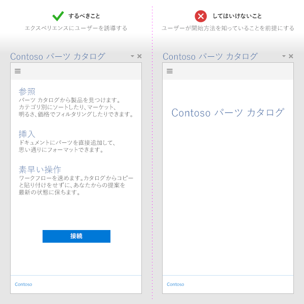
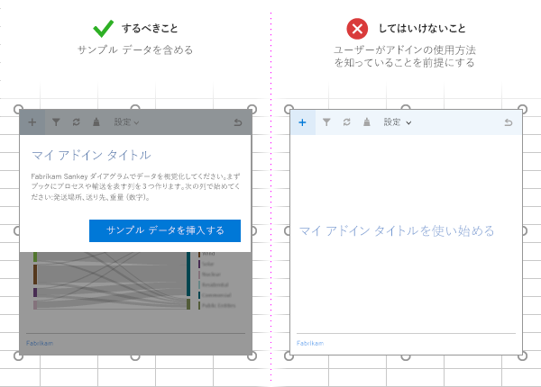

# Office アドイン開発のベスト プラクティス

効果的なアドインは、目で見て分かる方法で Office アプリケーションを拡張する、ユニークで頼もしい機能を提供します。優れたアドインを作成するには、魅力的な初回エクスペリエンスをユーザーに提供して、最高の UI エクスペリエンスを設計し、アドインのパフォーマンスを最適化します。この記事で説明するベスト プラクティスを適用して、ユーザーが迅速かつ効率的に仕事を遂行するための助けになるアドインを作成してください。

[!INCLUDE [publish policies note](../includes/note-publish-policies.md)]

## 価値を明確にする

- ユーザーがタスクをすばやく効率的に完了するのに役立つアドインを作成します。Office アプリケーションに当てはまるシナリオに絞ります。次に例を示します。
  - コア オーサリング タスクをよりスピーディかつ簡単にし、中断を減らします。
  - Office 内で新しいシナリオを有効にします。
  - アプリケーション内に補完的なOffice埋め込む。
  - Office エクスペリエンスを向上させて生産性を高めます。
- [魅力的な初回実行時エクスペリエンス](#create-an-engaging-first-run-experience)を作成して、ユーザーがアドインの価値をすぐに感じられるようにしてください。
- [効果的な AppSource リスト](/office/dev/store/create-effective-office-store-listings)を作成します。タイトルと説明から、アドインのメリットが明確にわかるようにします。アドインの内容を伝えるのに、ブランドだけに頼ることはしないでください。

## 魅力的な初回実行時エクスペリエンスを作成する

- 非常に使いやすく、直観で理解しやすいファースト エクスペリエンスによって、新しいユーザーを引き込みます。ユーザーは、アドインをストアからダウンロードした後も、使用するか中止するかを判断しています。

- ユーザーがアドインを使用するのに必要な手順を明確にします。ビデオ、マット、ページング パネル、その他のリソースを使用して、ユーザーを誘導します。

- 単純にユーザーにサインを求めるのではなく、起動時にアドインの価値を強調します。

- 使い方や UI を個人用に設定する方法を説明する UI を提供します。

  

- コンテンツ アドインがユーザーのドキュメント内のデータにバインドされている場合は、サンプル データまたはテンプレートを含めて、使用するデータ形式をユーザーに表示します。

  

- [無料の試用版](/office/dev/store/decide-on-a-pricing-model)を提供します。アドインでサブスクリプションを要求する場合は、一部の機能をサブスクリプションなしでも利用できるようにします。

- サインアップをシンプルにします。情報 (電子メール、表示名) を事前に入力し、電子メールの確認はスキップします。

- ポップアップは使用しないようにします。使用する必要がある場合は、ポップアップを有効にするようユーザーに指示します。

最初の実行エクスペリエンスを開発する際に適用できるパターンについては、「[Office アドインの UX 設計パターン](../design/first-run-experience-patterns.md)」を参照してください。

## アドイン コマンドを使用する

- アドイン コマンドを使用することで、アドインに関連する UI エントリ ポイントを提供します。設計のベスト プラクティスを含む詳細については、「[アドイン コマンド](../design/add-in-commands.md)」を参照してください。

## UX 設計原則を適用する

- アドインの機能とルック アンド フィールと機能が、Office のエクスペリエンスと合っていることを確認します。 「[アドインの UI をOfficeする」を参照してください](../design/add-in-design.md)。

- クロムよりもコンテンツを優先します。ユーザー エクスペリエンスの価値を高めない余分な UI 要素を追加しないようにします。

- ユーザーをよく管理します。ユーザーが重要な決定事項を理解し、アドインが実行するアクションを簡単に取り消すことができるようにします。

- ユーザーの信頼を得て、ユーザーを引き込むために
ブランドを利用します。ユーザーを圧倒するためや、宣伝のためにブランドを使用しないでください。

- スクロールしないようにします。1366 x 768 の解像度用に最適化します。

- 使用許可を得ていないイメージを含めないでください。

- アドインでは[明確でシンプルな表現](../design/voice-guidelines.md)を使用してください。

- アクセシビリティを考慮してください。すべてのユーザーにとって操作しやすいアドインにして、画面リーダーなどの支援テクノロジが利用できるようにしてください。

- すべてのプラットフォームと入力方法 (マウスやキーボード、および [タッチ](#optimize-for-touch)など) に対応するように設計してください。UI が様々なフォーム ファクターに対応するようにしてください。

### タッチ用に最適化する

- [Context.touchEnabled](/javascript/api/office/office.context#touchEnabled)プロパティを使用して、アドインが実行Officeアプリケーションがタッチが有効になっているかどうかを検出します。

  > [!NOTE]
  > このプロパティは、Outlook ではサポートされていません。

- すべてのコントロールがタッチ操作に適したサイズになっていることを確認します。たとえば、ボタンに適切なタッチ ターゲットを設定し、入力ボックスはユーザーが入力するのに十分な大きさにします。

- ホバーや右クリックなどの非タッチの入力方法に依存しないようにしてください。

- 縦向きと横向きの両方のモードでアドインが機能することを確認します。タッチ デバイスで、アドインの一部がソフトキーボードの後ろに隠れることがあることに注意してください。

- [サイドロード](../testing/sideload-an-office-add-in-on-ipad-and-mac.md)を使用して、アドインを実際のデバイスでテストしてください。

> [!NOTE]
> デザイン要素に UI Fluent[を](../design/using-office-ui-fabric-react.md)React場合、これらの要素の多くはデザイン システムに組み込まれています。

## アドインのパフォーマンスを最適化して監視する

- UI が素早く応答する感覚を与えるようにします。アドインが 500 ミリ秒以内で読み込まれるようにする必要があります。

- すべてのユーザー操作が 1 秒以内で応答することを確認します。

- 長時間実行する操作には、読み込みインジケーターを提供します。

- 画像、リソース、および一般的なライブラリを CDN を使用してホストします。可能な限り多くのものを 1 つの場所から読み込みます。

- Web ページを最適化するには、標準的な Web の慣習に従います。運用環境では、ライブラリの縮小バージョンのみを使用します。必要なリソースのみを読み込み、リソースが読み込まれる方法を最適化します。

- 操作の実行に時間がかかる場合は、ユーザーにフィードバックを提供します。次の表のしきい値に注意してください。追加情報については、「[Office アドインのリソースの制限とパフォーマンスの最適化](../concepts/resource-limits-and-performance-optimization.md)」を参照してください。

  |操作クラス|Target|上限|人間の感覚|
  |:-----|:-----|:-----|:-----|
  |即時|50 ミリ秒以下|100 ミリ秒|顕著な遅延はない。|
  |速く|50 から 100 ミリ秒|200 ミリ秒|最低限知覚される遅延。フィードバックは不要。|
  |普通|100-300 ミリ秒|500 ミリ秒|速い。しかし、高速とまではいかない。フィードバックは不要。|
  |速い|300-500 ミリ秒|1 秒|高速ではないが、速いという実感はある。フィードバックは不要。|
  |連続|500 ミリ秒より長い|5 秒|中程度の待ち時間。速いという実感はない。フィードバックが必要な可能性あり。|
  |キャプティブ|500 ミリ秒より長い|10 秒|長い。しかし、何か他のことを行えるほどの長さではない。フィードバックが必要な可能性あり。|
  |拡張|500 ミリ秒より長い|10 秒より長い|待機中に他のことを行うのに十分な長さ。フィードバックが必要な可能性あり。|
  |長時間実行|5 秒より長い|1 分より長い|ユーザーは確実に別のことを行えます。|

- サービスの正常性を監視し、テレメトリを使用して、ユーザーが正常に完了したか監視します。

- アドインとドキュメント間のデータ交換を最小限Officeします。 詳細については [、「context.sync メソッドをループで使用しないようにする」を参照してください](correlated-objects-pattern.md)。

## アドインを売り込む

- アドインを [AppSource](/office/dev/store/submit-to-appsource-via-partner-center) に公開して、Web サイトで[それを宣伝](/office/dev/store/promote-your-office-store-solution)します。[効果的な AppSource リストを作成します](/office/dev/store/create-effective-office-store-listings)。

- アドイン タイトルを簡潔でわかりやすいものにします。128 文字以下にします。

- アドインの短くて魅力的な説明を作成します。「このアドインでどんな問題が解決しますか？」という質問への答えを提供します。

- タイトルと説明でアドインの価値提案を行います。ブランドに依存しないでください。

- ユーザーがアドインを見つけて使うことができる Web サイトを作成します。

## JavaScript をサポートする JavaScript をInternet Explorer

[!INCLUDE [How to support IE](../includes/es5-support.md)]

## 関連項目

- [Office アドイン プラットフォームの概要](../overview/office-add-ins.md)
- [Microsoft 365 開発者プログラムについて](https://developer.microsoft.com/microsoft-365/dev-program)
