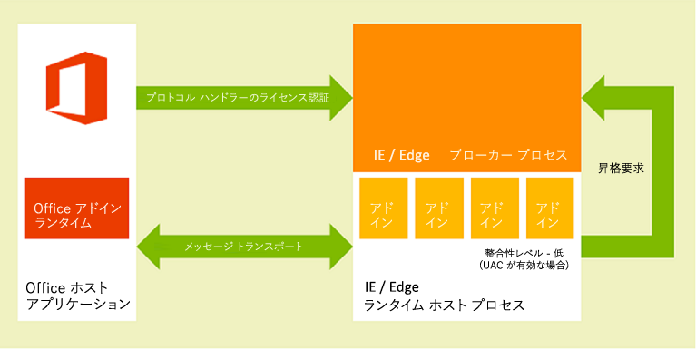

# <a name="privacy-and-security-for-office-add-ins"></a>Office アドインのプライバシーとセキュリティ

## <a name="understanding-the-add-in-runtime"></a>アドインのランタイムについて

Office アドインは、アドインのランタイム環境、複数層のアクセス許可モデル、およびパフォーマンス ガバナーによって保護されます。 このフレームワークは、次の方法でユーザーのエクスペリエンスを保護します。

- Office クライアント アプリケーションの UI フレームへのアクセスは管理されます。

- Office クライアント アプリケーションの UI スレッドへの間接アクセスのみが許可されます。

- モーダル操作は許可されません。たとえば、JavaScript `alert``confirm`の呼び出し、`prompt`関数はモーダルであるため許可されません。

さらに、ランタイム フレームワークには、Office アドインがユーザーの環境を破損できないようにするための次の利点があります。

- アドインが実行されるプロセスを分離します。

- .dll や .exe の置き換えも、ActiveX コンポーネントも必要ありません。

- アドインのインストールとアンインストールが容易になります。

また、Office アドインによるメモリ、CPU、およびネットワーク リソースの使用が管理可能になり、良好なパフォーマンスと信頼性が確保されます。

次のセクションでは、ランタイム アーキテクチャが、Windows ベースのデバイス、Mac OS X デバイス、および Web ブラウザーでOffice クライアントでアドインを実行する方法について簡単に説明します。

### <a name="clients-on-windows-and-os-x-devices"></a>Windows および OS X のデバイス用のクライアント

Windows 版の Excel、Windows 版および Mac 版の Outlook など、デスクトップおよびタブレット デバイス用のサポート対象クライアントでは、インプロセス コンポーネントである Office アドイン ランタイムを統合することで、Office アドインをサポートしています。このランタイムは、アドインのライフサイクルを管理し、アドインとクライアント アプリケーションの相互運用を可能にします。アドインの Web ページ自体は、プロセスの外部にホストされます。図 1 に示すように、Windows のデスクトップ デバイスやタブレット デバイスでは、[アドインの Web ページは Internet Explorer または Microsoft Edge コントロール内にホストされ](browsers-used-by-office-web-add-ins.md)、この Internet Explorer または Microsoft Edge コントロールのほうはアドインのランタイム プロセス内にホストされます。そのようにして、セキュリティとパフォーマンスの分離が実現されます。

Windows デスクトップの場合は、制限付きサイト ゾーンに対して Internet Explorer の保護モードを有効にする必要があります。これは通常、既定で有効にされています。無効になっている場合、アドインを起動しようとすると[エラーが発生](/office/troubleshoot/office-suite-issues/apps-for-office-not-start)します。

*図 1.Windows ベースのデスクトップおよびタブレットのクライアントにおける Office アドインのランタイム環境*



次の図に示すように、Mac OS X デスクトップでは、アドイン Web ページはサンドボックス化された WebKit ランタイム ホスト プロセス内でホストされ、同様のレベルのセキュリティとパフォーマンス保護を提供するのに役立ちます。

*図 2.Mac OS X クライアントでのアドインランタイム環境のOffice*


Office アドイン ランタイムは、プロセス間通信、JavaScript API 呼び出しとイベントの固有形式への変換、および UI リモート処理サポートを管理し、アドインがドキュメント内や作業ウィンドウ内、あるいは電子メール メッセージ、会議出席依頼、予定の隣に表示されるようにします。

### <a name="web-clients"></a>Web クライアント

サポートされている Web クライアントでは、Office アドインは、HTML5 **サンドボックス** 属性を使用して実行される **iframe** でホストされます。 ActiveX コンポーネントや Web クライアントのメイン ページでのナビゲーションは許可されていません。 Office アドインのサポートは、JavaScript API for Office の統合によって Web クライアント内で有効になっています。 デスクトップ クライアント アプリケーションの場合と同様、JavaScript API はアドインのライフサイクルや、アドインと Web クライアントの間の相互運用性を管理します。 この相互運用性は、特別なクロスフレーム ポスト メッセージ通信インフラストラクチャを使用して実現されています。 Web クライアントとの対話には、デスクトップ クライアント上で使用されるのと同じ JavaScript ライブラリ (Office.js) を使用できます。 次の図は、ブラウザーで実行されているOfficeのアドインをサポートするインフラストラクチャと、それらをサポートするために必要な関連コンポーネント (Web クライアント、**iframe**、Office アドイン ランタイム、および javaScript API for Office) を示しています。

*図 3.Office Web クライアント内で Office アドインをサポートするインフラストラクチャ*


## <a name="add-in-integrity-in-appsource"></a>AppSource でのアドインの整合性

Office アドインは、AppSource で公開することで利用可能にできます。 AppSource では、アドインの整合性を維持するために、次の手段が適用されます。

- Office アドインのホスト サーバーでは、通信に必ず Secure Socket Layer (SSL) を使用する必要があります。

- 開発者はアドインを提出する際に、ID の証明、契約上の合意、および法規制に準拠したプライバシー ポリシーを提供する必要があります。

- 使用可能なアドインに対するユーザーレビュー システムをサポートしてコミュニティの自己管理を促します。

## <a name="optional-connected-experiences"></a>オプションの接続エクスペリエンス

エンド ユーザーと IT 管理者は、[Office のデスクトップ クライアントとモバイル クライアントでオプションの接続エクスペリエンスを](/deployoffice/privacy/optional-connected-experiences) オフにすることができます。 Office アドインの場合、[**オプションの接続エクスペリエンス**] 設定を無効にした場合の影響は、ユーザーがこれらのクライアントを介してアドインまたは Office ストアにアクセスできなくなった場合です。 ただし、不可欠またはビジネスクリティカルと見なされる特定の Microsoft アドインと、組織の IT 管理者が [一元展開](/microsoft-365/admin/manage/centralized-deployment-of-add-ins) を通じて展開されたアドインは引き続き使用できます。 また、アドインとストアは、設定の状態に関係なく、Outlook on the webで引き続き使用できます。

Outlook固有の動作の詳細については、「[Outlook アドインのプライバシー、アクセス許可、セキュリティ](../outlook/privacy-and-security.md#optional-connected-experiences)」を参照してください。

IT 管理者が[Officeでの接続エクスペリエンスの使用](/deployoffice/privacy/manage-privacy-controls#policy-setting-for-most-connected-experiences)を無効にした場合、オプションの接続エクスペリエンスのみをオフにした場合と同じ効果がアドインに与えることに注意してください。

## <a name="addressing-end-users-privacy-concerns"></a>エンド ユーザーのプライバシー問題への対応

ここでは、Office アドイン プラットフォームから提供される保護を顧客 (エンド ユーザー) の視点から説明し、ユーザーの期待に応える方法とユーザーの個人情報 (PII) を安全に取り扱う方法に関するガイドラインを提供します。

### <a name="end-users-perspective"></a>エンド ユーザーの認知

Office アドインは、ブラウザー コントロールまたは **iframe** 内で実行する Web テクノロジを使用して構築されています。そのため、アドインの使用は、インターネットまたはイントラネット上で Web サイトを閲覧することと似ています。アドインは、組織の外部に存在することも (AppSource からアドインを入手する場合)、内部に存在することも (Exchange Server アドイン カタログ、SharePoint アプリ カタログ、または組織のネットワーク上のファイル共有からアドインを入手する場合) あります。アドインはネットワークへのアクセスが制限されますが、ほとんどのアドインは作業中のドキュメントやメール アイテムの読み書きができます。ユーザーや管理者がアドインをインストールまたは起動する前に、アドイン プラットフォームによって特定の制約が課されます。ただし、拡張性モデルと同様に、未知のアドインの起動は慎重に行う必要があります。

> [!NOTE]
> アドインが初めて読み込まれると、ドメインを信頼するように求めるセキュリティ プロンプトが表示される場合があります。 これは、アドインのドメイン ホストがオンプレミスまたはOffice Online Serverのドメインの外部にある場合Exchange発生します。

アドイン プラットフォームは、次の方法でエンド ユーザーのプライバシーに関する懸念事項に対処します。

- コンテンツ アドイン、Outlook アドイン、または作業ウィンドウ アドインをホストする Web サーバーとやり取りされるデータ、およびアドインとそれが使用する Web サービス間の通信は、Secure Socket Layer (SSL) プロトコルを使用して暗号化する必要があります。

- ユーザーは、AppSource からアドインをインストールする前に、そのアドインのプライバシー ポリシーと要件を表示できます。さらに、ユーザーのメールボックスとやり取りする Outlook アドインでは、アドインに必要なアクセス許可が具体的に表示されます。ユーザーは Outlook アドインをインストールする前に、使用条件、要求されるアクセス許可、およびプライバシー ポリシーを確認できます。

- ドキュメントを共有する場合、ユーザーはそのドキュメントに挿入されているアドインまたはそのドキュメントに関連付けられているアドインも共有することになります。 ユーザーが以前に使用したことがないアドインを含むドキュメントを開いた場合、Office クライアント アプリケーションは、ドキュメントで実行するアドインのアクセス許可をユーザーに付与するように求めます。 組織環境では、Office クライアント アプリケーションは、ドキュメントが外部ソースから送信された場合にもユーザーにメッセージを表示します。

- ユーザーは、AppSource へのアクセスを有効または無効にすることができます。 コンテンツ アドインと作業ウィンドウ アドインの場合、ユーザーは、ホスト Office クライアントの **信頼** できるアドインとカタログへのアクセスを管理します (**FileOptionsTrust** >  >  **CenterTrust** >  **Center 設定** > **Trusted アドイン カタログ** から開きます)。 Outlook アドインの場合、[アドインの管理] ボタンを選択して **アドインを管理** できます。WindowsのOutlookで、[**FileManage** >  アドイン] を選択します。Mac のOutlookで、アドイン バーの [アドイン **の管理**] ボタンを選択します。 Outlook on the web では、**[設定]** メニュー (歯車アイコン) > **[アドインを管理する]** を選択します。管理者は [グループ ポリシーを使用することによって](/previous-versions/office/office-2013-resource-kit/jj219429(v=office.15)#using-group-policy-to-manage-how-users-can-install-and-use-apps-for-office)、このようなアクセスも管理することができます。

- アドイン プラットフォームの設計は、次の方法でエンド ユーザーにセキュリティとパフォーマンスを提供します。

  - Office アドインは、Office クライアント アプリケーションとは別のアドイン ランタイム環境でホストされている Web ブラウザー コントロールで実行されます。 この設計により、クライアント アプリケーションからのセキュリティとパフォーマンスの両方の分離が提供されます。

  - アドインは Web ブラウザー コントロール下で動作するため、ブラウザーで動作する通常の Web ページとほぼ同じ処理を実行できますが、同時に、ドメイン分離のための同一生成元ポリシーとセキュリティ ゾーンを遵守するように制限されます。

Outlook アドイン固有のリソース使用量監視機能により、Outlook アドインはセキュリティとパフォーマンスの追加の機能を提供します。詳細については、「[Outlook アドインに関するプライバシー、アクセス許可、セキュリティ](../outlook/privacy-and-security.md)」を参照してください。

### <a name="developer-guidelines-to-handle-pii"></a>PII の取り扱いに関する開発ガイドライン

次に、Office アドインの開発者向けの PII 保護ガイドラインをいくつか示します。

- [Settings](/javascript/api/office/office.settings) オブジェクトは、コンテンツ アドインまたは作業ウィンドウ アドインに関する設定やセッション間の状態データの永続化に使用できますが、パスワードやその他の機密性の高い PII を **Settings** オブジェクトに保存してはいけません。**Settings** オブジェクト内のデータはエンド ユーザーには表示されませんが、容易にアクセスできるドキュメントのファイル形式の一部として保存されます。アドインの PII の使用を制限し、アドインに必要な PII はユーザー保護リソースとしてアドインをホストするサーバーに保存する必要があります。

- 一部のアプリケーションを使用すると PII が公開されてしまう可能性があります。ユーザーの ID、所在、アクセス時間、およびその他の資格情報に関するデータが安全に保存されていて、アドインの他のユーザーが使用できないことを確認してください。

- アドインが AppSource で入手可能な場合は、AppSource の HTTPS 要件によって Web サーバーとクライアント コンピューターまたはデバイスとの間で転送される PII が保護されます。ただし、データを他のサーバーに再転送する場合は、これと同レベルの保護が適用されることを確認してください。

- ユーザーの PII を保存する場合は、その事実を公開し、ユーザーがそれを検査して削除できる方法を提供します。アドインを AppSource に送信する場合は、収集するデータとその用途をプライバシーに関する声明の中で説明できます。

## <a name="developers-permission-choices-and-security-practices"></a>開発者によるアクセス許可の選択とセキュリティ手法

Office アドインのセキュリティ モデルをサポートするための以下の一般的なガイドラインを踏まえたうえで、アドインの種類ごとの詳細について調べます。

### <a name="permissions-choices"></a>アクセス許可の選択

アドイン プラットフォームは、その機能で必要なユーザー データへのアクセス レベルを宣言する、アドインが使用するアクセス許可のモデルを提供します。 それぞれのアクセス許可レベルは、アドインがその機能で使用することが許可されている JavaScript API for Office のサブセットに対応しています。 たとえば、コンテンツアドインと作業ウィンドウ アドインに対する **WriteDocument** アクセス許可では、ユーザーのドキュメントへのアドインの書き込みを許可する [Document.setSelectedDataAsync](/javascript/api/office/office.document) メソッドへのアクセスが許可されますが、ドキュメントからデータを読み取るためのメソッドへのアクセスは許可されません。 このアクセス許可レベルは、ユーザーのドキュメントにデータを挿入するためにユーザーが照会できるアドインなど、ドキュメントに書き込みのみを行う必要があるアドインに適しています。

ベスト プラクティスとしては、_最小限の特権_ の原則に基づいてアクセス許可を要求するべきです。つまり、アドインが正しく機能するために必要な最小限の API サブセットにのみアクセスする許可を要求します。たとえば、ユーザーのドキュメントのデータさえ読み込めばアドインが正しく機能する場合、**ReadDocument** 以外のアクセス許可を要求しません。(ただし、要求したアクセス許可が不十分な場合は、アドイン プラットフォームによってアドインによる一部の API の使用がブロックされ、ランタイム エラーが発生する可能性があることに注意してください)。

次の例に示すように、アドインのマニフェストでアクセス許可を指定すれば、エンド ユーザーは、アドインを初めてインストールまたはアクティブにする前に、アドインの要求されたアクセス許可レベルを確認できます。 さらに、**ReadWriteMailbox** アクセス許可を要求するアドインOutlook、インストールするには明示的な管理者特権が必要です。

次の例は、作業ウィンドウ アドインがマニフェストで **ReadDocument** アクセス許可を指定する方法を示しています。 アクセス許可に注目できるようにマニフェスト内の他の要素は省略しています。

```xml
<?xml version="1.0" encoding="utf-8"?>
<OfficeApp xmlns="http://schemas.microsoft.com/office/appforoffice/1.0"
           xmlns:xsi="http://www.w3.org/2001/XMLSchema-instance" 
           xmlns:ver="http://schemas.microsoft.com/office/appforoffice/1.0"
           xsi:type="TaskPaneApp">

... <!-- To keep permissions as the focus, not displaying other elements. -->
  <Permissions>ReadDocument</Permissions>
...
</OfficeApp>
```

作業ウィンドウ アドインとコンテンツ アドインのアクセス許可の詳細については、「[アドインでの API 使用についてアクセス許可を要求する](../develop/requesting-permissions-for-api-use-in-content-and-task-pane-add-ins.md)」を参照してください。

Outlook アドインのアクセス許可の詳細については、次のトピックを参照してください。

- [Outlook アドインに関するプライバシー、アクセス許可、セキュリティ](../outlook/privacy-and-security.md)

- [Outlook アドインのアクセス許可を理解する](../outlook/understanding-outlook-add-in-permissions.md)

### <a name="same-origin-policy"></a>同一生成元ポリシー

Office アドインは Web ブラウザー コントロールで実行される Web ページであるため、ブラウザーによって適用される同じ配信元ポリシーに従う必要があります。 既定では、あるドメインの Web ページでは、ホストされているドメイン以外のドメインに [対して XmlHttpRequest](https://www.w3.org/TR/XMLHttpRequest/) Web サービスを呼び出すことはできません。

この制限を克服する 1 つの方法は、JSON/P を使用することです。別のドメインでホストされているスクリプトを指す **src** 属性を持つ **スクリプト** タグを含めることで、Web サービスのプロキシを提供します。 **スクリプト** タグをプログラムで作成し、**src** 属性を指す URL を動的に作成し、URI クエリ パラメーターを使用してパラメーターを URL に渡すことができます。 Web サービス プロバイダーは、固有の URL で JavaScript コードを作成およびホストし、URI クエリ パラメーターに応じて異なるスクリプトを返します。 それらのスクリプトは挿入された場所で実行され、想定どおりに動作します。

Outlook アドインでの JSON/P の例を次に示します。

```js
// Dynamically create an HTML SCRIPT element that obtains the details for the specified video.
function loadVideoDetails(videoIndex) {
    // Dynamically create a new HTML SCRIPT element in the webpage.
    var script = document.createElement("script");
    // Specify the URL to retrieve the indicated video from a feed of a current list of videos,
    // as the value of the src attribute of the SCRIPT element. 
    script.setAttribute("src", "https://gdata.youtube.com/feeds/api/videos/" + 
        videos[videoIndex].Id + "?alt=json-in-script&amp;callback=videoDetailsLoaded");
    // Insert the SCRIPT element at the end of the HEAD section.
    document.getElementsByTagName('head')[0].appendChild(script);
}
```

Exchange と SharePoint は、クロス ドメイン アクセスを可能にするためにクライアント側のプロキシを提供します。一般に、イントラネット上の同一生成元ポリシーは、インターネット上のポリシーほど厳密ではありません。詳細については、「[同一生成元ポリシー第 1 部: ピーク禁止](/archive/blogs/ieinternals/same-origin-policy-part-1-no-peeking)」および「[Office アドインにおける同一生成元ポリシーの制限事項に対応する](../develop/addressing-same-origin-policy-limitations.md)」を参照してください。

### <a name="tips-to-prevent-malicious-cross-site-scripting"></a>悪意のあるクロスサイト スクリプティングを回避するヒント

悪意のあるユーザーが、ドキュメントやアドインのフィールドを経由して悪意のあるスクリプトを入力し、アドインの入手元を攻撃する場合があります。 開発者は、ドメイン内で悪意のあるユーザーの JavaScript が実行されないようにユーザー入力を処理する必要があります。 ドキュメントまたはメール メッセージから、またはアドインのフィールドを使用してユーザー入力を処理するには、次の手順に従う必要があります。

- 可能であれば、DOM プロパティの [innerHTML](https://developer.mozilla.org/docs/Web/API/Element/innerHTML) ではなく、[innerText](https://developer.mozilla.org/docs/Web/API/Node/innerText) および [textContent](https://developer.mozilla.org/docs/DOM/Node.textContent) プロパティを使用します。 Internet Explorer と Firefox クロスブラウザーのサポートについては、次の操作を行います。

    ```js
     var text = x.innerText || x.textContent
    ```

    **innerText** と **textContent** の違いについては、「[Node.textContent」を](https://developer.mozilla.org/docs/DOM/Node.textContent)参照してください。 一般的なブラウザー間での DOM の互換性の詳細については、「[W3C DOM 互換性](https://www.quirksmode.org/dom/w3c_html.html#t07)」を参照してください。

- **innerHTML** を使用する必要がある場合は、**innerHTML** に渡す前に、ユーザーの入力に悪意のあるコンテンツが含まれていないことを確認してください。 **innerHTML** を安全に使用する方法とその例については、[innerHTML](https://developer.mozilla.org/docs/Web/API/Element/innerHTML) プロパティを参照してください。

- jQuery を使用している場合は、[.html()](https://api.jquery.com/text/) メソッドの代わりに [.text()](https://api.jquery.com/html/) メソッドを使用してください。

- 
  [toStaticHTML](https://developer.mozilla.org/docs/Web/HTML/Reference) メソッドを使用して、ユーザーの入力から動的な HTML 要素と属性を削除したうえで、**innerHTML** に入力を渡してください。

- 
  [encodeURIComponent](https://developer.mozilla.org/docs/Web/JavaScript/Reference/Global_Objects/encodeuricomponent) または [encodeURI](https://developer.mozilla.org/docs/Web/JavaScript/Reference/Global_Objects/encodeuri) 関数を使用して、参照元 URL またはユーザーの入力を含む URL として使用できるようにテキストをエンコードしてください。

- より安全に使用できる Web ソリューションを作成するためのその他のベスト プラクティスについては、「[セキュリティで保護されたアドインを開発する](/previous-versions/windows/apps/hh849625(v=win.10))」を参照してください。

### <a name="tips-to-prevent-clickjacking"></a>「クリックジャック」を防止するためのヒント

Office アドインは、Office クライアント アプリケーションを使用してブラウザーで実行するときに iframe でレンダリングされるため、次のヒントを使用して[クリックジャック](https://en.wikipedia.org/wiki/Clickjacking)のリスクを最小限に抑えます。ハッカーがユーザーをだまして機密情報を明らかにする手法です。

まず、アドインが実行できる機密性の高いアクションを特定します。これには、未承認のユーザーが悪用できる、財務トランザクションの開始や機密データの公開などのアクションが含まれます。たとえば、アドインが支払いをユーザー定義の受信者に送信できる場合があります。

2 番目に、機密性の高いアクションでは、アドインがアクションを実行する前に、ユーザーに確認を求める必要があります。この確認では、アクションの影響を詳細に示す必要があります。また、「許可しない」と書かれた特定のボタンを選択するか、確認を無視することで、必要に応じてユーザーがアクションを止める方法も詳細に示す必要があります。

3 番目に、潜在的な攻撃者が確認を非表示にしたり覆い隠したりする可能性がないようにするため、確認をアドインのコンテキストの外部 (HTML ダイアログ ボックスの外部) に表示する必要があります。

確認を取得する方法の例を次に示します。

- 確認のリンクが含まれている電子メールをユーザーに送信します。

- ユーザーがアドインで入力できる確認コードが含まれているテキスト メッセージをユーザーに送信します。

- iframe に対応していないページについて、新しいブラウザー ウィンドウで確認ダイアログを開きます。これは通常、ログイン ページで使用するパターンです。新しいダイアログを作成するには、[ダイアログ API](../develop/dialog-api-in-office-add-ins.md) を使用します。

また、ユーザーへの連絡に使用されているアドレスが、潜在的な攻撃者によって提供されている可能性がないことを確認してください。たとえば、支払いの確認には、承認されたユーザーのアカウントに関するファイル内のアドレスを使用します。

### <a name="other-security-practices"></a>その他のセキュリティ手法

開発者は、次のセキュリティプラクティスにも注意する必要があります。

- ActiveX コントロールはアドイン プラットフォームのクロス プラットフォームの特性をサポートしていないため、開発者は Office アドインで ActiveX コントロールを使用しないでください。

- コンテンツ アドインと作業ウィンドウ アドインは、ブラウザーが既定で使用するものと同じ SSL 設定を使用することを前提としているため、ほとんどのコンテンツは SSL でのみ提供されていても問題ありません。Outlook アドインは、すべてのコンテンツが SSL で提供されている必要があります。開発者は、アドインの HTML ファイルの場所を示すときに、アドイン マニフェストの **SourceLocation** 要素で HTTPS を使用する URL を指定する必要があります。

  アドインが HTTP を使用してコンテンツを配信しないようにするには、アドインをテストするときに、開発者は、**コントロール パネル** の **インターネット オプション** で次の設定が選択されていることを確認し、テスト シナリオにセキュリティ警告が表示されないようにする必要があります。

  - **インターネット** ゾーンのセキュリティ設定 [**混合コンテンツの表示**] が **[プロンプト**] に設定されていることを確認します。 これを行うには、[ **インターネット オプション]** で次を選択します。[ **セキュリティ** ] タブで、[ **インターネット** ゾーン] を選択し、[ **カスタム レベル**] を選択し、スクロールして [ **混合コンテンツの表示**] を探し、まだ選択されていない場合は **[プロンプト** ] を選択します。

  - **[インターネット オプション]** ダイアログ ボックスの **[詳細設定]** タブで、**[保護付き/保護なしのサイト間を移動する場合に警告する]** が選択されていることを確認します。

- アドインで CPU コアやメモリ リソースが過剰に使用され、クライアント コンピューターでサービス拒否が発生しないように、アドイン プラットフォームにはリソース使用量の上限が設けられています。開発者はテストの一環として、アドイン プラットフォームがリソース使用量の上限を超えていないかどうかを確認する必要があります。

- 開発者はアドインを発行する前に、アドイン ファイルで公開される個人を識別できる情報が保護されていることを確認する必要があります。

- 開発者は、Microsoft や他のユーザー (Bing、Google、Facebook など) から API やサービスにアクセスするために使用するキーをアドインの HTML ページに直接埋め込むべきではありません。 代わりに、カスタム Web サービスを作成するか、キーを安全な Web ストレージの他の形態で保存して、キー値をアドインに渡すために呼び出すことができるようにする必要があります。

- 開発者は、AppSource にアドインを送信するときに、次の操作を行う必要があります。

  - SSL をサポートする Web サーバーで、提出するアドインをホストする。
  - 法規制に準拠したプライバシー ポリシーを記載した声明を作成する。
  - アドインの提出時に契約合意書に署名する。

Outlook アドインの開発者は、リソース使用量のルール以外に、アクティブ化ルールの指定と JavaScript API の使用に関する制限についてもアドインが遵守していることを確認する必要があります。詳細については、「[Outlook アドインのアクティブ化と JavaScript API に関する制限事項](../outlook/limits-for-activation-and-javascript-api-for-outlook-add-ins.md)」を参照してください。

## <a name="it-administrators-control"></a>IT 管理者による制御

企業の設定では、IT 管理者は、AppSource とプライベート カタログへのアクセスの有効化または無効化に対して最終的な権限を持ちます。

Office 設定の管理と適用はグループ ポリシー設定で行われます。 これらは、[Office カスタマイズ ツール](/deployoffice/overview-of-the-office-customization-tool-for-click-to-run)と共に [Office 展開ツール](/deployoffice/overview-of-the-office-2016-deployment-tool)を介して構成できます。

| 設定名 | 説明 |
|--------------|-------------|
| セキュリティで保護されていないアドインとカタログの許可 | セキュリティで保護されていないOffice アドインを実行できます。これは、SSL でセキュリティで保護された (https://) web ページまたはカタログの場所を持ち、ユーザーのインターネット ゾーンに存在しないアドインOffice。 |
| Web アドインのブロック | ユーザーが Web テクノロジを使用Officeアドインを実行できないようにすることができます。 |
| Office ストアのブロック |  ユーザーが Office ストアから取得したアドインOffice取得または実行できないようにすることができます。 |

> [!IMPORTANT]
> 作業グループが複数のリリースの Office を使用している場合は、リリースごとにグループ ポリシー設定を構成する必要があります。 Office 2013 のグループ ポリシー設定の詳細については、記事「[Office 2013 用アプリの概要](/previous-versions/office/office-2013-resource-kit/jj219429(v%3doffice.15))」の「[グループ ポリシーを使用して、ユーザーが Office 用アプリをインストールおよび使用する方法を管理する](/previous-versions/office/office-2013-resource-kit/jj219429(v=office.15)#using-group-policy-to-manage-how-users-can-install-and-use-apps-for-office)」を参照してください。

## <a name="see-also"></a>関連項目

- [アドインでの API 使用についてアクセス許可を要求する](../develop/requesting-permissions-for-api-use-in-content-and-task-pane-add-ins.md)
- [Outlook アドインに関するプライバシー、アクセス許可、セキュリティ](../outlook/privacy-and-security.md)
- [Outlook アドインのアクセス許可を理解する](../outlook/understanding-outlook-add-in-permissions.md)
- [Outlook アドインのアクティブ化と JavaScript API の制限](../outlook/limits-for-activation-and-javascript-api-for-outlook-add-ins.md)
- [Office アドインにおける同一生成元ポリシーの制限への対処](../develop/addressing-same-origin-policy-limitations.md)
- [同一生成元ポリシー](https://www.w3.org/Security/wiki/Same_Origin_Policy)
- [同一生成元ポリシー パート 1:ピーク禁止](/archive/blogs/ieinternals/same-origin-policy-part-1-no-peeking)
- [JavaScript の同一生成元ポリシー](https://developer.mozilla.org/docs/Web/Security/Same-origin_policy)
- [IE 保護モード](/office/troubleshoot/office-suite-issues/apps-for-office-not-start)
- [Microsoft 365 アプリのプライバシー コントロール](/deployoffice/privacy/overview-privacy-controls)
