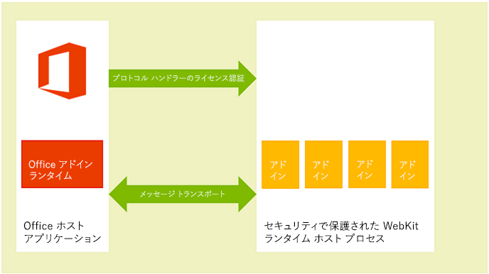

# <a name="privacy-and-security-for-office-add-ins"></a><span data-ttu-id="f213b-102">Office アドインのプライバシーとセキュリティ</span><span class="sxs-lookup"><span data-stu-id="f213b-102">Privacy and security for Office Add-ins</span></span>

## <a name="understanding-the-add-in-runtime"></a><span data-ttu-id="f213b-103">アドインのランタイムについて</span><span class="sxs-lookup"><span data-stu-id="f213b-103">Understanding the add-in runtime</span></span>

<span data-ttu-id="f213b-p101">Office アドインは、アドインのランタイム環境、複数層のアクセス許可モデル、およびパフォーマンス ガバナーによって保護されます。このフレームワークは、以下の方法でユーザーのエクスペリエンスを保護します。</span><span class="sxs-lookup"><span data-stu-id="f213b-p101">Office Add-ins are secured by an add-in runtime environment, a multiple-tier permissions model, and performance governors. This framework protects the user's experience in the following ways:</span></span> 

- <span data-ttu-id="f213b-106">ホスト アプリケーションの UI フレームへのアクセスが管理されます。</span><span class="sxs-lookup"><span data-stu-id="f213b-106">Access to the host application's UI frame is managed.</span></span>

- <span data-ttu-id="f213b-107">ホスト アプリケーションの UI スレッドに対しては間接的なアクセスのみが許可されます。</span><span class="sxs-lookup"><span data-stu-id="f213b-107">Only indirect access to the host application's UI thread is allowed.</span></span>

- <span data-ttu-id="f213b-108">モーダルな操作は許可されていません。たとえば、JavaScript の **alert** 関数、**confirm** 関数、**prompt** 関数の呼び出しは、モーダルであるため許可されていません。</span><span class="sxs-lookup"><span data-stu-id="f213b-108">Modal interactions aren't allowed - for example, calls to JavaScript  **alert**, **confirm**, and **prompt** functions aren't allowed because they're modal.</span></span>

<span data-ttu-id="f213b-109">さらに、ランタイム フレームワークには、Office アドインによるユーザーの環境の破壊を防止するうえで以下の利点があります。</span><span class="sxs-lookup"><span data-stu-id="f213b-109">Further, the runtime framework provides the following benefits to ensure that an Office Add-in can't damage the user's environment:</span></span>

- <span data-ttu-id="f213b-110">アドインが実行されるプロセスを分離します。</span><span class="sxs-lookup"><span data-stu-id="f213b-110">Isolates the process the add-in runs in.</span></span>

- <span data-ttu-id="f213b-111">.dll や .exe の置き換えも、ActiveX コンポーネントも必要ありません。</span><span class="sxs-lookup"><span data-stu-id="f213b-111">Doesn't require .dll or .exe replacement or ActiveX components.</span></span>

- <span data-ttu-id="f213b-112">アドインのインストールとアンインストールが容易になります。</span><span class="sxs-lookup"><span data-stu-id="f213b-112">Makes add-ins easy to install and uninstall.</span></span>

<span data-ttu-id="f213b-113">また、Office アドインによるメモリ、CPU、およびネットワーク リソースの使用が管理可能になり、良好なパフォーマンスと信頼性が確保されます。</span><span class="sxs-lookup"><span data-stu-id="f213b-113">Also, the use of memory, CPU, and network resources by Office Add-ins is governable to ensure that good performance and reliability are maintained.</span></span> 

<span data-ttu-id="f213b-114">以降のセクションでは、Windows ベース デバイスの Office クライアント、OS X Mac デバイス、および Web 上の Office Online クライアントでのアドインの実行がランタイム アーキテクチャによってどのようにサポートされるかについて簡潔に説明します。</span><span class="sxs-lookup"><span data-stu-id="f213b-114">The following sections briefly describe how the runtime architecture supports running add-ins in Office clients on Windows-based devices, on OS X Mac devices, and in Office Online clients on the web.</span></span>

> <span data-ttu-id="f213b-115">**注:**  WIP と Intune の Office アドインとの併用の詳細については、「[Office アドインを実行するドキュメントでエンタープライズ データを保護するために WIP と Intune を使用する](https://docs.microsoft.com/microsoft-365/enterprise/office-add-ins-wip)」を参照してください。</span><span class="sxs-lookup"><span data-stu-id="f213b-115">**NOTE**  To learn about using WIP and Intune with Office Add-ins, see [Use WIP and Intune to protect enterprise data in documents running Office Add-ins](https://docs.microsoft.com/microsoft-365/enterprise/office-add-ins-wip).</span></span>

### <a name="clients-for-windows-and-os-x-devices"></a><span data-ttu-id="f213b-116">Windows および OS X のデバイス用のクライアント</span><span class="sxs-lookup"><span data-stu-id="f213b-116">Clients for Windows and OS X devices</span></span>

<span data-ttu-id="f213b-p102">Excel、Outlook、および Outlook for Mac など、デスクトップおよびタブレット デバイス用のサポート対象クライアントでは、インプロセス コンポーネントである Office アドイン ランタイムを統合することで、Office アドインをサポートしています。このランタイムは、アドインのライフサイクルを管理し、アドインとクライアント アプリケーションの相互運用を可能にします。アドインの Web ページ自体は、プロセスの外部にホストされます。図 1 に示すように、Windows のデスクトップ デバイスやタブレット デバイスでは、アドインの Web ページは Internet Explorer コントロール内にホストされ、この Internet Explorer コントロールのほうはアドインのランタイム プロセス内にホストされます。そのようにして、セキュリティとパフォーマンスの分離が実現されます。</span><span class="sxs-lookup"><span data-stu-id="f213b-p102">In supported clients for desktop and tablet devices, such as Excel, Outlook, and Outlook for Mac, Office Add-ins are supported by integrating an in-process component, the Office Add-ins runtime, which manages the add-in lifecycle and enables interoperability between the add-in and the client application. The add-in webpage itself is hosted out-of-process. As shown in figure 1, on a Windows desktop or tablet device, the add-in webpage is hosted inside an Internet Explorer control which, in turn, is hosted inside an add-in runtime process that provides security and performance isolation.</span></span>

<span data-ttu-id="f213b-p103">Windows デスクトップの場合は、制限付きサイト ゾーンに対して Internet Explorer の保護モードを有効にする必要があります。これは通常、既定で有効にされています。無効になっている場合、アドインを起動しようとすると[エラーが発生](https://support.microsoft.com/help/2761180/apps-for-office-don-t-start-if-you-disable-protected-mode-for-the-restricted-sites-zone-in-internet-explorer)します。</span><span class="sxs-lookup"><span data-stu-id="f213b-p103">On Windows desktops, Protect Mode in Internet Explorer must be enabled for the Restricted Site Zone. This is typically enabled by default. If it is disabled, an [error will occur](https://support.microsoft.com/help/2761180/apps-for-office-don-t-start-if-you-disable-protected-mode-for-the-restricted-sites-zone-in-internet-explorer) when you try to launch an add-in.</span></span>

<span data-ttu-id="f213b-123">*図 1.Windows ベースのデスクトップおよびタブレットのクライアントにおける Office アドインのランタイム環境*</span><span class="sxs-lookup"><span data-stu-id="f213b-123">*Figure 1. Office Add-ins runtime environment in Windows-based desktop and tablet clients*</span></span>


<span data-ttu-id="f213b-125">OS X Mac デスクトップの場合は、次の図に示すように、アドインの Web ページはセキュリティで保護された WebKit ランタイム ホスト プロセス内にホストされ、それによって同様のレベルのセキュリティとパフォーマンスの保護が提供されます。</span><span class="sxs-lookup"><span data-stu-id="f213b-125">As shown in the following figure, on an OS X Mac desktop, the add-in web page is hosted inside a sandboxed WebKit runtime host process which helps provide similar level of security and performance protection.</span></span> 

<span data-ttu-id="f213b-126">*図 2.OS X Mac クライアントにおける Office アドインのランタイム環境*</span><span class="sxs-lookup"><span data-stu-id="f213b-126">*Figure 2. Office Add-ins runtime environment in OS X Mac clients*</span></span>



<span data-ttu-id="f213b-128">Office アドイン ランタイムは、プロセス間通信、JavaScript API 呼び出しとイベントの固有形式への変換、および UI リモート処理サポートを管理し、アドインがドキュメント内や作業ウィンドウ内、あるいは電子メール メッセージ、会議出席依頼、予定の隣に表示されるようにします。</span><span class="sxs-lookup"><span data-stu-id="f213b-128">The Office Add-ins runtime manages interprocess communication, the translation of JavaScript API calls and events into native ones, as well as UI remoting support to enable the add-in to be rendered inside the document, in a task pane, or adjacent to an email message, meeting request, or appointment.</span></span>

### <a name="web-clients"></a><span data-ttu-id="f213b-129">Web クライアント</span><span class="sxs-lookup"><span data-stu-id="f213b-129">Web clients</span></span>

<span data-ttu-id="f213b-p104">Excel Online や Outlook Web App などのサポート対象の Web クライアントの場合、Office アドインは HTML5 **sandbox** 属性を使用して実行される **iframe** でホストされます。ActiveX コンポーネントは許可されていません。また、Web クライアントのメイン ページのナビゲートも許可されていません。Office アドインのサポートは、JavaScript API for Office の統合によって Web クライアントで有効になります。JavaScript API は、デスクトップ クライアント アプリケーションと類似の方法で、アドインのライフサイクルや、アドインと Web クライアントの相互運用性を管理します。この相互運用性は、特別なクロスフレーム投稿メッセージ通信インフラストラクチャを使用して実装されます。Web クライアントとの対話には、デスクトップ クライアントで使用されているものと同じ JavaScript ライブラリ (Office.js) を使用できます。次の図に、Office Online (ブラウザーで実行) で Office アドインをサポートするインフラストラクチャと、それをサポートするために必要な関連コンポーネント (Web クライアント、**iframe**、Office アドイン ランタイム、JavaScript API for Office) を示します。</span><span class="sxs-lookup"><span data-stu-id="f213b-p104">In supported Web clients, such as Excel Online and Outlook Web App, Office Add-ins are hosted in an  **iframe** that runs using the HTML5 **sandbox** attribute. ActiveX components or navigating the main page of the web client are not allowed. Office Add-ins support is enabled in the web clients by the integration of the JavaScript API for Office. In a similar way to the desktop client applications, the JavaScript API manages the add-in lifecycle and interoperability between the add-in and the web client. This interoperability is implemented by using a special cross-frame post message communication infrastructure. The same JavaScript library (Office.js) that is used on desktop clients is available to interact with the web client. The following figure shows the infrastructure that supports Office Add-ins in Office Online (running in the browser), and the relevant components (the web client, **iframe**, Office Add-ins runtime, and JavaScript API for Office) that are required to support them.</span></span>

<span data-ttu-id="f213b-137">*図 3.Office Web クライアント内で Office アドインをサポートするインフラストラクチャ*</span><span class="sxs-lookup"><span data-stu-id="f213b-137">*Figure 3. Infrastructure that supports Office Add-ins in Office web clients*</span></span>


## <a name="add-in-integrity-in-appsource"></a><span data-ttu-id="f213b-139">AppSource でのアドインの整合性</span><span class="sxs-lookup"><span data-stu-id="f213b-139">Add-in integrity in AppSource</span></span>

<span data-ttu-id="f213b-p105">Office アドインは、AppSource で公開することで利用可能にできます。AppSource では、アドインの整合性を維持するために以下の規則が適用されます。</span><span class="sxs-lookup"><span data-stu-id="f213b-p105">You can make your Office Add-ins available to the public by publishing them to AppSource. AppSource enforces the following measures to maintain the integrity of add-ins:</span></span>


- <span data-ttu-id="f213b-142">Office アドインのホスト サーバーでは、通信に必ず Secure Socket Layer (SSL) を使用する必要があります。</span><span class="sxs-lookup"><span data-stu-id="f213b-142">Requires the host server of an Office Add-in to always use Secure Sockets Layer (SSL) to communicate.</span></span>

- <span data-ttu-id="f213b-143">開発者はアドインを提出する際に、ID の証明、契約上の合意、および法規制に準拠したプライバシー ポリシーを提供する必要があります。</span><span class="sxs-lookup"><span data-stu-id="f213b-143">Requires a developer to provide proof of identity, a contractual agreement, and a compliant privacy policy to submit add-ins.</span></span>

- <span data-ttu-id="f213b-144">アドインのソースに読み取り専用モードでアクセスできるようにします。</span><span class="sxs-lookup"><span data-stu-id="f213b-144">Ensures that the source of add-ins is accessible in read-only mode.</span></span>

- <span data-ttu-id="f213b-145">使用可能なアドインに対するユーザーレビュー システムをサポートしてコミュニティの自己管理を促します。</span><span class="sxs-lookup"><span data-stu-id="f213b-145">Supports a user-review system for available add-ins to promote a self-policing community.</span></span>

## <a name="addressing-end-users-privacy-concerns"></a><span data-ttu-id="f213b-146">エンド ユーザーのプライバシー問題への対応</span><span class="sxs-lookup"><span data-stu-id="f213b-146">Addressing end users' privacy concerns</span></span>

<span data-ttu-id="f213b-147">ここでは、Office アドイン プラットフォームから提供される保護を顧客 (エンド ユーザー) の視点から説明し、ユーザーの期待に応える方法とユーザーの個人情報 (PII) を安全に取り扱う方法に関するガイドラインを提供します。</span><span class="sxs-lookup"><span data-stu-id="f213b-147">This section describes the protection offered by the Office Add-ins platform from the customer's (end user's) perspective, and provides guidelines for how to support users' expectations and how to securely handle users' personally identifiable information (PII).</span></span>

### <a name="end-users-perspective"></a><span data-ttu-id="f213b-148">エンド ユーザーの認知</span><span class="sxs-lookup"><span data-stu-id="f213b-148">End users' perspective</span></span>

<span data-ttu-id="f213b-p106">Office アドインは、ブラウザー コントロールまたは **iframe** 内で実行する Web テクノロジを使用して構築されています。そのため、アドインの使用は、インターネットまたはイントラネット上で Web サイトを閲覧することと似ています。アドインは、組織の外部に存在することも (AppSource からアドインを入手する場合)、内部に存在することも (Exchange Server アドイン カタログ、SharePoint アドイン カタログ、または組織のネットワーク上のファイル共有からアドインを入手する場合) あります。アドインはネットワークへのアクセスが制限されますが、ほとんどのアドインは作業中のドキュメントやメール アイテムの読み書きができます。ユーザーや管理者がアドインをインストールまたは起動する前に、アドイン プラットフォームによって特定の制約が課されます。ただし、拡張性モデルと同様に、未知のアドインの起動は慎重に行う必要があります。</span><span class="sxs-lookup"><span data-stu-id="f213b-p106">Office Add-ins are built using web technologies that run in a browser control or **iframe**. Because of this, using add-ins is similar to browsing to web sites on the Internet or intranet. Add-ins can be external to an organization (if you acquire the add-in from AppSource) or internal (if you acquire the add-in from an Exchange Server add-in catalog, SharePoint add-in catalog, or file share on an organization's network). Add-ins have limited access to the network and most add-ins can read or write to the active document or mail item. The add-in platform applies certain constraints before a user or administrator installs or starts an add-in. But as with any extensibility model, users should be cautious before starting an unknown add-in.</span></span>

<span data-ttu-id="f213b-155">アドイン プラットフォームは、エンド ユーザーのプライバシーの懸念に次のように対処します。</span><span class="sxs-lookup"><span data-stu-id="f213b-155">The add-in platform addresses end users' privacy concerns in the following ways:</span></span>

- <span data-ttu-id="f213b-156">コンテンツ アドイン、Outlook アドイン、または作業ウィンドウ アドインをホストする Web サーバーとやり取りされるデータ、およびアドインとそれが使用する Web サービス間の通信は、Secure Socket Layer (SSL) プロトコルを使用して暗号化する必要があります。</span><span class="sxs-lookup"><span data-stu-id="f213b-156">Data communicated with the web server that hosts a content, Outlook or task pane add-in as well as communication between the add-in and any web services it uses must be encrypted using the Secure Socket Layer (SSL) protocol.</span></span>

- <span data-ttu-id="f213b-p107">ユーザーは、AppSource からアドインをインストールする前に、そのアドインのプライバシー ポリシーと要件を表示できます。さらに、ユーザーのメールボックスとやり取りする Outlook アドインでは、アドインに必要なアクセス許可が具体的に表示されます。ユーザーは Outlook アドインをインストールする前に、使用条件、要求されるアクセス許可、およびプライバシー ポリシーを確認できます。</span><span class="sxs-lookup"><span data-stu-id="f213b-p107">Before a user installs an add-in from AppSource, the user can view the privacy policy and requirements of that add-in. In addition, Outlook add-ins that interact with users' mailboxes surface the specific permissions that they require; the user can review the terms of use, requested permissions and privacy policy before installing an Outlook add-in.</span></span>

- <span data-ttu-id="f213b-p108">ドキュメントを共有する場合、ユーザーはそのドキュメントに挿入されているアドインまたはそのドキュメントに関連付けられているアドインも共有することになります。ユーザーがこれまで使用したことのないアドインが含まれたドキュメントを開いた場合、ホスト アプリケーションは、そのドキュメントでアドインを実行するために必要なアクセス許可を付与するようにユーザーに促します。組織環境では、ドキュメントが外部ソースから取得される場合にも、Office ホスト アプリケーションは確認のためのプロンプトを表示します。</span><span class="sxs-lookup"><span data-stu-id="f213b-p108">When sharing a document, users also share add-ins that have been inserted in or associated with that document. If a user opens a document that contains an add-in that the user hasn't used before, the host application prompts the user to grant permission for the add-in to run in the document. In an organizational environment, the Office host application also prompts the user if the document comes from an external source.</span></span>

- <span data-ttu-id="f213b-p109">ユーザーは、AppSource へのアクセスを有効または無効にすることができます。コンテンツ アドインと作業ウィンドウ アドインの場合は、ユーザーがホスト Office クライアント上の **[セキュリティ センター]** (**[ファイル]** > **[オプション]** > **[セキュリティ センター]** > **[セキュリティ センターの設定]** > **[信頼できるアドイン カタログ]** から開く) から信頼できるアドインとカタログへのアクセスを管理します。Outlook アドインの場合は、**[アドインの管理]** ボタンを選択してアドインを管理できます。Outlook for Windows では、**[ファイル]** > **[アドインの管理]** を選択します。Outlook for Mac では、アドイン バーの **[アドインの管理]** ボタンを選択します。Outlook Web App の場合、**[設定]** メニュー (歯車アイコン) の **[アドインの管理]** を選択します。管理者は、[グループ ポリシーを使用](https://docs.microsoft.com/previous-versions/office/office-2013-resource-kit/jj219429(v=office.15)#using-group-policy-to-manage-how-users-can-install-and-use-apps-for-office)してこのアクセスを管理することもできます。</span><span class="sxs-lookup"><span data-stu-id="f213b-p109">Users can enable or disable the access to AppSource. For content and task pane add-ins, users manage access to trusted add-ins and catalogs from the  **Trust Center** on the host Office client (opened from **File** > **Options** > **Trust Center** > **Trust Center Settings** > **Trusted Add-in Catalogs**). For Outlook add-ins, uses can manage add-ins by choosing the  **Manage Add-ins** button: in Outlook for Windows, choose **File** > **Manage Add-ins**. In Outlook for Mac, choose the  **Manage Add-ins** button on the add-in bar. In Outlook Web App choose the **Settings** menu (gear icon) > **Manage add-ins**. Administrators can also manage this access [by using group policy](https://docs.microsoft.com/previous-versions/office/office-2013-resource-kit/jj219429(v=office.15)#using-group-policy-to-manage-how-users-can-install-and-use-apps-for-office).</span></span>

- <span data-ttu-id="f213b-166">アドイン プラットフォームの設計を通して、次のような方法でセキュリティとパフォーマンスがエンド ユーザーに提供されます。</span><span class="sxs-lookup"><span data-stu-id="f213b-166">The design of the add-in platform provides security and performance for end users in the following ways:</span></span>

  - <span data-ttu-id="f213b-p110">Office アドインは、Office ホスト アプリケーションとは別のアドイン ランタイム環境でホストされている Web ブラウザーのコントロールで動作します。この設計により、ホスト アプリケーションからセキュリティとパフォーマンスの両方が分離されます。</span><span class="sxs-lookup"><span data-stu-id="f213b-p110">An Office Add-in runs in a web browser control that is hosted in an add-in runtime environment separate from the Office host application. This design provides both security and performance isolation from the host application.</span></span>

  - <span data-ttu-id="f213b-169">アドインは Web ブラウザー コントロール下で動作するため、ブラウザーで動作する通常の Web ページとほぼ同じ処理を実行できますが、同時に、ドメイン分離のための同一生成元ポリシーとセキュリティ ゾーンを遵守するように制限されます。</span><span class="sxs-lookup"><span data-stu-id="f213b-169">Running in a web browser control allows the add-in to do almost anything a regular web page running in a browser can do but, at the same time, restricts the add-in to observe the same-origin policy for domain isolation and security zones.</span></span>

<span data-ttu-id="f213b-p111">Outlook アドイン固有のリソース使用量監視機能により、Outlook アドインはセキュリティとパフォーマンスの追加の機能を提供します。詳細については、「[Outlook アドインに関するプライバシー、アクセス許可、セキュリティ](https://docs.microsoft.com/outlook/add-ins/privacy-and-security)」を参照してください。</span><span class="sxs-lookup"><span data-stu-id="f213b-p111">Outlook add-ins provide additional security and performance features through Outlook add-in specific resource usage monitoring. For more information, see [Privacy, permissions, and security for Outlook add-ins](https://docs.microsoft.com/outlook/add-ins/privacy-and-security).</span></span>

### <a name="developer-guidelines-to-handle-pii"></a><span data-ttu-id="f213b-172">PII の取り扱いに関する開発ガイドライン</span><span class="sxs-lookup"><span data-stu-id="f213b-172">Developer guidelines to handle PII</span></span>

<span data-ttu-id="f213b-173">Office アドインを開発するときに適用される PII 保護ガイドラインを以下に示します。</span><span class="sxs-lookup"><span data-stu-id="f213b-173">The following lists some specific PII protection guidelines for you as a developer of Office Add-ins:</span></span>

- <span data-ttu-id="f213b-p112">[Settings](https://dev.office.com/reference/add-ins/shared/settings) オブジェクトは、コンテンツ アドインまたは作業ウィンドウ アドインに関する設定やセッション間の状態データの永続化に使用できますが、パスワードやその他の機密性の高い PII を **Settings** オブジェクトに保存してはいけません。**Settings** オブジェクト内のデータはエンド ユーザーには表示されませんが、容易にアクセスできるドキュメントのファイル形式の一部として保存されます。アドインの PII の使用を制限し、アドインに必要な PII はユーザー保護リソースとしてアドインをホストするサーバーに保存する必要があります。</span><span class="sxs-lookup"><span data-stu-id="f213b-p112">The [Settings](https://dev.office.com/reference/add-ins/shared/settings) object is intended for persisting add-in settings and state data across sessions for a content or task pane add-in, but don't store passwords and other sensitive PII in the **Settings** object. The data in the **Settings** object isn't visible to end users, but it is stored as part of the document's file format which is readily accessible. You should limit your add-in's use of PII and store any PII required by your add-in on the server hosting your add-in as a user-secured resource.</span></span>

- <span data-ttu-id="f213b-p113">一部のアプリケーションを使用すると PII が公開されてしまう可能性があります。ユーザーの ID、所在、アクセス時間、およびその他の資格情報に関するデータが安全に保存されていて、アドインの他のユーザーが使用できないことを確認してください。</span><span class="sxs-lookup"><span data-stu-id="f213b-p113">Using some applications can reveal PII. Make sure that you securely store data for your users' identity, location, access times, and any other credentials so that data won't become available to other users of the add-in.</span></span>

- <span data-ttu-id="f213b-p114">アドインが AppSource で入手可能な場合は、AppSource の HTTPS 要件によって Web サーバーとクライアント コンピューターまたはデバイスとの間で転送される PII が保護されます。ただし、データを他のサーバーに再転送する場合は、これと同レベルの保護が適用されることを確認してください。</span><span class="sxs-lookup"><span data-stu-id="f213b-p114">If your add-in is available in AppSource, the AppSource requirement for HTTPS protects PII transmitted between your web server and the client computer or device. However, if you re-transmit that data to other servers, make sure you observe the same level of protection.</span></span>

- <span data-ttu-id="f213b-p115">ユーザーの PII を保存する場合は、その事実を公開し、ユーザーがそれを検査して削除できる方法を提供します。アドインを AppSource に送信する場合は、収集するデータとその用途をプライバシーに関する声明の中で説明できます。</span><span class="sxs-lookup"><span data-stu-id="f213b-p115">If you store users' PII, make sure you reveal that fact, and provide a way for users to inspect and delete it. If you submit your add-in to AppSource, you can outline the data you collect and how it's used in the privacy statement.</span></span>

## <a name="developers-permission-choices-and-security-practices"></a><span data-ttu-id="f213b-183">開発者によるアクセス許可の選択とセキュリティ手法</span><span class="sxs-lookup"><span data-stu-id="f213b-183">Developers' permission choices and security practices</span></span>

<span data-ttu-id="f213b-184">Office アドインのセキュリティ モデルをサポートするための以下の一般的なガイドラインを踏まえたうえで、アドインの種類ごとの詳細について調べます。</span><span class="sxs-lookup"><span data-stu-id="f213b-184">Follow these general guidelines to support the security model of Office Add-ins, and drill down on more details for each add-in type.</span></span>

### <a name="permissions-choices"></a><span data-ttu-id="f213b-185">アクセス許可の選択</span><span class="sxs-lookup"><span data-stu-id="f213b-185">Permissions choices</span></span>

<span data-ttu-id="f213b-186">アドイン プラットフォームは、アドインがその機能に必要なユーザー データへのアクセス レベルを宣言するために使用するアクセス許可モデルを提供します。</span><span class="sxs-lookup"><span data-stu-id="f213b-186">The add-in platform provides a permissions model that your add-in uses to declare the level of access to a user's data that it requires for its features.</span></span> <span data-ttu-id="f213b-187">各アクセス許可レベルは、アドインがその機能に使用できる JavaScript API for Office のサブセットに対応しています。</span><span class="sxs-lookup"><span data-stu-id="f213b-187">Each permission level corresponds to the subset of the JavaScript API for Office your add-in is allowed to use for its features.</span></span> <span data-ttu-id="f213b-188">たとえば、コンテンツおよび作業ウインドウのアドインに対する **WriteDocument** アクセス許可により、 [Document.setSelectedDataAsync](https://dev.office.com/reference/add-ins/shared/document.setselecteddataasync) メソッドは、ユーザーのドキュメントにアドインの書き込みを許可しますが、ドキュメントからデータを読み取るメソッドへのアクセスは許可しません。</span><span class="sxs-lookup"><span data-stu-id="f213b-188">For example, the  **WriteDocument** permission for content and task pane add-ins allows access to the [Document.setSelectedDataAsync](https://dev.office.com/reference/add-ins/shared/document.setselecteddataasync) method that lets an add-in write to the user's document, but doesn't allow access to any of the methods for reading data from the document.</span></span> <span data-ttu-id="f213b-189">このアクセス許可レベルは、ユーザーがドキュメントに挿入するデータを照会できるアドインなど、ドキュメントに書き込むだけでよいアドインに適しています。</span><span class="sxs-lookup"><span data-stu-id="f213b-189">This permission level makes sense for add-ins that only need to write to a document, such as an add-in where the user can query for data to insert into their document.</span></span>

<span data-ttu-id="f213b-p117">ベスト プラクティスとしては、_最小限の特権_の原則に基づいてアクセス許可を要求するべきです。つまり、アドインが正しく機能するために必要な最小限の API サブセットにのみアクセスする許可を要求します。たとえば、ユーザーのドキュメントのデータさえ読み込めばアドインが正しく機能する場合、**ReadDocument** 以外のアクセス許可を要求しません。(ただし、要求したアクセス許可が不十分な場合は、アドイン プラットフォームによってアドインによる一部の API の使用がブロックされ、ランタイム エラーが発生する可能性があることに注意してください)。</span><span class="sxs-lookup"><span data-stu-id="f213b-p117">As a best practice, you should request permissions based on the principle of  _least privilege_. That is, you should request permission to access only the minimum subset of the API that your add-in requires to function correctly. For example, if your add-in needs only to read data in a user's document for its features, you should request no more than the **ReadDocument** permission. (But, keep in mind that requesting insufficient permissions will result in the add-in platform blocking your add-in's use of some APIs and will generate errors at run time.)</span></span>

<span data-ttu-id="f213b-p118">次の例に示すように、アドインのマニフェストでアクセス許可を指定すれば、エンド ユーザーは、アドインを初めてインストールまたはアクティブにする前に、アドインの要求されたアクセス許可レベルを確認できます。さらに、**ReadWriteMailbox** アクセス許可を要求する Outlook アドインをインストールするには、明示的な管理特権が必要になります。</span><span class="sxs-lookup"><span data-stu-id="f213b-p118">You specify permissions in the manifest of your add-in, as shown in the example in this section below, and end users can see the requested permission level of an add-in before they decide to install or activate the add-in for the first time. Additionally, Outlook add-ins that request the  **ReadWriteMailbox** permission require explicit administrator privilege to install.</span></span>

<span data-ttu-id="f213b-p119">次の例は、作業ウィンドウ アドインでそのマニフェストに **ReadDocument** アクセス許可を指定する方法を示しています。アクセス許可に注目できるようにマニフェスト内の他の要素は省略しています。</span><span class="sxs-lookup"><span data-stu-id="f213b-p119">The following example shows how a task pane add-in specifies the  **ReadDocument** permission in its manifest. To keep permissions as the focus, other elements in the manifest aren't displayed.</span></span>

```xml
<?xml version="1.0" encoding="utf-8"?>
<OfficeApp xmlns="http://schemas.microsoft.com/office/appforoffice/1.0"
           xmlns:xsi="http://www.w3.org/2001/XMLSchema-instance" 
           xmlns:ver="http://schemas.microsoft.com/office/appforoffice/1.0"
           xsi:type="TaskPaneApp">

... <!-- To keep permissions as the focus, not displaying other elements. -->
  <Permissions>ReadDocument</Permissions>
...
</OfficeApp>
```

<span data-ttu-id="f213b-198">作業ウィンドウ アドインとコンテンツ アドインのアクセス許可の詳細については、「[コンテンツ アドインおよび作業ウィンドウ アドインでの API 使用のアクセス許可を要求する](https://docs.microsoft.com/office/dev/add-ins/develop/requesting-permissions-for-api-use-in-content-and-task-pane-add-ins)」を参照してください。</span><span class="sxs-lookup"><span data-stu-id="f213b-198">For more information about permissions for task pane and content add-ins, see [Requesting permissions for API use in content and task pane add-ins](https://docs.microsoft.com/office/dev/add-ins/develop/requesting-permissions-for-api-use-in-content-and-task-pane-add-ins).</span></span>

<span data-ttu-id="f213b-199">Outlook アドインのアクセス許可の詳細については、次のトピックを参照してください。</span><span class="sxs-lookup"><span data-stu-id="f213b-199">For more information about permissions for Outlook add-ins, see the following topics:</span></span>

- [<span data-ttu-id="f213b-200">Outlook アドインに関するプライバシー、アクセス許可、セキュリティ</span><span class="sxs-lookup"><span data-stu-id="f213b-200">Privacy, permissions, and security for Outlook add-ins</span></span>](https://docs.microsoft.com/outlook/add-ins/privacy-and-security)

- [<span data-ttu-id="f213b-201">Outlook アドインのアクセス許可を理解する</span><span class="sxs-lookup"><span data-stu-id="f213b-201">Understanding Outlook add-in permissions</span></span>](https://docs.microsoft.com/outlook/add-ins/understanding-outlook-add-in-permissions)

### <a name="same-origin-policy"></a><span data-ttu-id="f213b-202">同一生成元ポリシー</span><span class="sxs-lookup"><span data-stu-id="f213b-202">Same origin policy</span></span>

<span data-ttu-id="f213b-203">Office アドインは Web ブラウザー コントロール内で動作する Web ページのため、ブラウザーによって強制された同一生成元ポリシーに従う必要があります。既定で、あるドメイン内の Web ページから、それがホストされているドメイン以外のドメインに対して、[XmlHttpRequest](http://www.w3.org/TR/XMLHttpRequest/) Web サービス呼び出しを実行することはできません。</span><span class="sxs-lookup"><span data-stu-id="f213b-203">Because Office Add-ins are webpages that run in a web browser control, they must follow the same-origin policy enforced by the browser: by default, a webpage in one domain can't make [XmlHttpRequest](http://www.w3.org/TR/XMLHttpRequest/) web service calls to another domain other than the one where it is hosted.</span></span>

<span data-ttu-id="f213b-p120">この制限に対処する 1 つの方法として JSON/P を使用します。JSON/P は、**script** タグと、別のドメインでホストされている一部のスクリプトを指している **src** 属性を追加することによって、Web サービスのプロキシを構成します。**src** 属性を指している URL を動的に作成し、URI クエリ パラメーター経由で URL にパラメーターを渡す **script** タグをプログラムで作成できます。Web サービス プロバイダーは、特定の URL で JavaScript コードを作成してホストし、URI クエリ パラメーターに応じて異なるスクリプトを返します。これらのスクリプトが挿入先で実行され、想定どおりに機能します。</span><span class="sxs-lookup"><span data-stu-id="f213b-p120">One way to overcome this limitation is to use JSON/P -- provide a proxy for the web service by including a  **script** tag with a **src** attribute that points to some script hosted on another domain. You can programmatically create the **script** tags, dynamically creating the URL to which to point the **src** attribute, and passing parameters to the URL via URI query parameters. Web service providers create and host JavaScript code at specific URLs, and return different scripts depending on the URI query parameters. These scripts then execute where they are inserted and work as expected.</span></span>

<span data-ttu-id="f213b-208">Outlook アドインでの JSON/P の例を次に示します。</span><span class="sxs-lookup"><span data-stu-id="f213b-208">The following is an example of JSON/P in the Outlook add-in example.</span></span> 

```js
// Dynamically create an HTML SCRIPT element that obtains the details for the specified video.
function loadVideoDetails(videoIndex) {
    // Dynamically create a new HTML SCRIPT element in the webpage.
    var script = document.createElement("script");
    // Specify the URL to retrieve the indicated video from a feed of a current list of videos,
    // as the value of the src attribute of the SCRIPT element. 
    script.setAttribute("src", "https://gdata.youtube.com/feeds/api/videos/" + 
        videos[videoIndex].Id + "?alt=json-in-script&amp;callback=videoDetailsLoaded");
    // Insert the SCRIPT element at the end of the HEAD section.
    document.getElementsByTagName('head')[0].appendChild(script);
}
```

<span data-ttu-id="f213b-p121">Exchange と SharePoint は、クロス ドメイン アクセスを可能にするためにクライアント側のプロキシを提供します。一般に、イントラネット上の同一生成元ポリシーは、インターネット上のポリシーほど厳密ではありません。詳細については、「[同一生成元ポリシー第 1 部: ピーク禁止](http://blogs.msdn.com/b/ieinternals/archive/2009/08/28/explaining-same-origin-policy-part-1-deny-read.aspx)」および「[Office アドインにおける同一生成元ポリシーの制限事項に対応する](../develop/addressing-same-origin-policy-limitations.md)」を参照してください。</span><span class="sxs-lookup"><span data-stu-id="f213b-p121">Exchange and SharePoint provide client-side proxies to enable cross-domain access. In general, same origin policy on an intranet isn't as strict as on the Internet. For more information, see [Same Origin Policy Part 1: No Peeking](http://blogs.msdn.com/b/ieinternals/archive/2009/08/28/explaining-same-origin-policy-part-1-deny-read.aspx) and [Addressing same-origin policy limitations in Office Add-ins](../develop/addressing-same-origin-policy-limitations.md).</span></span>

### <a name="tips-to-prevent-malicious-cross-site-scripting"></a><span data-ttu-id="f213b-212">悪意のあるクロスサイト スクリプティングを回避するヒント</span><span class="sxs-lookup"><span data-stu-id="f213b-212">Tips to prevent malicious cross-site scripting</span></span>

<span data-ttu-id="f213b-213">悪意のあるユーザーは、アドインのドキュメントまたはフィールドを介して悪質なスクリプトを入力して、アドインの発行元を攻撃する可能性があります。</span><span class="sxs-lookup"><span data-stu-id="f213b-213">An ill-intentioned user could attack the origin of an add-in by entering malicious script through the document or fields in the add-in.</span></span> <span data-ttu-id="f213b-214">開発者は、ユーザーの入力を処理して、悪意のあるユーザーの JavaScript をドメイン内で実行しないようにする必要があります。</span><span class="sxs-lookup"><span data-stu-id="f213b-214">A developer should process user input to avoid executing a malicious user's JavaScript within their domain.</span></span> <span data-ttu-id="f213b-215">ドキュメントやメール メッセージからのユーザー入力、またはアドインのフィールドを使用してユーザー入力を処理するには、次のような優れた方法があります。</span><span class="sxs-lookup"><span data-stu-id="f213b-215">The following are some good practices to follow to handle user input from a document or mail message, or via fields in an add-in:</span></span>


- <span data-ttu-id="f213b-p123">可能であれば、DOM プロパティの [innerHTML](https://developer.mozilla.org/docs/Web/API/Element/innerHTML) ではなく、[innerText](https://developer.mozilla.org/docs/Web/API/Node/innerText) および [textContent](https://developer.mozilla.org/docs/DOM/Node.textContent) プロパティを使用します。次のように実行して、Internet Explorer と Firefox のクロス ブラウザー サポートを提供します。</span><span class="sxs-lookup"><span data-stu-id="f213b-p123">Instead of the DOM property [innerHTML](https://developer.mozilla.org/docs/Web/API/Element/innerHTML), use the [innerText](https://developer.mozilla.org/docs/Web/API/Node/innerText) and [textContent](https://developer.mozilla.org/docs/DOM/Node.textContent) properties where appropriate. Do the following for Internet Explorer and Firefox cross-browser support:</span></span>

    ```js
     var text = x.innerText || x.textContent
    ```

    <span data-ttu-id="f213b-p124">**innerText** と **textContent** の違いについては、「[Node.textContent](https://developer.mozilla.org/docs/DOM/Node.textContent)」を参照してください。一般的なブラウザー間での DOM の互換性の詳細については、「[W3C DOM 互換性](http://www.quirksmode.org/dom/w3c_html.html#t07)」を参照してください。</span><span class="sxs-lookup"><span data-stu-id="f213b-p124">For information about the differences between  **innerText** and **textContent**, see [Node.textContent](https://developer.mozilla.org/docs/DOM/Node.textContent). For more information about DOM compatibility across common browsers, see [W3C DOM Compatibility - HTML](http://www.quirksmode.org/dom/w3c_html.html#t07).</span></span>

- <span data-ttu-id="f213b-p125">**innerHTML** を使用する必要がある場合は、ユーザーの入力を **innerHTML** に渡す前に、悪意のあるコンテンツが含まれていないことを確認してください。**innerHTML** を安全に使用する方法とその例については、[innerHTML](https://developer.mozilla.org/docs/Web/API/Element/innerHTML) プロパティを参照してください。</span><span class="sxs-lookup"><span data-stu-id="f213b-p125">If you must use  **innerHTML**, make sure the user's input doesn't contain malicious content before passing it to  **innerHTML**. For more information and an example of how to use  **innerHTML** safely, see [innerHTML](https://developer.mozilla.org/docs/Web/API/Element/innerHTML) property.</span></span>

- <span data-ttu-id="f213b-222">jQuery を使用している場合は、[.html()](http://api.jquery.com/text/) メソッドの代わりに [.text()](http://api.jquery.com/html/) メソッドを使用してください。</span><span class="sxs-lookup"><span data-stu-id="f213b-222">If you are using jQuery, use the [.text()](http://api.jquery.com/text/) method instead of the [.html()](http://api.jquery.com/html/) method.</span></span>

- <span data-ttu-id="f213b-223">[toStaticHTML](http://msdn.microsoft.com/library/ie/cc848922.aspx) メソッドを使用して、ユーザーの入力から動的な HTML 要素と属性を削除したうえで、**innerHTML** に入力を渡してください。</span><span class="sxs-lookup"><span data-stu-id="f213b-223">Use the [toStaticHTML](http://msdn.microsoft.com/library/ie/cc848922.aspx) method to remove any dynamic HTML elements and attributes in users' input before passing it to **innerHTML**.</span></span>

- <span data-ttu-id="f213b-224">[encodeURIComponent](https://developer.mozilla.org/docs/Web/JavaScript/Reference/Global_Objects/encodeuricomponent) または [encodeURI](https://developer.mozilla.org/docs/Web/JavaScript/Reference/Global_Objects/encodeuri) 関数を使用して、参照元 URL またはユーザーの入力を含む URL として使用できるようにテキストをエンコードしてください。</span><span class="sxs-lookup"><span data-stu-id="f213b-224">Use the [encodeURIComponent](https://developer.mozilla.org/docs/Web/JavaScript/Reference/Global_Objects/encodeuricomponent) or [encodeURI](https://developer.mozilla.org/docs/Web/JavaScript/Reference/Global_Objects/encodeuri) function to encode text that is intended to be a URL that comes from or contains user input.</span></span>

- <span data-ttu-id="f213b-225">より安全に使用できる Web ソリューションを作成するためのその他のベスト プラクティスについては、「[セキュリティで保護されたアドインを開発する](https://docs.microsoft.com/previous-versions/windows/apps/hh849625(v=win.10))」を参照してください。</span><span class="sxs-lookup"><span data-stu-id="f213b-225">See [Developing secure add-ins](https://docs.microsoft.com/previous-versions/windows/apps/hh849625(v=win.10)) for more best practices to create more secure web solutions.</span></span>

### <a name="tips-to-prevent-clickjacking"></a><span data-ttu-id="f213b-226">「クリックジャック」を防止するためのヒント</span><span class="sxs-lookup"><span data-stu-id="f213b-226">Tips to prevent "Clickjacking"</span></span>

<span data-ttu-id="f213b-227">Office アドインは Office Online ホスト アプリケーションと通信するブラウザーの iframe 内でレンダリングされるため、次のヒントを参照して、[クリックジャック](http://en.wikipedia.org/wiki/Clickjacking)と呼ばれる、ユーザーをだまして機密情報を公開させようとするハッカーが利用するテクニックのリスクを最小限に抑えてください。</span><span class="sxs-lookup"><span data-stu-id="f213b-227">Because Office Add-ins are rendered in an iframe when running in a browser with Office Online host applications, use the following tips to minimize the risk of [clickjacking](http://en.wikipedia.org/wiki/Clickjacking) -- a technique used by hackers to fool users into revealing confidential information.</span></span>

<span data-ttu-id="f213b-p126">まず、アドインが実行できる機密性の高いアクションを特定します。これには、未承認のユーザーが悪用できる、財務トランザクションの開始や機密データの公開などのアクションが含まれます。たとえば、アドインが支払いをユーザー定義の受信者に送信できる場合があります。</span><span class="sxs-lookup"><span data-stu-id="f213b-p126">First, identify sensitive actions that your add-in can perform. These include any actions that an unauthorized user could use with malicious intent, such as initiating a financial transaction or publishing sensitive data. For example, your add-in might let the user send a payment to a user-defined recipient.</span></span>

<span data-ttu-id="f213b-p127">2 番目に、機密性の高いアクションでは、アドインがアクションを実行する前に、ユーザーに確認を求める必要があります。この確認では、アクションの影響を詳細に示す必要があります。また、「許可しない」と書かれた特定のボタンを選択するか、確認を無視することで、必要に応じてユーザーがアクションを止める方法も詳細に示す必要があります。</span><span class="sxs-lookup"><span data-stu-id="f213b-p127">Second, for sensitive actions, your add-in should confirm with the user before it executes the action. This confirmation should detail what effect the action will have. It should also detail how the user can prevent the action, if necessary, whether by choosing a specific button marked "Don't Allow" or by ignoring the confirmation.</span></span>

<span data-ttu-id="f213b-234">3 番目に、潜在的な攻撃者が確認を非表示にしたり覆い隠したりする可能性がないようにするため、確認をアドインのコンテキストの外部 (HTML ダイアログ ボックスの外部) に表示する必要があります。</span><span class="sxs-lookup"><span data-stu-id="f213b-234">Third, to ensure that no potential attacker can hide or mask the confirmation, you should display it outside the context of the add-in (that is, not in an HTML dialog box).</span></span>

<span data-ttu-id="f213b-235">確認を取得できる方法の例を次にいくつか示します。</span><span class="sxs-lookup"><span data-stu-id="f213b-235">Here are some examples of how you could get confirmation:</span></span>

- <span data-ttu-id="f213b-236">確認のリンクが含まれている電子メールをユーザーに送信します。</span><span class="sxs-lookup"><span data-stu-id="f213b-236">Send an email to the user that contains a confirmation link.</span></span>

- <span data-ttu-id="f213b-237">ユーザーがアドインで入力できる確認コードが含まれているテキスト メッセージをユーザーに送信します。</span><span class="sxs-lookup"><span data-stu-id="f213b-237">Send a text message to the user that includes a confirmation code that the user can enter in the add-in.</span></span>

- <span data-ttu-id="f213b-p128">iframe に対応していないページについて、新しいブラウザー ウィンドウで確認ダイアログを開きます。これは通常、ログイン ページで使用するパターンです。新しいダイアログを作成するには、[ダイアログ API](../develop/dialog-api-in-office-add-ins.md) を使用します。</span><span class="sxs-lookup"><span data-stu-id="f213b-p128">Open a confirmation dialog in a new browser window to a page that cannot be iframed. This is typically the pattern that is used by login pages. Use the [dialog api](../develop/dialog-api-in-office-add-ins.md) to create a new dialog.</span></span>

<span data-ttu-id="f213b-p129">また、ユーザーへの連絡に使用されているアドレスが、潜在的な攻撃者によって提供されている可能性がないことを確認してください。たとえば、支払いの確認には、承認されたユーザーのアカウントに関するファイル内のアドレスを使用します。</span><span class="sxs-lookup"><span data-stu-id="f213b-p129">Also, ensure that the address you use for contacting the user couldn't have been provided by a potential attacker. For example, for payment confirmations use the address on file for the authorized user's account.</span></span>

### <a name="other-security-practices"></a><span data-ttu-id="f213b-243">その他のセキュリティ手法</span><span class="sxs-lookup"><span data-stu-id="f213b-243">Other security practices</span></span>

<span data-ttu-id="f213b-244">開発者は以下のセキュリティ手法にも注意する必要があります。</span><span class="sxs-lookup"><span data-stu-id="f213b-244">Developers should also take note of the following security practices:</span></span>


- <span data-ttu-id="f213b-245">ActiveX コントロールはアドイン プラットフォームのクロス プラットフォームの特性をサポートしていないため、開発者は Office アドインで ActiveX コントロールを使用しないでください。</span><span class="sxs-lookup"><span data-stu-id="f213b-245">Developers shouldn't use ActiveX controls in Office Add-ins as ActiveX controls don't support the cross-platform nature of the add-in platform.</span></span>

- <span data-ttu-id="f213b-p130">コンテンツ アドインと作業ウィンドウ アドインは、Internet Explorer が既定で使用するものと同じ SSL 設定を使用することを前提としているため、ほとんどのコンテンツは SSL でのみ提供されていても問題ありません。Outlook アドインは、すべてのコンテンツが SSL で提供されている必要があります。開発者は、アドインの HTML ファイルの場所を示すときに、アドイン マニフェストの **SourceLocation** 要素で HTTPS を使用する URL を指定する必要があります。</span><span class="sxs-lookup"><span data-stu-id="f213b-p130">Content and task pane add-ins assume the same SSL settings that Internet Explorer uses by default, and allows most content to be delivered only by SSL. Outlook add-ins require all content to be delivered by SSL. Developers must specify in the **SourceLocation** element of the add-in manifest a URL that uses HTTPS, to identify the location of the HTML file for the add-in.</span></span>

    <span data-ttu-id="f213b-249">アドインが HTTP を使用してコンテンツを配信していないことを確認するために、開発者はアドインをテストするときに、Internet Explorer で次の設定が選択されていることと、テスト シナリオでセキュリティ警告が表示されないことを確認する必要があります。</span><span class="sxs-lookup"><span data-stu-id="f213b-249">To make sure add-ins aren't delivering content by using HTTP, when testing add-ins, developers should make sure the following settings are selected in Internet Explorer and no security warnings appear in their test scenarios:</span></span>

    - <span data-ttu-id="f213b-p131">**[インターネット]** ゾーンのセキュリティ設定で、**[混在したコンテンツを表示する]** が **[ダイアログを表示する]** に設定されていることを確認します。そのためには、Internet Explorer の **[インターネット オプション]** ダイアログ ボックスの **[セキュリティ]** タブで、**[インターネット]** ゾーンを選択し、**[レベルのカスタマイズ]** を選択します。スクロールして **[混在したコンテンツを表示する]** を見つけ、**[ダイアログを表示する]** を選択します (まだ選択されていない場合)。</span><span class="sxs-lookup"><span data-stu-id="f213b-p131">Make sure the security setting,  **Display mixed content**, for the  **Internet** zone is set to **Prompt**. You can do that by selecting the following in Internet Explorer: on the  **Security** tab of the **Internet Options** dialog box, select the **Internet** zone, select **Custom level**, scroll to look for  **Display mixed content**, and select  **Prompt** if it isn't already selected.</span></span>

    - <span data-ttu-id="f213b-252">**[インターネット オプション]** ダイアログ ボックスの **[詳細設定]** タブで、**[保護付き/保護なしのサイト間を移動する場合に警告する]** が選択されていることを確認します。</span><span class="sxs-lookup"><span data-stu-id="f213b-252">Make sure **Warn if Changing between Secure and not secure mode** is selected in the **Advanced** tab of the **Internet Options** dialog box.</span></span>

- <span data-ttu-id="f213b-p132">アドインで CPU コアやメモリ リソースが過剰に使用され、クライアント コンピューターでサービス拒否が発生しないように、アドイン プラットフォームにはリソース使用量の上限が設けられています。開発者はテストの一環として、アドイン プラットフォームがリソース使用量の上限を超えていないかどうかを確認する必要があります。</span><span class="sxs-lookup"><span data-stu-id="f213b-p132">To make sure that add-ins don't use excessive CPU core or memory resources and cause any denial of service on a client computer, the add-in platform establishes resource usage limits. As part of testing, developers should verify whether an add-in performs within the resource usage limits.</span></span>

- <span data-ttu-id="f213b-255">開発者はアドインを発行する前に、アドイン ファイルで公開される個人を識別できる情報が保護されていることを確認する必要があります。</span><span class="sxs-lookup"><span data-stu-id="f213b-255">Before publishing an add-in, developers should make sure that any personal identifiable information that they expose in their add-in files is secure.</span></span>

- <span data-ttu-id="f213b-p133">開発者は、アドインの HTML ページ内で直接サード パーティ API やサービス (Bing、Google、Facebook など) にアクセスするためのキーを埋め込まないようにしてください。代わりに、カスタム Web サービスを作成するか、キーを安全な Web ストレージの他の形態で保存して、キー値をアドインに渡すために呼び出すことができるようにする必要があります。</span><span class="sxs-lookup"><span data-stu-id="f213b-p133">Developers shouldn't embed keys that they use to access third-party APIs or services (such as Bing, Google, or Facebook) directly in the HTML pages of their add-in. Instead, they should create a custom web service or store the keys in some other form of secure web storage that they can then call to pass the key value to their add-in.</span></span>

- <span data-ttu-id="f213b-258">開発者は AppSource にアドインを提出する際に、次の作業を実行する必要があります。</span><span class="sxs-lookup"><span data-stu-id="f213b-258">Developers should do the following when submitting an add-in to AppSource:</span></span>

  - <span data-ttu-id="f213b-259">SSL をサポートする Web サーバーで、提出するアドインをホストする。</span><span class="sxs-lookup"><span data-stu-id="f213b-259">Host the add-in they are submitting on a web server that supports SSL.</span></span>
  - <span data-ttu-id="f213b-260">法規制に準拠したプライバシー ポリシーを記載した声明を作成する。</span><span class="sxs-lookup"><span data-stu-id="f213b-260">Produce a statement outlining a compliant privacy policy.</span></span>
  - <span data-ttu-id="f213b-261">アドインの提出時に契約合意書に署名する。</span><span class="sxs-lookup"><span data-stu-id="f213b-261">Be ready to sign a contractual agreement upon submitting the add-in.</span></span>

<span data-ttu-id="f213b-p134">Outlook アドインの開発者は、リソース使用量のルール以外に、アクティブ化ルールの指定と JavaScript API の使用に関する制限についてもアドインが遵守していることを確認する必要があります。詳細については、「[Outlook アドインのアクティブ化と JavaScript API に関する制限事項](https://docs.microsoft.com/outlook/add-ins/limits-for-activation-and-javascript-api-for-outlook-add-ins)」を参照してください。</span><span class="sxs-lookup"><span data-stu-id="f213b-p134">Other than resource usage rules, developers for Outlook add-ins should also make sure their add-ins observe limits for specifying activation rules and using the JavaScript API. For more information, see [Limits for activation and JavaScript API for Outlook add-ins](https://docs.microsoft.com/outlook/add-ins/limits-for-activation-and-javascript-api-for-outlook-add-ins).</span></span>

## <a name="it-administrators-control"></a><span data-ttu-id="f213b-264">IT 管理者による制御</span><span class="sxs-lookup"><span data-stu-id="f213b-264">IT administrators' control</span></span>

<span data-ttu-id="f213b-265">企業の設定では、IT 管理者は、AppSource とプライベート カタログへのアクセスの有効化または無効化に対して最終的な権限を持ちます。</span><span class="sxs-lookup"><span data-stu-id="f213b-265">In a corporate setting, IT administrators have ultimate authority over enabling or disabling access to AppSource and any private catalogs.</span></span>

## <a name="see-also"></a><span data-ttu-id="f213b-266">関連項目</span><span class="sxs-lookup"><span data-stu-id="f213b-266">See also</span></span>

- [<span data-ttu-id="f213b-267">コンテンツ アドインと作業ウィンドウ アドインでの API 使用についてアクセス許可を要求する</span><span class="sxs-lookup"><span data-stu-id="f213b-267">Requesting permissions for API use in content and task pane add-ins</span></span>](https://docs.microsoft.com/office/dev/add-ins/develop/requesting-permissions-for-api-use-in-content-and-task-pane-add-ins)
- [<span data-ttu-id="f213b-268">Outlook アドインに関するプライバシー、アクセス許可、セキュリティ</span><span class="sxs-lookup"><span data-stu-id="f213b-268">Privacy, permissions, and security for Outlook add-ins</span></span>](https://docs.microsoft.com/outlook/add-ins/privacy-and-security)
- [<span data-ttu-id="f213b-269">Outlook アドインのアクセス許可を理解する</span><span class="sxs-lookup"><span data-stu-id="f213b-269">Understanding Outlook add-in permissions</span></span>](https://docs.microsoft.com/outlook/add-ins/understanding-outlook-add-in-permissions)
- [<span data-ttu-id="f213b-270">Outlook アドインのアクティブ化と JavaScript API の制限</span><span class="sxs-lookup"><span data-stu-id="f213b-270">Limits for activation and JavaScript API for Outlook add-ins</span></span>](https://docs.microsoft.com/outlook/add-ins/limits-for-activation-and-javascript-api-for-outlook-add-ins)
- [<span data-ttu-id="f213b-271">Office アドインにおける同一生成元ポリシーの制限への対処</span><span class="sxs-lookup"><span data-stu-id="f213b-271">Addressing same-origin policy limitations in Office Add-ins</span></span>](https://docs.microsoft.com/office/dev/add-ins/develop/addressing-same-origin-policy-limitations)
- [<span data-ttu-id="f213b-272">同一生成元ポリシー</span><span class="sxs-lookup"><span data-stu-id="f213b-272">Same Origin Policy</span></span>](http://www.w3.org/Security/wiki/Same_Origin_Policy)
- [<span data-ttu-id="f213b-273">同一生成元ポリシー パート 1:ピーク禁止</span><span class="sxs-lookup"><span data-stu-id="f213b-273">Same Origin Policy Part 1: No Peeking</span></span>](http://blogs.msdn.com/b/ieinternals/archive/2009/08/28/explaining-same-origin-policy-part-1-deny-read.aspx)
- [<span data-ttu-id="f213b-274">JavaScript の同一生成元ポリシー</span><span class="sxs-lookup"><span data-stu-id="f213b-274">Same origin policy for JavaScript</span></span>](https://developer.mozilla.org/docs/Web/Security/Same-origin_policy)
- [<span data-ttu-id="f213b-275">IE 保護モード</span><span class="sxs-lookup"><span data-stu-id="f213b-275">IE Protect Mode</span></span>](https://support.microsoft.com/help/2761180/apps-for-office-don-t-start-if-you-disable-protected-mode-for-the-restricted-sites-zone-in-internet-explorer)
