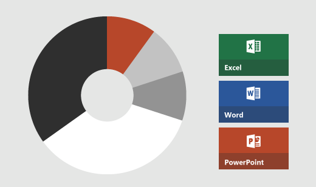

# 色

色は、ブランドを強調し、視覚的な階層を明確にするためにしばしば使用されます。 インターフェイスを識別し、エクスペリエンスに従ってお客様をガイドするのに役立ちます。 Office 内で色は、同じ目的で使用されますが、意図的に適用され、最小限に抑えられます。 お客様のコンテンツを圧倒しないでください。 それぞれの Office アプリは、独自の主要な色を使用してブランド化されているとしても、慎重に使用します。

Office UI Fabric には、既定のテーマの色のセットが含まれています。Fabric が、コンポーネントやレイアウトとして Office アドインに適用されると、同じ目的が適用されます。色は、階層を示して、コンテンツに干渉することなく、意図的にお客様の行動を喚起するものであるべきです。Fabric テーマの色により、インターフェイス全体に新しいアクセント カラーを取り込むことができます。この新しいアクセントは、Office アプリのブランドと競合し、階層に干渉する可能性があります。つまり、Fabric は、アドイン内で使用すると、インターフェイス全体に新しいアクセント カラーを取り込むことができるということです。この新しいアクセント カラーは、注意をそらし、階層全体に干渉する可能性があります。競合との干渉を回避する方法を検討してください。ニュートラルのアクセントを使用したり、Fabric テーマの色を上書きしたりして、Office アプリのブランドや独自のブランドの色に合わせます。

Office アプリケーションを使用すると、お客様は、Office UI テーマを適用することによって、インタ フェースをカスタマイズできます。お客様は、4 つの UI テーマから選択でき、Word、PowerPoint、Excel、Office スイートに含まれる他のアプリの背景やボタンをさまざまなスタイルに変えることができます。Office の自然な一部であるかのような、個人用設定に対応するアドインを作成するには、テーマ API を使用します。たとえば、作業ウィンドウの背景色を、いくつかのテーマで濃い灰色に切り替えます。テーマ API を使用すると、先例に倣い、[アクセシビリティ](../design/accessibility-guidelines.md)を確保するために前景色を調整することができます。

> [!NOTE]
> - メール アドインと作業ウィンドウ アドインの場合は、[Context.officeTheme](/javascript/api/office/office.context) プロパティを使用して Office アプリケーションのテーマに合わせます。 この API は、現在 Office 2016 以降で利用可能です。
> - PowerPoint のコンテンツ アドインの場合は、「[PowerPoint アドインで Office テーマを使用する](../powerpoint/use-document-themes-in-your-powerpoint-add-ins.md)」を参照してください。

色について、次の一般的なガイドラインが適用されます。

* 色は、階層を示し、ブランドを明確するために、慎重に使用します。
* 対話型要素と非対話型要素の両方に適用される単一のアクセント カラーの使いすぎは、混乱を招くことがあります。たとえば、ナビゲーション メニューで選択された項目と選択されていない項目について、同じ色を使用することは避けてください。
* Office ブランドのアプリの色との不必要な競合を避けます。
* 独自のブランドの色を使用して、サービスや会社との関連付けを作成します。
* すべてのテキストにアクセスできることを確認します。 前景色と背景との間には、4.5: 1 のコントラスト比率があることを確認してください。
* 色覚障碍者に配慮してください。 操作や階層を色だけで識別することは避けてください。
* Office アイコンのカラーパレットを使用したアドインコマンドアイコンの設計について詳しくは、[アイコンのガイドライン](../design/add-in-icons.md)を参照してください。
