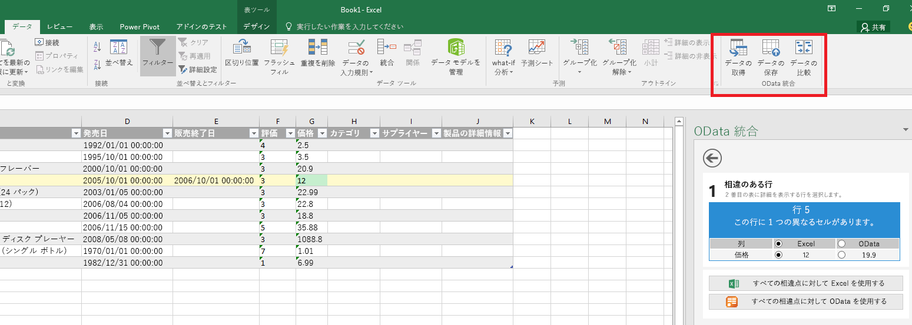
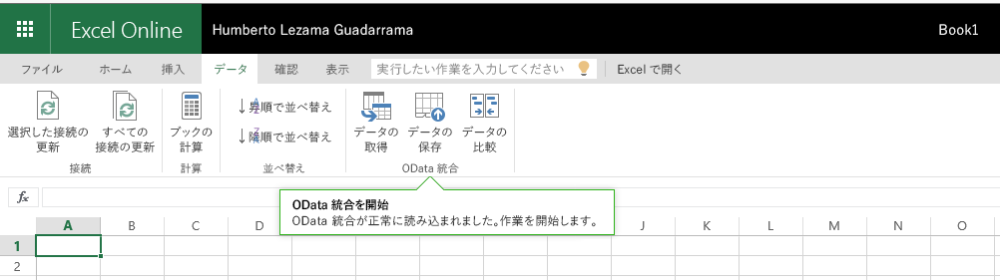
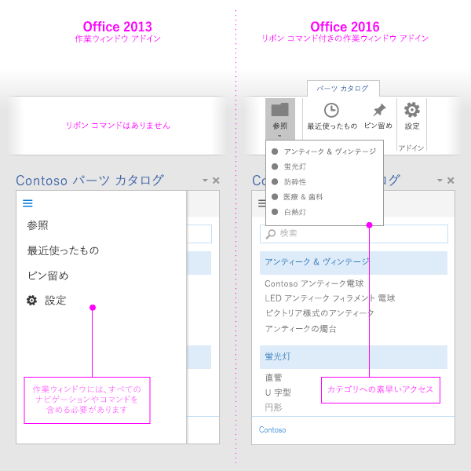

# Excel、PowerPoint、Word のアドイン コマンド

Add-in commands are UI elements that extend the Office UI and start actions in your add-in. You can use add-in commands to add a button on the ribbon or an item to a context menu. When users select an add-in command, they initiate actions such as running JavaScript code, or showing a page of the add-in in a task pane. Add-in commands help users find and use your add-in, which can help increase your add-in's adoption and reuse, and improve customer retention.

機能の概要については、ビデオ「[Office アプリ リボンのアドイン コマンド](https://channel9.msdn.com/events/Build/2016/P551)」を参照してください。

> [!NOTE]
> SharePoint catalogs do not support add-in commands. You can deploy add-in commands via [Centralized Deployment](../publish/centralized-deployment.md) or [AppSource](/office/dev/store/submit-to-appsource-via-partner-center), or use [sideloading](../testing/create-a-network-shared-folder-catalog-for-task-pane-and-content-add-ins.md) to deploy your add-in command for testing.

> [!IMPORTANT]
> アドイン コマンドは、Outlook でもサポートされています。 詳細については、「[Outlook のアドイン コマンド](../outlook/add-in-commands-for-outlook.md)」を参照してください。

*図 1. Excel デスクトップで実行するコマンドを含むアドイン*

*図 2. Excel on the web で実行するコマンドを含むアドイン*

## コマンドの機能

現在は、次のコマンド機能がサポートされています。

> [!NOTE]
> 現在、コンテンツ アドインは、アドイン コマンドをサポートしていません。

### 拡張点

- リボン タブ: 組み込みのタブを拡張するか、新しいカスタム タブを作成します。
- コンテキスト メニュー: 選択されたコンテキスト メニューを拡張します。

### コントロールの種類

- 単純なボタン: 特定のアクションをトリガーします。
- メニュー: アクションをトリガーするボタン付きの単純なメニューのドロップダウン。

### アクション

- ShowTaskpane: カスタムの HTML ページをロードする 1 つまたは複数のウィンドウを表示します。
- ExecuteFunction - Loads an invisible HTML page and then execute a JavaScript function within it. To show UI within your function (such as errors, progress, or additional input) you can use the [displayDialog](/javascript/api/office/office.ui) API.  

### 既定で有効または無効になっている状態 (プレビュー)

アドイン起動時にコマンドを有効にするか無効にするかを指定したり、プログラムによって設定を変更したりできます。

> [!NOTE]
> この機能はプレビュー段階にあり、すべてのホストまたはシナリオでサポートされるわけではありません。 詳細については、「[アドイン コマンドを有効または無効にする](disable-add-in-commands.md)」を参照してください。

## サポートされるプラットフォーム

現在、アドイン コマンドは次のプラットフォームでサポートされています。

- Windows 上の Office (ビルド 16.0.6769 以降、Microsoft 365 サブスクリプションに接続済み)
- Windows 版 Office 2019
- Mac 上の Office (ビルド 15.33 以降、Microsoft 365 サブスクリプションに接続済み)
- Mac 上の Office 2019
- Office on the web

> [!NOTE]
> Outlook でのサポートについては、「[Outlook のアドイン コマンド](../outlook/add-in-commands-for-outlook.md)」をご覧ください。

## デバッグ

アドイン コマンドをデバッグするには、Office on the web で実行する必要があります。 詳細については、「[Office on the web でアドインをデバッグする](../testing/debug-add-ins-in-office-online.md)」を参照してください。

## ベスト プラクティス

アドイン コマンドを開発するときは、次のベスト プラクティスを適用します。

- Use commands to represent a specific action with a clear and specific outcome for users. Do not combine multiple actions in a single button.
- Provide granular actions that make common tasks within your add-in more efficient to perform. Minimize the number of steps an action takes to complete.
- Office アプリ リボンにコマンドを配置するために。
    - Place commands on an existing tab (Insert, Review, and so on) if the functionality provided fits there. For example, if your add-in enables users to insert media, add a group to the Insert tab. Note that not all tabs are available across all Office versions. For more information, see [Office Add-ins XML manifest](../develop/add-in-manifests.md).
    - Place commands on the Home tab if the functionality doesn't fit on another tab, and you have fewer than six top-level commands. You can also add commands to the Home tab if your add-in needs to work across Office versions (such as Office on the web or desktop) and a tab is not available in all versions (for example, the Design tab doesn't exist in Office on the web).  
    - 6 個以上のトップ レベル コマンドがある場合は、コマンドをカスタム タブに配置します。
    - Name your group to match the name of your add-in. If you have multiple groups, name each group based on the functionality that the commands in that group provide.
    - アドインの使用スペースを増やす余分なボタンを追加しないでください。

     > [!NOTE]
     > 占有領域が大きすぎるアドインは [AppSource 検証](/legal/marketplace/certification-policies)を通過しない場合があります。

- すべてのアイコンについては、[アイコン デザインのガイドライン](add-in-icons.md)に従ってください。
- コマンドをサポートしていないホストでも動作するアドインのバージョンを提供します。 1 つのアドインのマニフェストは、コマンド対応 (コマンドを使用) ホストとコマンド非対応 (作業ウィンドウとして) ホストの両方で動作します。

   *図 3. Office 2013 の作業ウィンドウのアドインと、Office 2016 のアドイン コマンドを使用する同じアドイン*

   

## 次の手順

アドイン コマンドの使用を開始するために最適な方法は、GitHub の「[Office-Add-in-Commands-Samples](https://github.com/OfficeDev/Office-Add-in-Commands-Samples/)」を参照することです。

マニフェストでのアドイン コマンドの指定の詳細については、「[マニフェストでアドイン コマンドを作成する](../develop/create-addin-commands.md)」と「[VersionOverrides 要素](../reference/manifest/versionoverrides.md)」のリファレンス資料をご覧ください。
