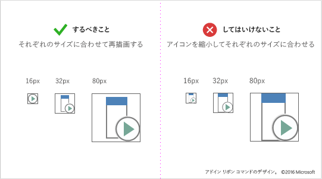
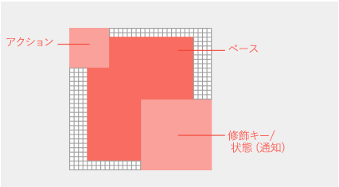

# Office アドインの新しいスタイル アイコンのガイドライン

Office 2013+ (永続) バージョンの Office では、Microsoft の Fresh スタイルのアイコンが使用されます。 アイコンが Microsoft 365 の Monoline スタイルと一致することを望む場合は、 [Office アドインの Monoline スタイル アイコンガイドラインに関するページ](add-in-icons-monoline.md)を参照してください。

## Office Fresh のビジュアル スタイル

Fresh アイコンには、重要なコミュニケーション要素のみが含まれます。 遠近法、グラデーション、および光源など、重要でない要素が削除されています。 アイコンが簡略化されたことで、コマンドやコントロールの解析をより高速に行うことができるようになっています。 このスタイルに従って、Office 永続クライアントに最適です。

## ベスト プラクティス

アイコンを作成するときは、次のガイドラインに従ってください。

|するべきこと|してはいけないこと|
|:---|:---|
|コミュニケーションの重要な要素に焦点を当てて、ビジュアルをシンプルで明確に保ちます。| アイコンが乱雑に見える成果物は使用しないでください。|
|Office アイコンの言語を使用して、動作や概念を示します。|Office アプリのリボンまたはコンテキスト メニューのアドイン コマンドに Fabric Core グリフを再利用しないでください。 Fabric Core アイコンは文体的に異なり、一致しません。|
|書式設定用のペイントブラシや検索用の虫眼鏡など、一般的な Office の視覚的メタファーを再利用します。|異なるコマンドで、同じ視覚的メタファーを再利用しないようにします。 異なる動作や概念に同じアイコンを使用すると、混乱が生じる可能性があります。 |
|アイコンを小さくしたり大きくしたりするために、アイコンを再描画します。 カットアウト、角、および丸角のエッジの線をできる限り明瞭にするために、再描画を行う手間を省かないでください。 |縮小または拡大してアイコンのサイズを変更しないでください。 これにより、視覚的品質が低くなり、動作が不明瞭になることがあります。 再描画せずにサイズを小さくすると、より大きなサイズで作成された複雑なアイコンから明瞭さが失われることがあります。 |
|Use a white fill for accessibility. Most objects in your icons will require a white background to be legible across Office UI themes and in high-contrast modes.  |アドイン コマンドで何をするかを伝えるために、ロゴやブランドに頼らないようにします。 ブランド マークは、サイズの小さいアイコンにしたり、修飾子を適用したりすると、しばしば認識不可能になります。 ブランド マークは、多くの場合、Office アプリのリボン アイコン のスタイルと競合し、飽和状態の環境でユーザーの注意を奪うことができます。 |
|透明背景の PNG 形式を使用します。 |*なし。*|
|アイコンに、表記文字、段落のラグ、および疑問符などの、ローカライズ可能なコンテンツを含めないようにします。 |*なし。*|

## アイコン サイズについて推奨事項と要件

Office のデスクトップ アイコンは、ビットマップ画像です。 ユーザーの DPI 設定やタッチ モードに応じて異なるサイズで表示されます。 サポートされている 8 つのサイズすべてを組み込んで、すべての解像度とコンテキストで最高のエクスペリエンスを提供します。 サポートされているサイズは次のとおりです。3 つのサイズが必要です。

- 16 px (必須)
- 20 px
- 24 px
- 32 px (必須)
- 40 px
- 48 px
- 64 ピクセル (推奨、Mac に最適)
- 80 px (必須)

> [!IMPORTANT]
> アドインの代表的なアイコンである画像については、「 [AppSource と Office 内で効果的なリストを作成](/office/dev/store/create-effective-office-store-listings#create-an-icon-for-your-add-in) する」を参照してください。サイズやその他の要件については、「」を参照してください。

それぞれのアイコンを、サイズに合わせて縮小するのではなく再描画します。

## アイコンの構造とレイアウト

Office アイコンは、通常、アクションと概念修飾子が重ねて表示された基本要素で構成されます。 アクション修飾子は、追加、開く、新規、閉じるなどの概念を表します。 概念的修飾子は、ステータス、変更、またはアイコンの説明を表します。

To create commands that align with the Office UI, follow layout guidelines for the base element and modifiers. This ensures that your commands look professional and that your customers will trust your add-in. If you make exceptions to these guidelines, do so intentionally.

以下の図は、Office のアイコンの基本要素と修飾子のレイアウトを表しています。

- 基本要素をピクセル フレームの中央に配置し、周囲に余白をとります。
- アクション修飾子は、左上に配置します。
- 概念的修飾子は、右下に配置します。
- アイコン内の要素の数を制限します。 32 ピクセルで、修飾子の数を最大 2 に制限します。 16 ピクセルで、修飾子の数を 1 に制限します。

### 基本要素のパディング

基本要素は、どのサイズでも同じ配置にします。 基本要素をフレームの中央に配置できない場合は、左上にそろえ、余分のピクセルは右下に残します。 最適な結果を得るには、次のセクションの表に示すパディング ガイドラインを適用します。

### 修飾子

すべての修飾子は、背景を含め、各要素の間に 1 ピクセルの透明なカットアウトを持つ必要があります。 要素が直接重ならないようにします。 ルールとエッジの間に余白を作ります。 修飾子はサイズが少しずつ異なっている場合がありますが、開始点としてこれらのサイズを使用します。

|アイコンのサイズ|基本要素の周囲のパディング|修飾子のサイズ|
|:---|:---|:---|
|16 px|0|9 px|
|20 px|1px|10 px|
|24 px|1px|12 px|
|32 px|2px|14 px|
|40 px|2px|20 px|
|48 px|3px|22 px|
|64 px|5px|29 px|
|80 px|5px|38 px|

## アイコンの色

> [!NOTE]
> これらの色のガイドラインは、[アドイン コマンド](add-in-commands.md)で使用されるリボン アイコン用です。 これらのアイコンは Fluent UI ではレンダリングされず、カラー パレットは Microsoft UI Fabric |で説明されているパレットとは異なります。[色|共有](https://fluentfabric.azurewebsites.net/#/color/shared)。

Office のアイコンには、限定されたカラー パレットがあります。 Office UI とのシームレスな統合を保証するために、以下の表に記載されている色を使用してください。 色の使用に次のガイドラインを適用します。

- Use color to communicate meaning rather than for embellishment. It should highlight or emphasize an action, status, or an element that explicitly differentiates the mark.
- 可能であれば、グレー以外の 1 色のみを追加で使用します。 追加する色は最大 2 色までに制限します。
- すべてのサイズのアイコンで、色を統一する必要があります。 Office のアイコンのカラー パレットは、アイコンのサイズによってわずかな違いがあります。 16 ピクセル以上のアイコンは、32 ピクセル以上のアイコンよりも少し暗く、鮮やかです。 これらの微妙な調整をしないと、サイズによって色の見え方が変わってしまいます。

|色の名前|RGB|16 進数|色|カテゴリ|
|:---|:---|:---|:---|:---|
|テキスト グレー (80)|80、80、80|#505050|  |テキスト|
|テキスト グレー (95)|95、95、95|#5F5F5F|  |テキスト|
|テキスト グレー (105)|105, 105, 105|#696969|  |テキスト|
|ダーク グレー 32|128、128、128|#808080|  |32 px 以上|
|ミディアム グレー 32|158、158、158|#9E9E9E|  |32 px 以上|
|ライト グレー オール|179、179、179|#B3B3B3|  |すべてのサイズ|
|ダーク グレー 16|114、114、114|#727272|  |16 ピクセル以下|
|ミディアム グレー 16|144、144、144|#909090|  |16 以下|
|ブルー 32|77、130、184|#4d82B8|  |32 px 以上|
|ブルー 16|74、125、177|#4A7DB1|  |16 ピクセル以下|
|イエロー オール|234、194、130|#EAC282|  |すべてのサイズ|
|オレンジ 32|231、142、70|#E78E46|  |32 px 以上|
|オレンジ 16|227、142、70|#E3751C|  |16 ピクセル以下|
|ピンク オール|230、132、151|#E68497|  |すべてのサイズ|
|グリーン 32|118、167、151|#76A797|  |32 px 以上|
|グリーン 16|104、164、144|#68A490|  |16 ピクセル以下|
|レッド 32|216、99、68|#D86344|  |32 px 以上|
|レッド 16|214、85、50|#D65532|  |16 ピクセル以下|
|パープル 32|152、104、185|#9868B9|  |32 px 以上|
|パープル 16|137、89、171|#8959AB|  |16 ピクセル以下|

## ハイコントラスト モードのアイコン

Office のアイコンは、ハイコントラスト モードで適切に表示されるように設計されています。 前景の要素は背景と区別され、読みやすさを最大限に高め、色の変更を可能にします。 ハイコントラスト モードでは、Office は赤、緑、または青の値が 190 未満のアイコンのすべてのピクセルを、完全な黒に変更します。 それ以外のピクセルは、すべて白になります。 つまり、各 RGB チャンネルは 0 から 189 の値が黒、190 から 255 の値が白と評価されます。 その他のハイコントラスト テーマも同じ 190 値のしきい値を使用して色の変更が行われますが、ルールは異なります。 たとえば、白のハイコントラスト テーマでは、190 よりも大きい不透明のピクセルすべての色を変更しますが、その他のピクセルはすべて透明になります。 ハイ コントラスト設定で読みやすさを最大化するには、次のガイドラインを適用します。

- 190 値のしきい値に沿って、前景と背景の要素を区別するようにします。
- Office アイコンの表示スタイルに従います。
- 色はアイコン パレットから使用します。
- グラデーションの使用を避けます。
- 同じ様な値を持つ大きな色のブロックを避けます。

## 関連項目

- [Icon manifest 要素](/javascript/api/manifest/icon)
- [IconUrl manifest 要素](/javascript/api/manifest/iconurl)
- [HighResolutionIconUrl manifest 要素](/javascript/api/manifest/highresolutioniconurl)
- [アドイン用のアイコンの作成](/office/dev/store/create-effective-office-store-listings#create-an-icon-for-your-add-in)
