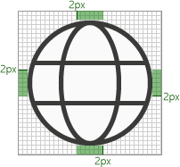

# アドインのモノOffice アイコンのガイドラインMonoline style icon guidelines for Office Add-ins

モノライン スタイルの図図は、一部のアプリOfficeされます。Monoline style iconography are used in Office apps. サブスクリプション以外の Office 2013+ の新しいスタイルとアイコンを一致することを希望する場合は、新しいスタイルのアイコンのガイドラインにOffice [参照してください](add-in-icons-fresh.md)。If you would prefer that your icons match the Fresh style of non-subscription Office 2013+, see [Fresh style icon guidelines for Office Add-ins](add-in-icons-fresh.md).

## Officeの視覚スタイルOffice Monoline visual style

モノライン スタイルの目標は、アクションと機能をシンプルな視覚効果で伝え、すべてのユーザーがアイコンにアクセスし、Windows の他の場所で使用されているスタイルと一貫性のあるスタイルを持つ、一貫性があり、明確でアクセス可能な図を作成することです。The goal of the Monoline style to have consistent, clear, and accessible iconography to communicate action and features with simple visuals, ensure the icons are accessible to all users, and have a style that is consistent with those used elsewhere in Windows.

次のガイドラインは、既存の製品に既に存在するアイコンと一致する機能のアイコンを作成するサードパーティOfficeです。The following guidelines are for 3rd party developers who want to create icons for features that will be consistent with the icons already present Office products.

### デザインの原則Design principles

- シンプル、クリーン、クリア。Simple, clean, clear.
- 必要な要素のみを含む。Contain only necessary elements.
- Windows のアイコン スタイルから着風を受けたもの。Inspired by Windows icon style.
- すべてのユーザーがアクセスできます。Accessible to all users.

#### 意味を伝えるConveying meaning

- 文書を表すページやメールを表す封筒などの説明的な要素を使用します。Use descriptive elements such as a page to represent a document or an envelope to represent mail.
- 同じ概念を表す場合は、同じ要素を使用します。つまり、メールは常にスタンプではなく封筒で表されます。Use the same element to represent the same concept, i.e., mail is always represented by an envelope, not a stamp.
- 概念の開発時にコアメタファーを使用します。Use a core metaphor during concept development.

#### 要素の削減Reduction of Elements

- メタファーに不可欠な要素のみを使用して、アイコンをコアの意味に減らします。Reduce the icon to its core meaning, using only elements that are essential to the metaphor.
- アイコンのサイズに関係なく、アイコン内の要素の数を 2 に制限します。Limit the number of elements in an icon to two, regardless of icon size.

#### 一貫性Consistency

アイコンのサイズ、配置、色は一貫している必要があります。Sizes, arrangement, and color of icons should be consistent.

#### スタイル設定Styling

##### PerspectivePerspective

モノライン アイコンは既定で前方に表示されます。Monoline icons are forward-facing by default. 立方体など、視点や回転を必要とする特定の要素は許可されますが、例外は最小限に抑える必要があります。Certain elements that require perspective and/or rotation, such as a cube, are allowed, but exceptions should be kept to a minimum.

##### 装飾Embellishment

モノラインは、クリーンな最小限のスタイルです。Monoline is a clean minimal style. すべてはフラットカラーを使用します。つまり、グラデーション、テクスチャ、または光源はありません。Everything uses flat color, which means there are no gradients, textures, or light sources.

## 設計Designing

### サイズSizes

高 DPI デバイスをサポートするために、これらのすべてのサイズで各アイコンを作成することをお勧めします。We recommend that you produce each icon in all these sizes to support high DPI devices. 絶対に *必要な* サイズは 16 px、20 px、32 px です。100% のサイズです。The absolutely *required* sizes are 16 px, 20 px, and 32 px, as those are the 100% sizes.

**16 px、20 px、24 px、32 px、40 px、48 px、64 px、80 px、96 px****16 px, 20 px, 24 px, 32 px, 40 px, 48 px, 64 px, 80 px, 96 px**

### レイアウトLayout

修飾子を持つアイコン レイアウトの例を次に示します。The following is an example of icon layout with a modifier.

  

#### 要素Elements

- **基本**: アイコンが表す主な概念です。**Base**: The main concept that the icon represents. 通常、これはアイコンに必要な唯一のビジュアル要素ですが、主な概念をセカンダリ要素 (修飾子) で拡張できる場合があります。This is usually the only visual needed for the icon, but sometimes the main concept can be enhanced with a secondary element, a modifier.

- **修飾子** ベースをオーバーレイする要素。つまり、通常はアクションまたは状態を表す修飾子です。**Modifier** Any element that overlays the base; that is, a modifier that typically represents an action or a status. 追加、変更、または記述子として機能することで、基本要素を変更します。It modifies the base element by acting as an addition, alteration, or a descriptor.

### 建設Construction

#### 要素の配置Element placement

基本要素は、パディング内のアイコンの中央に配置されます。Base elements are placed in the center of the icon within the padding. 完全に中央に配置できない場合は、基点を上から右に配置する必要があります。If it can't be placed perfectly centered, then the base should err to the top right. 次の例では、アイコンは完全に中央に表示されます。In the following example, the icon is perfectly centered.

次の例では、アイコンが左側に表示されます。In the following example, the icon is erring to the left.

修飾子は、ほとんどの場合、アイコン キャンバスの右下隅に配置されます。Modifiers are almost always placed in the bottom right corner of the icon canvas. まれに、修飾子が別の隅に配置される場合があります。In some rare cases, modifiers are placed in a different corner. たとえば、右下隅の修飾子で基本要素を認識できない場合は、その要素を左上隅に配置します。For example, if the base element would be unrecognizable with the modifier in the bottom right corner, then consider placing it in the upper left corner.

#### PaddingPadding

各サイズ アイコンには、アイコンの周囲のパディングの量が指定されています。Each size icon has a specified amount of padding around the icon. 基本要素はパディング内に残りますが、修飾子はキャンバスの端まで修飾し、パディングの外側をアイコンの境界線の端まで拡張する必要があります。The base element stays within the padding, but the modifier should butt up to the edge of the canvas, extending outside of the padding to the edge of the icon border. 次の図は、各アイコン サイズに使用する推奨されるパディングを示しています。The following images show the recommended padding to use for each of the icon sizes.

|**16px****16px**|**20px****20px**|**24px****24px**|**32px****32px**|**40px****40px**|**48px****48px**|**64px****64px**|**80px****80px**|**96px****96px**|
|:---|:---|:---|:---|:---|:---|:---|:---|:---|
||||||||||

#### 線の太さLine weights

モノラインは、線と輪郭の付いた図形で使用されるスタイルです。Monoline is a style dominated by line and outlined shapes. アイコンを作成するサイズに応じて、次の線の太みを使用する必要があります。Depending on what size you are producing the icon should use the following line weights.

|アイコンのサイズ:Icon Size:|16px16px|20px20px|24px24px|32px32px|40px40px|48px48px|64px64px|80px80px|96px96px|
|:---|:---|:---|:---|:---|:---|:---|:---|:---|:---|
|**線の太さ:****Line Weight:**|1px1px|1px1px|1px1px|1px1px|2px2px|2px2px|2px2px|2px2px|3px3px|
|**アイコンの例:****Example icon:**||||||||||

#### カットアウトCutouts

アイコン要素が別の要素の上に配置されている場合、主に読みやすさを目的として、2 つの要素の間にスペースを提供するためにカットアウト (下の要素) が使用されます。When an icon element is placed on top of another element, a cutout (of the bottom element) is used to provide space between the two elements, mainly for readability purposes. これは通常、修飾子が基本要素の上に配置されますが、どちらの要素も修飾子でもない場合にも発生します。This usually happens when a modifier is placed on top of a base element, but there are also cases where neither of the elements is a modifier. これらの 2 つの要素間の切り取りは、"ギャップ" と呼ばれる場合があります。These cutouts between the two elements is sometimes referred to as a "gap".

間隔のサイズは、そのサイズで使用される線の太さと同じ幅である必要があります。The size of the gap should be the same width as the line weight used on that size. 16 ピクセルのアイコンを作成する場合、間隔の幅は 1px、48 px アイコンの場合はギャップを 2 ピクセルに設定する必要があります。If making a 16 px icon, the gap width would be 1px and if it is a 48 px icon then the gap should be 2px. 次の例は、修飾子と基になるベースの間の間隔が 1px の 32 px アイコンを示しています。The following example shows a 32 px icon with a gap of 1px between the modifier and the underlying base.

修飾子のエッジが斜めまたは曲線の場合、標準のギャップが十分に分離できない場合は、ギャップが 1/2 ピクセル増加する場合があります。In some cases, the gap can be increase by a 1/2 px if the modifier has a diagonal or curved edge and the standard gap doesn't provide enough separation. これは、線の太さ 16 px、20 px、24 px、32 px のアイコンにのみ影響します。This will likely only affect the icons with 1px line weight: 16 px, 20 px, 24 px, and 32 px.

#### 背景の塗りつぶしBackground fills

モノライン アイコン セットのほとんどのアイコンでは、背景に塗りつぶしが必要です。Most icons in the Monoline icon set require background fills. ただし、オブジェクトが自然に塗りつぶしを持たないので、塗りつぶしを適用しない場合があります。However, there are cases where the object would not naturally have a fill, so no fill should be applied. 次のアイコンは白い塗りつぶしです。The following icons have a white fill.

次のアイコンには塗りつぶしはありません。The following icons have no fill. (歯車アイコンは、中心の穴が塗りつぶされていない場合に表示されます)。(The gear icon is included to show that the center hole is not filled.)

##### 塗りつぶしのベスト プラクティスBest practices for fills

###### 次の操作を行います。Dos:

- 定義された境界を持ち、自然に塗りつぶしを持つすべての要素を塗りつぶします。Fill any element that has a defined boundary, and would naturally have a fill.
- 背景の塗りつぶしを作成するには、別の図形を使用します。Use a separate shape to create the background fill.
- カラー **パレットから背景の** 塗りつぶし [を使用します](#color)。Use **Background Fill** from the [color palette](#color).
- 重複する要素間のピクセルの分離を維持します。Maintain the pixel separation between overlapping elements.
- 複数のオブジェクト間で塗りつぶしを行います。Fill between multiple objects.

###### 次の方法で行います。Don'ts:

- 自然に塗りつぶされないオブジェクトは塗りつぶしません。たとえば、クリップDon't fill objects that would not naturally be filled; for example, a paperclip.
- 角かっこを埋めない。Don't fill brackets.
- 数字やアルファ文字の後ろに入力しません。Don't fill behind numbers or alpha characters.

### 色Color

カラー パレットは、シンプルさとアクセシビリティを考慮して設計されています。The color palette has been designed for simplicity and accessibility. 4 つの中間色と、青、緑、黄色、赤、紫色の 2 つのバリエーションが含まれている。It contains 4 neutral colors and two variations for blue, green, yellow, red, and purple. オレンジ色は、モノライン アイコンのカラー パレットには意図的に含まれていません。Orange is intentionally not included in the Monoline icon color palette. 各色は、このセクションで説明する特定の方法で使用することを目的とします。Each color is intended to be used in specific ways as outlined in this section.

#### パレットPalette

#### 色の使い方How to use color

モノライン カラー パレットでは、すべての色にスタンドアロン、アウトライン、および塗りつぶしのバリエーションがあります。In the Monoline color palette, all colors have Standalone, Outline, and Fill variations. 一般に、要素は塗りつぶしと罫線で構成されます。Generally, elements are constructed with a fill and a border. 色は、次のいずれかのパターンで適用されます。The colors are applied in one of the following patterns:

- 塗りつぶしがないオブジェクトに対するスタンドアロンの色。The Standalone color alone for objects that have no fill.
- 枠線はアウトライン色を使用し、塗りつぶしは塗りつぶしの色を使用します。The border uses the Outline color and the fill uses the Fill color.
- 枠線はスタンドアロン色を使用し、塗りつぶしは背景の塗りつぶしの色を使用します。The border uses the Standalone color and the fill uses the Background Fill color.

色の使用例を次に示します。The following are examples of using color.

最も一般的な状況は、要素で背景に塗りつぶしを適用した濃い灰色のスタンドアロンを使用する場合です。The most common situation will be to have an element use Dark Gray Standalone with Background Fill.

塗りつぶしを使用する場合は、常に対応するアウトライン色を使用する必要があります。When using a colored Fill, it should always be with its corresponding Outline color. たとえば、青い塗りつぶしは青いアウトラインでのみ使用する必要があります。For example, Blue Fill should only be used with Blue Outline. ただし、この一般規則には次の 2 つの例外があります。But there are two exceptions to this general rule:

- 背景の塗りつぶしは、スタンドアロンの任意の色で使用できます。Background Fill can be used with any color Standalone.
- 薄い灰色の塗りつぶしは、2 つの異なるアウトライン色 (濃い灰色または中灰色) で使用できます。Light Gray Fill can be used with two different Outline colors: Dark Gray or Medium Gray.

#### 色を使用する場合When to use color

装飾のためにではなく、アイコンの意味を伝えるために色を使用する必要があります。Color should be used to convey the meaning of the icon rather than for embellishment. ユーザーに **対するアクションを強調表示** する必要があります。It should **highlight the action** to the user. 色を持つ基本要素に修飾子を追加すると、通常、基本要素は濃い灰色と背景の塗りつぶしに変換され、次のセットの左端のアイコンの画像ベースに "X" 修飾子が追加されるなど、修飾子を色の要素にできます。When a modifier is added to a base element that has color, the base element is typically turned into Dark Gray and Background Fill so that the modifier can be the element of color, such as the case below with the "X" modifier being added to the picture base in the leftmost icon of the following set.

アイコンは、上記 **のアウトラインと** 塗りつぶし以外の 1 つの追加の色に制限する必要があります。You should limit your icons to **one** additional color, other than the Outline and Fill mentioned above. ただし、メタファーにとってより多くの色を使用できる場合は、灰色以外の 2 つの追加色に制限されます。However, more colors can be used if it is vital for its metaphor, with a limit of two additional colors other than gray. まれに、より多くの色が必要な場合は例外があります。In rare cases, there are exceptions when more colors are needed. 1 つの色を使用するアイコンの良い例を次に示します。The following are good examples of icons that use just one color.

  

ただし、次のアイコンでは色が多すぎます。But the following icons use too many colors.

  

スプレッドシート **のアイコンの** 枠線など、内部の "コンテンツ" に中灰色を使用します。Use **Medium Gray** for interior "content", such as grid lines in an icon of a spreadsheet. コンテンツがコントロールの動作を表示する必要がある場合は、追加の内部の色が使用されます。Additional interior colors are used when the content needs to show the behavior of the control.

#### テキスト行Text lines

テキスト行が "コンテナー" (文書のテキストなど) にある場合は、灰色 (中) を使用します。When text lines are in a "container" (for example, text on a document), use medium gray. コンテナー内のテキスト行は濃い灰色 **である必要があります**。Text lines not in a container should be **Dark Gray**.

### テキストText

アイコンにテキスト文字を使用しないようにします。Avoid using text characters in icons. 世界中Office製品が使われるので、アイコンはできる限り言語に依存しない状態にしておきたいと考えています。Since Office products are used around the world, we want to keep icons as language neutral as possible.

## 生産Production

### アイコン ファイル形式Icon file format

最後のアイコンは、.png イメージ ファイルとして保存する必要があります。The final icons should be saved as .png image files. 背景が透明で、深度が 32 ビットの PNG 形式を使用します。Use PNG format with a transparent background and have 32-bit depth.
