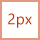
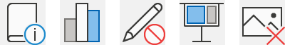

# Office アドインの Monoline スタイルのアイコンガイドラインMonoline style icon guidelines for Office Add-ins

Monoline style 図像は Office 365 で使用されます。Monoline style iconography are used in Office 365. アイコンがサブスクリプション以外の Office 2013 以降の新しいスタイルに一致するようにする場合は、「 [Office アドインの新しいスタイルのアイコンガイドライン](add-in-icons-fresh.md)」を参照してください。If you would prefer that your icons match the Fresh style of non-subscription Office 2013+, see [Fresh style icon guidelines for Office Add-ins](add-in-icons-fresh.md).

## Office Monoline の視覚スタイルOffice Monoline visual style

一貫性があり、わかりやすく、アクセス可能な図像を持つ Monoline スタイルの目的は、シンプルなビジュアルを使用して操作と機能を伝えるために、アイコンがすべてのユーザーに対してアクセス可能であること、および Windows の他の場所で使用されているものと一致するスタイルを持つことを示します。The goal of the Monoline style to have consistent, clear, and accessible iconography to communicate action and features with simple visuals, ensure the icons are accessible to all users, and have a style that is consistent with those used elsewhere in Windows.

次のガイドラインは、サードパーティの開発者が、既にインストールされているアイコンと一貫性のある機能のアイコンを作成することを希望しています。The following guidelines are for 3rd party developers who want to create icons for features that will be consistent with the icons already present Office products.

### 設計原則Design principles

-   シンプル、クリーン、クリア。Simple, clean, clear.
-   必要な要素のみが含まれています。Contain only necessary elements.
-   ウィンドウアイコンのスタイル。Inspired by Windows icon style.
-   すべてのユーザーがアクセスできます。Accessible to all users.

#### 意味を伝えるConveying meaning

-   ページなどの説明的な要素を使用して、メールを表すドキュメントまたはエンベロープを表します。Use descriptive elements such as a page to represent a document or an envelope to represent mail.
-   同じ概念を表すのと同じ要素を使用します。つまり、メールは常に、スタンプではなく封筒で表されます。Use the same element to represent the same concept, i.e., mail is always represented by an envelope, not a stamp.
-   概念開発時にコアメタファを使用します。Use a core metaphor during concept development.

#### 要素の削減Reduction of Elements

-   アイコンは、メタファに不可欠な要素のみを使用して、中心となる意味を小さくします。Reduce the icon to its core meaning, using only elements that are essential to the metaphor.
-   アイコンのサイズに関係なく、アイコンの要素の数を2に制限します。Limit the number of elements in an icon to two, regardless of icon size.

#### 一貫Consistency

アイコンのサイズ、配置、色は一貫している必要があります。Sizes, arrangement, and color of icons should be consistent.

#### スタイルStyling

##### PerspectivePerspective

既定では、Monoline アイコンは前方に向きます。Monoline icons are forward-facing by default. キューブなどの遠近や回転を必要とする一部の要素は許可されますが、例外は最小限に抑える必要があります。Certain elements that require perspective and/or rotation, such as a cube, are allowed, but exceptions should be kept to a minimum.

##### 装飾記号Embellishment

Monoline は、完全な最小のスタイルです。Monoline is a clean minimal style. すべてがフラットな色を使用しているため、グラデーション、テクスチャ、または光源がないことを意味します。Everything uses flat color, which means there are no gradients, textures, or light sources.

## 設計Designing

### フェースSizes

高 DPI デバイスをサポートするには、これらのサイズで各アイコンを生成することをお勧めします。We recommend that you produce each icon in all these sizes to support high DPI devices. 絶対に *必要な* サイズは、100% のサイズなので、16 px、20px、および32px です。The absolutely *required* sizes are 16px, 20px, and 32px, as those are the 100% sizes.

**16px、20px、24px、32px、40px、48px、64px、80px、96px****16px, 20px, 24px, 32px, 40px, 48px, 64px, 80px, 96px**

### レイアウトLayout

次に、修飾子付きのアイコンレイアウトの例を示します。The following is an example of icon layout with a modifier.

  

#### 要素Elements

- **Base**: アイコンが表す主な概念です。**Base**: The main concept that the icon represents. これは通常、アイコンに必要なビジュアルだけですが、第2の要素 (修飾子) を使用して主な概念を拡張することもできます。This is usually the only visual needed for the icon, but sometimes the main concept can be enhanced with a secondary element, a modifier.

- **修飾子** ベースをオーバーレイする任意の要素。これは、通常、アクションまたはステータスを表す修飾子です。**Modifier** Any element that overlays the base; that is, a modifier that typically represents an action or a status. 追加、変更、または記述子として機能することによって、基本要素を変更します。It modifies the base element by acting as an addition, alteration, or a descriptor.

![ベースエリアと [修飾子] 領域があるグリッド。](../images/monolineicon3.png)

### 建設Construction

#### 要素の配置Element placement

Base 要素は、スペース内のアイコンの中央に配置されます。Base elements are placed in the center of the icon within the padding. 中心を完全に配置できない場合は、上から右にエラーが表示されます。If it can't be placed perfectly centered, then the base should err to the top right. 次の例では、アイコンは完全に中央揃えになっています。In the following example, the icon is perfectly centered:

次の例では、アイコンは左に erring ます。In the following example, the icon is erring to the left.

修飾子は、ほとんどの場合、アイコンキャンバスの右下隅に配置されます。Modifiers are almost always placed in the bottom right corner of the icon canvas. まれに、修飾子が異なる隅に配置される場合があります。In some rare cases, modifiers are placed in a different corner. たとえば、底要素が右下隅の修飾子で認識されない場合は、左上隅に配置することを検討してください。For example, if the base element would be unrecognizable with the modifier in the bottom right corner, then consider placing it in the upper left corner.

#### PaddingPadding

各サイズアイコンには、アイコンの周囲に指定された余白があります。Each size icon has a specified amount of padding around the icon. Base 要素は埋め込みの範囲内に残りますが、補助線はキャンバスの端までになり、パディング---の外側がアイコンの輪郭の端まで拡張されます。The base element stays within the padding, but the modifier should butt up to the edge of the canvas, extending outside of the padding---to the edge of the icon border. 次の画像は、アイコンのサイズごとに推奨される埋め込みを示しています。The following images show the recommended padding to use for each of the icon sizes.

|**16px****16px**|**20px****20px**|**24px****24px**|**32px****32px**|**40px****40px**|**48px****48px**|**64px****64px**|**80px****80px**|**96px****96px**|
|:---|:---|:---|:---|:---|:---|:---|:---|:---|
||||||||||

#### 線の太さLine weights

Monoline は、線とアウトライン付きの図形のスタイルです。Monoline is a style dominated by line and outlined shapes. アイコンのサイズに応じて、次の線の太さを使用する必要があります。Depending on what size you are producing the icon should use the following line weights.

|**アイコンのサイズ:****Icon Size:**|**16px****16px**|**20px****20px**|**24px****24px**|**32px****32px**|**40px****40px**|**48px****48px**|**64px****64px**|**80px****80px**|**96px****96px**|
|:---|:---|:---|:---|:---|:---|:---|:---|:---|:---|
|**線の太さ:****Line Weight:**|1px1px|1px1px|1px1px|1px1px|2px2px|2px2px|2px2px|2px2px|3px3px|
|||||||||||

#### 切り抜きCutouts

Icon 要素が別の要素の上に配置されている場合は、主に読みやすくするために、(bottom 要素の) 切り抜きを使用して、2つの要素の間にスペースを提供します。When an icon element is placed on top of another element, a cutout (of the bottom element) is used to provide space between the two elements, mainly for readability purposes. これは通常、修飾子が基本要素の上に配置されている場合に、いずれの要素も修飾子ではない場合に発生します。This usually happens when a modifier is placed on top of a base element, but there are also cases where neither of the elements is a modifier. これらの2つの要素間の切り抜きは、「gap」と呼ばれることもあります。These cutouts between the two elements is sometimes referred to as a "gap".

間隔のサイズは、そのサイズに対して使用される線の太さと同じである必要があります。The size of the gap should be the same width as the line weight used on that size. 16ピクセルのアイコンを作成する場合は、間隔を1px に設定し、それが48ピクセルのアイコンの場合、ギャップを2px にする必要があります。If making a 16px icon, the gap width would be 1px and if it is a 48px icon then the gap should be 2px. 次の例では、修飾子と基になるベースとの間に1px のギャップがある間隔アイコンを示しています。The following example shows a 32px icon with a gap of 1px between the modifier and the underlying base.

場合によっては、スペースが斜めまたは曲線のエッジを持つ場合は、1/2px で間隔を増やすことができ、標準のギャップでは十分な分離が得られない場合があります。In some cases, the gap can be increase by a 1/2px if the modifier has a diagonal or curved edge and the standard gap doesn't provide enough separation. これは、1px 線の太さを持つアイコンにのみ影響する可能性があります。16px、20px、24px、および32px。This will likely only affect the icons with 1px line weight; 16px, 20px, 24px, and 32px.

#### 背景の塗りつぶしBackground fills

Monoline アイコンセットのほとんどのアイコンは、背景の塗りつぶしを必要とします。Most icons in the Monoline icon set require background fills. ただし、オブジェクトが自然に塗りつぶされていない場合は、塗りつぶしを適用する必要はありません。However, there are cases where the object would not naturally have a fill, so no fill should be applied. 次のアイコンには白の塗りつぶしが設定されています。The following icons have a white fill:

次のアイコンには塗りつぶしがありません。The following icons have no fill. (中央の穴が塗りつぶされていないことを示す歯車アイコンが含まれています)。 (The gear icon is included to show that the center hole is not filled.) 

##### 塗りつぶしのベストプラクティスBest practices for fills

###### DoDos:

- 境界が定義されている任意の要素を塗りつぶします。塗りつぶしがあります。Fill any element that has a defined boundary, and would naturally have a fill.
- 背景の塗りつぶしを作成するには、別の図形を使用します。Use a separate shape to create the background fill.
- [カラーパレット](#color)から**背景の塗りつぶし**を使用します。Use **Background Fill** from the [color palette](#color).
- 重なり合う要素間のピクセルの間隔を維持します。Maintain the pixel separation between overlapping elements.
- 複数のオブジェクト間での塗りつぶし。Fill between multiple objects.

###### 注意事項Don'ts:

- 自然に入力されていないオブジェクトを塗りつぶすことはできません。たとえば、クリップになります。Don't fill objects that would not naturally be filled; for example, a paperclip.
- 角かっこを入力しません。Don't fill brackets.
- 数字または英字の後ろには入力しないでください。Don't fill behind numbers or alpha characters.

### 色Color

カラーパレットは、シンプルかつアクセシビリティを目的として設計されています。The color palette has been designed for simplicity and accessibility. この中には、4つの中間色の色と、青、緑、黄色、赤、および紫の2つのバリエーションが含まれています。It contains 4 neutral colors and two variations for blue, green, yellow, red, and purple. オレンジ色は、意図的に Monoline アイコンカラーパレットに含まれていません。Orange is intentionally not included in the Monoline icon color palette. 各色は、このセクションで説明する特定の方法で使用することを目的としています。Each color is intended to be used in specific ways as outlined in this section.

#### カラーPalette

#### 色の使用方法How to use color

Monoline カラーパレットでは、すべての色に、スタンドアロン、アウトライン、および塗りつぶしのバリエーションがあります。In the Monoline color palette, all colors have Standalone, Outline, and Fill variations. 通常、要素は塗りつぶしと輪郭で構成されています。Generally, elements are constructed with a fill and a border. 色は、次のいずれかのパターンで適用されます。The colors are applied in one of the following patterns:

- 塗りつぶしが設定されていないオブジェクトのスタンドアロンカラーのみ。The Standalone color alone for objects that have no fill.
- 罫線はアウトラインの色を使用し、塗りつぶしには塗りつぶしの色が使用されます。The border uses the Outline color and the fill uses the Fill color.
- 罫線は、スタンドアロンの色を使用し、塗りつぶしには背景の塗りつぶしの色が使用されます。The border uses the Standalone color and the fill uses the Background Fill color.

次に色を使用する例を示します。The following are examples of using color.

最も一般的な状況は、要素に背景の塗りつぶしを使用して濃い灰色のスタンドアロンを使用することです。The most common situation will be to have an element use Dark Gray Standalone with Background Fill.

色の塗りつぶしを使用する場合は、常に、対応する輪郭の色で表示される必要があります。When using a colored Fill, it should always be with its corresponding Outline color. たとえば、青い塗りつぶしは青い輪郭線でのみ使用します。For example, Blue Fill should only be used with Blue Outline. ただし、この一般的なルールには次の2つの例外があります。But there are two exceptions to this general rule:

- 背景の塗りつぶしは、任意の色のスタンドアロンで使用できます。Background Fill can be used with any color Standalone.
- 明るい灰色の塗りつぶしは、2つの異なる輪郭の色 (濃い灰色または淡い灰色) で使用できます。Light Gray Fill can be used with two different Outline colors: Dark Gray or Medium Gray.

#### 色を使用する場合When to use color

装飾記号ではなく、アイコンの意味を伝えるために色を使用する必要があります。Color should be used to convey the meaning of the icon rather than for embellishment. ユーザーに対する **アクションを強調表示** する必要があります。It should **highlight the action** to the user. 色が設定された基本要素に修飾子を追加すると、通常は、次のセットの左端のアイコンにある "X" 修飾子が picture base に追加されている場合など、基本要素が暗い灰色および背景の塗りつぶしに変更されます。When a modifier is added to a base element that has color, the base element is typically turned into Dark Gray and Background Fill so that the modifier can be the element of color, such as the case below with the "X" modifier being added to the picture base in the leftmost icon of the following set.

アイコンは、前に説明したアウトラインと塗りつぶし以外の **1 つ** の追加色に制限する必要があります。You should limit your icons to **one** additional color, other than the Outline and Fill mentioned above. ただし、メタファにとって重要であり、灰色以外の2つの追加の色の制限がある場合は、より多くの色を使用できます。However, more colors can be used if it is vital for its metaphor, with a limit of two additional colors other than gray. その他の色を必要とする場合、例外が発生することがまれにあります。In rare cases, there are exceptions when more colors are needed. 次に示すのは、1つの色のみを使用するアイコンの適切な例です。The following are good examples of icons that use just one color.

  

しかし、次のアイコンは多くの色を使用します。But the following icons use too many colors.

  

内部の "コンテンツ" (スプレッドシートのアイコン内のグリッド線など) に **淡い灰色** を使用します。Use **Medium Gray** for interior "content", such as grid lines in an icon of a spreadsheet. コンテンツにコントロールの動作を表示する必要がある場合は、追加の内部色が使用されます。Additional interior colors are used when the content needs to show the behavior of the control.

#### テキスト行Text lines

テキスト行が "container" (たとえば、ドキュメントのテキスト) にある場合は、淡い灰色を使用します。When text lines are in a "container" (for example, text on a document), use medium gray. コンテナー内にないテキスト行は、 **濃い灰色**にする必要があります。Text lines not in a container should be **Dark Gray**.

### テキストText

アイコンでテキスト文字を使用することは避けてください。Avoid using text characters in icons. Office 製品は世界中で使用されているため、アイコンをできるだけニュートラルにしておきたいと考えています。Since Office products are used around the world, we want to keep icons as language neutral as possible.

## 生産Production

### アイコンファイルの形式Icon file format

最終的なアイコンは .png 画像ファイルとして保存する必要があります。The final icons should be saved as .png image files. 透明な背景で PNG 形式を使用し、32ビットの深さを設定します。Use PNG format with a transparent background and have 32-bit depth.
