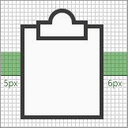
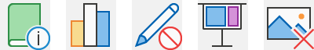

# アドインのモノOfficeアイコンのガイドライン

モノライン スタイルのアイコンは、アプリでOfficeされます。 2013+ のサブスクリプション以外の新しいスタイルとアイコンが一致することを希望する場合は、「Office アドインのフレッシュ スタイル[アイコンガイドライン](add-in-icons-fresh.md)」を参照Officeしてください。

## Officeモノラインの表示スタイル

モノライン スタイルの目的は、アクションと機能を簡単なビジュアルで通信し、アイコンがすべてのユーザーにアクセス可能で、Windows の他の場所で使用されているスタイルと一致するスタイルを持つ、一貫性のある、明確でアクセスしやすい図ノグラフィを持つという目的です。

次のガイドラインは、既に製品に表示されているアイコンと一致する機能のアイコンを作成するサードパーティの開発者Officeです。

### デザインの原則

- シンプル、クリーン、クリア。
- 必要な要素のみを含む。
- アイコンのスタイルWindowsにインスパイアされています。
- すべてのユーザーがアクセスできます。

#### 意味を伝える

- ページなどの説明的な要素を使用して、文書や封筒を表してメールを表します。
- 同じ要素を使用して同じ概念を表します。つまり、メールは常にスタンプではなく封筒で表されます。
- 概念開発中にコアメタファーを使用します。

#### 要素の削減

- 比喩に不可欠な要素のみを使用して、アイコンを中心の意味に減らします。
- アイコンのサイズに関係なく、アイコン内の要素の数を 2 に制限します。

#### 整合性

アイコンのサイズ、配置、色は一貫している必要があります。

#### スタイル設定

##### Perspective

モノライン アイコンは既定で前方に向かっています。 キューブなどの視点や回転を必要とする特定の要素は許可されますが、例外は最小限に抑える必要があります。

##### 装飾

モノラインはクリーンな最小限のスタイルです。 すべてはフラットカラーを使用します。つまり、グラデーション、テクスチャ、光源はありません。

## 設計

### サイズ

高 DPI デバイスをサポートするために、これらのすべてのサイズで各アイコンを作成することをお勧めします。 絶対に必要 *なサイズ* は 16 px、20 px、および 32 px で、サイズは 100% です。

**16 px, 20 px, 24 px, 32 px, 40 px, 48 px, 64 px, 80 px, 96 px**

> [!IMPORTANT]
> アドインの代表的なアイコンである画像については、「サイズなどの要件については[、「AppSource](/office/dev/store/create-effective-office-store-listings#create-an-icon-for-your-add-in)および Office 内で効果的なリストを作成する」を参照してください。

### レイアウト

修飾子付きアイコン レイアウトの例を次に示します。

  

#### 要素

- **基本**: アイコンが表す主な概念。 これは通常、アイコンに必要な唯一のビジュアルですが、セカンダリ要素である修飾子を使用して主な概念を拡張できる場合があります。

- **修飾子** ベースをオーバーレイする要素。つまり、通常はアクションまたは状態を表す修飾子です。 追加、変更、または記述子として機能することで、基本要素を変更します。

### 建設

#### 要素の配置

基本要素は、パディング内のアイコンの中央に配置されます。 完全に中央に配置できない場合は、基部の位置が一番上の位置に誤りがある必要があります。 次の例では、アイコンは完全に中央に表示されます。

次の例では、アイコンが左側にエラーが発生しています。

修飾子は、ほとんどの場合、アイコン キャンバスの右下隅に配置されます。 まれに、修飾子が別のコーナーに配置される場合があります。 たとえば、右下隅の修飾子で基本要素を認識できない場合は、左上隅に配置する必要があります。

#### Padding

各サイズ アイコンには、アイコンの周囲に指定した量のパディングがあります。 基本要素はパディング内に残りますが、修飾子はキャンバスの端まで突き合わせ、パディングの外側をアイコンの境界線の端まで拡張する必要があります。 次の図は、各アイコン サイズに使用する推奨されるパディングを示しています。

|**16px**|**20px**|**24px**|**32px**|**40px**|**48px**|**64px**|**80px**|**96px**|
|:---|:---|:---|:---|:---|:---|:---|:---|:---|
||||||||||

#### 線の太さ

モノラインは、線とアウトラインの図形で支配されるスタイルです。 アイコンを作成するサイズに応じて、次の線の太みを使用する必要があります。

|アイコンのサイズ:|16px|20px|24px|32px|40px|48px|64px|80px|96px|
|:---|:---|:---|:---|:---|:---|:---|:---|:---|:---|
|**線の太さ:**|1px|1px|1px|1px|2px|2px|2px|2px|3px|
|**アイコンの例:**||||||||||

#### カットアウト

icon 要素を別の要素の上に配置すると、主に読みやすさを目的として、2 つの要素の間にスペースを提供するために(下の要素の) 切り抜きが使用されます。 これは通常、修飾子が基本要素の上に配置されている場合に発生しますが、どちらの要素も修飾子でもない場合があります。 2 つの要素間のこれらの切り抜きは、"ギャップ" と呼ばれる場合があります。

ギャップのサイズは、そのサイズで使用される線の太さと同じ幅である必要があります。 16 px アイコンを作成する場合、ギャップ幅は 1px で、48 px アイコンの場合、ギャップは 2px になります。 次の使用例は、修飾子と基になるベースの間に 1px の間隔を持つ 32 px アイコンを示しています。

場合によっては、修飾子に対角線または曲線のエッジが存在し、標準のギャップが十分に分離できない場合は、ギャップを 1/2 ピクセル増やします。 これは、線の太さ 16 px、20 px、24 px、および 32 px のアイコンにのみ影響します。

#### 背景の塗りつぶし

モノライン アイコン セットのほとんどのアイコンでは、背景の塗りつぶしが必要です。 ただし、オブジェクトが自然に塗りつぶしを持たないので、塗りつぶしを適用しない場合があります。 次のアイコンは、白い塗りつぶしを持っています。

次のアイコンには塗りつぶしはありません。 (中央の穴が塗りつぶされていないのを示す歯車アイコンが含まれています)。

##### 塗りつぶしのベスト プラクティス

###### すべきこと

- 定義された境界を持ち、自然に塗りつぶしを持つ要素を塗りつぶします。
- 背景塗りつぶしを作成するには、別の図形を使用します。
- カラー **パレットの [背景の** 塗りつぶし [] を使用します](#color)。
- 重なり合う要素間のピクセルの分離を維持します。
- 複数のオブジェクト間で塗りつぶしを行います。

###### してはいけないこと

- 自然に塗りつぶされないオブジェクトを塗りつぶす必要があります。たとえば、ペーパークリップなどです。
- 角かっこを埋めない。
- 数字やアルファ文字の後ろに埋め込む必要があります。

### 色

カラー パレットは、わかりやすく、アクセシビリティを考慮して設計されています。 青、緑、黄、赤、紫の 4 色と 2 種類のバリエーションが含まれる。 オレンジ色は、モノライン アイコンのカラー パレットに意図的に含まれません。 各色は、このセクションで説明されている特定の方法で使用することを意図しています。

#### パレット

#### 色の使い方

モノライン カラー パレットでは、すべての色にスタンドアロン、アウトライン、塗りつぶしのバリエーションがあります。 一般に、要素は塗りつぶしと罫線で構成されます。 色は、次のいずれかのパターンで適用されます。

- 塗りつぶしがないオブジェクトのスタンドアロン色。
- 罫線はアウトライン色を使用し、塗りつぶしは塗りつぶしの色を使用します。
- 枠線はスタンドアロン色を使用し、塗りつぶしは背景塗りつぶしの色を使用します。

色の使用例を次に示します。

最も一般的な状況は、要素が背景塗りつぶしを持つ濃い灰色のスタンドアロンを使用する場合です。

塗りつぶしを使用する場合は、常に対応するアウトラインの色を使用する必要があります。 たとえば、青い塗りつぶしは青いアウトラインでのみ使用する必要があります。 ただし、この一般的なルールには 2 つの例外があります。

- 背景の塗りつぶしは、任意の色スタンドアロンで使用できます。
- 薄い灰色の塗りつぶしは、2 つの異なるアウトライン色 (濃い灰色または中灰色) で使用できます。

#### 色を使用する場合

装飾ではなく、アイコンの意味を伝えるために色を使用する必要があります。 ユーザーに **対するアクションを強調表示** する必要があります。 色を持つ基本要素に修飾子を追加すると、通常、基本要素は濃い灰色と背景塗りつぶしに変換され、次のセットの左端のアイコンの図のベースに "X" 修飾子が追加されている場合など、修飾子を色の要素にできます。

上記のアウトラインと塗りつぶし以外 **の 1** つの追加の色にアイコンを制限する必要があります。 ただし、比喩に不可欠な場合は、灰色以外の 2 つの追加の色を制限して、より多くの色を使用できます。 まれに、より多くの色が必要な場合は例外があります。 1 つの色を使用するアイコンの良い例を次に示します。

  

ただし、次のアイコンでは色が多すぎます。

  

スプレッドシート **のアイコンの** グリッド線など、内部の "コンテンツ" には中灰色を使用します。 追加の内部色は、コンテンツがコントロールの動作を表示する必要がある場合に使用されます。

#### テキスト行

テキスト行が "コンテナー" (ドキュメント上のテキストなど) にある場合は、中灰色を使用します。 コンテナー内に含めないテキスト行は濃い **灰色である必要があります**。

### テキスト

アイコンでテキスト文字を使用しないようにします。 世界中Office製品が使用されていますので、アイコンは可能な限り言語に依存しない状態にしておきたいと考えています。

## 生産

### アイコン ファイル形式

最後のアイコンは、イメージ ファイルとして.pngする必要があります。 背景が透明で、奥行きが 32 ビットの PNG 形式を使用します。

## 関連項目

- [Icon manifest 要素](../reference/manifest/icon.md)
- [IconUrl マニフェスト要素](../reference/manifest/iconurl.md)
- [HighResolutionIconUrl マニフェスト要素](../reference/manifest/highresolutioniconurl.md)
- [アドイン用のアイコンの作成](/office/dev/store/create-effective-office-store-listings#create-an-icon-for-your-add-in)
