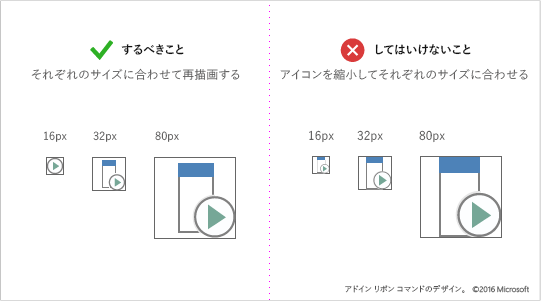
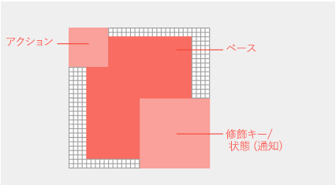

# アイコンIcons
アイコンは、動作や概念を視覚的に表現するものです。Icons are the visual representation of a behavior or concept. 多くの場合、コントロールとコマンドに意味を与えるために使用します。They are often used to add meaning to controls and commands. 環境内でユーザーが移動するのにサインが役立つのと同じように、リアルなビジュアルや象徴的なビジュアルにより、ユーザーは UI 間を移動できるようになります。Visuals, either realistic or symbolic, enable the user to navigate the UI the same way signs help users navigate their environment. お客様がコントロールを選択するときの動作をすばやく解析できるにように、必要な詳細のみを含む、シンプルで明確なビジュアルにする必要があります。They should be simple, clear, and contain only the necessary details to enable customers to quickly parse what action will occur when they choose a control.

Office リボンのインターフェイスには、標準の視覚的なスタイルが使用されています。Office ribbon interfaces have a standard visual style. これにより、Office アプリとの間で一貫性と親和性を保つことができます。This ensures consistency and familiarity across Office apps. このガイドラインは、ソリューションの PNG アセットのセットを Office の自然な一部のように設計するのに役立ちます。The guidelines will help you design a set of PNG assets for your solution that fit in as a natural part of Office.

多くの HTML コンテナーには、コントロールとアイコン画像が含まれています。Office UI Fabric のカスタム フォントを使用して、Office スタイルのアイコンをアドインで表示します。Fabric のアイコンのフォントには、ニーズに合わせて拡大縮小、色付け、スタイリングできる一般的な Office メタファーのグリフが多数含まれています。独自のアイコンのセットで既存のビジュアル言語を使用している場合、HTML キャンバスでも自由に使用できます。アイコンの標準セットを使用して独自のブランドの継続性を築くことは、すべてのデザイン言語の重要な一部をなしています。Office メタファーとの競合により、お客様が混乱することのないように注意してください。Many HTML containers contain controls with iconography. Use Office UI Fabric’s custom font to render Office styled icons in your add-in. Fabric’s icon font contains many glyphs for common Office metaphors that you can scale, color, and style to suit your needs. If you have an existing visual language with your own set of icons, feel free to use it in your HTML canvases. Building continuity with your own brand with a standard set of icons is an important part of any design language. Be careful to avoid creating confusion for customers by conflicting with Office metaphors.

## アドイン コマンドのアイコンをデザインするDesign icons for add-in commands

[アドイン コマンド](add-in-commands.md)は、Office UI にボタン、テキスト、およびアイコンを追加します。アドイン コマンドのボタンには、ユーザーがコマンドを使うときに、実行しようとするアクションを明確に識別できる、分かりやすいアイコンとラベルをつける必要があります。この記事では、Office とシームレスに統合するアイコンをデザインするための、スタイルと運用に関するガイドラインを提示します。[Add-in commands](add-in-commands.md) add buttons, text, and icons to the Office UI. Your add-in command buttons should provide meaningful icons and labels that clearly identify the action the user is taking when they use a command. This article provides stylistic and production guidelines that help you design icons that integrate seamlessly with Office. 

## Office のアイコン デザインの原則Office icon design principles

Office のデスクトップ クライアントの Office 2013 リリースでは、図像が更新されています。スタイルについての大きな変更は、内容が削減されたことです。新しいアイコンには、コミュニケーションに関する不可欠の要素だけが含まれてます。遠近法、グラデーション、および光源など、重要でない要素が削除されています。アイコンが簡略化されたことで、コマンドやコントロールの解析をより高速に行うことができるようになっています。このスタイルは、Office に最適です。The Office 2013 release of the Office desktop clients includes refreshed iconography. The overriding stylistic change is reduction. The new icons include only essential communicative elements. Non-essential elements including perspective, gradients, and light source are removed. The simplified icons support faster parsing of commands and controls. Follow this style to best fit with Office.

Office のアイコンは、次のデザインの原則に基づいています。Office icons are based on the following design principles: 

- Office のアイコン コレクションに関する現在の採用方針Modern interpretation of Office icon collection 
- 新鮮で、かつなじみ深いものFresh yet familiar  
- シンプルで、わかりやすく、直接的Simple, clear, and direct 

以下の図は、現在のデザインの原則を適用したアイコンです。The following image shows icons that apply the modern design principles.

## ベスト プラクティスBest practices

アイコンを作成するときは、以下のガイドラインに従ってください。Follow these guidelines when you create your icons: 

|するべきことDo|してはいけないことDon't|
|:---|:---|
|コミュニケーションの主要素に焦点を当て、ビジュアルをシンプルかつ明確に保つ。Keep visuals simple and clear, focusing on the key element(s) of the communication.| アイコンが乱雑に見える成果物は使用しないでください。Don't use artifacts that make your icon look messy.|
|Office アイコンの言語を使用して、動作や概念を示します。Use the Office icon language to represent behaviors or concepts.|Office リボンやコンテキスト メニューにあるアドイン コマンドの Office UI Fabric グリフの用途を変更しないでください。Fabric アイコンはスタイルが異なるので、適合しません。Don’t repurpose Office UI Fabric glyphs for add-in commands in the Office ribbon or contextual menus. Fabric icons are stylistically different and will not match.|
|書式設定用のペイントブラシや検索用の虫眼鏡など、一般的な Office の視覚的メタファーを再利用します。Reuse common Office visual metaphors such as paintbrush for format or magnifying glass for find.|異なるコマンドで、同じ視覚的メタファーを再利用しないようにします。Don't reuse visual metaphors for different commands. 異なる動作や概念に同じアイコンを使用すると、混乱が生じる可能性があります。Using the same icon for different behaviors and concepts can cause confusion. |
|アイコンを小さくしたり大きくしたりするために、アイコンを再描画します。Redraw your icons to make them small or larger. カットアウト、角、および丸角のエッジの線をできる限り明瞭にするために、再描画を行う手間を省かないでください。Take the time to redraw cutouts, corners, and rounded edges to maximize line clarity. |縮小または拡大してアイコンのサイズを変更しないでください。Don't resize your icons by shrinking or enlarging in size. これにより、視覚的品質が低くなり、動作が不明瞭になることがあります。This can lead to poor visual quality and unclear actions. 再描画せずにサイズを小さくすると、より大きなサイズで作成された複雑なアイコンから明瞭さが失われることがあります。Complex icons created at a larger size may lose clarity if resized to be smaller without redraw. |
|アクセスしやすくするために、白の塗りつぶしを使います。アイコンのオブジェクトは、Office UI のテーマのハイ コントラスト モードで読みやすさを保つために、たいていは背景を白にする必要があります。Use a white fill for accessibility. Most objects in your icons will require a white background to be legible across Office UI themes and in high-contrast modes.  ||
|透明背景の PNG 形式を使用します。Use the PNG format with a transparent background. ||
|アイコンに、表記文字、段落のラグ、および疑問符などの、ローカライズ可能なコンテンツを含めないようにします。Avoid localizable content in your icons, including typographic characters, indications of paragraph rags, and question marks. ||

## アイコン サイズについて推奨事項と要件Icon size recommendations and requirements

Office のデスクトップ アイコンは、ビットマップ画像です。Office desktop icons are bitmap images. ユーザーの DPI 設定やタッチ モードに応じて異なるサイズで表示されます。Different sizes will render depending on the user's DPI setting and touch mode. サポートされている 8 つのサイズすべてを組み込んで、すべての解像度とコンテキストで最高のエクスペリエンスを提供します。Include all eight supported sizes to create the best experience in all supported resolutions and contexts. 以下のサイズがサポートされています (うち 3 つは必須)：The following are the supported sizes - three are required:

- 16 px (必須)16 px (Required)
- 20 px20 px
- 24 px24 px
- 32 px (必須)32 px (Required)
- 40 px40 px
- 48 px48 px
- 64 ピクセル (推奨、Mac に最適)64 px (Recommended, best for Mac)
- 80 px (必須)80 px (Required)  

それぞれのアイコンを、サイズに合わせて縮小するのではなく再描画します。Make sure to redraw your icons for each size rather than shrink them to fit.

<!--
The following table shows the icon sizes that render for different modes at different DPI settings.

|DPI |**Small**||**Medium**||**Large**||**Extra large**|
|:---|:---|:---|:---|:---|:---|:---|:---|
|    |**Mouse**|**Touch**|**Mouse**|**Touch**|**Mouse**|**Touch**|-|
|100%|16px|20px|24px||32px|40px|48px|
|125%|20px|24px|||40px|48px|60px|
|150%|24px|24px|36px||48px|48px|72px|
|200%|32px|40px|48px||64px|80px|96px|
|250%|40px||||80px||120px|
|300%|48px||||96px||144px

> [!NOTE]
> At DPI settings of 150% or greater, the icon does not get swapped out for a larger size when Touch mode is engaged. At DPI settings greater than 250%, Touch mode is turned off by default.

The following table lists the locations for certain icon sizes.

|Location|100% DPI|200% DPI|250% DPI|
|:-------|:-------|:-------|:-------|
|Small ribbon button|16px|32px|40px|
|Contextual menu|16px|32px|40px|
|Quick access toolbar (QAT)|16px|32px|40px|
|Large ribbon icon|32px|64px|80px|

-->

## アイコンの構造とレイアウトIcon anatomy and layout

Office のアイコンは、基本要素に、アクション修飾子と概念的修飾子を重ね合わせた構成になっています。 アクション修飾子は、追加、開く、新規、閉じるなどの概念を表します。概念的修飾子は、ステータス、変更、またはアイコンの説明を表します。Office icons are typically comprised of a base element with action and conceptual modifiers overlayed. Action modifiers represent concepts such as add, open, new, or close. Conceptual modifiers represent status, alteration, or a description of the icon. 

Office UI と協調するコマンドを作成するために、基本要素と修飾子のレイアウト ガイドラインに従ってください。これにより、コマンドがプロフェッショナルな仕上がりになり、アドインに対する顧客の信頼度もあがります。場合によっては、意図的にこれらのガイドラインに対して例外を設けることもできます。To create commands that align with the Office UI, follow layout guidelines for the base element and modifiers. This ensures that your commands look professional and that your customers will trust your add-in. If you make exceptions to these guidelines, do so intentionally.

以下の図は、Office のアイコンの基本要素と修飾子のレイアウトを表しています。The following image shows the layout of base elements and modifiers in an Office icon.

- 基本要素をピクセル フレームの中央に配置し、周囲に余白をとります。Center base elements in the pixel frame with empty padding all around.
- アクション修飾子は、左上に配置します。Place action modifiers on the top left. 
- 概念的修飾子は、右下に配置します。Place conceptual modifiers on the bottom right.
- アイコン内の要素の数を制限します。32px では、修飾子の数を最大 2 つまでに制限します。16px では、修飾子の数を 1 つに制限します。Limit the number of elements in your icons. At 32px, limit the number of modifiers to a maximum of two. At 16px, limit the number of modifiers to one.

###基本要素のパディングBase element padding
基本要素は、どのサイズでも同じ配置にします。基本要素をフレームの中央に配置できない場合は、左上にそろえ、余分のピクセルは右下に残します。最良の結果を得るために、次の表に示すパディングのガイドラインを適用してください。Place base elements consistently across sizes. If base elements can't be centered in the frame, align them to the top left, leaving the extra pixels on the bottom right. For best results, apply the padding guidelines listed in the following table.

###修飾子Modifiers
すべての修飾子には、背景を含め、各要素の間に 1px の透明なカットアウトが必要です。要素が直接重ならないようにします。ルールとエッジの間に余白を作ります。修飾子はサイズが少しずつ異なっている場合がありますが、開始点としてこれらのサイズを使用します。All modifiers should have a 1px transparent cutout between each element, including the background. Elements should not directly overlap. Create whitespace between rules and edges. Modifiers can vary slightly in size, but use these dimensions as a starting point.

|**アイコンのサイズ****Icon size**|**基本要素の周囲のパディング****Padding around base element**|**修飾子のサイズ****Modifier size**|
|:---|:---|:---|
|16px16px|00|9px9px|
|20px20px|1px1px|10px10px|
|24px24px|1px1px|12px12px|
|32px32px|2px2px|14px14px|
|40px40px|2px2px|20px20px|
|48px48px|3px3px|22px22px|
|64px64px|5px5px|29px29px|
|80px80px|5px5px|38px38px|

## アイコンの色Icon colors

Office のアイコンには、限定されたカラー パレットがあります。Office UI とのシームレスな統合を保証するために、以下の表に記載されている色を使用してください。色の使用について、以下のガイドラインに従ってください。Office icons have a limited color palette. Use the colors listed in the following table to guarantee seamless integration with the Office UI. Apply the following guidelines to the use of color: 

- 色は、装飾のためというよりも、意味を伝える目的のために使用します。アクション、ステータス、または明示的にマークを区別する要素を、色によってハイライトまたは強調します。Use color to communicate meaning rather than for embellishment. It should highlight or emphasize an action, status, or an element that explicitly differentiates the mark.  
- 可能であれば、グレー以外の 1 色のみを追加で使用します。追加する色は最大 2 色までに制限します。If possible, use only one additional color beyond gray. Limit additional colors to two at the most.
- すべてのサイズのアイコンで、色を統一する必要があります。Office のアイコンのカラー パレットは、アイコンのサイズによってわずかな違いがあります。16px 以下のアイコンでは少し濃く、32px 以上のアイコンではより鮮やかな色になっています。これらの微妙な調整をしないと、サイズによって色の見え方が変わってしまいます。Colors should have a consistent appearance in all icon sizes. Office icons have slightly different color palettes for different icon sizes. 16px and smaller icons are slightly darker and more vibrant than 32px and larger icons. Without these subtle adjustments, colors appear to vary across sizes.   

|**色の名前****Color name**|**RGB****RGB**|**16 進数****Hex**|**色****Color**|**分類****Category**|
|:---|:---|:---|:---|:---|
|テキスト グレー (80)Text Gray (80)|80、80、8080, 80, 80|#505050#505050|  |テキストText|
|テキスト グレー (95)Text Gray (95)|95、95、9595, 95, 95|#5F5F5F#5F5F5F|  |テキストText|
|テキスト グレー (105)Text Gray (105)|105, 105, 105105, 105, 105|#696969#696969|  |テキストText|
|ダーク グレー 32Dark Gray 32|128、128、128128, 128, 128|#808080#808080|  |32 以上32 and above|
|ミディアム グレー 32Medium Gray 32|158、158、158158, 158, 158|#9E9E9E#9E9E9E|  |32 以上32 and above|
|ライト グレー オールLight Gray ALL|179、179、179179, 179, 179|#B3B3B3#B3B3B3|  |すべてのサイズAll sizes|
|ダーク グレー 16Dark Gray 16|114、114、114114, 114, 114|#727272#727272|  |16 以下16 and below|
|ミディアム グレー 16Medium Gray 16|144、144、144144, 144, 144|#909090#909090|  |16 以下16 and below|
|ブルー 32Blue 32|77、130、18477, 130, 184|#4d82B8#4d82B8|  |32 以上32 and above|
|ブルー 16Blue 16|74、125、17774, 125, 177|#4A7DB1#4A7DB1|  |16 以下16 and below|
|イエロー オールYellow ALL|234、194、130234, 194, 130|#EAC282#EAC282|  |すべてのサイズAll sizes|
|オレンジ 32Orange 32|231、142、70231, 142, 70|#E78E46#E78E46|  |32 以上32 and above|
|オレンジ 16Orange 16|227、142、70227, 142, 70|#E3751C#E3751C|  |16 以下16 and below|
|ピンク オールPink ALL|230、132、151230, 132, 151|#E68497#E68497|  |すべてのサイズAll sizes|
|グリーン 32Green 32|118、167、151118, 167, 151|#76A797#76A797|  |32 以上32 and above|
|グリーン 16Green 16|104、164、144104, 164, 144|#68A490#68A490|  |16 以下16 and below|
|レッド 32Red 32|216、99、68216, 99, 68|#D86344#D86344|  |32 以上32 and above|
|レッド 16Red 16|214、85、50214, 85, 50|#D65532#D65532|  |16 以下16 and below|
|パープル 32Purple 32|152、104、185152, 104, 185|#9868B9#9868B9|  |32 以上32 and above|
|パープル 16Purple 16|137、89、171137, 89, 171|#8959AB#8959AB|  |16 以下16 and below|

## ハイコントラスト モードのアイコンIcons in high contrast modes

Office のアイコンは、ハイコントラスト モードで適切に表示されるように設計されています。前景の要素は背景と区別され、読みやすさを最大限に高め、色の変更を可能にします。ハイコントラスト モードでは、Office は赤、緑、または青の値が 190 未満のアイコンのすべてのピクセルを、完全な黒に変更します。それ以外のピクセルは、すべて白になります。つまり、各 RGB チャンネルは 0 から 189 の値が黒、190 から 255 の値が白と評価されます。その他のハイコントラスト テーマも同じ 190 値のしきい値を使用して色の変更が行われますが、ルールは異なります。たとえば、白のハイコントラスト テーマでは、190 よりも大きい不透明のピクセルすべての色を変更しますが、その他のピクセルはすべて透明になります。次のガイドラインを適用して、ハイコントラスト設定で読みやすさを最大限にします。Office icons are designed to render well in high contrast modes. Foreground elements are well differentiated from backgrounds to maximize legibility and enable recoloring. In high contrast modes, Office will recolor any pixel of your icon with a red, green, or blue value less than 190 to full black. All other pixels will be white. In other words, each RGB channel is assessed where 0-189 values are black and 190-255 values are white. Other high-contrast themes recolor using the same 190 value threshold but with different rules. For example, the high-contrast white theme will recolor all pixels greater than 190 opaque but all other pixels as transparent. Apply the following guidelines to maximize legibility in high-contrast settings:

- 190 値のしきい値に沿って、前景と背景の要素を区別するようにします。Aim to differentiate foreground and background elements along the 190 value threshold.
- Office アイコンの表示スタイルに従います。Follow Office icon visual styles.
- 色はアイコン パレットから使用します。Use colors from our icon palette.
- グラデーションの使用を避けます。Avoid the use of gradients.
- 同じ様な値を持つ大きな色のブロックを避けます。Avoid large blocks of color with similar values.

## 関連項目See also

- [アドイン開発のベスト プラクティスAdd-in development best practices](../concepts/add-in-development-best-practices.md)
- [Excel、Word、PowerPoint のアドイン コマンドAdd-in commands for Excel, Word, and PowerPoint](../design/add-in-commands.md)

- アドイン コマンドで何をするかを伝えるために、ロゴやブランドに頼らないようにします。ブランド マークは、サイズの小さいアイコンにしたり、修飾子を適用したりすると、しばしば認識不可能になります。ブランド マークは、多くの場合、Office のリボン アイコンのスタイルと競合し、アイコンがたくさんある環境ではユーザーの関心を奪い合うおそれがあります。Avoid relying on your logo or brand to communicate what an add-in command does. Brand marks aren't always recognizable at smaller icon sizes and when modifiers are applied. Brand marks often conflict with Office ribbon icon styles, and can compete for user attention in a saturated environment.

