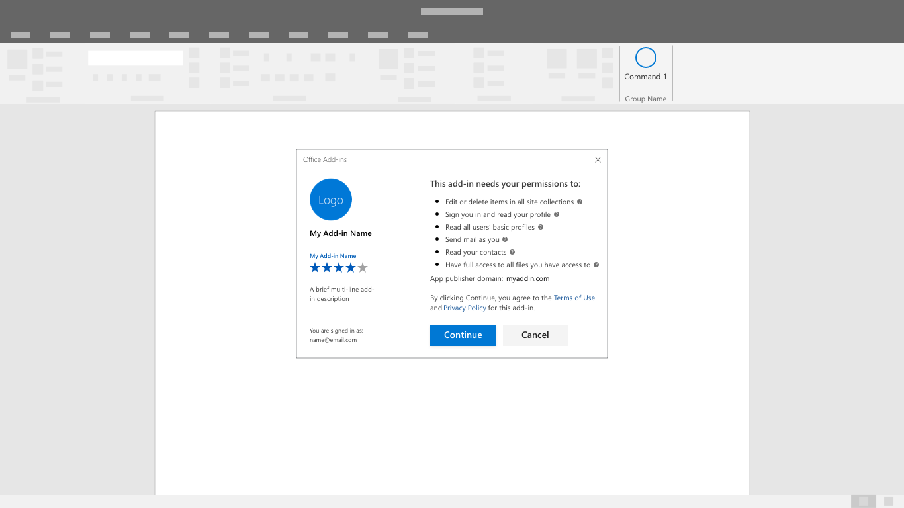

# 認証パターン

アドインの機能にユーザーがアクセスするには、サインインまたはサインアップする必要があります。 認証時の典型的なインターフェイス コントロールには、ユーザー名とパスワードの入力ボックスやサードパーティの資格情報フローを開始するボタンがあります。 ユーザーにアドインの使用を開始してもらうには、簡単で効率的に認証を導入することが重要な最初の一歩となります。

## ベスト プラクティス

|するべきこと|してはいけないこと|
|:----|:----|
|サインインの前に、アドインの価値について説明し、アカウントを要求せずにこの機能を実際に使用します。 |アドインの価値と長所を理解せずにサインインすることをユーザーに期待します。|
|各画面に目立つ第 1 のボタンを配置し、ユーザーに認証フローを段階的に説明します。 |ボタンや行動喚起が競合する第 2 のタスクや第 3 のタスクに注意を向けさせます。|
|"サインイン" や "アカウント作成" など、特定のタスクを説明するわかりやすいボタン ラベルを使用します。   |認証フローでユーザーを誘導するとき、"送信" や "開始" のようなあいまいなボタン ラベルを使用します。|
|ダイアログを使用し、ユーザーの注意を認証フォームに向けさせます。    |最初の実行エクスペリエンスと認証フォームで作業ウィンドウをあふれさせます。|
|入力ボックスの自動フォーカスなど、フローの中に小さな効率性を見つけます。 |クリックしてフォーム フィールドに入るようにユーザーに要求するなど、操作に不要な手順を追加します。|
|サインアウトや再認証する方法をユーザーに提供します。    |ID を切り替える際、アンインストールをユーザーに強制します。|

## 認証フロー

1. 初回実行プレースマット - アドインの最初の実行エクスペリエンス内にわかりやすい行動喚起としてサインイン ボタンを配置します。

2. ID プロバイダーの選択肢ダイアログ - ID プロバイダーのわかりやすい一覧を表示します。該当する場合、ユーザー名やパスワードのフォームも含めます。 認証ダイアログが開いているとき、アドイン UI はブロックされることがあります。

3. ID プロバイダーのサインイン - ID プロバイダーによって独自の UI が提供されます。 Microsoft Azure Active Directory では、サービスの外観に一貫性が与えられるように、サインイン ページとアクセス パネル ページをカスタマイズできます。 [詳細情報](/azure/active-directory/fundamentals/customize-branding)。

4. 進捗状況 - 設定や UI の読み込みの進行状況を示します。

> [!NOTE] 
> Microsoft の ID サービスを使用すると、商標付きのサインイン ボタンを使用できます。このボタンは淡色テーマまたは濃色テーマにカスタマイズできます。詳細情報。

## シングルサインオン認証フロー

> [!NOTE]
> 現在、シングルサインオン API は Word、Excel、Outlook、および PowerPoint でサポートされています。 シングル サインオン サポートの詳細については、「 [Identity API の要件セット](../reference/requirement-sets/identity-api-requirement-sets.md)」を参照してください。 Outlook アドインで作業している場合は、Office 365 テナントの先進認証が有効になっていることを確認してください。 この方法の詳細については、「 [Exchange Online: How to enable your tenant for modern authentication](https://social.technet.microsoft.com/wiki/contents/articles/32711.exchange-online-how-to-enable-your-tenant-for-modern-authentication.aspx)」 (Exchange Online: テナントの先進認証を有効にする方法) を参照してください。

エンドユーザーの利便性を向上させるためにシングルサインオンを使用します。 Office 内のユーザーの id (Microsoft アカウントまたは Microsoft 365 identity) は、アドインにサインインするために使用されます。 その結果、ユーザーは一度だけサインインします。 お客様は途中で止められることなく、簡単に利用を開始できます。

1. アドインがインストールされると、以下のような同意を求めるウィンドウが表示されます。
> [!NOTE]
> この同意ウィンドウに含まれるロゴ、文字列、アクセス許可の範囲については、アドインの発行元が制御します。 UI は Microsoft が事前に構成したものです。

2. アドインはユーザーが同意した後で読み込まれます。 ユーザーがカスタマイズした情報が必要であれば、それを抽出し、表示できます。

## 関連項目

- [SSO アドインの開発](../develop/sso-in-office-add-ins.md)に関する詳細情報
