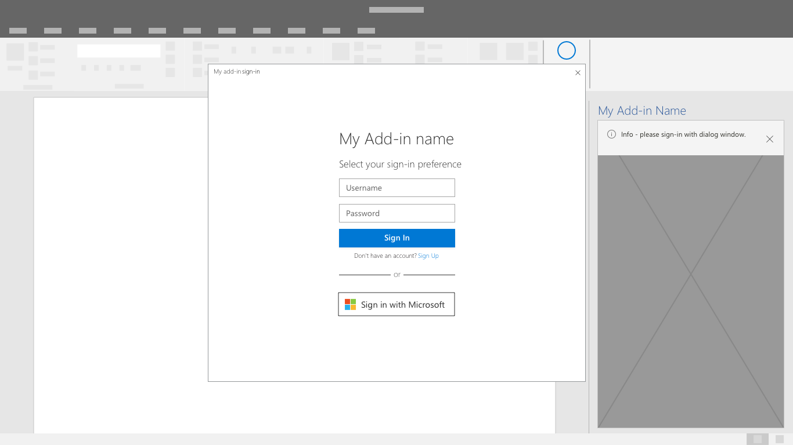

# 認証パターンAuthentication patterns

アドインでは、機能にアクセスするためにユーザーにサインインまたはサインアップする必要があります。Add-ins may require users to sign-in or sign-up in order to access features and functionality. ユーザー名とパスワードの入力ボックス、またはサードパーティの資格情報フローを開始するボタンは、認証エクスペリエンスにおける共通のインターフェイス コントロールです。Input boxes for username and password or buttons that start third party credential flows are common interface controls in authentication experiences. シンプルで効率的な認証エクスペリエンスは、アドインを使用してユーザーを開始させるための重要な第一歩です。A simple and efficient authentication experience is an important first step to getting users started with your add-in.

## ベスト プラクティスBest practices

|するべきことDo|してはいけないことDon't|
|:----|:----|
|シングル サインオン（SSO）を使用して、アドインにユーザーを認証します。Use single sign-on (SSO) to authenticate users into your add-in.|ユーザーが自分の個人用MicrosoftアカウントまたはOffice 365アカウント（職場または学校）とは別にアドインにサインインするように要求する。Require users to sign into your add-in separately from their personal Microsoft account or their Office 365 account (work or school).|
|サインインする前に、アドインの価値を記述するか、アカウントを必要とせずに機能をデモンストレーションしてください。Prior to sign-in, describe the value of your add-in or demonstrate functionality without requiring an account. |ユーザーがアドインの価値と利点を理解することなくサインインすることを期待してください。Expect users to sign-in without understanding the value and benefits of your add-in.|
|各画面には、目立つ主要なボタンが表示され、認証フローを通じてユーザーをガイドします。Guide users through authentication flows with a primary, highly visible button on each screen. |競合するボタンや行動を促すコールで、第二次、第三次のタスクに注意を喚起してください。Draw attention to secondary and tertiary tasks with competing buttons and calls to action.|
|「サインイン」や「アカウントの作成」などの特定のタスクを説明するクリア ボタンのラベルを使用します。Use clear button labels that describe specific tasks like "Sign in" or "Create account".   |「送信」や「開始」のような曖昧なボタンラベルを使用すると、ユーザーは認証フローをガイドできます。Use vague button labels like "Submit" or "Get started" to guide users through authentication flows.|
|ダイアログを使用して、認証フォームにユーザーの注意を集中させます。Use a dialog to focus users' attention on authentication forms.    |最初の実行経験と認証フォームを使用して作業ペインをオーバークラウドします。Overcrowd your task pane with a first run experience and authentication forms.|
|入力ボックスのオートフォーカスのようなフローの小さな効率を見つけます。Find small efficiencies in the flow like auto-focusing on input boxes. |ユーザーがフォームフィールドをクリックするような操作のような、不要なステップをインタラクションに追加します。Add unnecessary steps to the interaction like requiring users to click into form fields.|
|ユーザーがサインアウトして再認証する方法を提供します。Provide a way for users to sign-out and reauthenticate.    |ユーザーを強制的にアンインストールしてIDを切り替えます。Force users to uninstall to switch identities.|

> [!NOTE]
> 現在、シングル サインオン API は Word、Excel、Outlook、PowerPoint のプレビューでサポートされています。The Single Sign-on API is currently supported in preview for Word, Excel, Outlook, and PowerPoint. シングル サインオン API の現在のサポート状態に関する詳細は、「[IdentityAPI の要件セット](https://dev.office.com/reference/add-ins/requirement-sets/identity-api-requirement-sets)」を参照してください。For more information about where the Single Sign-on API is currently supported, see [IdentityAPI requirement sets](https://dev.office.com/reference/add-ins/requirement-sets/identity-api-requirement-sets). Outlook アドインで作業している場合は、Office 365 テナントの先進認証が有効になっていることを確認してください。If you are working with an Outlook add-in, be sure to enable Modern Authentication for the Office 365 tenancy. この方法の詳細については、「[Exchange Online: テナントの先進認証を有効にする方法](https://social.technet.microsoft.com/wiki/contents/articles/32711.exchange-online-how-to-enable-your-tenant-for-modern-authentication.aspx)」を参照してください。For information about how to do this, see [Exchange Online: How to enable your tenant for modern authentication](https://social.technet.microsoft.com/wiki/contents/articles/32711.exchange-online-how-to-enable-your-tenant-for-modern-authentication.aspx).

## 認証フローAuthentication flow
ユーザーがシングルサインオンをまだ利用できない場合は、代替認証フローを検討してください。If single sign-on is not yet available to your users, consider an alternative authentication flow. ユーザーには、サービスや Microsoft などのID プロバイダに直接サインインする選択肢を与えます。Give users a choice to sign-in directly with your service or an identity provider like Microsoft.

1. First Run Placemat  - サインインボタンを、アドインの最初の実行経験の中に明確なコールアクトアクションとして配置します。First Run Placemat - Place your sign-in button as a clear call-to action inside your add-in's first run experience.

2. ID プロバイダの選択肢ダイアログ - 必要に応じてユーザー名とパスワードのフォームを含む ID プロバイダの明確な一覧を表示します。Identity Provider Choices Dialog - Display a clear list of identity providers including a username and password form if applicable. 認証ダイアログが開いている間、アドインUIがブロックされることがあります。Your add-in UI may be blocked while the authentication dialog is open.

3. ID プロバイダのサインイン - ID プロバイダには独自のUIがあります。Identity Provider Sign-in - The identity provider will have their own UI. Microsoft Azure Active Directoryではサインインパネルとアクセスパネルのページをカスタマイズして、一貫したルック・アンド・フィールをサービスに提供できます。Microsoft Azure Active Directory allows customization of sign-in and access panel pages for consistent look and feel with your service. ([詳細を見る](https://docs.microsoft.com/azure/active-directory/fundamentals/customize-branding))。Learn More

4. 進行状況 - 設定やUIの読み込み中に進行状況を示します。Progress - Indicate progress while settings and UI load.

> [!NOTE] 
> マイクロソフトのIDサービスを使用する場合は、明暗のテーマに合わせてカスタマイズ可能なブランドのサイン インボタンを使用することができます。When using Microsoft's Identity service you'll have the opportunity to use a branded sign-in button that is customizable to light and dark themes. 詳しい情報をご覧ください。Learn more.

## シングル サインオン認証フローSingle Sign-On authentication flow
シングル サインオンはまだプレビュー中です。Single sign-on is still in preview. 一般に利用可能になったら、それを使用して最もスムーズなエンドユーザー体験を実現します。Once generally available, use it for the smoothest end-user experience. Office内のユーザーのIDは、アドインにサインインするために使用されます。The user's identity within Office is used to sign-in to your add-in. 結果として、ユーザーは一度だけサインインします。As a result users only sign-in once. これにより、経験の中の摩擦が排除され、顧客が簡単に開始することができます。This removes friction in the experience making it easier for your customers to get started.

1. アドインがインストールされると、以下のような同意ウィンドウが表示されます。 As an add-in is being installed, a user will see a consent window similar to the one below: 
> [!NOTE]
> アドインパブリッシャーは、同意ウィンドウに含まれるロゴ、文字列、および権限スコープを制御します。The add-in publisher will have control over the logo, strings and permission scopes included in the consent window. UI は Microsoft によって事前設定されています。The UI is pre-configured by Microsoft.

2. ユーザーが同意すると、アドインが読み込まれます。The add-in will load after the user consents. 必要なユーザー カスタマイズ情報を抽出して表示することができます。It can extract and display any necessary user customized information.

## 関連項目See also
- [SSO アドインの開発](https://docs.microsoft.com/office/dev/add-ins/develop/sso-in-office-add-ins)について詳細を知るLearn more about [developing SSO Add-ins](https://docs.microsoft.com/office/dev/add-ins/develop/sso-in-office-add-ins)