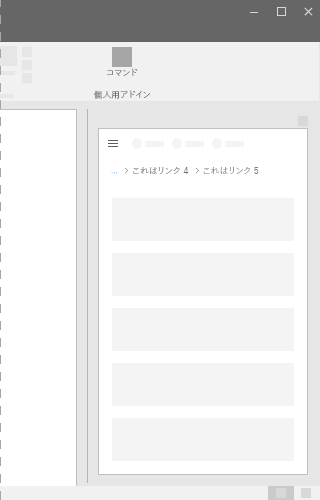
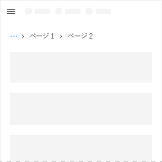
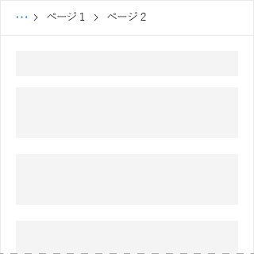

# Office UI Fabric の階層リンクのコンポーネント

Office アドインでは、ナビゲーションに階層リンクを使用します。それは現在のページの階層内の場所を表示し、階層の他の部分との関連において、どこにあるかをユーザーが理解できるよう助けます。さらに、階層リンクは、階層内の上位レベルへのワン クリック ナビゲーションを提供します。
  
#### 例: 作業ウィンドウ内の階層リンク

## ベスト プラクティス

|**するべきこと**|**してはいけないこと**|
|:------------|:--------------|
|階層リンクを、アドインのレイアウトの最上部、項目の一覧の上、レイアウトのメイン コンテンツの上などに配置します。   |階層リンクを、他のページに移動する主な手段として使用しないでください。  |

## 実装

詳細については、「[階層リンク](https://dev.office.com/fabric#/components/breadcrumb)」と「[Fabric React のコード サンプルの使用にあたって](https://github.com/OfficeDev/Word-Add-in-GettingStartedFabricReact)」を参照してください。

## 関連項目

- [UX 設計パターン](https://github.com/OfficeDev/Office-Add-in-UX-Design-Patterns-Code)
- [Office アドインの Office UI Fabric](office-ui-fabric.md)
