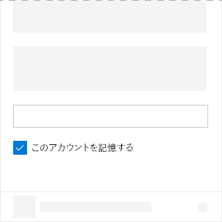

# Office UI Fabric のチェック ボックス コンポーネント

チェックボックスは、ユーザーがアドインのオプションをオンまたはオフにできる UI 要素です。チェックボックスを使用すると、ユーザーがオプションを選択できます。さらに、チェックボックスは関連するコントロールとペアにすることもできます。チェックボックスをオンまたはオフにすると、関連するコントロールの動作が変更されます。たとえば、関連するコントロールの状態を表示または非表示に切り替えます。
  
#### 例: 作業ウィンドウ内のチェック ボックス

## ベスト プラクティス

|**するべきこと**|**してはいけないこと**|
|:------------|:--------------|
|チェック ボックスを使用して、状態を示します。   |アクションの表示や指示にチェック ボックスを使用しないでください。   |
|ユーザーが複数のオプションを選択できる場合は、複数のチェック ボックスを使用します。オプションは相互排他的ではありません。|ユーザーがオプションを 1 つのみ選択する場合は、チェックボックスを使用しないでください。1 つのみのオプションを選択する必要がある場合は、ラジオ ボタンを使用します。|
|いくつかのチェック ボックスをグループ化している場合、ユーザーはオプションの任意の組み合わせを選択できます。|2 つのグループのチェックボックスを隣り合わせで配置しないでください。2 つのグループはラベルを使用して区切ります。|
|セカンダリ設定には 1 つのチェック ボックスを使用します。 たとえば、**[Remember me?]** (このアカウントを記憶する) チェック ボックスは、サインイン シナリオで使用されるセカンダリ設定です。|チェックボックスを使用して設定をオンまたはオフにしないでください。オンとオフを切り替えるには、切り替えを使用します。|

## バリアント

|**バリエーション**|**説明**|**例**|
|:------------|:--------------|:----------|
|**未制御のチェック ボックス**|既定のチェック ボックスの状態として使用します。 ||
|**既定でチェックが true になっている未制御のチェック ボックス**|チェック ボックスのインスタンスが独自の状態を保持する場合に使用します ||
|**既定でチェックが true になっている無効な未制御のチェック ボックス**|チェック ボックスが無効にされた状態です。 ||
|**制御されたチェック ボックス**|このチェックボックスのチェックされた状態は、UI の別の場所で決定されます。このシナリオでは、**onChange** イベントによって正しい値がチェックボックスに渡され、UI が再描画されます。 ||

## 実装

詳細については、「[チェック ボックス](https://dev.office.com/fabric#/components/checkbox)」と「[Fabric React のコード サンプルの使用にあたって](https://github.com/OfficeDev/Word-Add-in-GettingStartedFabricReact)」を参照してください。

## 関連項目

- [UX 設計パターン](https://github.com/OfficeDev/Office-Add-in-UX-Design-Patterns-Code)
- [Office アドインの Office UI Fabric](office-ui-fabric.md)
