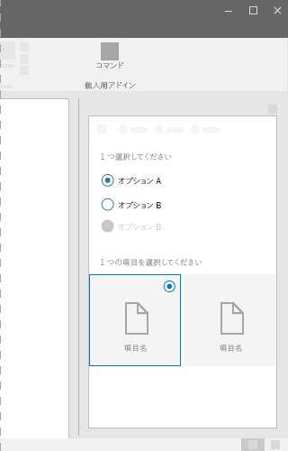

# Office UI Fabric の ChoiceGroup コンポーネント

ChoiceGroup コンポーネント (ラジオ ボタンとも呼ばれる) は、ユーザーに 2 つ以上の相互排他的なオプションを提供します。ユーザーはグループ内の ChoiceGroup ボタンを 1 つのみ選択できます。各オプションは 1 つの ChoiceGroup ボタンで表されます。 
  
#### 例:作業ウィンドウでの ChoiceGroup

 

## ベスト プラクティス

|**するべきこと**|**使用不可**|
|:------------|:--------------|
|ChoiceGroup オプションは、同じレベルを維持します。   |入れ子になった ChoiceGroup またはチェック ボックスは使用しないでください。   |
|ChoiceGroup で 2 個から 7 個のオプションを使用します。画面にすべてのオプションを表示できる十分なスペースがあることを確認します。 十分なスペースがない場合は、チェック ボックスまたはドロップダウン リストを使用します。|オプションが固定の段階の数字の場合は使用しないでください。たとえば、10、20、30 などです。その代わりに、スライダー コンポーネントを使用します。|
|ユーザーがオプションを選択しない可能性がある場合は、**[なし]** や **[該当しません]** などのオプションを含めることを検討してください。|単一のバイナリ選択には、2 つの ChoiceGroup ボタンを使用しないでください。|
|可能であれば、ChoiceGroup ボタンは水平方向ではなく垂直方向に、一列に配置します。水平方向に配置すると、読み取りやローカライズが難しくなります。||
|論理的な順序でオプションを一覧表示します。たとえば、最も選択される可能性の高いオプションから低いオプションへ、最も容易な操作から複雑な操作へ、または最もリスクが低いものから高いものへ、などのような順序です。 |アルファベット順の順序付けは、言語に依存するため行わないでください。|

## バリアント

|**バリエーション**|**説明**|**例**|
|:------------|:--------------|:----------|
|**ChoiceGroup**|選択を行うために画像が不要な場合に使用します。| |
|**画像を使用した ChoiceGroup**|選択を行うために画像が必要な場合に使用します。| |

## 実装

詳細については、「[ChoiceGroup](https://dev.office.com/fabric#/components/choicegroup)」と「[Fabric React のコード サンプルの使用にあたって](https://github.com/OfficeDev/Word-Add-in-GettingStartedFabricReact)」を参照してください。

## 関連項目

- [UX 設計パターン](https://github.com/OfficeDev/Office-Add-in-UX-Design-Patterns-Code)
- [Office アドインの Office UI Fabric](office-ui-fabric.md)
