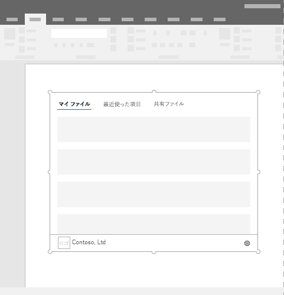
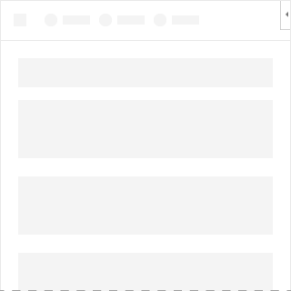

# コンテンツ Office アドイン

コンテンツ アドインは、Excel または PowerPoint ドキュメントに直接埋め込むことができるサーフェイスです。 コンテンツ アドインにより、ユーザーはコードを実行してドキュメントを修正したり、データ ソースからデータを表示したりするインターフェイス コントロールにアクセスできます。 機能を直接ドキュメントに埋め込む場合は、コンテンツ アドインを使用します。  

*図 1. コンテンツ アドインの一般的なレイアウト*

## ベスト プラクティス

- アドインの上部に CommandBar や Pivot などのナビゲーション要素やコマンド要素を含めます。
- アドインの下部に BrandBar などのブランド化の要素を含めます (Excel、および PowerPoint アドインにのみ適用)。

## バリエーション

デスクトップとデスクトップのExcelおよびPowerPointのOfficeのMicrosoft 365サイズは、ユーザーが指定します。

## パーソナル メニュー

パーソナル メニューは、アドインの右上付近にあるナビゲーション要素やコマンド要素の妨げになる可能性があります。Windows と Mac でのパーソナル メニューの現在のサイズを次に示します。

Windows の場合、パーソナル メニューは 12x32 ピクセルを測定します (図を参照)。

*図 2. Windows のパーソナル メニュー*

Mac の場合、パーソナル メニューは 26x26 ピクセルを測定しますが、右から 8 ピクセル内側、上から 6 ピクセルの位置にフロートします。これにより、占有スペースは 34x32 ピクセルに増加します (図を参照)。

*図 3. Mac のパーソナル メニュー*

## 実装

コンテンツ アドインの実装サンプルについては、GitHub の「[Excel コンテンツ アドイン Humongous Insurance](https://github.com/OfficeDev/Excel-Content-Add-in-Humongous-Insurance)」を参照してください。

## サポートに関する考慮事項

- 特定のアプリケーションまたはプラットフォームでOfficeアドインが動作Office[確認します](../overview/office-add-in-availability.md)。
- コンテンツ アドインによっては、Excel または PowerPoint の読み取りと書き込みのためにユーザーがアドインを「信頼」する必要があります。 アドインのマニフェストには、ユーザーに必要とされる[アクセス許可のレベル](../develop/requesting-permissions-for-api-use-in-content-and-task-pane-add-ins.md)を宣言することができます。  
- コンテンツ アドインは Office 2013 以降のバージョンの Excel および PowerPoint でサポートされています。 Office Web アドインをサポートしていない Office のバージョンでアドインを開くと、アドインはイメージとして表示されます。

## 関連項目

- [Office アドインの Office クライアント アプリケーションとプラットフォームの可用性](../overview/office-add-in-availability.md)
- [Office アドインの Fabric Core](fabric-core.md)
- [Office アドインの UX 設計パターン](../design/ux-design-pattern-templates.md)
- [アドインでの API 使用についてアクセス許可を要求する](../develop/requesting-permissions-for-api-use-in-content-and-task-pane-add-ins.md)
