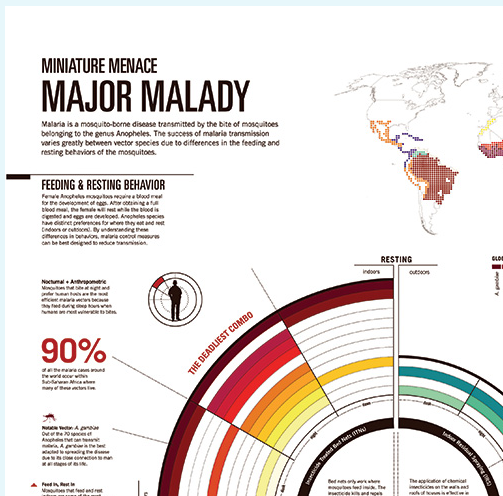

# Office アドインのデータ可視化のスタイル ガイドライン

データ可視化が良好なら、ユーザーはデータから洞察が得やすくなります。ユーザーは、これらの洞察を使って通知や説得の話ができます。この記事では、Excel やその他の Office アプリ用のアドインで効果的なデータ可視化を設計するためのガイドラインを示します。

データ可視化のクロムを作成するには、[Office UI Fabric](https://developer.microsoft.com/fabric) を使用することをお勧めします。Office UI Fabric には、Office の外観とシームレスに統合するスタイルとコンポーネントが含まれています。 

<!--The following figure shows a data visualization in an add-in that uses Fabric.

 

-->

## データ可視化の要素

データ可視化には、共通の一般的なフレームワークと、共通の視覚および対話型要素があります。次の図に示す、タイトル、ラベル、データ プロットなどです。

### グラフのタイトル

グラフのタイトルに関する次のガイドラインに従います。

- グラフのタイトルを見やすくします。グラフの残りの部分との階層関係を視覚ではっきり示すように配置します。
- 一般に、文頭だけを大文字にします (最初の単語の最初の文字を大文字にします)。コントラストを付けたり、階層を明確にしたりするには、すべて大文字を使用できますが、控えめに使用する必要があります。
- [Office UI Fabric の文字体裁](https://developer.microsoft.com/fabric#/styles/typography)を組み込み、グラフを Segoe を使用する Office UI と一貫性をもたせます。グラフのコンテンツを UI と区別するために、異なる書体を使用することもできます。
- カウンターの大きい sans-serif 書体を使用します。

次の例では、グラフ タイトルにおける serif と sans-serif 書体の使用を示します。スケールのコントラストと空白スペースの効果的な使用によって、視覚で階層関係がどのように強調されるかにご注目ください。

### 軸ラベル

テキスト色と背景色のコントラスト比を適正に保ちつつ、軸ラベルをはっきり読める程度にまで濃くします。データ インクと張り合うほど濃くしません。

軸のラベルには明るいグレーが最も効果的です。Fabric を使用している場合は、[中間色のパレット](https://developer.microsoft.com/fabric#/styles/colors)をご覧ください。

### データ インク

グラフの実際のデータを表すピクセルをデータ インクと言います。これは可視化で最も重点が置かれるものです。影付き、太いアウトライン、またはデータをゆがめたり、データと張り合ったりする不要なデザイン要素の使用は避けてください。グラデーションを使用するのは、データ値が色の値と関連する場合だけにします。測定可能な対象値が三次元に結び付けられていない限り、三次元のグラフは避けてください。

### 色

ハードコードされた色ではなく、オペレーティング システムまたはアプリケーションのテーマに沿った色を選びます。同時に、適用する色がデータをゆがめないようにします。データ可視化で誤って色を使用すると、データがゆがめられて、情報が間違って伝わることがあります。

データ可視化における色の使用のベスト プラクティスについては、次をご覧ください。

- [なぜ虹色はデータの可視化に適していないか](https://www.poynter.org/2013/why-rainbow-colors-arent-always-the-best-options-for-data-visualizations/224413/)
- [Color Brewer 2.0:地図作成の色のアドバイス](http://colorbrewer2.org/)
- [色相が必要だ](http://tools.medialab.sciences-po.fr/iwanthue/)

### 枠線

グラフを正確に読み取るために目盛線が必要な場合もありますが、データ インクを引き立てる (データ インクと競合しない) 2 次的なビジュアル要素でなければなりません。静的な目盛線は特にハイ コントラスト用にデザインされたものでなければ、細く明るい色にします。また、ユーザーがグラフを対話的に使用するときにコンテキストに沿って現れる、その場限りの動的な目盛線を対話的操作によって作成することもできます。

目盛線には明るいグレーが最も効果的です。Fabric を使用している場合は、[中間色のパレット](https://developer.microsoft.com/fabric#/styles/colors)をご覧ください。

次の図は、目盛線のあるデータ可視化を示しています。

### 凡例

次が必要な場合は、凡例を追加します。

- データ系列を区別する
- 目盛または値の変化を示す

凡例がデータ インクを引き立てるようにし、データ インクと競合しないようにしてください。次のように凡例を配置します。

- 凡例項目がすべてグラフの上に収まる場合は、プロット エリアを既定で左揃えにします。
- 一部の凡例項目がグラフの上に収まらない場合は、プロット エリアの右上に配置し、必要に応じてスクロール可能にします。

読みやすさとアクセシビリティを最適化するには、凡例のマーカーを関連するグラフの図形に合わせます。たとえば、散布図とバブルチャートの凡例には円形の凡例マーカーを使用します。折れ線グラフには線分の凡例マーカーを使用します。

### データ ラベルとヒント

データ ラベルとヒントの空白スペースと活字バリエーションが十分であることを確認します。オクルージョンと競合を最小限にするアルゴリズムを使用します。たとえば、既定ではデータ ポイントの右側にヒントを表示するものの、右端が検出された場合は左側に表示するなどです。

## デザインの原則

次に示す一連のデザインの原則は Office の設計チームによって作成されたものであり、Office 製品スイートのデータ可視化を新たに設計するときに使用されているものです。

### ビジュアル デザインの原則

- 可視化では、データを優先し、これを引き立てて理解しやすくする必要があります。コンテキストを示すために必要な分だけサポート要素を追加し、データを強調します。不要な装飾 (影付きやアウトラインなど) や無意味なグラフ、データの歪みは避けます。
- 可視化は、調査を促す十分な視覚的フィードバックを返す必要があります。確立した対話的操作のパターン、インターフェイスのコントロール、明確なシステム フィードバックを使用します。
- 古くからあるデザイン原則を具体化します。形式、読みやすさ、意味を強化するため、文字体裁と視覚伝達のための定評あるデザイン原則を使用します。

### 対話的操作のデザイン原則

- 調査を考慮に入れてデザインします。
- 新しい洞察をもたらす、オブジェクトとの直接の対話的操作 (たとえばドラッグで並べ替え) を考慮に入れます。
- 単純で直接的な、慣れ親しんだ対話的操作モデルを使用します。

使いやすい対話型のデータ可視化をデザインする方法については、「[UI の原則と落とし穴](https://uitraps.com/)」をご覧ください。

### モーション デザインの原則

モーションは外部からの操作に従います。ビジュアル要素は、同じ方向に同じ速度で移動する必要があります。適用対象は以下のとおりです。

- チャートの作成
- 1 つのグラフの種類から別のグラフの種類への移行
- フィルター
- 並べ替え
- データの追加または削除
- データのブラッシングまたはスライス
- グラフのサイズ変更

因果関係を知覚できるようにします。アニメーションをステージングする場合には、次のようにします。

- 一度に 1 つだけステージングします。 
- データ インクの変更より前に、軸の変更をステージングします。
- 複数のオブジェクトが同じ速度で同じ方向に向かって移動している場合は、グループとしてステージングおよびアニメーション処理します。
- データ要素をステージングするグループのオブジェクト数はせいぜい 4 から 5 個とします。4 から 5 個を超えると、見る人がオブジェクトを個別に追跡しにくくなります。

モーションは意味を付け加えます。

- アニメーションは、ユーザーがデータの変化をより良く理解できるようにしたり、コンテキストを示したり、言語によらない注釈層として機能したりします。
- モーションは、意味のある可視化の座標空間で行わなければなりません。
- アニメーションはビジュアルに合わせます。 
- 余計なアニメーションは避けてください。

モーションはデータに従います。

- データのマッピングを保持します。測定単位に関係する領域があるなら、切り替え中にその領域を保持します。
- 一貫性のあるアニメーション デザインの言語を保持します。できれば、データ可視化アニメーションを既存の Office モーション デザイン言語にマップします。類似するグラフ タイプには、類似のアニメーションを使用します。

## データ可視化におけるアクセシビリティ

- 情報を伝達する唯一の手段として色を使用することはしないでください。色覚異常がある場合、結果がわからなくなってしまいます。できれば、色だけでなく、形状、サイズ、テクスチャを情報の伝達に使用します。
- プッシュ ボタンやピック リストなど、すべての対話型要素をキーボードからアクセスできるようにします。
- フォーカスの変更、ヒントなどを通知するため、アクセシビリティ イベントをスクリーン リーダーに送信します。

## 関連項目 

- [データ可視化を構築するための 5 つの最適なライブラリ](https://www.fastcompany.com/3029760/the-five-best-libraries-for-building-data-vizualizations)
- [定量的情報のビジュアル表示](https://www.edwardtufte.com/tufte/books_vdqi)
