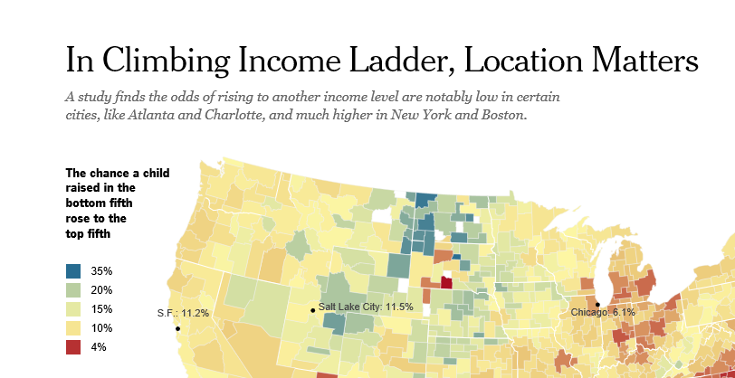

# Office アドインのデータ可視化のスタイル ガイドラインData visualization style guidelines for Office Add-ins

データ可視化が良好なら、ユーザーはデータから洞察が得やすくなります。ユーザーは、これらの洞察を使って通知や説得の話ができます。この記事では、Excel やその他の Office アプリ用のアドインで効果的なデータ可視化を設計するためのガイドラインを示します。Good data visualizations help users find insights in their data. They can use those insights to tell stories that inform and persuade. This article provides guidelines to help you design effective data visualizations in your add-ins for Excel and other Office apps.

データ可視化のクロムを作成するには、[Office UI Fabric](https://developer.microsoft.com/fabric) を使用することをお勧めします。Office UI Fabric には、Office の外観とシームレスに統合するスタイルとコンポーネントが含まれています。We recommend that you use [Office UI Fabric](https://developer.microsoft.com/fabric) to create the chrome for your data visualizations. Office UI Fabric includes styles and components that integrate seamlessly with the Office look and feel. 

<!--The following figure shows a data visualization in an add-in that uses Fabric.

 

-->

## データ可視化の要素Data visualization elements

データ可視化には、共通の一般的なフレームワークと、共通の視覚および対話型要素があります。次の図に示す、タイトル、ラベル、データ プロットなどです。Data visualizations share a general framework and common visual and interactive elements, including titles, labels, and data plots, as shown in the following figures.

### グラフのタイトルChart titles

グラフのタイトルに関する次のガイドラインに従います。Follow these guidelines for chart titles:

- グラフのタイトルを見やすくします。グラフの残りの部分との階層関係を視覚ではっきり示すように配置します。Make your chart titles easily readable. Position them to create a clear visual hierarchy in relation to the rest of the chart.
- 一般に、文頭だけを大文字にします (最初の単語の最初の文字を大文字にします)。コントラストを付けたり、階層を明確にしたりするには、すべて大文字を使用できますが、控えめに使用する必要があります。In general, use sentence capitalization (capitalize the first word). To create contrast or to reinforce hierarchies, you can use all caps, but all caps should be used sparingly.
- [Office UI Fabric の文字体裁](https://developer.microsoft.com/fabric#/styles/typography)を組み込み、グラフを Segoe を使用する Office UI と一貫性をもたせます。グラフのコンテンツを UI と区別するために、異なる書体を使用することもできます。Incorporate the [Office UI Fabric type ramp](https://developer.microsoft.com/fabric#/styles/typography) to make your charts consistent with the Office UI, which uses Segoe. You can also use a different typeface to differentiate chart content from the UI.
- カウンターの大きい sans-serif 書体を使用します。Use sans-serif typefaces with large counters.

次の例では、グラフ タイトルにおける serif と sans-serif 書体の使用を示します。スケールのコントラストと空白スペースの効果的な使用によって、視覚で階層関係がどのように強調されるかにご注目ください。The following examples show serif and sans-serif typefaces used in chart titles. Notice how the scale contrast and effective use of white space create a strong visual hierarchy.

### 軸ラベルAxis labels

テキスト色と背景色のコントラスト比を適正に保ちつつ、軸ラベルをはっきり読める程度にまで濃くします。データ インクと張り合うほど濃くしません。Make your axis labels dark enough to read clearly, with adequate contrast ratios between the text and background colors. Make sure that they are not so dark that they compete with data ink.

軸のラベルには明るいグレーが最も効果的です。Fabric を使用している場合は、[中間色のパレット](https://developer.microsoft.com/fabric#/styles/colors)をご覧ください。Light grays are most effective for axis labels. If you’re using Fabric, see the [Neutral Colors palette](https://developer.microsoft.com/fabric#/styles/colors).

### データ インクData ink

グラフの実際のデータを表すピクセルをデータ インクと言います。これは可視化で最も重点が置かれるものです。影付き、太いアウトライン、またはデータをゆがめたり、データと張り合ったりする不要なデザイン要素の使用は避けてください。グラデーションを使用するのは、データ値が色の値と関連する場合だけにします。測定可能な対象値が三次元に結び付けられていない限り、三次元のグラフは避けてください。The pixels that represent the actual data in a chart are referred to as data ink. This should be the central focus of the visualization. Avoid the use of drop shadows, heavy outlines, or unnecessary design elements that distort or compete with the data. Use gradients only when data values are tied to color values. Avoid three-dimensional charts unless a measurable, objective value is bound to a third dimension.

### 色Color

ハードコードされた色ではなく、オペレーティング システムまたはアプリケーションのテーマに沿った色を選びます。同時に、適用する色がデータをゆがめないようにします。データ可視化で誤って色を使用すると、データがゆがめられて、情報が間違って伝わることがあります。Choose colors that follow operating system or application themes rather than hardcoded colors. At the same time, make sure that the colors you apply do not distort the data. Misuse of color in data visualizations can result in data distortion and incorrect reading of information.

データ可視化における色の使用のベスト プラクティスについては、次をご覧ください。For best practices for use of color in data visualizations, see the following:

- [なぜ虹色はデータの可視化に適していないかWhy rainbow colors aren't the best option for data visualizations](https://www.poynter.org/2013/why-rainbow-colors-arent-always-the-best-options-for-data-visualizations/224413/)
- [Color Brewer 2.0:地図作成の色のアドバイスColor Brewer 2.0: Color Advice for Cartography](http://colorbrewer2.org/)
- [色相が必要だI Want Hue](https://tools.medialab.sciences-po.fr/iwanthue/)

### 枠線Gridlines

グラフを正確に読み取るために目盛線が必要な場合もありますが、データ インクを引き立てる (データ インクと競合しない) 2 次的なビジュアル要素でなければなりません。静的な目盛線は特にハイ コントラスト用にデザインされたものでなければ、細く明るい色にします。また、ユーザーがグラフを対話的に使用するときにコンテキストに沿って現れる、その場限りの動的な目盛線を対話的操作によって作成することもできます。Gridlines are often necessary for accurately reading a chart, but should be presented as a secondary visual element, enhancing the data ink, not competing with it. Make static gridlines thin and light, unless they are designed specifically for high contrast. You can also use interaction to create dynamic, just-in-time gridlines that appear in context when a user interacts with a chart.

目盛線には明るいグレーが最も効果的です。Fabric を使用している場合は、[中間色のパレット](https://developer.microsoft.com/fabric#/styles/colors)をご覧ください。Light grays are most effective for gridlines. If you’re using Fabric, see the [Neutral Colors palette](https://developer.microsoft.com/fabric#/styles/colors).

次の図は、目盛線のあるデータ可視化を示しています。The following image shows a data visualization with gridlines.

### 凡例Legends

次が必要な場合は、凡例を追加します。Add legends if necessary to:

- データ系列を区別するDistinguish between series
- 目盛または値の変化を示すPresent scale or value changes

凡例がデータ インクを引き立てるようにし、データ インクと競合しないようにしてください。次のように凡例を配置します。Make sure that your legends enhance the data ink and do not compete with it. Place legends:

- 凡例項目がすべてグラフの上に収まる場合は、プロット エリアを既定で左揃えにします。Flush left above the plot area by default, if all legend items fit above the chart.
- 一部の凡例項目がグラフの上に収まらない場合は、プロット エリアの右上に配置し、必要に応じてスクロール可能にします。On the upper right side of the plot area, if all legend items do not fit above the chart, and make it scrollable, if necessary.

読みやすさとアクセシビリティを最適化するには、凡例のマーカーを関連するグラフの図形に合わせます。たとえば、散布図とバブルチャートの凡例には円形の凡例マーカーを使用します。折れ線グラフには線分の凡例マーカーを使用します。To optimize for readability and accessibility, map legend markers to the relevant chart shape. For example, use circle legend markers for scatter plot and bubble chart legends. Use line segment legend markers for line charts.

### データ ラベルとヒントData labels and tooltips

データ ラベルとヒントの空白スペースと活字バリエーションが十分であることを確認します。オクルージョンと競合を最小限にするアルゴリズムを使用します。たとえば、既定ではデータ ポイントの右側にヒントを表示するものの、右端が検出された場合は左側に表示するなどです。Ensure that data labels and tooltips have adequate white space and type variation. Use algorithms to minimize occlusion and collision. For example, a tooltip might surface to the right of a data point by default, but surface to the left if right edges are detected.

## デザインの原則Design principles

次に示す一連のデザインの原則は Office の設計チームによって作成されたものであり、Office 製品スイートのデータ可視化を新たに設計するときに使用されているものです。The Office Design team created the following set of design principles, which we use when designing new data visualizations for the Office product suite.

### ビジュアル デザインの原則Visual design principles

- 可視化では、データを優先し、これを引き立てて理解しやすくする必要があります。コンテキストを示すために必要な分だけサポート要素を追加し、データを強調します。不要な装飾 (影付きやアウトラインなど) や無意味なグラフ、データの歪みは避けます。Visualizations should honor and enhance the data, making it easy to understand. Highlight the data, adding supporting elements only as needed to provide context. Avoid unnecessary embellishments (drop shadows, outlines, etc), chart junk, or data distortion.
- 可視化は、調査を促す十分な視覚的フィードバックを返す必要があります。確立した対話的操作のパターン、インターフェイスのコントロール、明確なシステム フィードバックを使用します。Visualizations should encourage exploration by providing rich visual feedback. Use well-established interaction patterns, interface controls, and clear system feedback.
- 古くからあるデザイン原則を具体化します。形式、読みやすさ、意味を強化するため、文字体裁と視覚伝達のための定評あるデザイン原則を使用します。Embody time-honored design principles. Use established typographic and visual communication design principles to enhance form, readability, and meaning.

### 対話的操作のデザイン原則Interaction design principles

- 調査を考慮に入れてデザインします。Design to allow for exploration.
- 新しい洞察をもたらす、オブジェクトとの直接の対話的操作 (たとえばドラッグで並べ替え) を考慮に入れます。Allow for direct interactions with objects that reveal new insights (sorting via drag, for example).
- 単純で直接的な、慣れ親しんだ対話的操作モデルを使用します。Use simple, direct, familiar interaction models.

使いやすい対話型のデータ可視化をデザインする方法については、「[UI の原則と落とし穴](https://uitraps.com/)」をご覧ください。For more information about how to design user-friendly interactive data visualizations, see [UI Tenets and Traps](https://uitraps.com/).

### モーション デザインの原則Motion design principles

モーションは外部からの操作に従います。ビジュアル要素は、同じ方向に同じ速度で移動する必要があります。適用対象は以下のとおりです。Motion follows stimulus. Visual elements should move in the same direction at the same rate. This applies to:

- チャートの作成Chart creation
- 1 つのグラフの種類から別のグラフの種類への移行Transition from one chart type to another chart type
- フィルターFiltering
- 並べ替えSorting
- データの追加または削除Adding or subtracting data
- データのブラッシングまたはスライスBrushing or slicing data
- グラフのサイズ変更Resizing a chart

因果関係を知覚できるようにします。アニメーションをステージングする場合には、次のようにします。Create a perception of causality. When staging animations:

- 一度に 1 つだけステージングします。Stage one thing at a time. 
- データ インクの変更より前に、軸の変更をステージングします。Stage changes to axes before changes to data ink.
- 複数のオブジェクトが同じ速度で同じ方向に向かって移動している場合は、グループとしてステージングおよびアニメーション処理します。Stage and animate objects as a group if they are moving at the same speed in the same direction.
- データ要素をステージングするグループのオブジェクト数はせいぜい 4 から 5 個とします。4 から 5 個を超えると、見る人がオブジェクトを個別に追跡しにくくなります。Stage data elements in groups of no more than 4-5 objects. Viewers have difficulty tracking more than 4-5 objects independently.

モーションは意味を付け加えます。Motion adds meaning.

- アニメーションは、ユーザーがデータの変化をより良く理解できるようにしたり、コンテキストを示したり、言語によらない注釈層として機能したりします。Animations increase user comprehension of changes to the data, provide context, and act as a non-verbal annotation layer.
- モーションは、意味のある可視化の座標空間で行わなければなりません。Motion should occur in a meaningful coordinate space of the visualization.
- アニメーションはビジュアルに合わせます。Tailor the animation to the visual. 
- 余計なアニメーションは避けてください。Avoid gratuitous animations.

モーションはデータに従います。Motion follows data.

- データのマッピングを保持します。測定単位に関係する領域があるなら、切り替え中にその領域を保持します。Preserve data mappings. If an area is tied to a measure, maintain that area in transition.
- 一貫性のあるアニメーション デザインの言語を保持します。できれば、データ可視化アニメーションを既存の Office モーション デザイン言語にマップします。類似するグラフ タイプには、類似のアニメーションを使用します。Maintain a consistent animation design language. Where possible, map data visualization animation to existing Office motion design language. Use similar animations for similar chart types.

## データ可視化におけるアクセシビリティAccessibility in data visualizations

- 情報を伝達する唯一の手段として色を使用することはしないでください。色覚異常がある場合、結果がわからなくなってしまいます。できれば、色だけでなく、形状、サイズ、テクスチャを情報の伝達に使用します。Do not use color as the only way to communicate information. People who are color blind will not be able to interpret the results. Use shape, size and texture in addition to color when possible to communicate information.
- プッシュ ボタンやピック リストなど、すべての対話型要素をキーボードからアクセスできるようにします。Make all interactive elements, such as push buttons or pick lists, accessible from a keyboard.
- フォーカスの変更、ヒントなどを通知するため、アクセシビリティ イベントをスクリーン リーダーに送信します。Send accessibility events to screen readers to announce focus changes, tooltips, and so on.

## 関連項目See also 

- [データ可視化を構築するための 5 つの最適なライブラリThe Five Best Libraries for Building Data Visualizations](https://www.fastcompany.com/3029760/the-five-best-libraries-for-building-data-vizualizations)
- [定量的情報のビジュアル表示The Visual Display of Quantitative Information](https://www.edwardtufte.com/tufte/books_vdqi)
