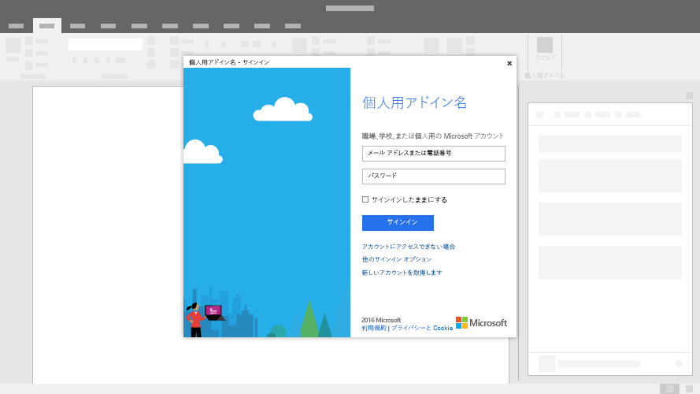

# Office アドインのダイアログ ボックスDialog boxes in Office Add-ins
 
ダイアログ ボックスは、作業中の Office アプリケーション ウインドウの手前に浮動するサーフェスです。ダイアログ ボックスを使用すれば、作業ウィンドウで直接開くことができないサインイン ページ、ユーザーによるアクションを確認するための要求、作業ウィンドウ内で再生すると小さすぎるビデオの表示などのタスクのために追加の画面領域を提供できます。Dialog boxes are surfaces that float above the active Office application window. You can use dialog boxes to provide additional screen space for tasks such as sign-in pages that can't be opened directly in a task pane or requests to confirm an action taken by a user, or to show videos that might be too small if confined to a task pane.

*図 1. ダイアログ ボックスの一般的なレイアウト**Figure 1. Typical layout for a dialog box*

## ベスト プラクティスBest practices

|**するべきこと****Do**|**使用不可****Don't**|
|:-----|:--------|
|<ul><li>アドイン名および現在のタスクを含む説明的なタイトルが含まれます。Include a descriptive title that includes your add-in name along with the current task.</li></ul>|<ul><li>タイトルには会社名を追加しません。Don't append your company name to the title.</li></ul>|
||<ul><li>シナリオで必要な場合を除き、ダイアログ ボックスを開きません。Don't open a dialog box unless the scenario requires it.</li></ul>|

## 実装Implementation

ダイアログ ボックスを実装するサンプルについては、GitHub の「[Office アドイン ダイアログ API の例](https://github.com/OfficeDev/Office-Add-in-Dialog-API-Simple-Example)」を参照してください。For a sample that implements a dialog box, see [Office Add-in Dialog API Example](https://github.com/OfficeDev/Office-Add-in-Dialog-API-Simple-Example) in GitHub.

## 関連項目See also

- [Dialog オブジェクトDialog object](/javascript/api/office/office.dialog)
- [Office アドインの UX 設計パターンUX design patterns for Office Add-ins](../design/ux-design-pattern-templates.md)
