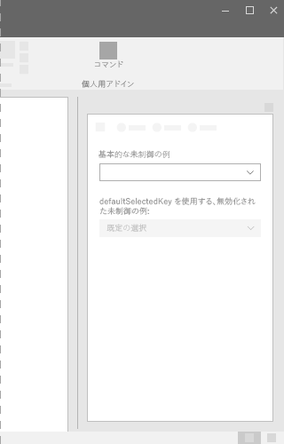
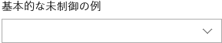
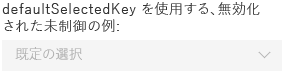
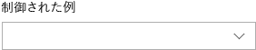

# Office UI Fabric のドロップダウン コンポーネント

ドロップダウンは、ドロップダウン ボタンをクリックすると表示される、オプションのリストです。ドロップダウン リスト (ドロップダウン メニュー) を使用して、UI デザインを簡素化します。また、ユーザーが UI 内で選択する必要がある場合にも使用します。リストを折りたたむと、選択した項目が表示されます。選択した項目を変更するには、ユーザーがリストを開き、新しい値を選択します。
  
#### 例: 作業ウィンドウ内のドロップダウン

## ベスト プラクティス

|**するべきこと**|**してはいけないこと**|
|:------------|:--------------|
|既定の選択済みオプションが、他のオプションよりも選択される可能性が高い場合は、ドロップダウンを使用します。対照的に、ChoiceGroup やラジオ ボタンはすべての選択肢を表示します。そのため、すべてのオプションを同じように強調します。|すべてのオプションが同じように選択される可能性がある場合は、ドロップダウンは使用しないでください。|
|1 つのフィールドに折りたたむことができる、複数の選択肢がある場合は、ドロップダウンを使用します。長い項目リストがある場合や、画面のスペースが制限されている場合にもドロップダウンを使用します。|選択肢が 2 つ未満の場合は、ドロップダウンを使用しないでください。その代わりに、チェックボックスを使用します。|
|ドロップダウン リストでは、短い文や単語を使用します。| |

## バリアント

|**バリエーション**|**説明**|**例**|
|:------------|:--------------|:----------|
|**基本的な未制御のドロップダウン**|多くのオプションが選択可能な場合に使用します。| |
|**defaultSelectedKey を使用して無効化された未制御のドロップダウン**|ドロップダウンが無効にされた状態です。| |
|**制御されたドロップダウン**|既定の選択済み項目が UI の別の場所の影響を受け、ドロップダウン内の選択された項目を保持する必要がある場合に使用します。| |

## 実装

詳細については、「[ドロップダウン](https://dev.office.com/fabric#/components/dropdown)」と「[Fabric React のコード サンプルの使用にあたって](https://github.com/OfficeDev/Word-Add-in-GettingStartedFabricReact)」を参照してください。

## 関連項目

- [UX 設計パターン](https://github.com/OfficeDev/Office-Add-in-UX-Design-Patterns-Code)
- [Office アドインの Office UI Fabric](office-ui-fabric.md)
