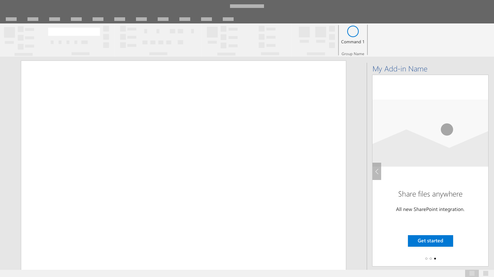

# 最初の実行エクスペリエンスパターン

最初の実行エクスペリエンス（FRE）は、ユーザーに対するアドインの紹介です。 FRE は、ユーザーが初めてアドインを開いた時に表示され、新機能、特徴、および/またはアドインのメリットがわかります。 このエクスペリエンスは、ユーザーのアドインの印象を形作るのを助け、また戻ってくる、および継続的にアドオンを使用するなどの可能性に強く影響します。

## ベスト プラクティス

最初の実行エクスペリエンスを作成する際、次のベストプラクティスに従ってください。

|するべきこと|してはいけないこと|
|:------|:------|
|アドインの主な操作を簡単に、短く紹介します。 | 開始するのに関係のない情報やコールアウトを含めないでください。
|アドインの使用にプラスの影響を与える操作を完了する機会をユーザーに与えます。 | ユーザーが一度にすべてを覚えるとは思わないでください。 最も価値を提供する操作に焦点を当てます。
|ユーザーが完了したいと思うような、魅力的な体験を作成します。 | ユーザーを強制的に最初の実行エクスペリエンスへ導かないでください。 ユーザーには、最初の実行エクスペリエンスを迂回する選択肢を与えます。 |

ユーザーに最初の実行エクスペリエンスを 1 回示すか、定期的に示すかを検討することがシナリオにとって重要かどうかを検討します。 例えば、アドインが定期的にのみ活用される場合、ユーザーはアドインにあまり親しんでいない可能性があり、最初の実行エクスペリエンスでもう一度体験することにメリットがある場合があります。

該当する場合、次のパターンを適用してアドインの最初の実行エクスペリエンスを作成し、向上させましょう。

## カルーセル

カルーセルは、ユーザーがアドインを使用する前に、ユーザーに一連の特徴や情報ページを表示します。

*図 1: カルーセルフローで先に進む、または最初のページを飛ばすことができるようにします。*

*図 2: ユーザーに表示するカルーセル画面の数を効率的にページを伝えるのに必要なだけの最小限にます*

*図 3: 最初の実行エクスペリエンスを終了するための、明確な操作のきっかけを提供します。*

## バリュープレイスマット

バリュー プレイスマットは、アドインノ価値提案をロゴを配置することで、価値提案、機能のハイライトまたは概要、およびコール トゥ アクションを明確に伝えます。

*ロゴ付きのバリュープレイスマット、明確な価値提案、機能の概要、およびコール トゥ アクション。*

### ビデオプレイスマット

ビデオプレイスマットは、ユーザーがアドインを使用し始める前にビデオを表示します。

*図 1: 最初の実行プレイスマット - 画面にはビデオからの静止画と、再生ボタンならびに明確なコール トゥ アクションボタンが含まれています。*

*図 2: ビデオプレーヤー - ユーザーには、ダイアログウィンドウの中にビデオを表示されます。*

