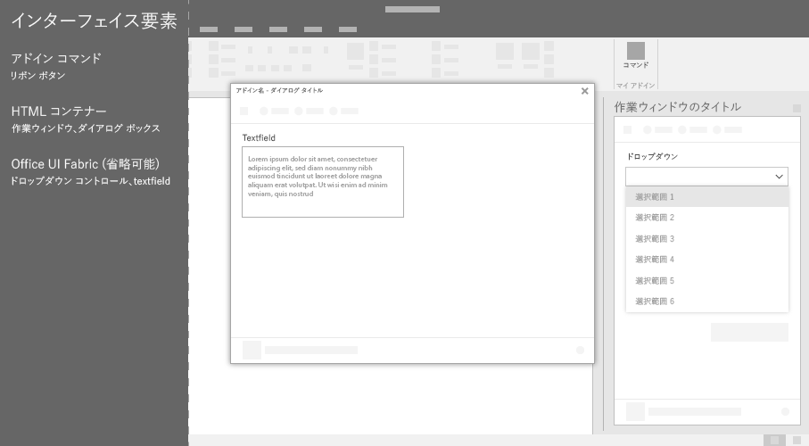

# Office アドイン用の Office の UI 要素

アドイン コマンドおよび HTML のコンテナーを含むいくつかの種類の UI 要素を使用して Office UI を拡張することができます。これらの UI 要素は、Office の元々の拡張機能のように自然に、あらゆるプラットフォームで使えます。これらのいずれの要素にも、Web ベースのカスタム コードを挿入できます。

次の図は、作成できる Office UI 要素の種類を示しています。

## アドイン コマンド

[アドイン コマンド](add-in-commands.md)を使って、アドインへのエントリ ポイントを Office リボンに追加します。コマンドは、JavaScript コードを実行するか、HTML コンテナーを起動することによって、アドインのアクションを開始します。2 種類のアドイン コマンドを作成できます。

|**コマンドの種類**|**説明**|
|:---------------|:--------------|
|リボンのボタン、メニュー、およびタブ|Office の既定のリボンにカスタム ボタン、メニュー (ドロップダウン)、またはタブを追加するのに使用します。ボタンやメニューは、Office でのアクションをトリガーするのに使用します。タブは、ボタンやメニューをグループ化し整理するのに使用します。|
|コンテキスト メニュー| 既定のコンテキスト メニューを拡張するために使用します。Office ドキュメントのテキストまたは Excel のテーブルを右クリックすると、コンテキスト メニューが表示されます。| 

## HTML コンテナー

HTML コンテナーは、Office クライアント内に HTML ベースの UI コードを埋め込むのに使用します。その Web ページで、Office の JavaScript API を参照して、ドキュメント内でコンテンツを操作できるようになります。3 種類の HTML コンテナーを作成できます。

|**HTML コンテナー**|**説明**|
|:-----------------|:--------------|
|[作業ウィンドウ](task-pane-add-ins.md)|Office ドキュメントの右側のウィンドウに、カスタム UI を表示します。作業ウィンドウを使用して、Office ドキュメントでアドインを横に並べて表示して操作できるようにします。|
|[コンテンツ アドイン](content-add-ins.md)|Office ドキュメントに埋め込まれているカスタム UI を表示します。コンテンツ アドインを使用して、Office ドキュメント内でアドインを直接操作できるようにします。たとえば、ビデオや、他のソースからのデータのビジュアル化などの外部コンテンツを表示します。 |
|[ダイアログ ボックス](dialog-boxes.md)|Office ドキュメントにオーバーレイした形でダイアログ ボックスの中にカスタム UI を表示します。フォーカスする必要がありスペースをより多く取る操作で、ドキュメント内で横並びにする必要がない操作には、ダイアログ ボックスを使用します。|

## 関連項目

- [Excel、Word、PowerPoint のアドイン コマンド](add-in-commands.md)
- [作業ウィンドウ](task-pane-add-ins.md)
- [コンテンツ アドイン](content-add-ins.md)
- [ダイアログ ボックス](dialog-boxes.md)
