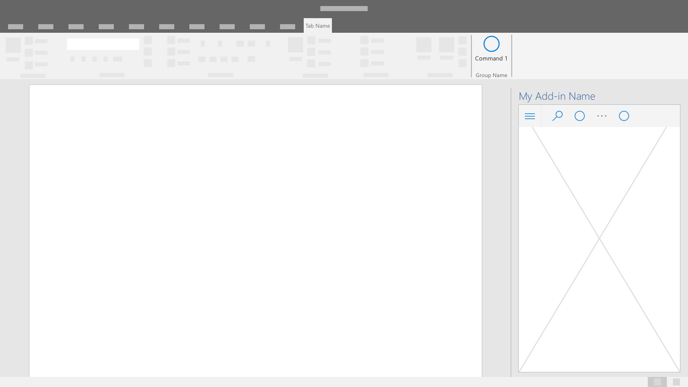

# ナビゲーション パターン

アドインの主な機能には、特定のコマンドの種類と限られた画面領域を介してアクセスします。 ナビゲーションは直感的で、コンテキストを提供し、アドイン全体においてユーザーが簡単に移動できることが重要です。

## ベスト プラクティス

| するべきこと    | してはいけないこと |
| :---- | :---- |
| ユーザーに分かりやすいナビゲーション オプションが表示されるようにする。 | 標準的ではない UI を使用してナビゲーション プロセスを複雑にしない。
| 可能な場合には以下のコンポーネントを利用して、ユーザーがアドイン内でナビゲートできるようにする。 | ユーザーが、アドインにおける現在の場所またはコンテキストを理解しにくいという状況を避ける。

## コマンド バー

CommandBar は、作業ウィンドウ内のサーフェスで、ウィンドウ、パネル、または上に存在する親領域のコンテンツを操作するコマンドを含む。 オプション機能には、ハンバーガー メニューのアクセス ポイント、検索、およびサイド コマンドが含まれます。

## タブ バー

タブ バーには、縦に積み上げされたテキストとアイコンを含むボタンを使用したナビゲーションが表示されます。 タブ バーを使用すると、短くてわかりやすいタイトルのタブが使用されたナビゲーションを表示できます。

## [戻る] ボタン

[戻る] ボタンを使用すると、ユーザーはドリルダウン ナビゲーション アクションから回復できます。 このパターンは、ユーザーが順序のある一連の手順に従えるようにするのに役立ちます。

![デスクトップ アプリケーション作業ウィンドウ内の [戻る] Officeを示す図。 次の使用例は、左上にアドイン名の直下に戻るボタンを示しています。](../images/add-in-back-button.png)
