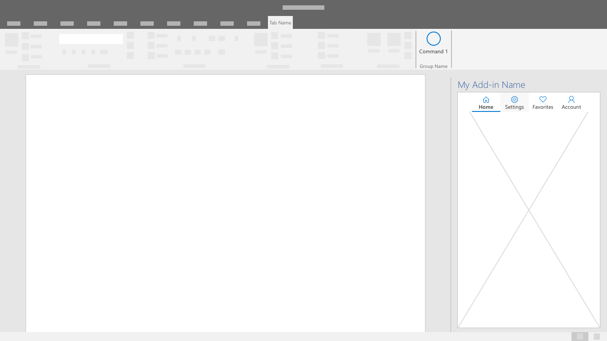

# ナビゲーション パターン

アドインの主な機能は、特定のコマンド タイプと限られた画面領域を介してアクセスします。 ナビゲーションは直観的であり、コンテキストを提供し、ユーザーがアドイン全体を簡単に移動できるようにすることが大切です。

## ベスト プラクティス

| するべきこと    | してはいけないこと |
| :---- | :---- |
| ユーザーに明確なナビゲーション オプションが表示されていることを確認します。 | 非標準 UI を使用してナビゲーション プロセスを複雑にすることは避けましょう。
| ユーザーがアドインをナビゲートできるように、適宜に次のコンポーネントを使用します。 | ユーザーがアドイン内の現在の場所やコンテキストを理解することを難しくするのは避けましょう。

## コマンド バー

CommandBar は、その下にあるウィンドウ、パネル、または親領域の内容を操作するコマンドを格納するサーフェスです。 オプション機能には、ハンバーガー メニューのアクセス ポイント、検索、およびサイド コマンドが含まれます。

## タブ バー

テキストとアイコンが縦に並んだボタンを使用してナビゲーションを表示します。 タブ バーを使用すると、短くてわかりやすいタイトルのタブを使用したナビゲーションを表示できます。

## [戻る] ボタン

[戻る] ボタンを使用すると、ユーザーはドリルダウン ナビゲーション操作から回復できます。 このパターンを使用すれば、ユーザーは順序のある一連の手順に従えるようになります。  

![[戻る] ボタン - デスクトップ作業ウィンドウの仕様](../images/add-in-back-button.png)
