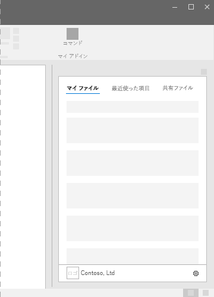
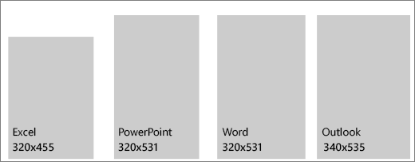

# Office アドインの作業ウィンドウ

Task panes are interface surfaces that typically appear on the right side of the window within Word, PowerPoint, Excel, and Outlook. Task panes give users access to interface controls that run code to modify documents or emails, or display data from a data source. Use task panes when you don't need to embed functionality directly into the document.

*図 1. 一般的な作業ウィンドウのレイアウト*

## ベスト プラクティス

|するべきこと|してはいけないこと|
|:-----|:--------|
|タイトルにアドインの名前を含めます。|タイトルには会社名を追加しません。|
|タイトルには短くわかりやすい名前を使用します。|アドインのタイトルに、"アドイン"、"for Word"、"for Office" などの文字列を追加しないでください。|
|アドインの上部に CommandBar や Pivot などのナビゲーション要素やコマンド要素を含めます。|*なし。*|
|アドインを Outlook 内で使用する場合を除き、アドインの下部に BrandBar などのブランド化の要素を含めます。|*なし。*|

## バリアント

次の図は、Office アプリ リボンが 1366x768 解像度の作業ウィンドウのさまざまなサイズを示しています。 Excel では、数式バーを収容するための縦のスペースが必要です。  

*図 2. Office 2016 デスクトップ作業ウィンドウのサイズ*

- Excel - 320x455 ピクセル
- PowerPoint - 320x531 ピクセル
- Word - 320x531 ピクセル
- Outlook - 348x535 ピクセル

 

*図 3.Office 作業ウィンドウのサイズ*

- Excel - 350x378 ピクセル
- PowerPoint - 348x391 ピクセル
- Word - 329x445 ピクセル
- Outlook (Web 上) - 320 x 570 ピクセル

## パーソナル メニュー

パーソナル メニューは、アドインの右上付近にあるナビゲーション要素やコマンド要素の妨げになる可能性があります。 Windows と Mac でのパーソナル メニューの現在のサイズを次に示します。 (Outlook では、パーソナリティ メニューはサポートされていません。)

Windows の場合、パーソナル メニューは 12x32 ピクセルを測定します (図を参照)。

*図 4. Windows のパーソナル メニュー*

![Windows デスクトップの [パーソナリティ] メニューを示す図。](../images/personality-menu-win.png)

Mac の場合、パーソナル メニューは 26x26 ピクセルを測定しますが、右から 8 ピクセル内側、上から 6 ピクセルの位置にフロートします。これにより、スペースは 34x32 ピクセルに増加します (図を参照)。

*図 5. Mac のパーソナル メニュー*

![Mac デスクトップの [パーソナリティ] メニューを示す図。](../images/personality-menu-mac.png)

## 実装

作業ウィンドウを実装するサンプルについては、GitHub の「[Excel アドインの JS WoodGrove Expense Trends](https://github.com/OfficeDev/Excel-Add-in-WoodGrove-Expense-Trends)」を参照してください。

## 関連項目

- [Office アドインの Fabric Core](fabric-core.md)
- [Office アドインの UX 設計パターン](../design/ux-design-pattern-templates.md)
