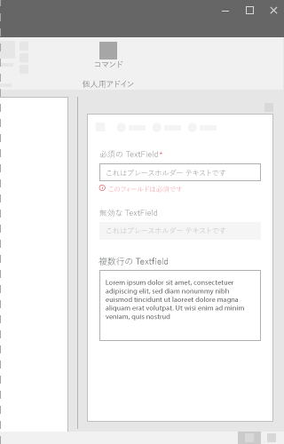
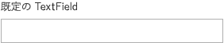
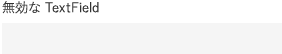
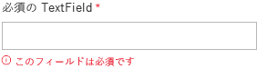
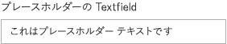
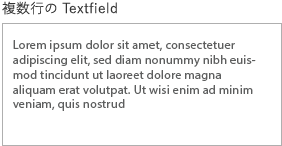

# Office UI Fabric の TextField コンポーネント

テキスト フィールドを使用すると、ユーザーがテキストを入力できます。通常、これは単一行のテキストのキャプチャに使用されますが、複数行のテキストをキャプチャするように構成することもできます。テキストは、シンプルで統一された形式で画面に表示されます。
  
#### 例: 作業ウィンドウ内の TextField

## ベスト プラクティス

|**するべきこと**|**してはいけないこと**|
|:------------|:--------------|
|テキスト フィールドを使用すると、フォームまたはページのデータ入力を受け入れることができます。|基本コピーをページの本文要素の一部としてレンダリングするために、テキスト フィールドを使用しないでください。|
|テキスト フィールドには、わかりやすい名前のラベルを付けます。|テキスト フィールドは、日付や時刻の入力に使用しないでください。 代わりに、日時指定を使用します。|
|簡潔なプレースホルダー テキストを使用して、入力する内容を指定します。|有効な入力オプションを事前に定義できる場合は、テキスト フィールドを使用しないでください。その代わりに、ドロップダウンを使用します。|
|テキスト フィールドに適した状態をすべて提供します (静的、ホバー、フォーカス、掛かり状態、利用不可、エラー)。||
|必須のテキスト フィールドと省略可能なテキスト フィールドを明確にマークします。||
|可能な場合は、必要なデータ形式に応じてテキスト フィールドを書式設定します。たとえば、10 桁の電話番号をキャプチャする場合は、別々の 3 つのフィールドを使用して電話番号の異なる部分を格納します。||

## バリアント

|**バリエーション**|**説明**|**例**|
|:------------|:--------------|:----------|
|**既定の TextField**|既定のテキスト フィールドとして使用します。| |
|**無効な TextField**|テキスト フィールドが無効になっている場合に使用します。| |
|**必須の TextField**|テキスト フィールドの入力が必須の場合に使用します。| |
|**プレース ホルダー付きの TextField**|プレース ホルダー テキストが必要な場合に使用します。| |
|**複数行の TextField**|多くの行のテキストが必要な場合に使用します。| |

## 実装

詳細については、「[TextField](https://dev.office.com/fabric#/components/textfield)」と「[Fabric React のコード サンプルの使用にあたって](https://github.com/OfficeDev/Word-Add-in-GettingStartedFabricReact)」を参照してください。

## 関連項目

- [UX 設計パターン](https://github.com/OfficeDev/Office-Add-in-UX-Design-Patterns-Code)
- [Office アドインの Office UI Fabric](office-ui-fabric.md)
