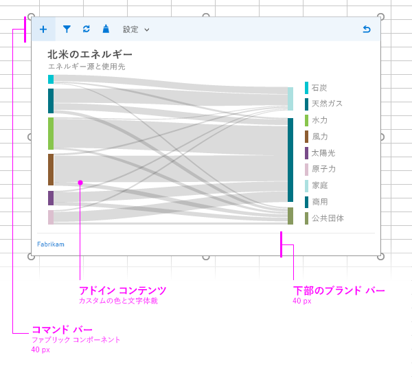

# コンテンツ アドインのレイアウト

推奨されるデザインのレイアウトを使用して、見た目に統一感のあるコンテンツ アドインを作成します。コンテンツ アドインで推奨されるレイアウトには、次の要素が含まれます。 

- コマンド バー (省略可能) - ユーザー向けのアイコンやナビゲーションが含まれ、アドイン コンテンツを重ねることができます。高さの最大値は 80 ピクセルです。
- アドイン コンテンツ
- ブランド化の要素 (省略可能)

[カスタム HTML ベースの UI](ui-elements.md#custom-html-based-ui) をコンテンツ アドインに追加することもできます。

Office アドインで Office UI Fabric を使用する方法を示すサンプルについては、「[Office アドイン Fabric UI サンプル](https://github.com/OfficeDev/Office-Add-in-Fabric-UI-Sample)」を参照してください。

<!-- Add sample template for content add-in and individual building blocks - Command Bar, Input, layout components. -->

## 関連項目

- [Office アドインの設計ガイドライン](../add-in-design.md)