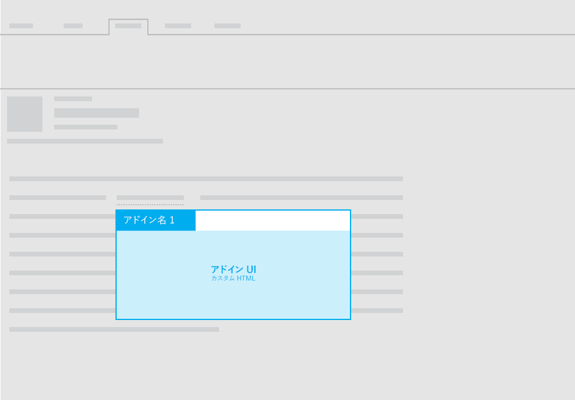

#メール アドイン用のレイアウト

メールのアドイン用の次のレイアウトのいずれかを使用できます。

- 作業ウィンドウ
- コンテキスト
- InfoBar 通知付きの機能

アドインの UI テキストのガイドラインについては、「[Office のスタイル](https://msdn.microsoft.com/en-us/library/office/mt484351.aspx)」を参照してください。

##作業ウィンドウ
 メール アドインの作業ウィンドウのレイアウトに関する推奨事項は、「[作業ウィンドウ アドイン用のレイアウト](layout-for-task-pane-add-ins.md)」を参照してください。

##コンテキスト アドイン

以下の図は、[コンテキスト メール アドイン](https://msdn.microsoft.com/EN-US/library/office/dn893542.aspx)に推奨されるレイアウトを示しています。

##InfoBar 通知付きの機能

メール アドインで、作業ウィンドウまたはコンテキスト ウィンドウを使用してカスタム HTML UI を表示することに加えて、コマンドから関数を実行することができます。関数の結果として UI テキストを表示する必要がある場合は、InfoBar 通知を使用することができます。たとえば、InfoBar 通知を使用してエラーまたは成功のメッセージを表示することができます。 

詳細については、「[メール用のアドイン コマンド](https://msdn.microsoft.com/EN-US/library/office/mt267546.aspx)」をご参照ください。 

