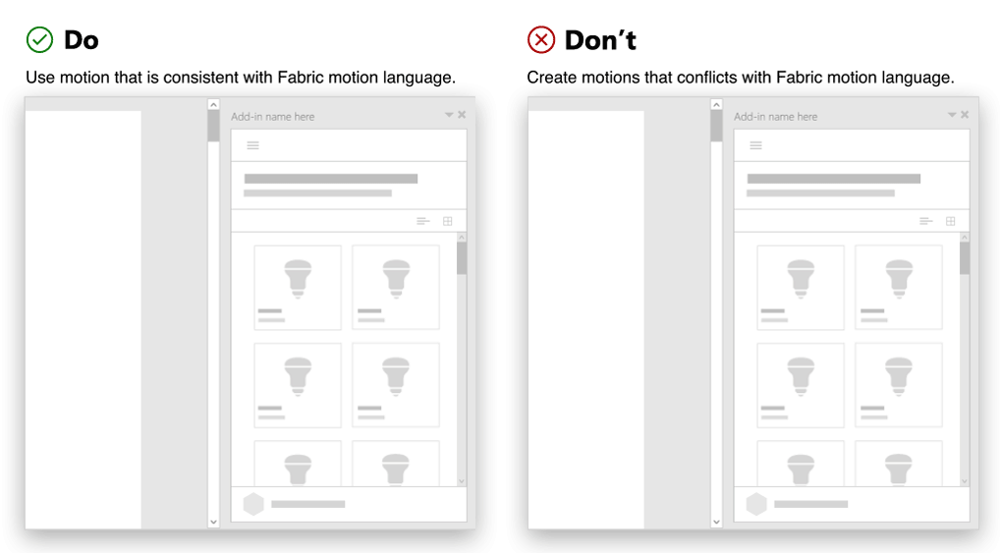

# Office アドインでモーションを使用する

Office アドインを設計する際、モーションを使用してユーザー エクスペリエンスを向上させられます。 UI 要素、コントロール、コンポーネントには多くの場合、切り替え、モーション、アニメーションを必要とする対話型の動作が関係します。 UI 要素全体においてモーションの共通の特性は、デザイン言語のアニメーション要素を定義することです。 

Office は生産性に重点を置いているため、Office のアニメーション言語は、お客様による業務の遂行を支援するという目的をサポートします。 このアニメーション言語は、優れた応答性、信頼できるビジュアル、きめ細やかな魅力をバランスよく実現しています。 Office に埋め込まれるアドインは、この既存のアニメーション言語を利用します。 したがって、モーションを使用する場合、次のガイドラインを検討することが重要です。 

## 用途に合わせてモーションを作成する

モーションは、ユーザーが価値を実感できるものである必要があります。 アニメーションを選択する際は、コンテンツのトーンと目的を検討します。 重要なメッセージは、探索的ナビゲーションとは異なる方法で処理します。

アドインで使用される標準的な要素では、モーションを組み込むことにより、ユーザーの注意を引く、要素どうしの関連性を示す、ユーザーの操作を確認するなどの用途に役立てられます。 要素にモーションを付けることで、階層モデルやメンタル モデルを明確にできます。

### ベスト プラクティス

|するべきこと|してはいけないこと|
|:-----|:-----|
|アドインの中でモーションを設定する必要のある主要な要素を特定します。 アドインの要素では、パネル、オーバーレイ、モーダル、ツール ヒント、メニュー、ティーチング コールアウトに、よくアニメーションが付けられます。| すべての要素をアニメーション化して、ユーザーを圧倒することは避けてください。 一度に多くの要素に注意を引こうとして、複数のモーションを適用することがないようにします。 |
|ユーザーが予想できる動作をする、わかりやすく自然なモーションを使用します。要素のトリガー元を検討します。モーションを使用して、操作と結果の UI がつながるようにします。 | モーションのための待機時間ができないようにします。 タスクの完了を妨げるモーションは、アドインで使用しないでください。|

## 予想される動作を使用する

  [Office UI Fabric](https://developer.microsoft.com/en-us/fabric) を使用して、Office プラットフォームと視覚的に関連付けることをお勧めします。また、Fabric モーション言語に合わせてモーションを作成するため、[Fabric アニメーション](https://developer.microsoft.com/en-us/fabric#/styles/animations)を使用することをお勧めします。 

これを、Office とシームレスに適合するように使用します。こうすることにより、直感的なエクスペリエンスを実現できます。アニメーション CSS クラスには、Office のメンタル モデルを明確にするのに役立つ、方向性、開始/終了、期間に関する詳細な設定が用意されており、アドインの操作方法も学べるようになっています。

### ベスト プラクティス

|するべきこと|してはいけないこと|
|:-----|:-----|
|Fabric の動作と合うモーションを使用します。| Office の一般的なモーション パターンに干渉または競合するモーションは作成しないでください。 
|要素全体で、モーションが一貫して適用されるようにします。| 同じコンポーネントやオブジェクトのアニメーションに、異なるモーションを使用しないでください。|
|アニメーションの方向にも一貫性があるようにします。 たとえば、右側から開くパネルは、右側に閉じるようにします。|要素をアニメーション化する際に、複数の方向を使用しないでください。

## 要素に合わないモーションを避ける

モーションを実装する際は、HTML キャンバス (作業ウィンドウ、ダイアログ ボックス、コンテンツ アドイン) のサイズを考慮に入れます。 制約のあるスペースにモーションを詰め込み過ぎないようにします。 要素の動き方は、Office に合わせる必要があります。 アドイン モーションは、高パフォーマンスで、信頼性があり、滑らかなものにする必要があります。 生産性を損なわずに、情報伝達や操作性が向上するようにします。

### ベスト プラクティス

|するべきこと|してはいけないこと|
|:-----|:-----|
| 
  [推奨モーション期間](https://developer.microsoft.com/en-us/fabric#/styles/animations)を使用することをお勧めします。 | 大げさなアニメーションを使用しないでください。 ユーザーの注意をそらす装飾目的のエクスペリエンスは作成しないでください。
| [Microsoft モーション ガイド](https://microsoft.sharepoint.com/teams/BrandCentral/Pages/The-Microsoft-brand-Core-elements-Motion.aspx#topic_0)にある、推奨されているイージング曲線を使用します。  |ぎくしゃくした動きやばらばらな動きは使用しないでください。 期待、バウンス、輪ゴムなどの自然界の物理特性を模倣するだけの効果は使用しないでください。|

## 関連項目

* 
  [Fabric アニメーションのガイドライン](https://developer.microsoft.com/en-us/fabric#/styles/animations)
* 
  [ユニバーサル Windows プラットフォーム アプリ用のモーション](https://docs.microsoft.com/ja-jp/windows/uwp/design/motion/)

