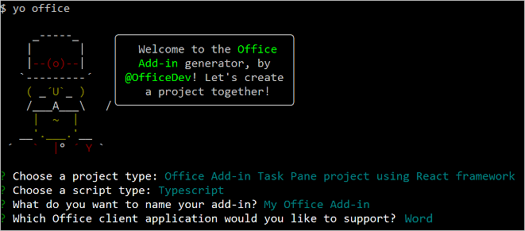
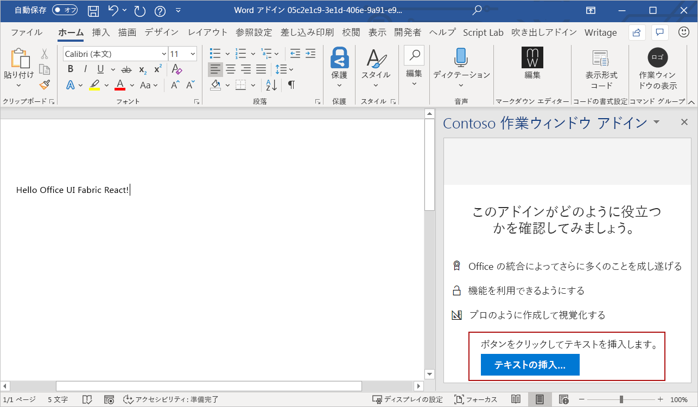

# <a name="use-fluent-ui-react-in-office-add-ins"></a>Office アドインで FLUENT UI Reactを使用する

Fluent UI Reactは、Officeを含む幅広い Microsoft 製品にシームレスに適合するエクスペリエンスを構築するために設計された公式のオープン ソース JavaScript フロントエンド フレームワークです。 CSS-in-JS を使用して、高度にカスタマイズ可能かつ堅牢で最新のアクセス可能な React ベースのコンポーネントを提供します。

> [!NOTE]
> この記事では、Office アドインのコンテキストでのFluent UI Reactの使用について説明します。しかし、さまざまなMicrosoft 365アプリや拡張機能でも使用されています。 詳細については、「[FLUENT UI React](https://developer.microsoft.com/fluentui#/get-started/web#fluent-ui-react)」と UI Web Fluentオープンソースリポジトリに関[するページを参照してください](https://github.com/microsoft/fluentui)。

この記事では、Reactで構築され、FLUENT UI React コンポーネントを使用するアドインを作成する方法について説明します。

## <a name="create-an-add-in-project"></a>アドイン プロジェクトの作成

Office アドイン用の Yeoman ジェネレーターを使用して、React を使用するアドイン プロジェクトを作成します。

### <a name="install-the-prerequisites"></a>前提条件をインストールする

[!include[Yeoman generator prerequisites](../includes/quickstart-yo-prerequisites.md)]

### <a name="create-the-project"></a>プロジェクトを作成する

[!include[Yeoman generator create project guidance](../includes/yo-office-command-guidance.md)]

- **Choose a project type: (プロジェクトの種類を選択)** `Office Add-in Task Pane project using React framework`
- **Choose a script type: (スクリプトの種類を選択)** `TypeScript`
- **What would you want to name your add-in?: (アドインの名前を何にしますか)** `My Office Add-in`
- **Which Office client application would you like to support?: (どの Office クライアント アプリケーションをサポートしますか)** `Word`



ウィザードを完了すると、ジェネレーターによってプロジェクトが作成されて、サポートしているノード コンポーネントがインストールされます。

[!include[Yeoman generator next steps](../includes/yo-office-next-steps.md)]

### <a name="try-it-out"></a>試してみる

1. プロジェクトのルート フォルダーに移動します。

    ```command&nbsp;line
    cd "My Office Add-in"
    ```

2. 以下の手順を実行し、ローカル Web サーバーを起動してアドインのサイドロードを行います。

    [!INCLUDE [alert use https](../includes/alert-use-https.md)]

    > [!TIP]
    > Mac でアドインをテストしている場合は、先に進む前に次のコマンドを実行してください。 このコマンドを実行すると、ローカル Web サーバーが起動します。
    >
    > ```command&nbsp;line
    > npm run dev-server
    > ```

    - Word でアドインをテストするには、プロジェクトのルート ディレクトリから次のコマンドを実行します。 これにより、ローカル Web サーバーが起動し、アドインが読み込まれた Word が開きます。

        ```command&nbsp;line
        npm start
        ```

    - ブラウザー上の Word でアドインをテストするには、プロジェクトのルート ディレクトリから次のコマンドを実行します。 このコマンドを実行すると、ローカル Web サーバーが起動します。 "{url}" を、アクセス許可を持っている OneDrive または SharePoint ライブラリ上の Word ドキュメントの URL に置き換えます。

        [!INCLUDE [npm start:web command syntax](../includes/start-web-sideload-instructions.md)]

3. アドイン作業ウィンドウを開くには、[ **ホーム** ] タブで [ **タスクウィンドウの表示** ] ボタンを選択します。 作業ウィンドウの下部にある既定のテキストと [**実行**] ボタンに注意してください。 このチュートリアルの残りの部分では、UI Reactから UX コンポーネントを使用するReact コンポーネントを作成して、このテキストとボタンFluent再定義します。

    ![[タスクウィンドウの表示] リボン ボタンが強調表示され、[実行] ボタンと作業ウィンドウで直前のテキストが強調表示された Word アプリケーションを示すスクリーンショット。](../images/word-task-pane-yo-default.png)

## <a name="create-a-react-component-that-uses-fluent-ui-react"></a>FLUENT UI Reactを使用するReact コンポーネントを作成する

この時点で、React を使用して構築された非常に基本的な作業ウィンドウ アドインが作成されました。 次の手順に従って、アドイン プロジェクト内で新しい React コンポーネント (`ButtonPrimaryExample`) を作成します。 コンポーネントは、`Label`FLUENT UI Reactのコンポーネントを`PrimaryButton`使用します。

1. Yeoman ジェネレーターで作成したプロジェクト フォルダーを開き、**src\taskpane\components** に移動します。
2. そのフォルダーで、**button.tsx** という名前の新しいファイルを作成します。
3. **button.tsx** で、次のコードを追加して `ButtonPrimaryExample` コンポーネントを定義します。

```typescript
import * as React from 'react';
import { PrimaryButton, IButtonProps } from '@fluentui/react/lib/Button';
import { Label } from '@fluentui/react/lib/Label';

export class ButtonPrimaryExample extends React.Component<IButtonProps, {}> {
  public constructor(props) {
    super(props);
  }

  insertText = async () => {
    // In the click event, write text to the document.
    await Word.run(async (context) => {
      let body = context.document.body;
      body.insertParagraph('Hello Fluent UI React!', Word.InsertLocation.end);
      await context.sync();
    });
  }

  public render() {
    let { disabled } = this.props;
    return (
      <div className='ms-BasicButtonsExample'>
        <Label>Click the button to insert text.</Label>
        <PrimaryButton
          data-automation-id='test'
          disabled={ disabled }
          text='Insert text...'
          onClick={ this.insertText } />
      </div>
    );
  }
}
```

このコードは、次の処理を実行します。

- `import * as React from 'react';` を使用して、React ライブラリを参照します。
- 作成`ButtonPrimaryExample`に使用されるFluent UI React コンポーネント (`PrimaryButton`, `IButtonProps``Label`) を参照します。
- `export class ButtonPrimaryExample extends React.Component` を使用して、新しい `ButtonPrimaryExample` コンポーネントを宣言します。
- ボタンの `onClick` イベントを処理する `insertText` 関数を宣言します。
- `render` 関数で React コンポーネントの UI を定義します。 HTML マークアップでは、Fluent UI Reactのコンポーネントを使用`Label``PrimaryButton`し、`insertText`イベントが発生したときに`onClick`関数を実行することを指定します。

## <a name="add-the-react-component-to-your-add-in"></a>React コンポーネントをアドインに追加

`ButtonPrimaryExample` **src\components\App.tsx** を開き、次の手順を完了して、アドインにコンポーネントを追加します。

1. **Button.tsx** の参照 `ButtonPrimaryExample` に次のインポート ステートメントを追加します。

    ```typescript
    import {ButtonPrimaryExample} from './Button';
    ```

2. 次の import ステートメントを削除します。

    ```typescript
    import Progress from './Progress';
    ```

3. 既定の `render()` 関数を、`ButtonPrimaryExample` を使った以下のコードに置き換えます。

    ```typescript
    render() {
      return (
        <div className="ms-welcome">
        <Header logo="assets/logo-filled.png" title={this.props.title} message="Welcome" />
        <HeroList message="Discover what this add-in can do for you today!" items={this.state.listItems} >
          <ButtonPrimaryExample />
        </HeroList>
        </div>
      );
    }
    ```

4. **App.tsx** に加えた変更を保存します。

## <a name="see-the-result"></a>結果を表示する

Word で、**App.tsx** に変更を保存すると、アドイン作業ウィンドウが自動的に更新されます。 作業ウィンドウ下部の既定のテキストとボタンに、`ButtonPrimaryExample` コンポーネントによって定義された UI が表示されるようになりました。 [**テキストの挿入**] ボタンを選択してドキュメントにテキストを挿入します。



おめでとうございます。ReactとFluent UI Reactを使用して作業ウィンドウ アドインを正常に作成しました。

## <a name="see-also"></a>関連項目

- [Word アドインの GettingStartedFabricReact](https://github.com/OfficeDev/Word-Add-in-GettingStartedFabricReact)
- [Office アドインの Fabric Core](fabric-core.md)
- [Office アドインの UX 設計パターン](ux-design-pattern-templates.md)
