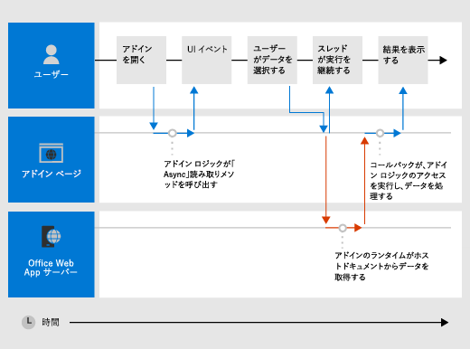

# <a name="asynchronous-programming-in-office-add-ins"></a><span data-ttu-id="f84bd-103">Office アドインにおける非同期プログラミング</span><span class="sxs-lookup"><span data-stu-id="f84bd-103">Asynchronous programming in Office Add-ins</span></span>

[!include[information about the common API](../includes/alert-common-api-info.md)]

<span data-ttu-id="f84bd-104">Office アドイン API が非同期プログラミングを使用するのはなぜですか?</span><span class="sxs-lookup"><span data-stu-id="f84bd-104">Why does the Office Add-ins API use asynchronous programming?</span></span> <span data-ttu-id="f84bd-105">JavaScript はシングルスレッドの言語であるため、スクリプトで実行時間の長い同期プロセスが呼び出されると、そのプロセスが完了するまで後続のすべてのスクリプト実行がブロックされます。</span><span class="sxs-lookup"><span data-stu-id="f84bd-105">Because JavaScript is a single-threaded language, if script invokes a long-running synchronous process, all subsequent script execution will be blocked until that process completes.</span></span> <span data-ttu-id="f84bd-106">Office web クライアントに対する特定の操作 (ただし、リッチクライアントでも) が同期的に実行されると、実行がブロックされる可能性があるため、ほとんどの Office JavaScript Api は非同期で実行するように設計されています。</span><span class="sxs-lookup"><span data-stu-id="f84bd-106">Because certain operations against Office web clients (but rich clients as well) could block execution if they are run synchronously, most of the Office JavaScript APIs are designed to execute asynchronously.</span></span> <span data-ttu-id="f84bd-107">これにより、Office アドインが迅速に応答できるようになります。</span><span class="sxs-lookup"><span data-stu-id="f84bd-107">This makes sure that Office Add-ins are responsive and fast.</span></span> <span data-ttu-id="f84bd-108">このような非同期メソッドを利用するときは、多くの場合、コールバック関数の記述も必要です。</span><span class="sxs-lookup"><span data-stu-id="f84bd-108">It also frequently requires you to write callback functions when working with these asynchronous methods.</span></span>

<span data-ttu-id="f84bd-109">API の最後にあるすべての非同期メソッドの名前。 "Async" (、、 `Document.getSelectedDataAsync` 、 `Binding.getDataAsync` または `Item.loadCustomPropertiesAsync` メソッドなど)。</span><span class="sxs-lookup"><span data-stu-id="f84bd-109">The names of all asynchronous methods in the API end with "Async", such as the `Document.getSelectedDataAsync`, `Binding.getDataAsync`, or `Item.loadCustomPropertiesAsync` methods.</span></span> <span data-ttu-id="f84bd-110">"Async" メソッドは呼び出されるとすぐに実行され、後続のスクリプトも続けて実行することができます。</span><span class="sxs-lookup"><span data-stu-id="f84bd-110">When an "Async" method is called, it executes immediately and any subsequent script execution can continue.</span></span> <span data-ttu-id="f84bd-111">"Async" メソッドに渡す任意のコールバック関数は、データまたは要求された操作の準備が整い次第、すぐに実行されます。</span><span class="sxs-lookup"><span data-stu-id="f84bd-111">The optional callback function you pass to an "Async" method executes as soon as the data or requested operation is ready.</span></span> <span data-ttu-id="f84bd-112">コールバック関数の実行は通常、直ちに行われますが、戻るまでに若干の遅延が生じることがあります。</span><span class="sxs-lookup"><span data-stu-id="f84bd-112">This generally occurs promptly, but there can be a slight delay before it returns.</span></span>

<span data-ttu-id="f84bd-113">次の図は、サーバーベースの Word または Excel で開いているドキュメントでユーザーが選択したデータを読み取る、"Async" メソッドへの呼び出しの実行フローを示しています。</span><span class="sxs-lookup"><span data-stu-id="f84bd-113">The following diagram shows the flow of execution for a call to an "Async" method that reads the data the user selected in a document open in the server-based Word or Excel.</span></span> <span data-ttu-id="f84bd-114">"Async" 呼び出しが行われる時点で、JavaScript 実行スレッドは、追加のクライアント側の処理を自由に実行できます (ただし、図には何も表示されません)。</span><span class="sxs-lookup"><span data-stu-id="f84bd-114">At the point when the "Async" call is made, the JavaScript execution thread is free to perform any additional client-side processing (although none are shown in the diagram).</span></span> <span data-ttu-id="f84bd-115">"Async" メソッドが戻ると、コールバックはスレッドの実行を再開し、アドインはアクセスデータを操作して、その結果を表示することができます。</span><span class="sxs-lookup"><span data-stu-id="f84bd-115">When the "Async" method returns, the callback resumes execution on the thread, and the add-in can the access data, do something with it, and display the result.</span></span> <span data-ttu-id="f84bd-116">Word 2013 または Excel 2013 などの Office リッチクライアントアプリケーションを使用する場合、同じ非同期実行パターンが保持されます。</span><span class="sxs-lookup"><span data-stu-id="f84bd-116">The same asynchronous execution pattern holds when working with the Office rich client applications, such as Word 2013 or Excel 2013.</span></span>

<span data-ttu-id="f84bd-117">*図 1. 非同期プログラミング実行フロー*</span><span class="sxs-lookup"><span data-stu-id="f84bd-117">*Figure 1. Asynchronous programming execution flow*</span></span>



<span data-ttu-id="f84bd-p104">リッチ クライアントと Web クライアントの両方でこの非同期設計をサポートすることは、Office アドイン開発モデルの "write once-run cross-platform (一度書けばどんなプラットフォームも実行できる)" 設計目的の一部です。たとえば、Excel 2013 と Excel Online の両方で実行されるシングル コード ベースのコンテンツ アドインまたは作業ウィンドウ アドインを作成できます。</span><span class="sxs-lookup"><span data-stu-id="f84bd-p104">Support for this asynchronous design in both rich and web clients is part of the "write once-run cross-platform" design goals of the Office Add-ins development model. For example, you can create a content or task pane add-in with a single code base that will run in both Excel 2013 and Excel on the web.</span></span>

## <a name="writing-the-callback-function-for-an-async-method"></a><span data-ttu-id="f84bd-121">"Async" メソッドのコールバック関数を記述する</span><span class="sxs-lookup"><span data-stu-id="f84bd-121">Writing the callback function for an "Async" method</span></span>


<span data-ttu-id="f84bd-122">"Async" メソッドにコール _バック_ 引数として渡すコールバック関数は、コールバック関数の実行時にアドインランタイムが [AsyncResult](/javascript/api/office/office.asyncresult) オブジェクトへのアクセスを提供するために使用する1つのパラメーターを宣言する必要があります。</span><span class="sxs-lookup"><span data-stu-id="f84bd-122">The callback function you pass as the _callback_ argument to an "Async" method must declare a single parameter that the add-in runtime will use to provide access to an [AsyncResult](/javascript/api/office/office.asyncresult) object when the callback function executes.</span></span> <span data-ttu-id="f84bd-123">次のように記述することができます。</span><span class="sxs-lookup"><span data-stu-id="f84bd-123">You can write:</span></span>


- <span data-ttu-id="f84bd-124">"Async" メソッドの _callback_ パラメーターとして "async" メソッドを呼び出すことで、行内で直接記述して渡す必要がある匿名関数。</span><span class="sxs-lookup"><span data-stu-id="f84bd-124">An anonymous function that must be written and passed directly in line with the call to the "Async" method as the _callback_ parameter of the "Async" method.</span></span>

- <span data-ttu-id="f84bd-125">"Async" メソッドの _callback_ パラメーターとしてその関数の名前を渡す、名前付き関数。</span><span class="sxs-lookup"><span data-stu-id="f84bd-125">A named function, passing the name of that function as the _callback_ parameter of an "Async" method.</span></span>

<span data-ttu-id="f84bd-p106">匿名関数は、そのコードを一度だけ使用する場合に便利です。関数には名前がないため、コードの別の部分で参照できないためです。名前付き関数は、複数の "Async" メソッドにコールバック関数を再利用する場合に便利です。</span><span class="sxs-lookup"><span data-stu-id="f84bd-p106">An anonymous function is useful if you are only going to use its code once - because it has no name, you can't reference it in another part of your code. A named function is useful if you want to reuse the callback function for more than one "Async" method.</span></span>


### <a name="writing-an-anonymous-callback-function"></a><span data-ttu-id="f84bd-128">匿名コールバック関数を記述する</span><span class="sxs-lookup"><span data-stu-id="f84bd-128">Writing an anonymous callback function</span></span>

<span data-ttu-id="f84bd-129">次の匿名のコールバック関数は、 `result` コールバックが戻るときに、 [AsyncResult](/javascript/api/office/office.asyncresult#value) プロパティからデータを取得するという名前の単一のパラメーターを宣言します。</span><span class="sxs-lookup"><span data-stu-id="f84bd-129">The following anonymous callback function declares a single parameter named `result` that retrieves data from the [AsyncResult.value](/javascript/api/office/office.asyncresult#value) property when the callback returns.</span></span>


```js
function (result) {
        write('Selected data: ' + result.value);
}
```

<span data-ttu-id="f84bd-130">次の例は、メソッドへの完全な "Async" メソッド呼び出しのコンテキストで、この匿名のコールバック関数をインラインで渡す方法を示して `Document.getSelectedDataAsync` います。</span><span class="sxs-lookup"><span data-stu-id="f84bd-130">The following example shows how to pass this anonymous callback function in line in the context of a full "Async" method call to the `Document.getSelectedDataAsync` method.</span></span>


- <span data-ttu-id="f84bd-131">最初の _coercionType_ 引数は、 `Office.CoercionType.Text` 選択されているデータをテキストの文字列として返すように指定します。</span><span class="sxs-lookup"><span data-stu-id="f84bd-131">The first _coercionType_ argument, `Office.CoercionType.Text`, specifies to return the selected data as a string of text.</span></span>

- <span data-ttu-id="f84bd-132">2番目の _callback_ 引数は、メソッドにインラインで渡される匿名関数です。</span><span class="sxs-lookup"><span data-stu-id="f84bd-132">The second _callback_ argument is the anonymous function passed in-line to the method.</span></span> <span data-ttu-id="f84bd-133">関数が実行されると、 _result_ パラメーターを使用して `value` オブジェクトのプロパティにアクセスし、 `AsyncResult` ドキュメント内のユーザーが選択したデータを表示します。</span><span class="sxs-lookup"><span data-stu-id="f84bd-133">When the function executes, it uses the _result_ parameter to access the `value` property of the `AsyncResult` object to display the data selected by the user in the document.</span></span>


```js
Office.context.document.getSelectedDataAsync(Office.CoercionType.Text, 
    function (result) {
        write('Selected data: ' + result.value);
    }
});

// Function that writes to a div with id='message' on the page.
function write(message){
    document.getElementById('message').innerText += message; 
}
```

<span data-ttu-id="f84bd-134">また、コールバック関数のパラメーターを使用して、オブジェクトの他のプロパティにアクセスすることもでき `AsyncResult` ます。</span><span class="sxs-lookup"><span data-stu-id="f84bd-134">You can also use the parameter of your callback function to access other properties of the `AsyncResult` object.</span></span> <span data-ttu-id="f84bd-135">呼び出しの成功または失敗を判断する場合は [AsyncResult.status](/javascript/api/office/office.asyncresult#status) プロパティを使用します。</span><span class="sxs-lookup"><span data-stu-id="f84bd-135">Use the [AsyncResult.status](/javascript/api/office/office.asyncresult#status) property to determine if the call succeeded or failed.</span></span> <span data-ttu-id="f84bd-136">呼び出しが失敗した場合は [AsyncResult.error](/javascript/api/office/office.asyncresult#error) プロパティを使用して [Error](/javascript/api/office/office.error) オブジェクトにアクセスし、エラーの詳細を確認できます。</span><span class="sxs-lookup"><span data-stu-id="f84bd-136">If your call fails you can use the [AsyncResult.error](/javascript/api/office/office.asyncresult#error) property to access an [Error](/javascript/api/office/office.error) object for error information.</span></span>

<span data-ttu-id="f84bd-137">メソッドの使用法の詳細については `getSelectedDataAsync` 、「 [文書またはスプレッドシート内のアクティブな選択範囲へのデータの読み取りおよび書き込み](read-and-write-data-to-the-active-selection-in-a-document-or-spreadsheet.md)」を参照してください。</span><span class="sxs-lookup"><span data-stu-id="f84bd-137">For more information about using the `getSelectedDataAsync` method, see [Read and write data to the active selection in a document or spreadsheet](read-and-write-data-to-the-active-selection-in-a-document-or-spreadsheet.md).</span></span> 


### <a name="writing-a-named-callback-function"></a><span data-ttu-id="f84bd-138">名前付き関数を記述する</span><span class="sxs-lookup"><span data-stu-id="f84bd-138">Writing a named callback function</span></span>

<span data-ttu-id="f84bd-139">別の方法として、名前付き関数を記述して、その名前を "Async" メソッドの _callback_ パラメーターに渡すこともできます。</span><span class="sxs-lookup"><span data-stu-id="f84bd-139">Alternatively, you can write a named function and pass its name to the _callback_ parameter of an "Async" method.</span></span> <span data-ttu-id="f84bd-140">たとえば、前の例は次のように `writeDataCallback` という名前の関数を _callback_ パラメーターとして渡すように書き換えることができます。</span><span class="sxs-lookup"><span data-stu-id="f84bd-140">For example, the previous example can be rewritten to pass a function named `writeDataCallback` as the _callback_ parameter like this.</span></span>


```js
Office.context.document.getSelectedDataAsync(Office.CoercionType.Text, 
    writeDataCallback);

// Callback to write the selected data to the add-in UI.
function writeDataCallback(result) {
    write('Selected data: ' + result.value);
}

// Function that writes to a div with id='message' on the page.
function write(message){
    document.getElementById('message').innerText += message; 
}
```


## <a name="differences-in-whats-returned-to-the-asyncresultvalue-property"></a><span data-ttu-id="f84bd-141">AsyncResult.value プロパティに返される内容の違い</span><span class="sxs-lookup"><span data-stu-id="f84bd-141">Differences in what's returned to the AsyncResult.value property</span></span>


<span data-ttu-id="f84bd-142">`asyncContext` `status` オブジェクトの、、およびプロパティは、 `error` `AsyncResult` すべての "Async" メソッドに渡されたコールバック関数に対して同じ種類の情報を返します。</span><span class="sxs-lookup"><span data-stu-id="f84bd-142">The `asyncContext`, `status`, and `error` properties of the `AsyncResult` object return the same kinds of information to the callback function passed to all "Async" methods.</span></span> <span data-ttu-id="f84bd-143">ただし、プロパティに返される内容は、 `AsyncResult.value` "Async" メソッドの機能によって異なります。</span><span class="sxs-lookup"><span data-stu-id="f84bd-143">However, what's returned to the `AsyncResult.value` property varies depending on the functionality of the "Async" method.</span></span>

<span data-ttu-id="f84bd-144">たとえば、 `addHandlerAsync` メソッド ( [Binding](/javascript/api/office/office.binding)、 [CustomXmlPart](/javascript/api/office/office.customxmlpart)、 [Document](/javascript/api/office/office.document)、 [RoamingSettings](/javascript/api/outlook/office.roamingsettings)、および [Settings](/javascript/api/office/office.settings) オブジェクトの) を使用して、これらのオブジェクトによって表されるアイテムにイベントハンドラー関数を追加します。</span><span class="sxs-lookup"><span data-stu-id="f84bd-144">For example, the `addHandlerAsync` methods (of the [Binding](/javascript/api/office/office.binding), [CustomXmlPart](/javascript/api/office/office.customxmlpart), [Document](/javascript/api/office/office.document), [RoamingSettings](/javascript/api/outlook/office.roamingsettings), and [Settings](/javascript/api/office/office.settings) objects) are used to add event handler functions to the items represented by these objects.</span></span> <span data-ttu-id="f84bd-145">`AsyncResult.value`メソッドに渡すコールバック関数からプロパティにアクセスできます `addHandlerAsync` が、イベントハンドラーを追加するときにデータまたはオブジェクトにアクセスされていないため、 `value` このプロパティにアクセスしようとすると、常に**undefined**が返されます。</span><span class="sxs-lookup"><span data-stu-id="f84bd-145">You can access the `AsyncResult.value` property from the callback function you pass to any of the `addHandlerAsync` methods, but since no data or object is being accessed when you add an event handler, the `value` property always returns **undefined** if you attempt to access it.</span></span>

<span data-ttu-id="f84bd-146">一方、メソッドを呼び出すと `Document.getSelectedDataAsync` 、コールバックのプロパティにドキュメントでユーザーが選択したデータが返され `AsyncResult.value` ます。</span><span class="sxs-lookup"><span data-stu-id="f84bd-146">On the other hand, if you call the `Document.getSelectedDataAsync` method, it returns the data the user selected in the document to the `AsyncResult.value` property in the callback.</span></span> <span data-ttu-id="f84bd-147">または、getAllAsync メソッドを呼び出すと、ドキュメント内のすべてのオブジェクトの配列が返されます[。](/javascript/api/office/office.bindings#getallasync-options--callback-) `Binding`</span><span class="sxs-lookup"><span data-stu-id="f84bd-147">Or, if you call the [Bindings.getAllAsync](/javascript/api/office/office.bindings#getallasync-options--callback-) method, it returns an array of all of the `Binding` objects in the document.</span></span> <span data-ttu-id="f84bd-148">また、バインディングを呼び出した場合は、1つのオブジェクトを返し[ます。](/javascript/api/office/office.bindings#getbyidasync-id--options--callback-) `Binding`</span><span class="sxs-lookup"><span data-stu-id="f84bd-148">And, if you call the [Bindings.getByIdAsync](/javascript/api/office/office.bindings#getbyidasync-id--options--callback-) method, it returns a single `Binding` object.</span></span>

<span data-ttu-id="f84bd-149">メソッドのプロパティに返される内容の詳細につい `AsyncResult.value` `Async` ては、そのメソッドのリファレンストピックの「コールバック値」セクションを参照してください。</span><span class="sxs-lookup"><span data-stu-id="f84bd-149">For a description of what's returned to the `AsyncResult.value` property for an `Async` method, see the "Callback value" section of that method's reference topic.</span></span> <span data-ttu-id="f84bd-150">メソッドを提供するすべてのオブジェクトの概要については、「 `Async` [AsyncResult](/javascript/api/office/office.asyncresult) object」の下にある表を参照してください。</span><span class="sxs-lookup"><span data-stu-id="f84bd-150">For a summary of all of the objects that provide `Async` methods, see the table at the bottom of the [AsyncResult](/javascript/api/office/office.asyncresult) object topic.</span></span>


## <a name="asynchronous-programming-patterns"></a><span data-ttu-id="f84bd-151">非同期プログラミング パターン</span><span class="sxs-lookup"><span data-stu-id="f84bd-151">Asynchronous programming patterns</span></span>


<span data-ttu-id="f84bd-152">Office JavaScript API は、次の2種類の非同期プログラミングパターンをサポートしています。</span><span class="sxs-lookup"><span data-stu-id="f84bd-152">The Office JavaScript API supports two kinds of asynchronous programming patterns:</span></span>


- <span data-ttu-id="f84bd-153">入れ子のコールバックの使用</span><span class="sxs-lookup"><span data-stu-id="f84bd-153">Using nested callbacks</span></span>
    
- <span data-ttu-id="f84bd-154">promise パターンの使用</span><span class="sxs-lookup"><span data-stu-id="f84bd-154">Using the promises pattern</span></span>
    
<span data-ttu-id="f84bd-p114">コールバック関数のある非同期プログラミングでは、多くの場合、2 つ以上のコールバック内に 1 つのコールバックで返された結果を入れ子にすることが必要となります。その場合、API のすべての "Async" メソッドからの入れ子のコールバックを使用できます。</span><span class="sxs-lookup"><span data-stu-id="f84bd-p114">Asynchronous programming with callback functions frequently requires you to nest the returned result of one callback within two or more callbacks. If you need to do so, you can use nested callbacks from all "Async" methods of the API.</span></span>

<span data-ttu-id="f84bd-157">入れ子のコールバックを使用することは、ほとんどの JavaScript 開発者にとってなじみのあるプログラミング パターンですが、コールバックが深い入れ子になっているコードは読みにくく、理解しにくいものです。</span><span class="sxs-lookup"><span data-stu-id="f84bd-157">Using nested callbacks is a programming pattern familiar to most JavaScript developers, but code with deeply nested callbacks can be difficult to read and understand.</span></span> <span data-ttu-id="f84bd-158">Office JavaScript API は、ネストされたコールバックの代わりに、約束パターンの実装もサポートしています。</span><span class="sxs-lookup"><span data-stu-id="f84bd-158">As an alternative to nested callbacks, the Office JavaScript API also supports an implementation of the promises pattern.</span></span> <span data-ttu-id="f84bd-159">ただし、現在のバージョンの Office JavaScript API では、約束パターンは、 [Excel スプレッドシートと Word 文書内のバインディング](bind-to-regions-in-a-document-or-spreadsheet.md)のコードでのみ機能します。</span><span class="sxs-lookup"><span data-stu-id="f84bd-159">However, in the current version of the Office JavaScript API, the promises pattern only works with code for [bindings in Excel spreadsheets and Word documents](bind-to-regions-in-a-document-or-spreadsheet.md).</span></span>

<a name="AsyncProgramming_NestedCallbacks" />
### <a name="asynchronous-programming-using-nested-callback-functions"></a><span data-ttu-id="f84bd-160">入れ子のコールバック関数を使用する非同期プログラミング</span><span class="sxs-lookup"><span data-stu-id="f84bd-160">Asynchronous programming using nested callback functions</span></span>


<span data-ttu-id="f84bd-p116">多くの場合、タスクを完了するには、2 つ以上の非同期操作を実行する必要があります。これを実現するために、1 つの "Async" 呼び出し内で別の呼び出しを入れ子にできます。</span><span class="sxs-lookup"><span data-stu-id="f84bd-p116">Frequently, you need to perform two or more asynchronous operations to complete a task. To accomplish that, you can nest one "Async" call inside another.</span></span>

<span data-ttu-id="f84bd-163">次のコード例では、2 つの非同期呼び出しを入れ子にしています。</span><span class="sxs-lookup"><span data-stu-id="f84bd-163">The following code example nests two asynchronous calls.</span></span>


- <span data-ttu-id="f84bd-164">最初に、[Bindings.getByIdAsync](/javascript/api/office/office.bindings#getbyidasync-id--options--callback-) メソッドが呼び出され、"MyBinding" という名前のドキュメントのバインドにアクセスします。</span><span class="sxs-lookup"><span data-stu-id="f84bd-164">First, the [Bindings.getByIdAsync](/javascript/api/office/office.bindings#getbyidasync-id--options--callback-) method is called to access a binding in the document named "MyBinding".</span></span> <span data-ttu-id="f84bd-165">`AsyncResult`そのコールバックのパラメーターに返されるオブジェクトは、 `result` 指定された binding オブジェクトへのアクセスをプロパティから提供し `AsyncResult.value` ます。</span><span class="sxs-lookup"><span data-stu-id="f84bd-165">The `AsyncResult` object returned to the `result` parameter of that callback provides access to the specified binding object from the `AsyncResult.value` property.</span></span>

- <span data-ttu-id="f84bd-166">次に、最初のパラメーターからアクセスされる binding オブジェクトを使用して、 `result` [getDataAsync](/javascript/api/office/office.binding#getdataasync-options--callback-) メソッドを呼び出します。</span><span class="sxs-lookup"><span data-stu-id="f84bd-166">Then, the binding object accessed from the first `result` parameter is used to call the [Binding.getDataAsync](/javascript/api/office/office.binding#getdataasync-options--callback-) method.</span></span>

- <span data-ttu-id="f84bd-167">最後に、 `result2` メソッドに渡されたコールバックのパラメーターを使用して、 `Binding.getDataAsync` バインド内のデータを表示します。</span><span class="sxs-lookup"><span data-stu-id="f84bd-167">Finally, the `result2` parameter of the callback passed to the `Binding.getDataAsync` method is used to display the data in the binding.</span></span>


```js
function readData() {
    Office.context.document.bindings.getByIdAsync("MyBinding", function (result) {
        result.value.getDataAsync({ coercionType: 'text' }, function (result2) {
            write(result2.value);
        });
    });
}

// Function that writes to a div with id='message' on the page.
function write(message){
    document.getElementById('message').innerText += message; 
}
```

<span data-ttu-id="f84bd-168">この基本的な入れ子のコールバックパターンは、Office JavaScript API のすべての非同期メソッドに使用できます。</span><span class="sxs-lookup"><span data-stu-id="f84bd-168">This basic nested callback pattern can be used for all asynchronous methods in the Office JavaScript API.</span></span>

<span data-ttu-id="f84bd-169">次のセクションでは、非同期メソッドの入れ子のコールバックで匿名関数または名前付き関数を使用する方法を示します。</span><span class="sxs-lookup"><span data-stu-id="f84bd-169">The following sections show how to use either anonymous or named functions for nested callbacks in asynchronous methods.</span></span>


#### <a name="using-anonymous-functions-for-nested-callbacks"></a><span data-ttu-id="f84bd-170">入れ子のコールバックとして匿名関数を使用する</span><span class="sxs-lookup"><span data-stu-id="f84bd-170">Using anonymous functions for nested callbacks</span></span>

<span data-ttu-id="f84bd-171">次の例では、2つの匿名関数をインラインで宣言し、入れ子にされた `getByIdAsync` `getDataAsync` コールバックとしてメソッドに渡します。</span><span class="sxs-lookup"><span data-stu-id="f84bd-171">In the following example, two anonymous functions are declared inline and passed into the `getByIdAsync` and `getDataAsync` methods as nested callbacks.</span></span> <span data-ttu-id="f84bd-172">関数は単純でインラインのため、実装の意図は明白です。</span><span class="sxs-lookup"><span data-stu-id="f84bd-172">Because the functions are simple and inline, the intent of the implementation is immediately clear.</span></span>


```js
Office.context.document.bindings.getByIdAsync('myBinding', function (bindingResult) {
    bindingResult.value.getDataAsync(function (getResult) {
        if (getResult.status == Office.AsyncResultStatus.Failed) {
            write('Action failed. Error: ' + asyncResult.error.message);
        } else {
            write('Data has been read successfully.');
        }
    });
});

// Function that writes to a div with id='message' on the page.
function write(message){
    document.getElementById('message').innerText += message;
}
```


#### <a name="using-named-functions-for-nested-callbacks"></a><span data-ttu-id="f84bd-173">入れ子のコールバックとして名前付き関数を使用する</span><span class="sxs-lookup"><span data-stu-id="f84bd-173">Using named functions for nested callbacks</span></span>

<span data-ttu-id="f84bd-174">複雑な実装の場合、名前付き関数を使用すると、読みやすく、保守管理がしやすく、再利用しやすくなります。</span><span class="sxs-lookup"><span data-stu-id="f84bd-174">In complex implementations, it may be helpful to use named functions to make your code easier to read, maintain, and reuse.</span></span> <span data-ttu-id="f84bd-175">次の例では、前のセクションの例にある2つの匿名関数がという名前の関数として書き換えられてい `deleteAllData` `showResult` ます。</span><span class="sxs-lookup"><span data-stu-id="f84bd-175">In the following example, the two anonymous functions from the example in the previous section have been rewritten as functions named `deleteAllData` and `showResult`.</span></span> <span data-ttu-id="f84bd-176">これらの名前付き関数は、 `getByIdAsync` `deleteAllDataValuesAsync` 名前によってコールバックとしてメソッドに渡されます。</span><span class="sxs-lookup"><span data-stu-id="f84bd-176">These named functions are then passed into the `getByIdAsync` and `deleteAllDataValuesAsync` methods as callbacks by name.</span></span>


```js
Office.context.document.bindings.getByIdAsync('myBinding', deleteAllData);

function deleteAllData(asyncResult) {
    asyncResult.value.deleteAllDataValuesAsync(showResult);
}

function showResult(asyncResult) {
    if (asyncResult.status == Office.AsyncResultStatus.Failed) {
        write('Action failed. Error: ' + asyncResult.error.message);
    } else {
        write('Data has been deleted successfully.');
    }
}

// Function that writes to a div with id='message' on the page.
function write(message){
    document.getElementById('message').innerText += message;
}
```


### <a name="asynchronous-programming-using-the-promises-pattern-to-access-data-in-bindings"></a><span data-ttu-id="f84bd-177">promise パターンを使用してバインドのデータにアクセスする非同期プログラミング</span><span class="sxs-lookup"><span data-stu-id="f84bd-177">Asynchronous programming using the promises pattern to access data in bindings</span></span>


<span data-ttu-id="f84bd-p120">コールバック関数を渡し、その関数が戻るのを待ってから実行を続行する代わりに、promise プログラミング パターンを使用すれば、その意図した結果を表す promise オブジェクトがすぐに返されます。ただし、本物の同期プログラミングとは異なり、実際には Office アドインのランタイム環境が要求を完了できるまでは、約束された結果の履行は実際には延期されます。要求が履行されない状況に対処するために _onError_ ハンドラーが用意されています。</span><span class="sxs-lookup"><span data-stu-id="f84bd-p120">Instead of passing a callback function and waiting for the function to return before execution continues, the promises programming pattern immediately returns a promise object that represents its intended result. However, unlike true synchronous programming, under the covers the fulfillment of the promised result is actually deferred until the Office Add-ins runtime environment can complete the request. An _onError_ handler is provided to cover situations when the request can't be fulfilled.</span></span>


<span data-ttu-id="f84bd-181">Office JavaScript API は、既存の binding オブジェクトを使用するための約束パターンをサポートするために、 [office の select](/javascript/api/office#office-select-expression--callback-) メソッドを提供します。</span><span class="sxs-lookup"><span data-stu-id="f84bd-181">The Office JavaScript API provides the [Office.select](/javascript/api/office#office-select-expression--callback-) method to support the promises pattern for working with existing binding objects.</span></span> <span data-ttu-id="f84bd-182">メソッドに返される promise オブジェクトは、 `Office.select` [Binding](/javascript/api/office/office.binding) オブジェクトから直接アクセスできる、 [getdataasync](/javascript/api/office/office.binding#getdataasync-options--callback-)、 [setdataasync](/javascript/api/office/office.binding#setdataasync-data--options--callback-)、 [addハンドラ async](/javascript/api/office/office.binding#addhandlerasync-eventtype--handler--options--callback-)、および [removeハンドラ async](/javascript/api/office/office.binding#removehandlerasync-eventtype--options--callback-)の4つのメソッドのみをサポートしています。</span><span class="sxs-lookup"><span data-stu-id="f84bd-182">The promise object returned to the `Office.select` method supports only the four methods that you can access directly from the [Binding](/javascript/api/office/office.binding) object: [getDataAsync](/javascript/api/office/office.binding#getdataasync-options--callback-), [setDataAsync](/javascript/api/office/office.binding#setdataasync-data--options--callback-), [addHandlerAsync](/javascript/api/office/office.binding#addhandlerasync-eventtype--handler--options--callback-), and [removeHandlerAsync](/javascript/api/office/office.binding#removehandlerasync-eventtype--options--callback-).</span></span>


<span data-ttu-id="f84bd-183">バインドと連携する promise パターンは次のような形式になります。</span><span class="sxs-lookup"><span data-stu-id="f84bd-183">The promises pattern for working with bindings takes this form:</span></span>

 <span data-ttu-id="f84bd-184">**Office。 [(**_selectorExpression_、 _onError_**)** ] を選択します。_BindingObjectAsyncMethod_</span><span class="sxs-lookup"><span data-stu-id="f84bd-184">**Office.select(**_selectorExpression_, _onError_**).**_BindingObjectAsyncMethod_</span></span>

<span data-ttu-id="f84bd-185">_SelectorExpression_パラメーターは、フォームを取得します。 `"bindings#bindingId"` ここで、 _bindingid_は、 `id` ドキュメントまたはスプレッドシートで以前に作成したバインドの名前 () です (このコレクションの "addfrom" メソッドのいずれかを使用します `Bindings` `addFromNamedItemAsync` `addFromPromptAsync` `addFromSelectionAsync` )。</span><span class="sxs-lookup"><span data-stu-id="f84bd-185">The _selectorExpression_ parameter takes the form `"bindings#bindingId"`, where _bindingId_ is the name ( `id`) of a binding that you created previously in the document or spreadsheet (using one of the "addFrom" methods of the `Bindings` collection: `addFromNamedItemAsync`, `addFromPromptAsync`, or `addFromSelectionAsync`).</span></span> <span data-ttu-id="f84bd-186">たとえば、selector 式は、 `bindings#cities` **id** が ' 都市 ' であるバインドにアクセスすることを指定します。</span><span class="sxs-lookup"><span data-stu-id="f84bd-186">For example, the selector expression `bindings#cities` specifies that you want to access the binding with an **id** of 'cities'.</span></span>

<span data-ttu-id="f84bd-187">_OnError_パラメーターは、 `AsyncResult` 指定された `Error` `select` バインドへのアクセスに失敗した場合に、オブジェクトへのアクセスに使用できる1つのパラメーター型のパラメーターを受け取るエラー処理関数です。</span><span class="sxs-lookup"><span data-stu-id="f84bd-187">The _onError_ parameter is an error handling function which takes a single parameter of type `AsyncResult` that can be used to access an `Error` object, if the `select` method fails to access the specified binding.</span></span> <span data-ttu-id="f84bd-188">次の例は、_onError_パラメーターに渡すことができる基本的なエラー処理関数を示しています。</span><span class="sxs-lookup"><span data-stu-id="f84bd-188">The following example shows a basic error handler function that can be passed to the _onError_ parameter.</span></span>


```js
function onError(result){
    var err = result.error;
    write(err.name + ": " + err.message);
}
// Function that writes to a div with id='message' on the page.
function write(message){
    document.getElementById('message').innerText += message; 
}
```

<span data-ttu-id="f84bd-189">_BindingObjectAsyncMethod_ placeholder を `Binding` 、promise オブジェクトでサポートされている4つのオブジェクトのいずれかのメソッド (、、、 `getDataAsync` `setDataAsync` `addHandlerAsync` または `removeHandlerAsync` ) を呼び出して置き換えます。</span><span class="sxs-lookup"><span data-stu-id="f84bd-189">Replace the _BindingObjectAsyncMethod_ placeholder with a call to any of the four `Binding` object methods supported by the promise object: `getDataAsync`, `setDataAsync`, `addHandlerAsync`, or `removeHandlerAsync`.</span></span> <span data-ttu-id="f84bd-190">これらのメソッドの呼び出しでは追加の promise がサポートされません。</span><span class="sxs-lookup"><span data-stu-id="f84bd-190">Calls to these methods don't support additional promises.</span></span> <span data-ttu-id="f84bd-191">これらは[入れ子のコールバック関数パターン](#AsyncProgramming_NestedCallbacks)を使用して呼び出す必要があります。</span><span class="sxs-lookup"><span data-stu-id="f84bd-191">You must call them using the [nested callback function pattern](#AsyncProgramming_NestedCallbacks).</span></span>

<span data-ttu-id="f84bd-192">オブジェクトの `Binding` promise が履行された後は、バインドされている場合と同様に、連鎖メソッドの呼び出しで再利用できます (アドインランタイムは、promise を実行しても非同期に再試行することはありません)。</span><span class="sxs-lookup"><span data-stu-id="f84bd-192">After a `Binding` object promise is fulfilled, it can be reused in the chained method call as if it were a binding (the add-in runtime won't asynchronously retry fulfilling the promise).</span></span> <span data-ttu-id="f84bd-193">オブジェクトの `Binding` 約束を履行できない場合、アドインランタイムは、次にその非同期メソッドが呼び出されたときに binding オブジェクトへのアクセスを再試行します。</span><span class="sxs-lookup"><span data-stu-id="f84bd-193">If the `Binding` object promise can't be fulfilled, the add-in runtime will try again to access the binding object the next time one of its asynchronous methods is invoked.</span></span>

<span data-ttu-id="f84bd-194">次のコード例では、メソッドを使用して、 `select` "" というバインドを `id` `cities` コレクションから取得 `Bindings` した後、 [addhandler async](/javascript/api/office/office.binding#addhandlerasync-eventtype--handler--options--callback-) メソッドを呼び出して、バインドの [dataChanged](/javascript/api/office/office.bindingdatachangedeventargs) イベントのイベントハンドラーを追加します。</span><span class="sxs-lookup"><span data-stu-id="f84bd-194">The following code example uses the `select` method to retrieve a binding with the `id` "`cities`" from the `Bindings` collection, and then calls the [addHandlerAsync](/javascript/api/office/office.binding#addhandlerasync-eventtype--handler--options--callback-) method to add an event handler for the [dataChanged](/javascript/api/office/office.bindingdatachangedeventargs) event of the binding.</span></span>


```js
function addBindingDataChangedEventHandler() {
    Office.select("bindings#cities", function onError(){/* error handling code */}).addHandlerAsync(Office.EventType.BindingDataChanged,
    function (eventArgs) {
        doSomethingWithBinding(eventArgs.binding);
    });
}

```


> [!IMPORTANT]
> <span data-ttu-id="f84bd-195">`Binding`メソッドによって返されるオブジェクトの promise は、 `Office.select` オブジェクトの4つのメソッドへのアクセスのみを提供し `Binding` ます。</span><span class="sxs-lookup"><span data-stu-id="f84bd-195">The `Binding` object promise returned by the `Office.select` method provides access to only the four methods of the `Binding` object.</span></span> <span data-ttu-id="f84bd-196">オブジェクトの他のメンバーにアクセスする必要がある場合は `Binding` 、その `Document.bindings` オブジェクトを取得するのにプロパティとメソッドのどちらか一方または両方を使用する必要があり `Bindings.getByIdAsync` `Bindings.getAllAsync` `Binding` ます。</span><span class="sxs-lookup"><span data-stu-id="f84bd-196">If you need to access any of the other members of the `Binding` object, instead you must use the `Document.bindings` property and `Bindings.getByIdAsync` or `Bindings.getAllAsync` methods to retrieve the `Binding` object.</span></span> <span data-ttu-id="f84bd-197">たとえば、オブジェクトのプロパティ (、、またはプロパティ) にアクセスする必要がある場合や、MatrixBinding または Tablebinding オブジェクトのプロパティにアクセスする必要がある場合は、 `Binding` `document` `id` `type` またはメソッドを使用して[MatrixBinding](/javascript/api/office/office.matrixbinding) [TableBinding](/javascript/api/office/office.tablebinding) `getByIdAsync` オブジェクトを取得する必要があり `getAllAsync` `Binding` ます。</span><span class="sxs-lookup"><span data-stu-id="f84bd-197">For example, if you need to access any of the `Binding` object's properties (the `document`, `id`, or `type` properties), or need to access the properties of the [MatrixBinding](/javascript/api/office/office.matrixbinding) or [TableBinding](/javascript/api/office/office.tablebinding) objects, you must use the `getByIdAsync` or `getAllAsync` methods to retrieve a `Binding` object.</span></span>


## <a name="passing-optional-parameters-to-asynchronous-methods"></a><span data-ttu-id="f84bd-198">オプションのパラメーターを非同期メソッドに渡す</span><span class="sxs-lookup"><span data-stu-id="f84bd-198">Passing optional parameters to asynchronous methods</span></span>


<span data-ttu-id="f84bd-199">すべての "Async" メソッドの一般的な構文は、次のパターンに従います。</span><span class="sxs-lookup"><span data-stu-id="f84bd-199">The common syntax for all "Async" methods follows this pattern:</span></span>

 <span data-ttu-id="f84bd-200">_AsyncMethod_ `(`_RequiredParameters_`, [`_OptionalParameters_`],`_CallbackFunction_`);`</span><span class="sxs-lookup"><span data-stu-id="f84bd-200">_AsyncMethod_ `(` _RequiredParameters_ `, [` _OptionalParameters_ `],` _CallbackFunction_ `);`</span></span>

<span data-ttu-id="f84bd-p127">すべての非同期メソッドは、オプションのパラメーターをサポートします。これらは、1 つまたは複数のオプションのパラメーターが格納された JavaScript Object Notation (JSON) オブジェクトとして渡されます。オプションのパラメーターを格納している JSON オブジェクトは、キーと値のペアの順不同のコレクションで、キーと値は ":" 文字で区切られています。オブジェクト内の各ペアはコンマで区切られ、ペアのセット全体はかっこで囲まれます。キーはパラメーター名で、値はそのパラメーターに渡す値です。</span><span class="sxs-lookup"><span data-stu-id="f84bd-p127">All asynchronous methods support optional parameters, which are passed in as a JavaScript Object Notation (JSON) object that contains one or more optional parameters. The JSON object containing the optional parameters is an unordered collection of key-value pairs with the ":" character separating the key and the value. Each pair in the object is comma-separated, and the entire set of pairs is enclosed in braces. The key is the parameter name, and value is the value to pass for that parameter.</span></span>

<span data-ttu-id="f84bd-205">省略可能なパラメーターを含む JSON オブジェクトはインラインで作成するか、オブジェクトを作成 `options` し、それを _options_ パラメーターとして渡すことによって作成できます。</span><span class="sxs-lookup"><span data-stu-id="f84bd-205">You can create the JSON object that contains optional parameters inline, or by creating an `options` object and passing that in as the _options_ parameter.</span></span>


### <a name="passing-optional-parameters-inline"></a><span data-ttu-id="f84bd-206">オプションのパラメーターをインラインで渡す</span><span class="sxs-lookup"><span data-stu-id="f84bd-206">Passing optional parameters inline</span></span>

<span data-ttu-id="f84bd-207">たとえば、オプションのパラメーターをインラインで指定して [Document.setSelectedDataAsync](/javascript/api/office/office.document#setselecteddataasync-data--options--callback-) メソッドを呼び出す場合の構文は、次のようになります。</span><span class="sxs-lookup"><span data-stu-id="f84bd-207">For example, the syntax for calling the [Document.setSelectedDataAsync](/javascript/api/office/office.document#setselecteddataasync-data--options--callback-) method with optional parameters inline looks like this:</span></span>

```js
 Office.context.document.setSelectedDataAsync(data, {coercionType: 'coercionType', asyncContext: 'asyncContext'},callback);

```

<span data-ttu-id="f84bd-208">この呼び出し構文では、 _coercionType_ および _asynccontext_という2つのオプションのパラメーターが、かっこで囲まれてインラインで JSON オブジェクトとして定義されています。</span><span class="sxs-lookup"><span data-stu-id="f84bd-208">In this form of the calling syntax, the two optional parameters, _coercionType_ and _asyncContext_, are defined as a JSON object inline enclosed in braces.</span></span>

<span data-ttu-id="f84bd-209">次の例は、 `Document.setSelectedDataAsync` 省略可能なパラメーターをインラインで指定することによってメソッドを呼び出す方法を示しています。</span><span class="sxs-lookup"><span data-stu-id="f84bd-209">The following example shows how to call to the `Document.setSelectedDataAsync` method by specifying optional parameters inline.</span></span>


```js
Office.context.document.setSelectedDataAsync(
    "<html><body>hello world</body></html>",
    {coercionType: "html", asyncContext: 42},
    function(asyncResult) {
        write(asyncResult.status + " " + asyncResult.asyncContext);
    }
)

// Function that writes to a div with id='message' on the page.
function write(message){
    document.getElementById('message').innerText += message; 
}
```


> [!NOTE]
> <span data-ttu-id="f84bd-210">オプションのパラメーターは、名前さえ正しければ、任意の順序で JSON オブジェクトに指定できます。</span><span class="sxs-lookup"><span data-stu-id="f84bd-210">You can specify optional parameters in any order in the JSON object as long as their names are specified correctly.</span></span>


### <a name="passing-optional-parameters-in-an-options-object"></a><span data-ttu-id="f84bd-211">オプションのパラメーターを options オブジェクトで渡す</span><span class="sxs-lookup"><span data-stu-id="f84bd-211">Passing optional parameters in an options object</span></span>

<span data-ttu-id="f84bd-212">または、メソッド呼び出しとは別に、オプションのパラメーターを指定するという名前のオブジェクトを作成し、その `options` `options` オブジェクトを _options_ 引数として渡すことができます。</span><span class="sxs-lookup"><span data-stu-id="f84bd-212">Alternatively, you can create an object named `options` that specifies the optional parameters separately from the method call, and then pass the `options` object as the _options_ argument.</span></span>

<span data-ttu-id="f84bd-213">次の例は、オブジェクトを作成する1つの方法を示してい `options` ます。ここで、 `parameter1` `value1` 、、などは、実際のパラメーター名と値のプレースホルダーです。</span><span class="sxs-lookup"><span data-stu-id="f84bd-213">The following example shows one way of creating the `options` object, where `parameter1`, `value1`, and so on, are placeholders for the actual parameter names and values.</span></span>


```js
var options = {
    parameter1: value1,
    parameter2: value2,
    ...
    parameterN: valueN
};

```

<span data-ttu-id="f84bd-214">[ValueFormat](/javascript/api/office/office.valueformat) パラメーターおよび [FilterType](/javascript/api/office/office.filtertype) パラメーターを指定する場合は次のようになります。</span><span class="sxs-lookup"><span data-stu-id="f84bd-214">Which looks like the following example when used to specify the [ValueFormat](/javascript/api/office/office.valueformat) and [FilterType](/javascript/api/office/office.filtertype) parameters.</span></span>


```js
var options = {
    valueFormat: "unformatted",
    filterType: "all"
};
```

<span data-ttu-id="f84bd-215">オブジェクトを作成する別の方法を次に示し `options` ます。</span><span class="sxs-lookup"><span data-stu-id="f84bd-215">Here's another way of creating the `options` object.</span></span>


```js
var options = {};
options[parameter1] = value1;
options[parameter2] = value2;
...
options[parameterN] = valueN;
```

<span data-ttu-id="f84bd-216">パラメーターとパラメーターの指定に使用する場合は、次の例のように `ValueFormat` `FilterType` なります。</span><span class="sxs-lookup"><span data-stu-id="f84bd-216">Which looks like the following example when used to specify the `ValueFormat` and `FilterType` parameters:</span></span>


```js
var options = {};
options["ValueFormat"] = "unformatted";
options["FilterType"] = "all";
```


> [!NOTE]
> <span data-ttu-id="f84bd-217">いずれかの方法でオブジェクトを作成する場合は `options` 、名前が正しく指定されていれば、任意の順序でオプションのパラメーターを指定できます。</span><span class="sxs-lookup"><span data-stu-id="f84bd-217">When using either method of creating the `options` object, you can specify optional parameters in any order as long as their names are specified correctly.</span></span>

<span data-ttu-id="f84bd-218">次の例は、 `Document.setSelectedDataAsync` オブジェクトで省略可能なパラメーターを指定してメソッドを呼び出す方法を示して `options` います。</span><span class="sxs-lookup"><span data-stu-id="f84bd-218">The following example shows how to call to the `Document.setSelectedDataAsync` method by specifying optional parameters in an `options` object.</span></span>


```js
var options = {
   coercionType: "html",
   asyncContext: 42
};

document.setSelectedDataAsync(
    "<html><body>hello world</body></html>",
    options,
    function(asyncResult) {
        write(asyncResult.status + " " + asyncResult.asyncContext);
    }
)

// Function that writes to a div with id='message' on the page.
function write(message){
    document.getElementById('message').innerText += message; 
}
```


<span data-ttu-id="f84bd-219">どちらのオプションのパラメーター例でも、_callback_ パラメーターが最後のパラメーターとして (インラインのオプションのパラメーターまたは _options_ 引数オブジェクトに続けて) 指定されています。</span><span class="sxs-lookup"><span data-stu-id="f84bd-219">In both optional parameter examples, the _callback_ parameter is specified as the last parameter (following the inline optional parameters, or following the _options_ argument object).</span></span> <span data-ttu-id="f84bd-220">_callback_ パラメーターは、インライン JSON オブジェクトの中で、または `options` オブジェクト内で指定することもできます。</span><span class="sxs-lookup"><span data-stu-id="f84bd-220">Alternatively, you can specify the _callback_ parameter inside either the inline JSON object, or in the `options` object.</span></span> <span data-ttu-id="f84bd-221">ただし、 _callback_ パラメーターを渡せるのは _options_ オブジェクト (インラインまたは外部で作成) または最後のパラメーターのどちらか一方であり、両方に渡すことはできません。</span><span class="sxs-lookup"><span data-stu-id="f84bd-221">However, you can pass the _callback_ parameter in only one location: either in the _options_ object (inline or created externally), or as the last parameter, but not both.</span></span>


## <a name="see-also"></a><span data-ttu-id="f84bd-222">関連項目</span><span class="sxs-lookup"><span data-stu-id="f84bd-222">See also</span></span>

- [<span data-ttu-id="f84bd-223">Office JavaScript API について</span><span class="sxs-lookup"><span data-stu-id="f84bd-223">Understanding the Office JavaScript API</span></span>](understanding-the-javascript-api-for-office.md)
- [<span data-ttu-id="f84bd-224">Office の JavaScript API</span><span class="sxs-lookup"><span data-stu-id="f84bd-224">Office JavaScript API</span></span>](../reference/javascript-api-for-office.md)
