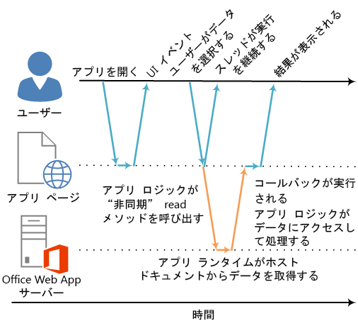

# <a name="asynchronous-programming-in-office-add-ins"></a>Office アドインにおける非同期プログラミング

Office アドイン API で非同期プログラミングを使用する理由 JavaScript はシングルスレッドの言語であるため、スクリプトで実行時間の長い同期プロセスが呼び出されると、そのプロセスが完了するまで後続のすべてのスクリプト実行がブロックされます。Office Web クライアント (リッチ クライアントも同様) に特定の操作を同時に実行した場合、実行がブロックされることがあるので、JavaScript API for Office のほとんどのメソッドは非同期で実行されるように設計されています。これにより、Office アドインの応答性とパフォーマンスが向上します。このような非同期メソッドを利用するときは、多くの場合、コールバック関数の記述も必要です。

[Document.getSelectedDataAsync](http://dev.office.com/reference/add-ins/shared/document.getselecteddataasync) メソッド、[Binding.getDataAsync](http://dev.office.com/reference/add-ins/shared/binding.getdataasync) メソッド、または [Item.loadCustomPropertiesAsync](http://dev.office.com/reference/add-ins/outlook/Office.context.mailbox.item) メソッドなど、API の非同期メソッドの名前はすべて "Async" で終わります。"Async" メソッドは呼び出されるとすぐに実行され、後続のスクリプトも続けて実行することができます。"Async" メソッドに渡す任意のコールバック関数は、データまたは要求された操作の準備が整い次第、すぐに実行されます。コールバック関数の実行は通常、直ちに行われますが、戻るまでに若干の遅延が生じることがあります。

次の図は、サーバーベースの Word Online または Excel Online で開いたドキュメントでユーザーが選択したデータを読み込む "Async" メソッドの呼び出しを実行するフローを示したものです。"Async" が呼び出された時点で、JavaSript 実行スレッドは自由にクライアント側の追加処理を実行できます。(ただし、この追加処理は図に示されていません。) "Async" メソッドが戻ると、コールバックはスレッドの実行を再開します。アドインはデータにアクセスし、それで何らかの操作を行い、結果を表示できます。Word 2013 や Excel 2013 など、Office リッチ クライアント ホスト アプリケーションを使用しているときは、同じ非同期実行パターンが当てはまります。

**図 1.非同期プログラミング実行フロー**




リッチ クライアントと Web クライアントの両方でこの非同期設計をサポートすることは、Office アドイン開発モデルの "write once-run cross-platform (一度書けばどんなプラットフォームでも動く)" 設計目的の一部です。たとえば、Excel 2013 と Excel Online の両方で実行されるシングル コード ベースのコンテンツ アドインまたは作業ウィンドウ アドインを作成できます。

## <a name="writing-the-callback-function-for-an-async-method"></a>"Async" メソッドのコールバック関数を記述する


"Async" メソッドに _callback_ 引数として渡すコールバック関数では、コールバック関数の実行時にアドインのランタイムが [AsyncResult](http://dev.office.com/reference/add-ins/shared/asyncresult) オブジェクトへのアクセスを提供するために使用する 1 つのパラメーターを宣言する必要があります。次を記述できます。


- "Async" メソッドの  _callback_ パラメーターとして "Async" メソッドの呼び出しと共にインラインで記述し、直接渡す必要がある匿名関数。
    
- "Async" メソッドの  _callback_ パラメーターとしてその関数の名前を渡す、名前付き関数。
    
匿名関数は、そのコードを一度だけ使用する場合に便利です。関数には名前がないため、コードの別の部分で参照できないためです。名前付き関数は、複数の "Async" メソッドにコールバック関数を再利用する場合に便利です。


### <a name="writing-an-anonymous-callback-function"></a>匿名コールバック関数を記述する

次の匿名のコールバック関数により `result` という名前のパラメーターが宣言されます。このパラメーターは、コールバックが戻るときに [AsyncResult.value](http://dev.office.com/reference/add-ins/shared/asyncresult.status) プロパティからデータを取得します。


```js
function (result) {
        write('Selected data: ' + result.value);
}
```

次の例は、完全な "Async" メソッドが  **Document.getSelectedDataAsync** メソッドを呼び出すときにインラインでこの匿名のコールバック関数を渡す仕組みを示しています。


- 最初の  _coercionType_ 引数である `Office.CoercionType.Text` は、選択されているデータをテキストの文字列として返すように指定します。
    
- 2 つ目の  _callback_ 引数は、メソッドにインラインで渡される匿名関数です。この関数が実行されるとき、 _result_ パラメーターを使用して **AsyncResult** オブジェクトの **value** プロパティにアクセスし、ドキュメントでユーザーが選択したデータを表示します。
    


```js
Office.context.document.getSelectedDataAsync(Office.CoercionType.Text, 
    function (result) {
        write('Selected data: ' + result.value);
    }
});

// Function that writes to a div with id='message' on the page.
function write(message){
    document.getElementById('message').innerText += message; 
}
```

またコールバック関数のパラメーターを使用して、**AsyncResult** オブジェクトのその他のプロパティにアクセスすることもできます。呼び出しの成功または失敗を判断する場合は [AsyncResult.status](http://dev.office.com/reference/add-ins/shared/asyncresult.error) プロパティを使用します。呼び出しが失敗した場合は [AsyncResult.error](http://dev.office.com/reference/add-ins/shared/asyncresult.context) プロパティを使用して [Error](http://dev.office.com/reference/add-ins/shared/error) オブジェクトにアクセスし、エラーの詳細を確認できます。

**getSelectedDataAsync** メソッドの使用の詳細については、「[ドキュメントまたはスプレッドシート内のアクティブな選択範囲へのデータの読み取りおよび書き込み](../../docs/develop/read-and-write-data-to-the-active-selection-in-a-document-or-spreadsheet.md)」を参照してください。 


### <a name="writing-a-named-callback-function"></a>名前付き関数を記述する

または、名前付き関数を記述し、その名前を "Async" メソッドの  _callback_ パラメーターに渡すことができます。たとえば、前の例は次のように `writeDataCallback` という名前の関数を _callback_ パラメーターとして渡すように書き換えることができます。


```js
Office.context.document.getSelectedDataAsync(Office.CoercionType.Text, 
    writeDataCallback);

// Callback to write the selected data to the add-in UI.
function writeDataCallback(result) {
    write('Selected data: ' + result.value);
}

// Function that writes to a div with id='message' on the page.
function write(message){
    document.getElementById('message').innerText += message; 
}
```


## <a name="differences-in-whats-returned-to-the-asyncresultvalue-property"></a>AsyncResult.value プロパティに返される内容の違い


**AsyncResult** オブジェクトの **asyncContext** プロパティ、**status** プロパティ、および **error** プロパティは、すべての "Async" メソッドに渡されるコールバック関数に同じ種類の情報を返します。ただし、**AsyncResult.value** プロパティに返される内容は "Async" メソッドの機能によって異なります。

たとえば、(**Binding** オブジェクト、 [CustomXmlPart](http://dev.office.com/reference/add-ins/shared/binding) オブジェクト、 [Document](http://dev.office.com/reference/add-ins/shared/customxmlpart.customxmlpart) オブジェクト、 [RoamingSettings](http://dev.office.com/reference/add-ins/shared/document) オブジェクト、および [Settings](http://dev.office.com/reference/add-ins/outlook/RoamingSettings) オブジェクトの) [addHandlerAsync](http://dev.office.com/reference/add-ins/shared/settings) メソッドは、それらのオブジェクトにより表されるアイテムにイベント ハンドラー関数を追加するために使用されます。 **AsyncResult.value** プロパティには、いずれかの **addHandlerAsync** メソッドに渡すコールバック関数からアクセスできますが、イベント ハンドラーを追加すると、データまたはオブジェクトはアクセスされないため、アクセスを試行すると **value** プロパティは常に **undefined** を返します。

一方で、**Document.getSelectedDataAsync** メソッドを呼び出すと、ドキュメントでユーザーが選択したデータがコールバックの **AsyncResult.value** プロパティに返されます。あるいは、[Bindings.getAllAsync](http://dev.office.com/reference/add-ins/shared/bindings.getallasync) メソッドを呼び出すと、ドキュメントですべての **Binding** オブジェクトの配列が返されます。また、[Bindings.getByIdAsync](http://dev.office.com/reference/add-ins/shared/bindings.getbyidasync) メソッドを呼び出すと、**Binding** オブジェクトが 1 つ返されます。

"Async" メソッドの**AsyncResult.value** プロパティに返される内容の説明については、そのメソッドの参照トピックの「コールバック値」セクションを参照してください。"Async" メソッドを提供するすべてのオブジェクトの概要については、[AsyncResult](http://dev.office.com/reference/add-ins/shared/asyncresult) オブジェクト トピックの下にある表を参照してください。


## <a name="asynchronous-programming-patterns"></a>非同期プログラミング パターン


JavaScript API for Office は 2 種類の非同期プログラミング パターンをサポートします。


- 入れ子のコールバックの使用
    
- promise パターンの使用
    
コールバック関数のある非同期プログラミングでは、多くの場合、2 つ以上のコールバック内に 1 つのコールバックで返された結果を入れ子にすることが必要となります。その場合、API のすべての "Async" メソッドからの入れ子のコールバックを使用できます。

入れ子のコールバックを使用することは、ほとんどの JavaScript 開発者にとってなじみのあるプログラミング パターンですが、コールバックが深い入れ子になっているコードは読みにくく、理解しにくいものです。入れ子のコールバックの代替として、JavaScript API for Office は promise パターンの実装もサポートします。ただし、JavaScript API for Office の現在のバージョンでは、promise パターンは [Excel ワークシートと Word 文書のバインディング](../../docs/develop/bind-to-regions-in-a-document-or-spreadsheet.md)のコードのみで使用できます。

<a name="AsyncProgramming_NestedCallbacks" />
### <a name="asynchronous-programming-using-nested-callback-functions"></a>入れ子のコールバック関数を使用する非同期プログラミング


多くの場合、タスクを完了するには、2 つ以上の非同期操作を実行する必要があります。これを実現するために、1 つの "Async" 呼び出し内で別の呼び出しを入れ子にできます。 

次のコード例では、2 つの非同期呼び出しを入れ子にしています。 


- 最初に、[Bindings.getByIdAsync](http://dev.office.com/reference/add-ins/shared/bindings.getbyidasync) メソッドが呼び出され、"MyBinding" という名前のドキュメントのバインドにアクセスします。そのコールバックの `result` パラメーターに返された **AsyncResult** オブジェクトは、**AsyncResult.value** プロパティから指定されたバインド オブジェクトへのアクセスを提供します。
    
- 次に、最初の `result` パラメーターからアクセスされるバインド オブジェクトを使用して、[Binding.getDataAsync](http://dev.office.com/reference/add-ins/shared/binding.getdataasync) メソッドを呼び出します。
    
- 最後に、 **Binding.getDataAsync** メソッドに渡されるコールバックの `result2` パラメーターを使用し、バインドのデータを表示します。
    


```js
function readData() {
    Office.context.document.bindings.getByIdAsync("MyBinding", function (result) {
        result.value.getDataAsync({ coercionType: 'text' }, function (result2) {
            write(result2.value);
        });
    });
}

// Function that writes to a div with id='message' on the page.
function write(message){
    document.getElementById('message').innerText += message; 
}
```

この基本の入れ子のコールバック パターンは JavaScript API for Office のすべての非同期メソッドに使用できます。

次のセクションでは、非同期メソッドの入れ子のコールバックで匿名関数または名前付き関数を使用する方法を示します。


#### <a name="using-anonymous-functions-for-nested-callbacks"></a>入れ子のコールバックとして匿名関数を使用する

次の例では、2 つの匿名関数がインラインで宣言され、入れ子のコールバックとして  **getByIdAsync** メソッドと **getDataAsync** メソッドに渡されます。関数は単純でインラインのため、実装の意図は明白です。


```js
Office.context.document.bindings.getByIdAsync('myBinding', function (bindingResult) {
    bindingResult.value.getDataAsync(function (getResult) {
        if (getResult.status == Office.AsyncResultStatus.Failed) {
            write('Action failed. Error: ' + asyncResult.error.message);
        } else {
            write('Data has been read successfully.');
        }
    });
});

// Function that writes to a div with id='message' on the page.
function write(message){
    document.getElementById('message').innerText += message; 
}
```


#### <a name="using-named-functions-for-nested-callbacks"></a>入れ子のコールバックとして名前付き関数を使用する

複雑な実装の場合、名前付き関数を使用すると、読みやすく、保守管理がしやすく、再利用しやすくなります。次の例では、前のセクションの例における 2 つの匿名関数が、 `deleteAllData` と `showResult` という名前の関数に書き換えられています。これらの名前付き関数は、名前を使用してコールバックとして **getByIdAsync** メソッドと **deleteAllDataValuesAsync** メソッドに渡されます。


```js
Office.context.document.bindings.getByIdAsync('myBinding', deleteAllData);

function deleteAllData(asyncResult) {
    asyncResult.value.deleteAllDataValuesAsync(showResult);
}

function showResult(asyncResult) {
    if (asyncResult.status == Office.AsyncResultStatus.Failed) {
        write('Action failed. Error: ' + asyncResult.error.message);
    } else {
        write('Data has been deleted successfully.');
    }
}

// Function that writes to a div with id='message' on the page.
function write(message){
    document.getElementById('message').innerText += message; 
}
```


### <a name="asynchronous-programming-using-the-promises-pattern-to-access-data-in-bindings"></a>promise パターンを使用してバインドのデータにアクセスする非同期プログラミング


コールバック関数を渡し、その関数が戻るのを待ってから実行を続行する代わりに、promise プログラミング パターンを使用すれば、その意図した結果を表す promise オブジェクトがすぐに返されます。ただし、本物の同期プログラミングとは異なり、実際には Office アドインのランタイム環境が要求を完了できるまでは、約束された結果の履行は実際には延期されます。要求が履行されない状況に対処するために _onError_ ハンドラーが用意されています。

JavaScript API for Office には [Office.select](http://dev.office.com/reference/add-ins/shared/office.select) メソッドが用意されており、既存のバインド オブジェクトと連携するための promise パターンをサポートします。**Office.select** メソッドに返される promise オブジェクトは、[Binding](http://dev.office.com/reference/add-ins/shared/binding) オブジェクトから直接アクセスできる 4 つのメソッド ([getDataAsync](http://dev.office.com/reference/add-ins/shared/binding.getdataasync)、[setDataAsync](http://dev.office.com/reference/add-ins/shared/binding.setdataasync)、[addHandlerAsync](http://dev.office.com/reference/add-ins/shared/asyncresult.value)、および [removeHandlerAsync](http://dev.office.com/reference/add-ins/shared/binding.removehandlerasync)) のみをサポートします。

バインドと連携する promise パターンは次のような形式になります。

 **Office.select(**_selectorExpression_,  _onError_**).**_BindingObjectAsyncMethod_

_selectorExpression_ パラメーターは `"bindings#bindingId"` という形式をとります。_bindingId_ は (**Bindings** コレクション: **addFromNamedItemAsync**、**addFromPromptAsync**、**addFromSelectionAsync** の "addFrom" メソッドの 1 つを利用して) 以前に文書またはワークシートに作成したバインドの名前 (**id**) です。たとえば、セレクター式 `bindings#cities` の場合、'cities' という **id** を持ったバインドにアクセスすることが指定されます。

_onError_ パラメーターは **AsyncResult** 型の 1 つのパラメーターを受け取るエラー処理関数であり、**select** メソッドで指定のバインドにアクセスできなかった場合に **Error** オブジェクトにアクセスするために使用できます。次の例は、_onError_パラメーターに渡すことができる基本的なエラー処理関数を示しています。


```js
function onError(result){
    var err = result.error;
    write(err.name + ": " + err.message);
}
// Function that writes to a div with id='message' on the page.
function write(message){
    document.getElementById('message').innerText += message; 
}
```

_BindingObjectAsyncMethod_ プレースホルダーを、promise オブジェクトでサポートされる 4 つの **Binding** オブジェクト メソッド (**getDataAsync**、**setDataAsync**、**addHandlerAsync**、または **removeHandlerAsync**) のいずれかの呼び出しで置換します。これらのメソッドの呼び出しでは追加の promise がサポートされません。これらは[入れ子のコールバック関数パターン](../../docs/develop/asynchronous-programming-in-office-add-ins.md#AsyncProgramming_NestedCallbacks)を使用して呼び出す必要があります。

**Binding** オブジェクトの promise が履行されたら、バインドのようにつながっているメソッド呼び出しで再利用できます (アドインのランタイムが非同期で再試行し、promise を履行することはありません)。**Binding** オブジェクトの promise を履行できない場合、次にその非同期メソッドの 1 つが呼び出されたとき、アドインのランタイムがバインド オブジェクトへのアクセスを再試行します。

次のコード例では、**select** メソッドを使用して、"`cities`" という **id** を持つバインドを **Bindings** コレクションから取得します。その後、[addHandlerAsync](http://dev.office.com/reference/add-ins/shared/asyncresult.value) メソッドを呼び出して、そのバインドの [dataChanged](http://dev.office.com/reference/add-ins/shared/binding.bindingdatachangedevent) イベントのイベント ハンドラーを追加します。


```js
function addBindingDataChangedEventHandler() {
    Office.select("bindings#cities", function onError(){/* error handling code */}).addHandlerAsync(Office.EventType.BindingDataChanged,
    function (eventArgs) {
        doSomethingWithBinding(eventArgs.binding);
    });
}

```


 >**重要:****Office.select** メソッドにより返された **Binding** オブジェクトの promise は **Binding** オブジェクトの 4 つのメソッドにのみアクセスを提供します。**Binding** オブジェクトのその他のメンバーにアクセスする必要がある場合、代わりに **Document.bindings** プロパティと **Bindings.getByIdAsync** メソッドまたは **Bindings.getAllAsync** メソッドを使用し、**Binding** オブジェクトを取得する必要があります。たとえば、**Binding** オブジェクトのプロパティ (**document** プロパティ、**id** プロパティ、**type** プロパティ) にアクセスする必要がある場合、または [MatrixBinding](http://dev.office.com/reference/add-ins/shared/binding.matrixbinding) オブジェクトまたは [TableBinding](http://dev.office.com/reference/add-ins/shared/binding.tablebinding) オブジェクトのプロパティにアクセスする必要がある場合、**getByIdAsync** メソッドまたは **getAllAsync** メソッドを使用して **Binding** オブジェクトを取得する必要があります。


## <a name="passing-optional-parameters-to-asynchronous-methods"></a>オプションのパラメーターを非同期メソッドに渡す


すべての "Async" メソッドの一般的な構文は、次のパターンに従います。

 _AsyncMethod_ `(`_RequiredParameters_`, [`_OptionalParameters_`],`_CallbackFunction_`);`

すべての非同期メソッドは、オプションのパラメーターをサポートします。これらは、1 つまたは複数のオプションのパラメーターが格納された JavaScript Object Notation (JSON) オブジェクトとして渡されます。オプションのパラメーターを格納している JSON オブジェクトは、キーと値のペアの順不同のコレクションで、キーと値は ":" 文字で区切られています。オブジェクト内の各ペアはコンマで区切られ、ペアのセット全体はかっこで囲まれます。キーはパラメーター名で、値はそのパラメーターに渡す値です。

オプションのパラメーターが格納される JSON オブジェクトはインラインで作成するか、 `options` オブジェクトを作成し、それを _options_ パラメーターとして渡すことによって作成できます。


### <a name="passing-optional-parameters-inline"></a>オプションのパラメーターをインラインで渡す

たとえば、オプションのパラメーターをインラインで指定して [Document.setSelectedDataAsync](http://dev.office.com/reference/add-ins/shared/document.setselecteddataasync) メソッドを呼び出す場合の構文は、次のようになります。

```js
 Office.context.document.setSelectedDataAsync(data, {coercionType: 'coercionType', asyncContext:' asyncContext},callback);

```

この呼び出し構文では、 _coercionType_ および _asyncContext_ という 2 つのオプションのパラメーターが、かっこで囲まれてインラインで JSON オブジェクトとして定義されています。

次の例は、オプションのパラメーターをインラインで指定して **Document.setSelectedDataAsync** メソッドを呼び出す方法を示しています。


```js
Office.context.document.setSelectedDataAsync(
    "<html><body>hello world</body></html>",
    {coercionType: "html", asyncContext: 42},
    function(asyncResult) {
        write(asyncResult.status + " " + asyncResult.asyncContext);
    }
)

// Function that writes to a div with id='message' on the page.
function write(message){
    document.getElementById('message').innerText += message; 
}
```


> **メモ:**オプションのパラメーターは、名前さえ正しければ、任意の順序で JSON オブジェクトに指定できます。


### <a name="passing-optional-parameters-in-an-options-object"></a>オプションのパラメーターを options オブジェクトで渡す

別の方法として、メソッド呼び出しとは別に、オプションのパラメーターを指定する  `options` という名前のオブジェクトを作成し、その `options` オブジェクトを _options_ 引数として渡すことができます。

次の例は、 `options` オブジェクトを作成する 1 つの方法を示しています。ここで、 `parameter1`、 `value1` などは、実際のパラメーター名と値で置き換えるプレースホルダーです。


```js
var options = {
    parameter1: value1,
    parameter2: value2,
    ...
    parameterN: valueN
};

```

[ValueFormat](http://dev.office.com/reference/add-ins/shared/valueformat-enumeration) パラメーターおよび [FilterType](http://dev.office.com/reference/add-ins/shared/filtertype-enumeration) パラメーターを指定する場合は次のようになります。


```js
var options = {
    valueFormat: "unformatted",
    filterType: "all"
};
```

次の方法で  `options` オブジェクトを作成することもできます。


```js
var options = {};
options[parameter1] = value1;
options[parameter2] = value2;
...
options[parameterN] = valueN;
```

**ValueFormat** パラメーターおよび **FilterType** パラメーターを指定する場合は次のようになります。


```js
var options = {};
options["ValueFormat"] = "unformatted";
options["FilterType"] = "all";
```


 >**メモ**  どちらかの方法で  `options` オブジェクトを作成するときは、名前さえ正しければ、オプションのパラメーターを任意の順序で指定できます。

次の例は、オプションのパラメーターを  `options` オブジェクトで指定して **Document.setSelectedDataAsync** メソッドを呼び出す方法を示しています。


```js
var options = {
   coercionType: "html",
   asyncContext: 42
};

document.setSelectedDataAsync(
    "<html><body>hello world</body></html>",
    options,
    function(asyncResult) {
        write(asyncResult.status + " " + asyncResult.asyncContext);
    }
)

// Function that writes to a div with id='message' on the page.
function write(message){
    document.getElementById('message').innerText += message; 
}
```


どちらのオプションのパラメーター例でも、_callback_ パラメーターが最後のパラメーターとして (インラインのオプションのパラメーターまたは _options_ 引数オブジェクトに続けて) 指定されています。_callback_ パラメーターは、インライン JSON オブジェクトの中で、または `options` オブジェクト内で指定することもできます。ただし、_callback_ パラメーターを渡せるのは _options_ オブジェクト (インラインまたは外部で作成) または最後のパラメーターのどちらか一方であり、両方に渡すことはできません。


## <a name="additional-resources"></a>その他のリソース


- [JavaScript API for Office について](../../docs/develop/understanding-the-javascript-api-for-office.md)
    
- [JavaScript API for Office](http://dev.office.com/reference/add-ins/javascript-api-for-office)
     
