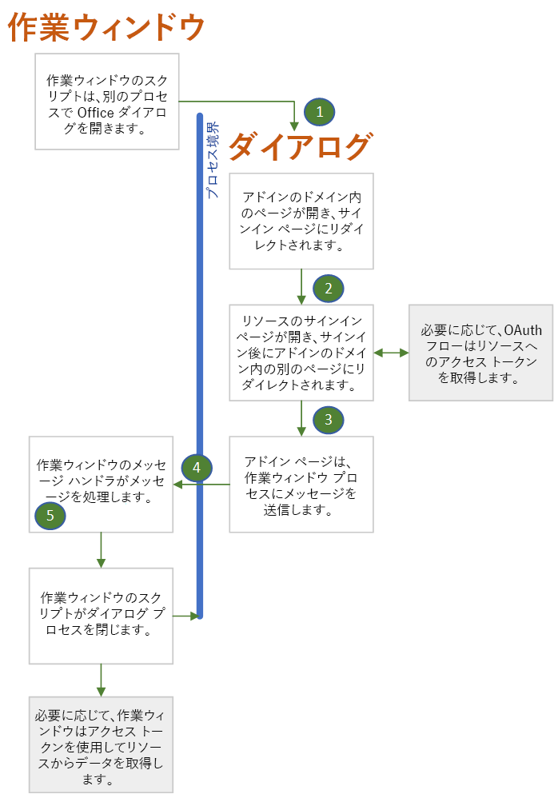

# Office ダイアログ API を使用して認証および承認する

Secure Token Services (STS) とも呼ばれる多くの ID 機関では、ログイン ページが iframe で開かれないようになっています。 これらには、Google、Facebook、および Microsoft アカウントや Office 365 (職場または学校のアカウント) などの Microsoft ID プラットフォーム (以前の Azure AD V 2.0) に保護されているサービスが含まれます。 アドインが **Office on the web** で実行される場合は、作業ウィンドウは iframe になるため、Office アドインに問題が発生します。 完全に異なるブラウザー インスタンスを開くことがアドインで可能な場合は、アドインのユーザーがログインできるのはこれらのサービスのうち 1 つのみです。 Office で[Office ダイアログ API](dialog-api-in-office-add-ins.md)、特に [displayDialogAsync](/javascript/api/office/office.ui) メソッドが提供されているのはこの理由からです。

> [!NOTE]
> この記事は、[Office アドインでの Office ダイアログ API の使用](dialog-api-in-office-add-ins.md)に精通していることを前提としています。

この API を使用して表示されるダイアログ ボックスには、次の特徴があります。

- [モードレス](https://en.wikipedia.org/wiki/Dialog_box)です。
- これは作業ウィンドウとは完全に異なるブラウザー インスタンスで、次のことを意味します。
  - 独自の JavaScript ランタイム環境ならびにウィンドウ オブジェクトおよびグローバル変数を持ちます。
  - 作業ウィンドウと共有される実行環境はありません。
  - 同じセッション ストレージは作業ウィンドウとは共有されません。
- ダイアログ ボックスで開かれる最初のページは、作業ウィンドウと同じドメイン (該当する場合は、プロトコル、サブドメイン、およびポートを含む) でホストされる必要があります。
- ダイアログ ボックスは [messageparent](/javascript/api/office/office.ui#messageparent-message-) メソッドを使用して作業ウィンドウに情報を返すことができますが、このメソッドは、作業ウィンドウと同じドメイン (プロトコル、サブドメイン、およびポートを含む) にホストされているページからのみ呼び出すことができます。

ダイアログ ボックスが iframe (既定) ではない場合、ID プロバイダーのログイン ページを開くことができます。 次に示すように、Office ダイアログ ボックスの特性は、MSAL や Passport などの認証ライブラリまたは承認ライブラリの使用方法に影響します。

> [!NOTE]
> 浮動 iframe で開くようにダイアログ ボックスを構成する方法があります。呼び出しの `displayInIframe: true` オプションを `displayDialogAsync` に渡すだけです。 ログインに Office ダイアログ API を使用している場合は、この方法を使用*しない*でください。

## Office ダイアログ ボックスの認証フロー

シンプルで標準的な認証フローを下に示します。 図の下に詳細の説明があります。

1. ダイアログ ボックスで開かれる最初のページは、アドインのドメイン (つまり作業ウィンドウと同じドメイン) でホストされているページ (または他のリソース) です。 このページには、"*プロバイダー名* にサインインできるページにリダイレクトしていますので、お待ちください。" という簡単な UI を含めることができます。 このページのコードは、ダイアログ ボックスに渡される情報 (「[情報をダイアログ ボックスに渡す](dialog-api-in-office-add-ins.md#pass-information-to-the-dialog-box)」で説明されています) またはアドインの構成ファイル (web.config ファイルなど) にハードコーディングされている情報を使用して ID プロバイダーのサインイン ページの URL を構築します。
2. 次に、ダイアログ ボックス ウィンドウはサインイン ページにリダイレクトします。 URL には、ユーザーがサインインしたらダイアログ ボックス ウィンドウを特定のページにリダイレクトするように ID プロバイダーに指示するクエリ パラメーターが含まれています。 この記事では、このページを **redirectPage.html** と呼びます。 *このページはホスト ウィンドウと同じドメインにある必要があります*。これは、`messageParent` の呼び出しを使用してサインインの試みの結果を作業ウィンドウに渡せるようにするためです。
3. ID プロバイダーのサービスは、ダイアログ ボックス ウィンドウから受信する GET 要求を処理します。 ユーザーが既にサインインしている場合は、ウィンドウが直ちに **redirectPage.html** にリダイレクトされ、クエリ パラメーターとしてユーザー データが含まれます。 ユーザーがまだサインインしていない場合は、プロバイダーのサインイン ページがウィンドウに表示されます。ユーザーはサインインします。 ほとんどのプロバイダーでは、ユーザーが正常にサインインできない場合、プロバイダーはダイアログ ボックス ウィンドウにエラー ページを表示して、**redirectPage.html** にはリダイレクトしません。 ユーザーは隅にある **X** を選択して、ウィンドウを閉じる必要があります。 ユーザーが正常にサインインした場合は、ダイアログ ボックス ウィンドウが **redirectPage.html** にリダイレクトされ、ユーザー データはクエリ パラメーターとして含まれます。
4. **redirectPage.html** ページが開くと、成功または失敗を作業ウィンドウ ページに報告するために `messageParent` が呼び出され、ユーザー データまたはエラー データも必要に応じて報告されます。 その他のメッセージには、アクセス トークンの受け渡しや、トークンがストレージにあるという作業ウィンドウへの伝達が含まれます。
5. `DialogMessageReceived` イベントが作業ウィンドウ ページで発生し、イベントのハンドラーによりダイアログ ボックス ウィンドウが閉じられ、メッセージはさらに処理される可能性があります。

#### 複数の ID プロバイダーのサポート

アドインによってユーザーが Microsoft アカウント、Google、Facebook などのプロバイダーを選択できる場合は、ユーザーがプロバイダーを選択するための UI を提供するローカルの最初のページ (前述のセクションを参照) が必要です。選択すると、サインイン URL とその URL へのリダイレクトの構築がトリガーされます。

#### 外部リソースへのアドインの承認

最新の Web において、ユーザーと Web アプリケーションはセキュリティ プリンシパルです。 アプリケーションには、Office 365、Google+、Facebook、LinkedIn などのオンライン リソースに対する独自の ID とアクセス許可があります。 アプリケーションは、展開前にリソース プロバイダーに登録されます。 登録には以下が含まれています。

- アプリケーションが必要とするアクセス許可の一覧。
- アプリケーションがサービスにアクセスするときに、リソース サービスがアクセス トークンを返す宛先の URL。  

リソース サービスのユーザーのデータにアクセスするアプリケーションでユーザーが関数を呼び出すと、ユーザーはサービスにサインインするように求められ、アプリケーションが必要とするユーザーのリソースへのアクセス許可をアプリケーションに付与するように求められます。次に、サービスはサインイン ウィンドウを既に登録済みの URL にリダイレクトし、アクセス トークンを渡します。アプリケーションはアクセス トークンを使用して、ユーザーのリソースにアクセスします。

このプロセスは Office ダイアログ API を使用して管理でき、これを行うにはユーザーのサインインについての説明でのフローと似たフローを使用します。 次の点のみが違います。

- アプリケーションが必要とするアクセス許可を、ユーザーがアプリケーションに付与したことがない場合、ユーザーがサインインすると、これを実行するよう求めるメッセージがダイアログ ボックスに表示されます。
- ダイアログ ボックス ウィンドウは、`messageParent` を使用して文字列に変換されたアクセス トークンを送信するか、またはホスト ウィンドウがアクセス トークンを取得できる場所にアクセス トークンを格納 (し、トークンが使用可能であることを `messageParent` を使用してホスト ウィンドウに伝達 )することで、アクセス トークンをホスト ウィンドウに送信します。 トークンには制限時間がありますが、制限時間内であれば追加のメッセージを表示することなく、ホスト ウィンドウはトークンを使用して、ユーザーのリソースに直接アクセスできます。

この目的のために Office ダイアログ API を使用するサンプル認証アドインが「[サンプル](#samples)」にいくつか記載されています。

## ダイアログ ボックスでの認証ライブラリの使用

Office ダイアログ ボックスと作業ウィンドウが異なるブラウザー、JavaScript ランタイム、およびインスタンスで実行されるということは、認証と承認が同じウィンドウで行われる場合の使用方法とは異なる方法で、多くの認証ライブラリまたは承認ライブラリを使用する必要があることを意味します。 次のセクションでは、通常はこれらのライブラリを使用できない主な方法と、これらのライブラリを使用*できる*方法について説明します。

### 多くの場合、トークンを格納するのにライブラリの内部キャッシュは使用できません。

通常、認証関連のライブラリでは、アクセス トークンを格納するためのメモリ内のキャッシュが提供されています。 その後に (Google、Microsoft Graph、Facebook などの) リソース プロバイダーに対する呼び出しが行われると、ライブラリは最初にライブラリのキャッシュ内のトークンの有効期限を確認します。 有効期限が切れていない場合、ライブラリは新しいトークンのために STS に新たにラウンドトリップを行うのではなく、キャッシュされたトークンを返します。 ただし、このパターンは Office アドインでは使用できません。ログインは Office ダイアログ ボックスのブラウザー インスタンスで発生するため、トークン キャッシュはそのインスタンスにあります。

これと密接に関連するのは、ライブラリは通常、トークンを取得するための方法として対話型のメソッドと "サイレント" メソッドの両方を提供しているということです。 リソースに対しての認証とデータの呼び出しの両方を同じブラウザー インスタンス内で行うことができる場合、コードは、トークンを取得するためにコードがトークンをデータの呼び出しに追加する直前にサイレント メソッドを呼び出します。 サイレント メソッドは期限が切れていないトークンがあるかどうかキャッシュを確認し、あった場合はトークンを返します。 それ以外の場合は、サイレント メソッドは対話型のメソッドを呼び出し、対話型のメソッドは STS のログインにリダイレクトします。 ログインが完了すると、対話型のメソッドはトークンを返しますが、トークンはメモリにもキャッシュされます。 ただし、Office ダイアログ API を使用している場合は、リソースへのデータ呼び出し (これは、サイレント メソッドを呼び出します) は、作業ウィンドウのブラウザー インスタンスにあります。 ライブラリのトークン キャッシュはそのインスタンスに存在しません。

別の方法として、アドインのダイアログ ボックス ブラウザー インスタンスは、ライブラリの対話型のメソッドを直接呼び出すことができます。 このメソッドがトークンを返した場合、コードはトークンを作業ウィンドウのブラウザー インスタンスがそれを取得できる場所 (ローカル ストレージ \* やサーバー側のデータベースなど) に明示的に格納する必要があります。 別の方法としては、`messageParent` メソッドを使用してトークンを作業ウィンドウに渡す方法があります。 この方法は、対話型のメソッドが、アクセス トークンをコードが読み取ることができる場所に格納している場合にのみ可能です。 ライブラリの対話型メソッドは、コードがアクセスできないオブジェクトのプライベート プロパティにトークンを格納するように作られている場合があります。

> [!NOTE]
> \* トークン処理の戦略に影響を与えるバグがあります。 Safari または Microsoft Edge ブラウザーの **Office on the web** でアドインを実行している場合、ダイアログ ボックスとタスク ウィンドウは同じローカル ストレージを共有しないため、これらの間の通信に使用できません。

### 通常、ライブラリの "認証コンテキスト" オブジェクトは使用できません。

多くの場合、認証関連のライブラリには、トークンの対話的な取得と、メソッドが返す "認証コンテキスト" オブジェクトの作成の両方を行うメソッドがあります。 トークンはオブジェクトのプロパティです (プライベートで、コードから直接アクセスできない可能性があります)。 そのオブジェクトには、リソースからデータを取得するメソッドが備わっています。 これらのメソッドには、(Google、Microsoft Graph、Facebook などの) リソースプロバイダーに対して行う HTTP 要求内のトークンが含まれます。

これらの認証コンテキストオブジェクトおよびこれらのオブジェクトを作成するメソッドは、Office アドインでは使用できません。ログインは Office ダイアログ ボックスのブラウザー インスタンスで発生するため、オブジェクトはそのインスタンスで作成する必要があります。 ただし、リソースへのデータの呼び出しは作業ウィンドウのブラウザー インスタンスにあり、あるインスタンスから別のインスタンスにオブジェクトを移動する方法はありません。 たとえば、`messageParent` は文字列またはブール値のみを渡すことができるため、`messageParent` を使用してオブジェクトを渡すことはできません。 メソッドを持つ JavaScript オブジェクトは、確実には文字化できません。

### Office ダイアログ API でライブラリを使用する方法

ほとんどのライブラリでは、モノリシックの "認証コンテキスト" オブジェクトに加えてまたはその代わりとして、モノリシックの度合いがより低いヘルパー オブジェクトをコードが作成するできるようにする、抽象化レベルの低い API が提供されています。 たとえば、[MSAL.NET](https://github.com/AzureAD/microsoft-authentication-library-for-dotnet/wiki#conceptual-documentation) バージョン  3.x.x には、ログイン URL を構築する API と、コードがアクセスできるプロパティ内のアクセス トークンを格納する AuthResult オブジェクトを構築するための別の API が含まれています。 Office アドインの MSAL.NET の例については、「[Office アドイン Microsoft Graph ASP.NET](https://github.com/OfficeDev/PnP-OfficeAddins/tree/master/Samples/auth/Office-Add-in-Microsoft-Graph-ASPNET)」および「[Outlook アドイン Microsoft Graph ASP.NET](https://github.com/OfficeDev/PnP-OfficeAddins/tree/master/Samples/auth/Outlook-Add-in-Microsoft-Graph-ASPNET)」を参照してください。 アドインで [msal.js](https://github.com/AzureAD/microsoft-authentication-library-for-js) を使用する例については、「[Office アドイン Microsoft Graph React](https://github.com/OfficeDev/PnP-OfficeAddins/tree/master/Samples/auth/Office-Add-in-Microsoft-Graph-React)」を参照してください。

認証ライブラリおよび承認ライブラリの詳細については、「[Microsoft Graph: 推奨されるライブラリ](authorize-to-microsoft-graph-without-sso.md#recommended-libraries-and-samples)」および「[その他の外部サービス: ライブラリ](auth-external-add-ins.md#libraries)」を参照してください。

## サンプル

- [Office アドイン Microsoft Graph ASP.NET](https://github.com/OfficeDev/PnP-OfficeAddins/tree/master/Samples/auth/Office-Add-in-Microsoft-Graph-ASPNET): ログインおよび Microsoft Graph データのアクセス トークンの取得を MSAL.NET ライブラリと承認コード フローを使用して行う、ASP.NET ベースのアドイン (Excel、Word、PowerPoint)。
- [Outlook アドイン Microsoft Graph ASP.NET](https://github.com/OfficeDev/PnP-OfficeAddins/tree/master/Samples/auth/Outlook-Add-in-Microsoft-Graph-ASPNET): 上記のアドインと同様ですが、Office アプリケーションは Outlook です。
- [Office アドイン Microsoft Graph React](https://github.com/OfficeDev/PnP-OfficeAddins/tree/master/Samples/auth/Office-Add-in-Microsoft-Graph-React): ログインおよび Microsoft Graph データのアクセス トークンの取得を msal.js ライブラリと暗黙的フローを使用して行う、NodeJS ベースのアドイン (Excel、Word、PowerPoint)。

詳細については、以下を参照してください。
- [Office アドインで外部サービスを承認する](auth-external-add-ins.md)
- [Office アドインで Office ダイアログ API を使用する](dialog-api-in-office-add-ins.md)
