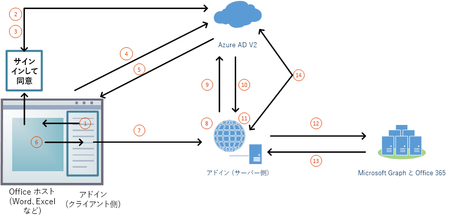

# Office アドインで  Microsoft Graph へ承認（プレビュー）

ユーザーは個人用の Microsoft アカウントまたは職場や学校の (Office 365) アカウントのいずれかを使用して、Office (オンライン、モバイル、およびデスクトップ プラットフォーム) にサインインします。 Office アドインが [Microsoft Graph](https://developer.microsoft.com/graph/docs) への承認されたアクセスを得る最善の方法は、ユーザーの Office サインオンからの認証情報を使用することです。 これにより、2 回目のサインインをせず に Microsoft Graph データにアクセスすることができます。 

> [!NOTE]
> 現在、シングル サインオン API は Word、Excel、Outlook、PowerPoint のプレビュー版がサポートしています。 シングル サインオン API の現在のサポート状態に関する詳細は、「[IdentityAPI の要件セット](https://dev.office.com/reference/add-ins/requirement-sets/identity-api-requirement-sets)」を参照してください。
> Outlook アドインで作業している場合は、Office 365 テナントの先進認証が有効になっていることを確認してください。 この方法の詳細については、「[Exchange Online: テナントの先進認証を有効にする方法](https://social.technet.microsoft.com/wiki/contents/articles/32711.exchange-online-how-to-enable-your-tenant-for-modern-authentication.aspx)」を参照してください。

## SSO と Microsoft Graph のアドイン アーキテクチャ

Web アプリケーションのページと JavaScript をホスティングすることに加え、アドインでは、同一の[完全修飾ドメイン名](https://msdn.microsoft.com/library/windows/desktop/ms682135.aspx#_dns_fully_qualified_domain_name_fqdn__gly)で、Microsoft Graph へのアクセス トークンを取得して、要求を送信するための 1 つ以上の Web API をホストする必要もあります。

アドイン マニフェストには、アドインを Azure Active Directory (Azure AD) v2.0 エンドポイントに登録する方法と、アドインが必要とする Microsoft Graph へのアクセス許可を指定するマークアップが含まれています。

### 実行時の動作のしくみ

次の図は、サインインして Microsoft Graph にアクセスするプロセスを示しています。

1. アドインでは、JavaScript は新しい Office.js API `getAccessTokenAsync` を呼び出します。 これにより、Office ホスト アプリケーションにアドインへのアクセス トークンを取得するように指示します。 （後の手順で 2 番目のトークンに置き換えられるため、以下、これを **ブートストラップ アクセス トークン** と呼びます。 デコードされたブートストラップ アクセス トークンの例については、「[アクセストークンの例](sso-in-office-add-ins.md#example-access-token)」を参照してください。）
1. ユーザーがサインインしていない場合、Office ホスト アプリケーションはユーザーにサインインを求めるポップアップ ウィンドウを開きます。
1. 現在のユーザーが初めてアドインを使用する場合は、そのユーザーに同意を求めるダイアログを表示します。
1. Office ホスト アプリケーションは、現在のユーザーについて Azure AD v2.0 エンドポイントから**ブートストラップ アクセス トークン** を要求します。
1. Azure AD は、Office ホスト アプリケーションにブートストラップ トークンを送信します。
1. Office ホスト アプリケーションは、** **  呼び出しによって返される結果オブジェクトの一部として、アドインに `getAccessTokenAsync` ブートストラップ アクセス トークン を送信します。
1. アドインの JavaScript は、アドインと同じ完全修飾ドメインでホストされている Web API に HTTP 要求を送信し、その要求に承認の証拠として **ブートストラップ アクセス トークン** を含めます。  
1. サーバー側のコードは、受信した **ブートストラップ アクセス トークン**を検証します。
1. サーバー側のコードでは、 "On-Behalf-Of" フロー（「[ OAuth トークン交換](https://tools.ietf.org/html/draft-ietf-oauth-token-exchange-02) 」および「[ デーモンまたはサーバー アプリケーション 対 Web API Azure シナリオ](https://docs.microsoft.com/azure/active-directory/develop/active-directory-authentication-scenarios#daemon-or-server-application-to-web-api)」 で定義されたもの）を使用して、ブートストラップ アクセストークンと引き換えに Microsoft Graph のアクセストークンを取得します。
1. Azure AD は、アドインに Microsoft Graph へのアクセス トークン (アドインが *offline_access* アクセス許可を要求した場合は、更新トークンも) を返します。
1. サーバー側のコードは、アクセストークンを Microsoft Graph にキャッシュします。
1. サーバー側のコードは Microsoft Graph への要求を行い、Microsoft Graph へのアクセス トークンを含みます。
1. Microsoft Graph は、アドインの UI に渡すことができるデータをアドインに返します。
1. Microsoft Graph へのアクセストークンが期限切れになると、サーバー側のコードは更新トークンを使用して Microsoft Graph への新しいアクセストークンを取得できます。

## Microsoft Graph にアクセスする SSO アドインの開発

SSO を使用する他のアドインと同様に、Microsoft Graphにアクセスするアドインを開発します。 詳細な説明については、 [Officeアドインのシングル サインオンを有効にする](https://docs.microsoft.com/office/dev/add-ins/develop/sso-in-office-add-ins)を参照してください。違いは、アドインにはサーバー側の Web API が必須であり、その記事ではアクセス トークンと呼ばれるものを「ブートストラップ アクセス トークン」と呼びます。 

使用する言語とフレームワークによっては、記述が必要なサーバー側コードを単純化することが可能なライブラリを使用できる場合があります。 コードでは次のことを行う必要があります。

* 前の手順で作成したトークン ハンドラーから受け取ったアドイン トークンを検証します。 詳細については、「[アクセス トークンを検証する](sso-in-office-add-ins.md#validate-the-access-token)」を参照してください。 
* ブートストラップ アクセス トークン、ユーザーに関するメタデータ、アドインの認証情報 (IDと秘匿情報) を含む Azure AD v2.0 エンドポイントへの呼び出しを使用して "On-Behalf-Of" フローを開始します。
* 返されたアクセス トークンを Microsoft Graph にキャッシュします。 このフローの詳細については、「[Azure Active Directory v2.0 および OAuth 2.0 On-Behalf-Of フロー](https://docs.microsoft.com/azure/active-directory/develop/active-directory-v2-protocols-oauth-on-behalf-of)」を参照してください。
* キャッシュされた アクセス トークン を Microsoft Graph に渡すことで Microsoft Graph データを取得する、 1 つ以上のWeb APIメソッドを作成します。

> [!NOTE]
> 「On-Behalf-Of」 フローで取得した Microsoft Graph のデコードされたアクセス トークンの例については、「[Azure Active Dictionary v2.0 および OAuth 2.0 On-Behalf-Of フロー](https://docs.microsoft.com/azure/active-directory/develop/active-directory-v2-protocols-oauth-on-behalf-of) 」を参照してください。

詳細なウォークスルーとシナリオは、次を参照してください。

* [シングル サインオンを使用する Node.js Office アドインを作成する](create-sso-office-add-ins-nodejs.md)
* [シングル サインオンを使用する ASP.NET Office アドインを作成する](create-sso-office-add-ins-aspnet.md)
* [シナリオ: Outlook アドインでサービスにシングル サインオンを実装する](https://docs.microsoft.com/outlook/add-ins/implement-sso-in-outlook-add-in)

