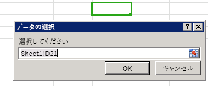

# <a name="bind-to-regions-in-a-document-or-spreadsheet"></a>ドキュメントやスプレッドシート内の領域へのバインド

バインドベースのデータ アクセスにより、コンテンツ アドインおよび作業ウィンドウ アドインは、ドキュメントまたはスプレッドシートの特定の領域に ID を通じて一貫性をもってアクセスできます。アドインは、最初に、ドキュメントの部分と一意の ID を関連付けるいずれかのメソッド ([addFromPromptAsync]、[addFromSelectionAsync]、または [addFromNamedItemAsync]) を呼び出すことによって、バインドを確立する必要があります。バインドが確立されると、アドインは提供された ID を使用して、ドキュメントまたはスプレッドシート内の関連付けられた領域に含まれるデータにアクセスできます。バインドの作成により、アドインに次の効果がもたらされます。


- 表、範囲、またはテキスト (隣接する一連の文字) など、サポートされている Office アプリケーション全体に共通のデータ構造へのアクセスを許可します。

- ユーザーによる選択を必要とせずに、読み取り/書き込み操作ができます。

- アドインとドキュメント内のデータの間にリレーションシップが確立されます。バインドはドキュメント内に保持され、後でアクセスできます。

また、バインドを確立すると、ドキュメントまたはスプレッドシートの特定の領域を範囲とする、データおよび選択範囲の変更イベントをサブスクライブできます。つまり、ドキュメントまたはスプレッドシート全体の全般的な変更ではなく、バインドされた領域内で発生する変更のみがアドインに通知されます。

[Bindings] オブジェクトの [getAllAsync] メソッドを使用すると、ドキュメントまたはスプレッドシートに設定されているすべてのバインドのセットにアクセスできます。個々のバインドには、Bindings.[getByIdAsync] メソッドまたは [Office.select] メソッドを使用して ID でアクセスできます。[Bindings] オブジェクトの [addFromSelectionAsync]、[addFromPromptAsync]、[addFromNamedItemAsync]、または [releaseByIdAsync] メソッドのいずれかを使用して、新しいバインドを設定したり、既存のバインドを削除したりできます。


## <a name="binding-types"></a>バインドの種類

[Addfromselectionasync]、 [addFromPromptAsync] 、または[addfromnameditemasync]メソッドを使用してバインドを作成する場合、 _bindingtype_パラメーターで指定する[バインドの]種類は3種類あり[ます]。

1. **[テキスト バインド][TextBinding]** - テキストとして表現できるドキュメントの領域にバインドします。

    Word では、連続する選択範囲の大部分が有効ですが、Excel では、単一セルの範囲のみがテキスト バインドの対象です。Excel では、プレーン テキストのみがサポートされます。Word では、3 つの形式 (プレーン テキスト、HTML、および Open XML for Office) がサポートされます。

2. **[マトリックスバインド][MatrixBinding] ** -ヘッダーのない表形式データが含まれるドキュメントの固定領域にバインドします。マトリックスバインド内のデータは、2次元**配列**として書き込みまたは読み取りが行われます。 JavaScript では、配列の配列として実装されています。 たとえば、2つの列の**文字列**値の2行を書き込みまたは読み込むことができ、 ` [['a', 'b'], ['c', 'd']]` 3 つの行の1つの列を書き込みまたはとして読み取ることができ `[['a'], ['b'], ['c']]` ます。

    Excel では、セルの連続する選択範囲を使用してマトリックス バインドを設定できます。Word では、表のみがマトリックス バインドをサポートします。

3. **[テーブル バインド][TableBinding]** - ヘッダーがある表が含まれるドキュメントの領域にバインドします。テーブル バインド内のデータは、[TableData](/javascript/api/office/office.tabledata) オブジェクトとして書き込みまたは読み取りが行われます。`TableData` オブジェクトは `headers` および `rows` プロパティを通じてデータを公開します。

    Excel または Word の表はすべて、テーブル バインドの基礎にできます。テーブル バインドを確立すると、ユーザーが表に追加する新しい各行または各列が、自動的にバインドに含まれます。

オブジェクトの3つの "addFrom" メソッドのいずれかを使用してバインドを作成した後は、 `Bindings` 対応するオブジェクトのメソッドである[MatrixBinding]、 [tablebinding]、または[textbinding]を使用してバインドのデータおよびプロパティを操作できます。 この 3 つのオブジェクトはすべて、[] オブジェクトの [getDataAsync] メソッドおよび `Binding` メソッドを継承しているので、バインドされたデータを操作できます。

> [!NOTE]
> **マトリックス バインドとテーブル バインドの使い分け**作業中の表形式のデータに集計行が含まれ、アドインのスクリプトが集計行の値にアクセスする必要がある場合、またはユーザーの選択が集計行にあることを検出する必要がある場合は、マトリックス バインドを使用する必要があります。集計行を含む表形式データに対するテーブル バインドを設定する場合、[TableBinding.rowCount] プロパティおよびイベント ハンドラーの [BindingSelectionChangedEventArgs] オブジェクトの `rowCount` および `startRow` プロパティは、集計行のそれらの値に反映されません。この制限を回避するには、集計行を処理するマトリックス バインドを設定する必要があります。

## <a name="add-a-binding-to-the-users-current-selection"></a>ユーザーの現在の選択範囲にバインドを追加する

次の例は、[addFromSelectionAsync] メソッドを使用して、ドキュメントの現在の選択範囲に `myBinding` というテキスト バインドを追加する方法を示しています。


```js
Office.context.document.bindings.addFromSelectionAsync(Office.BindingType.Text, { id: 'myBinding' }, function (asyncResult) {
    if (asyncResult.status == Office.AsyncResultStatus.Failed) {
        write('Action failed. Error: ' + asyncResult.error.message);
    } else {
        write('Added new binding with type: ' + asyncResult.value.type + ' and id: ' + asyncResult.value.id);
    }
});

// Function that writes to a div with id='message' on the page.
function write(message){
    document.getElementById('message').innerText += message; 
}
```

この例では、指定したバインドの種類はテキストです。つまり、選択範囲に対して [TextBinding] が作成されます。バインドが備えているデータと操作はバインドの種類ごとに異なります。[Office.BindingType] は、使用できるバインドの種類の値を示す列挙型です。

2 番目のオプションのパラメーターは、作成している新しいバインドの ID を指定するオブジェクトです。指定しない場合、ID は自動的に生成されます。

最後の _callback_ パラメーターで関数に渡される匿名関数は、バインドの作成が完了したときに実行されます。この関数の単一のパラメーター [ を通じて、呼び出しの状態を示す ]AsyncResult`asyncResult` オブジェクトにアクセスできます。`AsyncResult.value` プロパティには、新規作成するバインドとして指定した種類の [Binding] オブジェクトへの参照が格納されます。この [Binding] オブジェクトを使用して、データを取得および設定できます。

## <a name="add-a-binding-from-a-prompt"></a>プロンプトからバインドを追加する

次の例は、[addFromPromptAsync] メソッドを使用して `myBinding` という名前のテキスト バインドを追加する方法を示しています。このメソッドでは、ユーザーはアプリケーションの組み込み範囲選択プロンプトを使用してバインドの範囲を指定できます。


```js
function bindFromPrompt() {
    Office.context.document.bindings.addFromPromptAsync(Office.BindingType.Text, { id: 'myBinding' }, function (asyncResult) {
        if (asyncResult.status == Office.AsyncResultStatus.Failed) {
            write('Action failed. Error: ' + asyncResult.error.message);
        } else {
            write('Added new binding with type: ' + asyncResult.value.type + ' and id: ' + asyncResult.value.id);
        }
    });
}

// Function that writes to a div with id='message' on the page.
function write(message){
    document.getElementById('message').innerText += message;
}
```

この例では、指定されているバインドの種類はテキストです。つまり、ユーザーがプロンプトで指定した選択範囲に対して [TextBinding] が作成されます。

2 番目のパラメーターは、作成している新しいバインドの ID を含むオブジェクトです。指定しない場合、ID は自動的に生成されます。

3 番目の _callback_ パラメーターとして関数に渡される匿名関数は、バインドの作成が完了すると実行されます。コールバック関数が実行されると、[AsyncResult] オブジェクトには呼び出しのステータスおよび新しく作成されたバインドが格納されます。

図 1 は、Excel の組み込み範囲選択プロンプトを示しています。


*図 1.Excel のデータ選択 UI*




## <a name="add-a-binding-to-a-named-item"></a>名前付きアイテムにバインドを追加する


次の例は、 `myRange` [Addfromnameditemasync]メソッドを使用して、既存の名前付きアイテムへのバインドを "matrix" バインドとして追加し、そのバインドを `id` "mymatrix" として割り当てる方法を示しています。


```js
function bindNamedItem() {
    Office.context.document.bindings.addFromNamedItemAsync("myRange", "matrix", {id:'myMatrix'}, function (result) {
        if (result.status == 'succeeded'){
            write('Added new binding with type: ' + result.value.type + ' and id: ' + result.value.id);
            }
        else
            write('Error: ' + result.error.message);
    });
}

// Function that writes to a div with id='message' on the page.
function write(message){
    document.getElementById('message').innerText += message; 
}

```

**Excel**では、 `itemName` [Addfromnameditemasync]メソッドのパラメーターは、既存の名前付き範囲、参照スタイルで指定された範囲、 `A1` `("A1:A3")` またはテーブルを参照できます。 既定では、Excel のテーブルを追加すると、最初に追加したテーブルには "Table1"、次に追加したテーブルには "Table2" という名前が割り当てられます。 Excel UI でテーブルにわかりやすい名前を割り当てるには、 `Table Name` [表のツール] のプロパティを使用します。 **Table Tools | Design**リボンの [デザイン] タブ


> [!NOTE]
> Excel では、名前付きアイテムとしてテーブルを指定する場合、次の形式のテーブル名にワークシート名を含めるように、名前を完全修飾する必要があります。`"Sheet1!Table1"`

次の例では、Excel で、列 A () 内の最初の3つのセルにバインドを作成し、 `"A1:A3"` id を割り当て、 `"MyCities"` そのバインドに3つの都市名を書き込みます。


```js
 function bindingFromA1Range() {
    Office.context.document.bindings.addFromNamedItemAsync("A1:A3", "matrix", {id: "MyCities" },
        function (asyncResult) {
            if (asyncResult.status == "failed") {
                write('Error: ' + asyncResult.error.message);
            }
            else {
                // Write data to the new binding.
                Office.select("bindings#MyCities").setDataAsync([['Berlin'], ['Munich'], ['Duisburg']], { coercionType: "matrix" },
                    function (asyncResult) {
                        if (asyncResult.status == "failed") {
                            write('Error: ' + asyncResult.error.message);
                        }
                    });
            }
        });
}
// Function that writes to a div with id='message' on the page.
function write(message){
    document.getElementById('message').innerText += message; 
}
```

**Word の**場合、 `itemName` [Addfromnameditemasync]メソッドのパラメーターは、 `Title` コンテンツコントロールのプロパティを参照し `Rich Text` ます。 (`Rich Text` コンテンツ コントロール以外のコンテンツ コントロールにはバインドできません)。

既定では、コンテンツコントロールには値が割り当てられていません `Title*` 。 Word UI で意味のあるテーブル名を割り当てるには、リボンの [ **開発者**] タブの [ **コントロール**] グループから [ **リッチ テキスト**] コンテンツ コントロールを挿入した後、[ **コントロール**] グループの [ **プロパティ**] コマンドを使用して [ **コンテンツ コントロールのプロパティ**] ダイアログ ボックスを表示します。 次に、 `Title` コンテンツコントロールのプロパティを、コードから参照する名前に設定します。

次の例では、という名前のリッチテキストコンテンツコントロールに対して Word のテキストバインドを作成し、 `"FirstName"` **id** `"firstName"` を割り当て、その情報を表示します。


```js
function bindContentControl() {
    Office.context.document.bindings.addFromNamedItemAsync('FirstName', 
        Office.BindingType.Text, {id:'firstName'},
        function (result) {
            if (result.status === Office.AsyncResultStatus.Succeeded) {
                write('Control bound. Binding.id: '
                    + result.value.id + ' Binding.type: ' + result.value.type);
            } else {
                write('Error:', result.error.message);
            }
    });
}
// Function that writes to a div with id='message' on the page.
function write(message){
    document.getElementById('message').innerText += message; 
}
```

## <a name="get-all-bindings"></a>すべてのバインドを取得する


次の例は、Bindings.[getAllAsync] メソッドを使用して、ドキュメント内のすべてのバインドを取得する方法を示しています。


```js
Office.context.document.bindings.getAllAsync(function (asyncResult) {
    var bindingString = '';
    for (var i in asyncResult.value) {
        bindingString += asyncResult.value[i].id + '\n';
    }
    write('Existing bindings: ' + bindingString);
});

// Function that writes to a div with id='message' on the page.
function write(message){
    document.getElementById('message').innerText += message; 
}
```

パラメーターとして関数に渡される匿名関数 `callback` は、操作が完了したときに実行されます。 関数は、ドキュメント内のバインドの配列を含む単一のパラメーターで呼び出され `asyncResult` ます。 配列は反復処理されて、バインドの ID を含む文字列が作成されます。 この文字列がメッセージ ボックスに表示されます。


## <a name="get-a-binding-by-id-using-the-getbyidasync-method-of-the-bindings-object"></a>Bindings オブジェクトの getByIdAsync メソッドを使用して ID でバインドを取得する


次の例は、[getByIdAsync] メソッドを使用し、ID を指定してドキュメント内のバインドを取得する方法を示しています。この例では、前述のメソッドのいずれかを使用して `'myBinding'` という名前のバインドがドキュメントに追加されたと想定しています。


```js
Office.context.document.bindings.getByIdAsync('myBinding', function (asyncResult) {
    if (asyncResult.status == Office.AsyncResultStatus.Failed) {
        write('Action failed. Error: ' + asyncResult.error.message);
    } 
    else {
        write('Retrieved binding with type: ' + asyncResult.value.type + ' and id: ' + asyncResult.value.id);
    }
});

// Function that writes to a div with id='message' on the page.
function write(message){
    document.getElementById('message').innerText += message; 
}
```

この例では、最初の `id` パラメーターは取得するバインドの ID です。

2番目の_callback_パラメーターとして関数に渡される匿名関数は、操作が完了したときに実行されます。 この関数は、呼び出しのステータスおよび ID が "myBinding" であるバインドが格納される _asyncResult_ という 1 つのパラメーターを使用して呼び出されます。


## <a name="get-a-binding-by-id-using-the-select-method-of-the-office-object"></a>Office オブジェクトの select メソッドを使用して ID でバインドを取得する


次の例は、[Office.select] メソッドを使用してセレクター文字列に ID を指定することによって、ドキュメント内の [Binding] オブジェクトの promise を取得する方法を示しています。その後、Binding.[getDataAsync] メソッドを呼び出して、指定したバインドからデータを取得します。この例では、前述のメソッドのいずれかを使用して `'myBinding'` という名前のバインドがドキュメントに追加されたと想定しています。


```js
Office.select("bindings#myBinding", function onError(){}).getDataAsync(function (asyncResult) {
    if (asyncResult.status == Office.AsyncResultStatus.Failed) {
        write('Action failed. Error: ' + asyncResult.error.message);
    } else {
        write(asyncResult.value);
    }
});

// Function that writes to a div with id='message' on the page.
function write(message){
    document.getElementById('message').innerText += message; 
}
```


> [!NOTE]
> `select`メソッド promise が正常に[Binding]オブジェクトを返した場合、そのオブジェクトは、 [getdataasync]、 [setdataasync]、 [addハンドラ async]、および[removeハンドラ async]の4つのメソッドのみを公開します。 Promise が Binding オブジェクトを返すことができない場合は、 `onError` コールバックを使用して[asyncResult]. error オブジェクトにアクセスし、さらに情報を取得することができます。メソッドによって返される[binding]オブジェクトの promise によって公開される4つのメソッド以外の binding オブジェクトのメンバーを呼び出す必要がある場合は `select` 、代わりに、[ドキュメントバインディング]のプロパティとバインドを使用して[getbyidasync]メソッドを使用します。[getByIdAsync][バインド]オブジェクトを取得する getByIdAsync メソッド。

## <a name="release-a-binding-by-id"></a>ID でバインドを解除する


次の例は、[releaseByIdAsync] メソッドを使用して ID を指定し、ドキュメント内のバインドを解除する方法を示しています。

```js
Office.context.document.bindings.releaseByIdAsync('myBinding', function (asyncResult) {
    write('Released myBinding!');
});

// Function that writes to a div with id='message' on the page.
function write(message){
    document.getElementById('message').innerText += message; 
}
```

この例で、最初の `id` パラメーターは解除するバインドの ID です。

2 番目のパラメーターとして関数に渡される匿名関数は、操作の完了時に実行されます。この関数は、呼び出しのステータスが格納される  [asyncResult] という 1 つのパラメーターを使用して呼び出されます。


## <a name="read-data-from-a-binding"></a>バインドからデータを読み取る


次の例は、[getDataAsync] メソッドを使用して既存のバインドからデータを取得する方法を示しています。


```js
myBinding.getDataAsync(function (asyncResult) {
    if (asyncResult.status == Office.AsyncResultStatus.Failed) {
        write('Action failed. Error: ' + asyncResult.error.message);
    } else {
        write(asyncResult.value);
    }
});

// Function that writes to a div with id='message' on the page.
function write(message){
    document.getElementById('message').innerText += message; 
}
```

 `myBinding` は、ドキュメント内の既存のテキスト バインドを格納している変数です。代わりに、[Office.select] メソッドを使用して ID によってバインドにアクセスし、次のように [getDataAsync] メソッドの呼び出しを開始できます。 

```js 
Office.select("bindings#myBindingID").getDataAsync
```


関数に渡される匿名関数は、操作の完了時に実行されるコールバックです。[AsyncResult].value プロパティには、`myBinding` 内のデータが格納されます。その値の型は、バインドの種類により異なります。この例のバインドはテキスト バインドです。そのため、値には文字列が格納されます。マトリックス バインドおよびテーブル バインドを使用して作業する追加の例については、[getDataAsync] メソッドのトピックを参照してください。


## <a name="write-data-to-a-binding"></a>バインドにデータを書き込む

次の例は、[setDataAsync] メソッドを使用して既存のバインドにデータを設定する方法を示しています。

```js
myBinding.setDataAsync('Hello World!', function (asyncResult) { });
```

 `myBinding` は、ドキュメント内の既存のテキスト バインドを格納している変数です。

この例では、最初のパラメーターは、に設定する値です `myBinding` 。 これはテキスト バインドのため、値は `string` です。 バインドの種類が異なる場合、異なる型のデータが使用されます。

関数に渡される匿名関数は、操作の完了時に実行されるコールバックです。 この関数は、結果の状態を含む1つのパラメーターで呼び出され `asyncResult` ます。

> [!NOTE]
> Excel 2013 SP1 および Excel on the web の関連するビルドのリリースから、[バインド テーブルでデータの書き込みと更新を行う際に書式設定](../excel/excel-add-ins-tables.md)ができるようになりました。


## <a name="detect-changes-to-data-or-the-selection-in-a-binding"></a>バインド内のデータまたは選択範囲の変更を検出する


次の例は、ID が "MyBinding" であるバインドの [DataChanged](/javascript/api/office/office.binding) イベントにイベント ハンドラーを関連付ける方法を示しています。


```js
function addHandler() {
Office.select("bindings#MyBinding").addHandlerAsync(
    Office.EventType.BindingDataChanged, dataChanged);
}
function dataChanged(eventArgs) {
    write('Bound data changed in binding: ' + eventArgs.binding.id);
}
// Function that writes to a div with id='message' on the page.
function write(message){
    document.getElementById('message').innerText += message;
}
```

`myBinding` は、ドキュメント内の既存のテキスト バインドを格納している変数です。

[Addハンドラ async]メソッドの最初の_eventType_パラメーターは、サブスクライブするイベントの名前を指定します。 [Office.EventType] は、使用できるイベントの種類の値の列挙型です。 `Office.EventType.BindingDataChanged`文字列 "bindingDataChanged" に評価されます。

`dataChanged`2 番目の_handler_パラメーターとして関数に渡される関数は、バインド内のデータが変更されたときに実行されるイベントハンドラーです。 この関数は、バインドへの参照が格納される _eventArgs_ という 1 つのパラメーターを使用して呼び出されます。 このバインドを使用して、更新されたデータを取得できます。

同様に、バインドの [SelectionChanged] イベントにイベント ハンドラーを関連付けることによって、バインド内の選択範囲の変更を検出できます。これを行うには、[addHandlerAsync] メソッドの `eventType` パラメーターを `Office.EventType.BindingSelectionChanged` または `"bindingSelectionChanged"` と指定します。

[addHandlerAsync] メソッドを再び呼び出して、`handler` パラメーターに追加のイベント ハンドラー関数を指定すると、特定のイベントに複数のイベント ハンドラーを追加できます。この場合、各イベント ハンドラー関数の名前は一意である必要があります。


### <a name="remove-an-event-handler"></a>イベント ハンドラーを削除する


イベントのイベント ハンドラーを削除するには、最初の _eventType_ パラメーターにイベントの種類を指定し、2 番目の _handler_ パラメーターに削除するイベント ハンドラー関数の名前を指定して、[removeHandlerAsync] メソッドを呼び出します。たとえば、次の例では、前のセクションの例で追加した `dataChanged` イベント ハンドラー関数が削除されます。


```js
function removeEventHandlerFromBinding() {
    Office.select("bindings#MyBinding").removeHandlerAsync(
        Office.EventType.BindingDataChanged, {handler:dataChanged});
}
```


> [!IMPORTANT]
> [Removehandler async]メソッドが呼び出されたときにオプションの_handler_パラメーターが省略された場合は、指定されたのすべてのイベントハンドラーが `eventType` 削除されます。


## <a name="see-also"></a>関連項目

- [Office JavaScript API について](understanding-the-javascript-api-for-office.md) 
- [Office アドインにおける非同期プログラミング](asynchronous-programming-in-office-add-ins.md)
- [ドキュメントやスプレッドシート内のアクティブな選択範囲へのデータの読み取りと書き込みを行います](read-and-write-data-to-the-active-selection-in-a-document-or-spreadsheet.md)

[Binding]:               /javascript/api/office/office.binding
[MatrixBinding]:         /javascript/api/office/office.matrixbinding
[TableBinding]:          /javascript/api/office/office.tablebinding
[TextBinding]:           /javascript/api/office/office.textbinding
[getDataAsync]:          /javascript/api/office/Office.Binding#getdataasync-options--callback-
[setDataAsync]:          /javascript/api/office/Office.Binding#setdataasync-data--options--callback-
[SelectionChanged]:      /javascript/api/office/office.bindingselectionchangedeventargs
[addHandlerAsync]:       /javascript/api/office/Office.Binding#addhandlerasync-eventtype--handler--options--callback-
[removeHandlerAsync]:    /javascript/api/office/Office.Binding#removehandlerasync-eventtype--options--callback-

[Bindings]:              /javascript/api/office/office.bindings
[getByIdAsync]:          /javascript/api/office/office.bindings#getbyidasync-id--options--callback- 
[getAllAsync]:           /javascript/api/office/office.bindings#getallasync-options--callback-
[addFromNamedItemAsync]: /javascript/api/office/office.bindings#addfromnameditemasync-itemname--bindingtype--options--callback-
[addFromSelectionAsync]: /javascript/api/office/office.bindings#addfromselectionasync-bindingtype--options--callback-
[addFromPromptAsync]:    /javascript/api/office/office.bindings#addfrompromptasync-bindingtype--options--callback-
[releaseByIdAsync]:      /javascript/api/office/office.bindings#releasebyidasync-id--options--callback-

[AsyncResult]:          /javascript/api/office/office.asyncresult
[Office.BindingType]:   /javascript/api/office/office.bindingtype
[Office.select]:        /javascript/api/office 
[Office.EventType]:     /javascript/api/office/office.eventtype 
[Document.bindings]:    /javascript/api/office/office.document


[TableBinding.rowCount]: /javascript/api/office/office.tablebinding
[BindingSelectionChangedEventArgs]: /javascript/api/office/office.bindingselectionchangedeventargs
