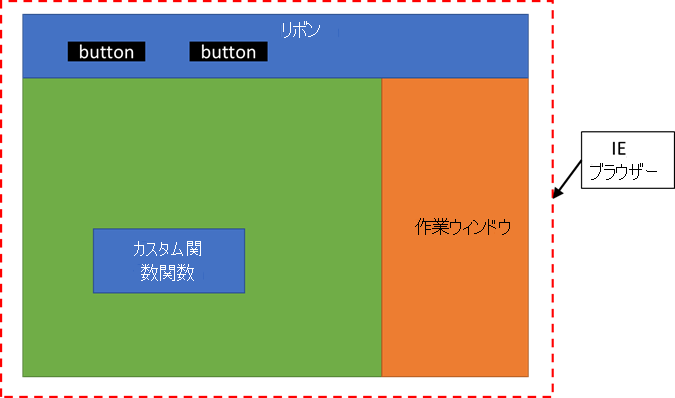

# <a name="configure-your-office-add-in-to-use-a-shared-javascript-runtime"></a>共有 JavaScript ランタイムを使用するように Office アドインを構成する

[!include[Shared JavaScript runtime requirements](../includes/shared-runtime-requirements-note.md)]

単一の共有 JavaScript ランタイム (共有ランタイムとも呼ばれる) ですべてのコードを実行するように Office アドインを構成できます。 これにより、アドイン間での調整が容易になり、アドインのすべての部分から DOM や CORS にアクセスできます。 また、ドキュメントを開いたときにコードを実行したり、リボン ボタンを有効または無効にするなどの追加機能も有効にできます。 共有 JavaScript ランタイムが使用できるようにアドインを構成するには、この記事の手順に従います。

## <a name="create-the-add-in-project"></a>アドイン プロジェクトの作成

新しいプロジェクトを開始する場合は、次の手順に従って、[Office アドイン用の Yeoman ジェネレーター](https://github.com/OfficeDev/generator-office)を使って Excel アドインまたは PowerPoint アドインを作成します。

次のいずれかの操作を行います。

- カスタム関数を使用して Excel アドインを生成するには、コマンド `yo office --projectType excel-functions --name 'Excel shared runtime add-in' --host excel --js true` を実行します。

    または

- PowerPoint アドインを生成するには、コマンド `yo office --projectType taskpane --name 'PowerPoint shared runtime add-in' --host powerpoint --js true` を実行します。

ジェネレーターはプロジェクトを作成し、サポートしているノード コンポーネントをインストールします。

> [!NOTE]
> この記事の手順を使用して、共有ランタイムを使用するように既存の Visual Studio プロジェクトを更新することもできます。 ただし、マニフェストの XML スキーマの更新が必要になる場合があります。 詳細については、「[Office アドインでの開発エラーのトラブルシューティング](../testing/troubleshoot-development-errors.md#manifest-schema-validation-errors-in-visual-studio-projects)」を参照してください。

## <a name="configure-the-manifest"></a>マニフェストを構成する

新規または既存のプロジェクトで共有ランタイムが使用できるように構成するには、次の手順を実行します。 これらの手順は、[Office アドイン用の Yeoman ジェネレーター](https://github.com/OfficeDev/generator-office)を使用してプロジェクトを生成したことを前提としています。

1. Visual Studio Code を起動し、生成した Excel または PowerPoint アドイン プロジェクトを開きます。
1. **manifest.xml** ファイルを開きます。
1. Excel アドインを生成していた場合は、要件セクションを更新して、カスタム関数ランタイムの代わりに[共有ランタイム](../reference/requirement-sets/shared-runtime-requirement-sets.md)を使用します。次のように XML が表示されるはずです。

    ```xml
    <Hosts>
      <Host Name="Workbook"/>
    </Hosts>
    <Requirements>
      <Sets DefaultMinVersion="1.1">
        <Set Name="SharedRuntime" MinVersion="1.1"/>
      </Sets>
    </Requirements>
    <DefaultSettings>
    ```

1. `<VersionOverrides>` セクションを検索して次の `<Runtimes>` セクションを追加します。 作業ウィンドウを閉じてもアドイン コードを実行できるように、有効期間は **長く** する必要があります。 `resid` 値は **Taskpane.Url** で、**manifest.xml** ファイルの下部付近の ` <bt:Urls>` セクションで指定された **taskpane.html** ファイルの場所を参照します。

    > [!IMPORTANT]
    > `<Runtimes>` セクションは、次の XML で示される正確な順序で `<Host>` 要素の後に入力する必要があります。

   ```xml
   <VersionOverrides ...>
     <Hosts>
       <Host ...>
         <Runtimes>
           <Runtime resid="Taskpane.Url" lifetime="long" />
         </Runtimes>
       ...
       </Host>
   ```

1. カスタム関数を使用して Excel アドインを生成した場合は、`<Page>` 要素を見つけます。 次に、ソースの場所を **Functions.Page.Url** から **Taskpane.Url** に変更します。

   ```xml
   <AllFormFactors>
   ...
   <Page>
     <SourceLocation resid="Taskpane.Url"/>
   </Page>
   ...
   ```

1. `<FunctionFile ...>` タグを見つけて、`resid` を **Commands.Url** から **Taskpane.Url** に変更します。 アクション コマンドがない場合は、**FunctionFile** エントリがないため、この手順は省略できます。

    ```xml
    </GetStarted>
    ...
    <FunctionFile resid="Taskpane.Url"/>
    ...
    ```

1. **manifest.xml** ファイルを保存します。

## <a name="configure-the-webpackconfigjs-file"></a>webpack.config.js ファイルを構成する

**webpack.config.js** は、複数のランタイム ローダーをビルドします。 **taskpane.html** ファイルを介して共有 JavaScript ランタイムのみを読み込むように変更する必要があります。

1. Visual Studio Code を起動し、生成した Excel または PowerPoint アドイン プロジェクトを開きます。
1. **webpack.config.js** ファイルを開きます。
1. **webpack.config.js** ファイルに次の **functions.html** プラグイン コードが含まれている場合は、それを削除します。

    ```javascript
    new HtmlWebpackPlugin({
        filename: "functions.html",
        template: "./src/functions/functions.html",
        chunks: ["polyfill", "functions"]
      })
    ```

1. **webpack.config.js** ファイルに次の **commands.html** プラグイン コードが含まれている場合は、それを削除します。

    ```javascript
    new HtmlWebpackPlugin({
        filename: "commands.html",
        template: "./src/commands/commands.html",
        chunks: ["polyfill", "commands"]
      })
    ```

1. プロジェクトで **関数** チャンクまたは **コマンド** チャンクのいずれかを使用した場合は、次に示すようにそれらをチャンク リストに追加します (次のコードは、プロジェクトで両方のチャンクを使用した場合のものです)。

    ```javascript
      new HtmlWebpackPlugin({
        filename: "taskpane.html",
        template: "./src/taskpane/taskpane.html",
        chunks: ["polyfill", "taskpane", "commands", "functions"]
      })
    ```

1. 変更を保存してプロジェクトを再ビルドします。

   ```command line
   npm run build
   ```

> [!NOTE]
> プロジェクトに **functions.html** ファイルまたは **commands.html** ファイルがある場合は、それらを削除できます。 **taskpane.html** は、先ほど行った webpack の更新を介して、**functions.js** および **commands.js** コードを共有 JavaScript ランタイムに読み込みます。

## <a name="test-your-office-add-in-changes"></a>Office アドインの変更をテストする

共有 JavaScript ランタイムが正しく使用されていることを確認するには、次の手順を実行します。

1. **manifest.xml** ファイルを開きます。
1. `<Control xsi:type="Button" id="TaskpaneButton">` セクションを探し、次の `<Action ...>` XML を変更します。

    送信元:

    ```xml
    <Action xsi:type="ShowTaskpane">
      <TaskpaneId>ButtonId1</TaskpaneId>
      <SourceLocation resid="Taskpane.Url"/>
    </Action>
    ```

    変更後:

    ```xml
    <Action xsi:type="ExecuteFunction">
      <FunctionName>action</FunctionName>
    </Action>
    ```

1. **./src/commands/commands.js** ファイルを開きます。
1. **アクション** 関数を以下のコードに置き換えます。 これにより、関数が更新され、作業ウィンドウ ボタンが開いて変更され、カウンターが増加されます。 コマンドから作業ウィンドウ DOM を開いてアクセスすることは、共有 JavaScript ランタイムでのみ機能します。

    ```javascript
    var _count=0;
    
    function action(event) {
      // Your code goes here.
      _count++;
      Office.addin.showAsTaskpane();
      document.getElementById("run").textContent="Go"+_count;
    
      // Be sure to indicate when the add-in command function is complete.
      event.completed();
    }
    ```

1. 変更を保存してプロジェクトを実行します。

   ```command line
   npm start
   ```

アドイン ボタンを選択するたびに、[**実行**] ボタンのテキストが [**移動**] に変更され、その後にカウンターが増加されます。

## <a name="runtime-lifetime"></a>ランタイムの有効期間

`Runtime` 要素を追加する場合は、`long` または `short` の値を使用して有効期間も指定します。この値を `long` に設定すると、ドキュメントが開いたときにアドインを起動したり、作業ウィンドウを閉じた後にコードを実行し続けたり、カスタム関数から CORS と DOM を使用したりするなどの機能を利用できます。

> [!NOTE]
> 既定の有効期間の値は `short` ですが、Excel アドインでは `long` を使うことをお勧めします。この例でランタイムを `short` に設定した場合、いずれかのリボン ボタンを押したときに Excel アドインが起動しますが、リボン ハンドラーの実行が完了するとアドインが終了することがあります。 同様に、作業ウィンドウを開くとアドインが起動します。ただし、作業ウィンドウを閉じると、アドインが終了する場合があります。

```xml
<Runtimes>
  <Runtime resid="ContosoAddin.Url" lifetime="long" />
</Runtimes>
```

> [!NOTE]
> アドインにマニフェストの `Runtimes` 要素 (共有ランタイムに必要) が含まれており、WebView2 (Chromium ベース) で Microsoft Edge の使用条件が満たされている場合、その WebView2 コントロールが使用されます。 使用条件が満たされていない場合は、Windows または Microsoft 365 のバージョンに関係なく、Internet Explorer 11 が使用されます。 詳細については、「[ランタイム](../reference/manifest/runtimes.md)」および「[Office アドインで使用されるブラウザー](../concepts/browsers-used-by-office-web-add-ins.md)」を参照してください。

## <a name="about-the-shared-javascript-runtime"></a>共有 JavaScript ランタイムについて

Windows または Mac で、アドインは、リボン ボタン、カスタム関数、作業ウィンドウのコードを別の JavaScript ランタイム環境で実行します。 これにより、グローバル データを簡単に共有できない、カスタム関数からすべての CORS 機能にアクセスできないなどの制限が発生します。

ただし、Office アドインを構成すれば、同じ JavaScript ランタイム (共有ランタイムとも呼ばれる) でコードを共有できるようになります。 これにより、アドイン間での調整が容易になり、アドインのすべての部分から、作業ウィンドウの DOM や CORS にアクセスできます。

共有ランタイムを構成すると、次のシナリオが可能になります。

- Office アドインは、追加の UI 機能を使用できます。
  - [Office アドインにカスタム キーボード ショートカットを追加する (プレビュー)](../design/keyboard-shortcuts.md)
  - [Office アドインでカスタム コンテキスト タブを作成する (プレビュー)](../design/contextual-tabs.md)
  - [アドイン コマンドを有効または無効にする](../design/disable-add-in-commands.md)
  - [ドキュメントが開いたら、Office アドインでコードを実行する](run-code-on-document-open.md)
  - [Office アドインの作業ウィンドウを表示または非表示にする](show-hide-add-in.md)
- Excel アドインの場合:
  - カスタム関数で CORS がすべてサポートされます。
  - カスタム関数で、Office.js API を呼び出して、スプレッドシート ドキュメントのデータを読み取ることができます。

Windows 上の Office の場合、共有ランタイムは、「[Office アドインで使用されるブラウザー](../concepts/browsers-used-by-office-web-add-ins.md)」で説明されているように、使用条件が満たされている場合、WebView2 (Chromium ベース) で Microsoft Edge を使用します。それ以外の場合は、Internet Explorer 11 を使用します。 また、アドインのリボンに表示するボタンはすべて、同じ共有ランタイムで実行されます。 次の図は、カスタム関数、リボン UI、作業ウィンドウのコードがすべて同じ JavaScript ランタイム内でどのように実行されるかを示しています。



### <a name="debugging"></a>デバッグ

共有ランタイムを使用している場合、この時点では、Windows の Excel でカスタム関数をデバッグするために Visual Studio Code を使用することはできません。 代わりに開発者ツールを使用する必要があります。 さらに詳しい情報については、「[Windows で開発者ツールを使用してアドインをデバッグする](../testing/debug-add-ins-using-f12-developer-tools-on-windows.md)」を参照してください。

### <a name="multiple-task-panes"></a>複数の作業ウィンドウ

共有ランタイムを使用する予定がある場合は、複数の作業ウィンドウを使用するようにアドインを設計しないでください。 共有ランタイムは、1 つの作業ウィンドウのみサポートします。 `<TaskpaneID>` のない作業ウィンドウは、別の作業ウィンドウとして扱われますのでご注意ください。

## <a name="give-us-feedback"></a>ご意見ご感想をお寄せください

この機能に関するフィードバックをお寄せください。この機能に関するバグ、問題、ご要望がある場合は、[office-js リポジトリ](https://github.com/OfficeDev/office-js)で GitHub の問題を作成してお知らせください。

## <a name="see-also"></a>関連項目

- [カスタム関数から Excel API を呼び出す](../excel/call-excel-apis-from-custom-function.md)
- [Office アドインにカスタム キーボード ショートカットを追加する (プレビュー)](../design/keyboard-shortcuts.md)
- [Office アドインでカスタム コンテキスト タブを作成する (プレビュー)](../design/contextual-tabs.md)
- [アドイン コマンドを有効または無効にする](../design/disable-add-in-commands.md)
- [ドキュメントが開いたら、Office アドインでコードを実行する](run-code-on-document-open.md)
- [Office アドインの作業ウィンドウを表示または非表示にする](show-hide-add-in.md)
- [チュートリアル: Excel カスタム関数と作業ウィンドウの間でデータとイベントを共有する](../tutorials/share-data-and-events-between-custom-functions-and-the-task-pane-tutorial.md)
