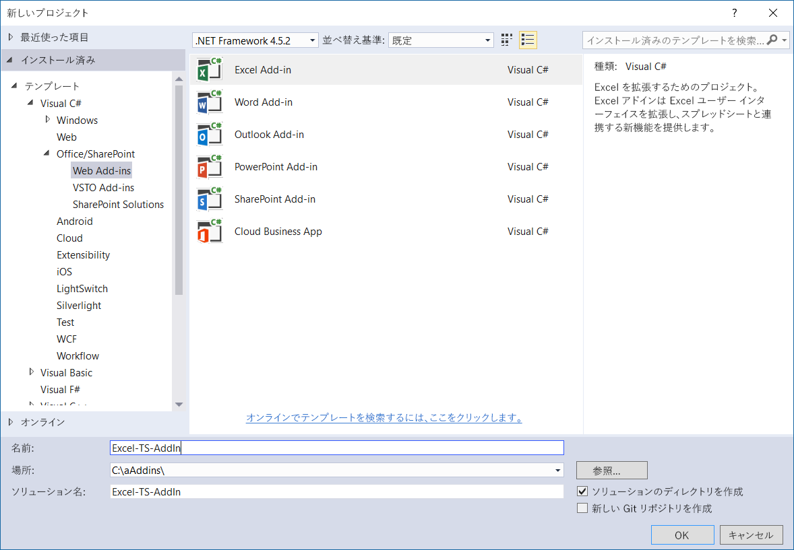
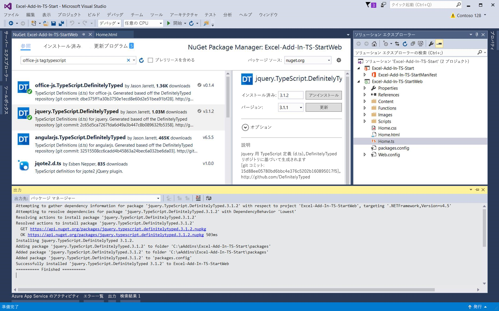

# <a name="convert-an-office-add-in-task-pane-template-in-visual-studio-to-typescript"></a>Visual Studio の Office アドインの作業ウィンドウ テンプレートを TypeScript に変換する


Visual Studio で Office アドイン JavaScript テンプレートを使用して、TypeScript を使用するアドインを作成できます。Visual Studio で新しいアドインを作成すると、その後、プロジェクトを TypeScript に変換できます。このようにすると、Office アドイン TypeScript プロジェクトを最初から作成する必要がなくなります。  

   > **注:** Visual Studio を使用しないで Office アドイン TypeScript プロジェクトを作成する方法については、「[任意のエディターを使用して Office アドインを作成する](../get-started/create-an-office-add-in-using-any-editor.md)」を参照してください。

TypeScript プロジェクトには、TypeScript ファイルと JavaScript ファイルをどちらも一緒に含めることができ、プロジェクトはコンパイルされます。TypeScript は、JavaScript にコンパイルされる JavaScript の型付けスーパーセットであるためです。 

この資料では、Visual Studio で Excel アドイン作業ウィンドウ テンプレートを JavaScript から TypeScript に変換する方法を取り上げます。同じ手順を使用して、他の Office アドインの JavaScript テンプレートを TypeScript に変換できます。

この記事の基にしているコード サンプルを表示またはダウンロードするには、GitHub の「[Excel-Add-In-TS-Start](https://github.com/officedev/Excel-Add-In-TS-Start)」を参照してください。

## <a name="prerequisites"></a>前提条件

次のものがインストールされていることを確認します。

* [Visual Studio 2015 以降](https://www.visualstudio.com/downloads/)
* [Office Developer Tools for Visual Studio](https://www.visualstudio.com/ja-JP/features/office-tools-vs.aspx)
* [Microsoft Visual Studio 2015 Update 3 の累積的なサービス リリース (KB3165756)](https://msdn.microsoft.com/ja-JP/library/mt752379.aspx)
* Excel 2016
* [TypeScript 2.1 for Visual Studio 2015](http://download.microsoft.com/download/6/D/8/6D8381B0-03C1-4BD2-AE65-30FF0A4C62DA/TS2.1-dev14update3-20161206.2/TypeScript_Dev14Full.exe) (Visual Studio 2015 Update 3 のインストール後)

    > **注:**TypeScript 2.1 のインストールの詳細については、「[TypeScript 2.1 の発表](https://blogs.msdn.microsoft.com/typescript/2016/12/07/announcing-typescript-2-1/)」を参照してください。

## <a name="create-new-add-in-project"></a>新しいアドイン プロジェクトを作成する

1.  Visual Studio を開き、**[ファイル]** > **[新規]** > **[プロジェクト]** と移動します。 
2.  **[Office/SharePoint]** の下にある **[Excel アドイン]** を選択してから、**[OK]** を選択します。

    

3.  アプリの作成ウィザードで、**[新機能を Excel に追加する]**、**[完了]** の順に選択します。
4.  F5 を押すか、緑色の **[開始]** ボタンを押して新しく作成した Excel アドインを起動して簡単なテストを実行します。 アドインは IIS でローカルにホストされ、アドインが読み込まれた状態で Excel が開きます。

## <a name="convert-the-add-in-project-to-typescript"></a>アドイン プロジェクトを TypeScript に変換する

1. **ソリューション エクスプローラー**で、Home.js ファイルを Home.ts に変更します。
2. ファイル名拡張子の変更について確認する表示が示される場合、**[はい]** を選択します。  
3. 次のスクリーンショットに示されているように、NuGet で TypeScript 型指定の検索を行うかどうか尋ねられる場合には、**[はい]** を選択します。 **Nuget Package Manager** が開きます。

    ![[TypeScript 型指定の検索] ダイアログ ボックス](../images/search-typescript-typings.png)

4. **Nuget Package Manager** で.**[参照]** を選択します。  
5. [検索] ボックスに、**office-js tag:typescript** と入力します。
6. 次のスクリーンショットに示されているように、**office.js.TypeScript.DefinitelyTyped** と **jquery.TypeScript.DefinitelyTyped** をインストールします。

    

7. Home.ts (変更前は Home.js) を開きます。Home.ts ファイルの先頭部分から以下の参照部分を削除します。

    ```///<reference path="/Scripts/FabricUI/MessageBanner.js" />```

8. Home.ts ファイルの先頭部分に以下の宣言を追加します。

    ```declare var fabric: any;```

9. **‘1.1’** を **1.1** に変更します。つまり、Home.ts ファイルの以下の行から引用符を削除します。

    ```if (!Office.context.requirements.isSetSupported('ExcelApi', 1.1)) {```
 
## <a name="run-the-converted-add-in-project"></a>変換後のアドイン プロジェクトを実行する

1. F5 または緑色の **[開始]** ボタンを押して、アドインを起動します。 
2. Excel が起動したら、**[ホーム]** リボンの **[作業ウィンドウの表示]** ボタンを押します。
3. 数値が入力されているすべてのセルを選択します。
4. 作業ウィンドウの **[強調表示]** ボタンを押します。 

## <a name="homets-code-file"></a>Home.ts コード ファイル

参考のため、Home.ts ファイルに含まれるコードを以下に示します。このファイルには、アドインを実行するために必要な最小限の数の変更が含まれています。

>**注:** TypeScript に変換した JavaScript ファイルのサンプル全体については、[Excel-Add-In-TS-StartWeb/Home.ts](https://github.com/officedev/Excel-Add-In-TS-Start/blob/master/Excel-Add-In-TS-StartWeb/Home.ts) を参照してください。 

```
declare var fabric: any;

(function () {
    "use strict";

    var cellToHighlight;
    var messageBanner;

    // The initialize function must be run each time a new page is loaded.
    Office.initialize = function (reason) {
        $(document).ready(function () {
            // Initialize the FabricUI notification mechanism and hide it
            var element = document.querySelector('.ms-MessageBanner');
            messageBanner = new fabric.MessageBanner(element);
            messageBanner.hideBanner();
            
            // If not using Excel 2016, use fallback logic.
            if (!Office.context.requirements.isSetSupported('ExcelApi', 1.1)) {
                $("#template-description").text("This sample will display the value of the cells you have selected in the spreadsheet.");
                $('#button-text').text("Display!");
                $('#button-desc').text("Display the selection");

                $('#highlight-button').click(
                    displaySelectedCells);
                return;
            }

            $("#template-description").text("This sample highlights the highest value from the cells you have selected in the spreadsheet.");
            $('#button-text').text("Highlight!");
            $('#button-desc').text("Highlights the largest number.");
                
            loadSampleData();

            // Add a click event handler for the highlight button.
            $('#highlight-button').click(
                hightlightHighestValue);
        });
    }

    function loadSampleData() {

        var values = [
                        [Math.floor(Math.random() * 1000), Math.floor(Math.random() * 1000), Math.floor(Math.random() * 1000)],
                        [Math.floor(Math.random() * 1000), Math.floor(Math.random() * 1000), Math.floor(Math.random() * 1000)],
                        [Math.floor(Math.random() * 1000), Math.floor(Math.random() * 1000), Math.floor(Math.random() * 1000)]
        ];

        // Run a batch operation against the Excel object model.
        Excel.run(function (ctx) {
            // Create a proxy object for the active sheet
            var sheet = ctx.workbook.worksheets.getActiveWorksheet();
            // Queue a command to write the sample data to the worksheet
            sheet.getRange("B3:D5").values = values;

            // Run the queued-up commands, and return a promise to indicate task completion
            return ctx.sync();
        })
        .catch(errorHandler);
    }

    function hightlightHighestValue() {

        // Run a batch operation against the Excel object model.
        Excel.run(function (ctx) {

            // Create a proxy object for the selected range and load its address and values properties.
            var sourceRange = ctx.workbook.getSelectedRange().load("values, address, rowIndex, columnIndex, rowCount, columnCount");

            // Run the queued-up command, and return a promise to indicate task completion
            return ctx.sync().
                .then(function () {
                    var highestRow = 0;
                    var highestCol = 0;
                    var highestValue = sourceRange.values[0][0];

                    // Find the cell to highlight
                    for (var i = 0; i < sourceRange.rowCount; i++) {
                        for (var j = 0; j < sourceRange.columnCount; j++) {
                            if (!isNaN(sourceRange.values[i][j]) && sourceRange.values[i][j] > highestValue) {
                                highestRow = i;
                                highestCol = j;
                                highestValue = sourceRange.values[i][j];
                            }
                        }
                    }

                    cellToHighlight = sourceRange.getCell(highestRow, highestCol);
                    sourceRange.worksheet.getUsedRange().format.fill.clear();
                    sourceRange.worksheet.getUsedRange().format.font.bold = false;

                    cellToHighlight.load("values");
                })
                   // Run the queued-up commands.
                .then(ctx.sync)
                .then(function () {
                    // Highlight the cell
                    cellToHighlight.format.fill.color = "orange";
                    cellToHighlight.format.font.bold = true;
                })
                .then(ctx.sync)
        })
        .catch(errorHandler);
    }

    function displaySelectedCells() {
        Office.context.document.getSelectedDataAsync(Office.CoercionType.Text,
            function (result) {
                if (result.status === Office.AsyncResultStatus.Succeeded) {
                    showNotification('The selected text is:', '"' + result.value + '"');
                } else {
                    showNotification('Error', result.error.message);
                }
            });
    }

    // Helper function for treating errors.
    function errorHandler(error) {
        // Always be sure to catch any accumulated errors that bubble up from the Excel.run execution
        showNotification("Error", error);
        console.log("Error: " + error);
        if (error instanceof OfficeExtension.Error) {
            console.log("Debug info: " + JSON.stringify(error.debugInfo));
        }
    }

    // Helper function for displaying notifications
    function showNotification(header, content) {
        $("#notificationHeader").text(header);
        $("#notificationBody").text(content);
        messageBanner.showBanner();
        messageBanner.toggleExpansion();
    }
})();

```

## <a name="additional-resources"></a>追加リソース

* [StackOverflow における Promise 実装に関するディスカッション](https://stackoverflow.com/questions/44461312/office-addins-file-in-its-typescript-version-doesnt-work)
* [GitHub における Office アドインのサンプル](https://github.com/officedev)
