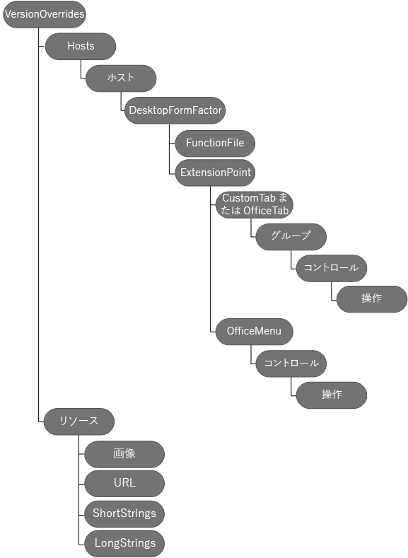

# <a name="create-add-in-commands-in-your-manifest-for-excel-word-and-powerpoint"></a>Excel、Word、PowerPoint のマニフェストにアドイン コマンドを作成する


マニフェストに **[VersionOverrides](https://dev.office.com/reference/add-ins/manifest/versionoverrides)** を使用して、Excel、Word、PowerPoint のアドイン コマンドを定義します。 アドイン コマンドは、アクションを実行する指定された UI 要素を使用して、既定の Office ユーザー インターフェイス (UI) をカスタマイズする簡単な方法を提供します。 アドイン コマンドを使用して、以下のことを行えます。
- アドインの機能を簡単に使用できる UI 要素またはエントリ ポイントを作成します。  
  
- ボタン、またはボタンのドロップダウンリストをリボンに追加します。    
  
- それぞれがオプションのサブメニューを含む個々のメニュー項目を、特定のコンテキスト (ショートカット) メニューに追加します。    
  
- アドイン コマンドが選択されると、操作を実行します。次の操作を実行できます。
    
  - ユーザーが操作する 1 つ以上の作業ウィンドウ アドインを表示します。作業ウィンドウ アドイン内部で、Office の UI ファブリックを使用してカスタム UI を作成する HTML を表示できます。
    
     *または* 
      
  - 通常はいずれの UI も表示しないで実行する JavaScript コードを実行します。
      
この記事では、アドイン コマンドを定義するマニフェストの編集方法について説明します。次の図に、アドイン コマンドを定義するのに使用される要素の階層を示します。これらの要素は、この記事で詳細に説明します。 
      
次の画像は、マニフェスト内のアドイン コマンド要素の概要です。 

 
## <a name="step-1-start-from-a-sample"></a>手順 1: サンプルから始める

「[Office-Add-in-Commands-Samples](https://github.com/OfficeDev/Office-Add-in-Command-Sample)」にあるサンプルのいずれかから始めることを強くお勧めします。必要に応じて、このガイドの手順に従って独自のマニフェストを作成できます。「Office-Add-in-Commands-Samples」サイト内で XSD ファイルを使用してご使用のマニフェストを検証できます。アドイン コマンドを使用する前に、「[Excel、Word、および PowerPoint のアドイン コマンド](../design/add-in-commands.md)」をお読みください。

## <a name="step-2-create-a-task-pane-add-in"></a>手順 2: 作業ウィンドウ アドインを作成する

アドイン コマンドの使用を開始するには、まず作業ウィンドウ アドインを作成し、次にアドインのマニフェストをこの記事で説明するように変更する必要があります。コンテンツ アドインではアドイン コマンドを使用できません。既存のマニフェストを更新している場合は、「[手順 3: VersionOverrides 要素を追加する](#step-3-add-versionoverrides-element)」で説明するように、**VersionOverrides** 要素をマニフェストに追加するだけでなく、適切な **XML 名前空間**も追加する必要があります。
   
次の例は、Office 2013 アドインのマニフェストを示します。**VersionOverrides** 要素がないため、このマニフェストにはアドイン コマンドがありません。Office 2013 は、アドイン コマンドをサポートしていませんが、このマニフェストに **VersionOverrides** を追加することで、アドインは Office 2013 と Office 2016 の両方で動作します。Office 2013 では、アドインはアドイン コマンドを表示しません。また、**SourceLocation** の値を使用して、アドインを単一の作業ウィンドウ アドインとして実行します。Office 2016 では、**VersionOverrides** 要素が含まれない場合、アドインを実行するために **SourceLocation** が使用されます。ただし、**VersionOverrides** を含める場合は、アドインにアドイン コマンドのみが表示され、アドインは単一の作業ウィンドウ アドインとして表示されません。
  
```xml
<OfficeApp xmlns="http://schemas.microsoft.com/office/appforoffice/1.1" xmlns:xsi="http://www.w3.org/2001/XMLSchema-instance" xmlns:bt="http://schemas.microsoft.com/office/officeappbasictypes/1.0" xmlns:ov="http://schemas.microsoft.com/office/taskpaneappversionoverrides" xsi:type="TaskPaneApp">
  <Id>657a32a9-ab8a-4579-ac9f-df1a11a64e52</Id>
  <Version>1.0.0.0</Version>
  <ProviderName>Contoso</ProviderName>
  <DefaultLocale>en-US</DefaultLocale>
  <DisplayName DefaultValue="Contoso Add-in Commands" />
  <Description DefaultValue="Contoso Add-in Commands"/>
  <IconUrl DefaultValue="~remoteAppUrl/Images/Icon_32.png" />
 
  <AppDomains>
    <AppDomain>AppDomain1</AppDomain>
    <AppDomain>AppDomain2</AppDomain>
    <AppDomain>AppDomain3</AppDomain>
  </AppDomains>
  <Hosts>
    <Host Name="Workbook" />
  </Hosts>
  <DefaultSettings>
    <SourceLocation DefaultValue="https://www.contoso.com/Pages/Home.aspx" />
  </DefaultSettings>
  <Permissions>ReadWriteDocument</Permissions>

 <!-- The VersionOverrides element is inserted at this location in the manifest. -->

</OfficeApp>
```

## <a name="step-3-add-versionoverrides-element"></a>手順 3: VersionOverrides 要素を追加する
**VersionOverrides** 要素は、アドイン コマンドの定義を含むルート要素です。**VersionOverrides** はマニフェスト内の **OfficeApp** 要素の子要素です。次の表に、**VersionOverrides** 要素の属性の一覧を示します。

|**属性**|**説明**|
|:-----|:-----|
|**xmlns** <br/> | 必須。スキーマの場所。http://schemas.microsoft.com/office/taskpaneappversionoverrides にする必要があります。 <br/> |
|**xsi:type** <br/> |必須。スキーマのバージョン。この記事で説明されているスキーマのバージョンは "VersionOverridesV1_0" です。  <br/> |
   
次の表は、**VersionOverrides** の子要素です。
  
|**要素**|**説明**|
|:-----|:-----|
|**説明** <br/> |省略可能。アドインについての説明。この子の **Description** 要素は、マニフェストの親部分の、元の **Description** 要素を上書きします。この **Description** 要素の **resid** 属性は、**String** 要素の **id** に設定されます。**String** 要素には、**Description** のテキストが含まれます。 <br/> |
|**Requirements** <br/> |省略可能。アドインに必要な最小の Office.js のセットおよびバージョンを指定します。この子の **Requirements** 要素は、マニフェストの親部分の **Requirements** 要素を上書きします。詳細については、「[Office のホストと API の要件を指定する](../develop/specify-office-hosts-and-api-requirements.md)」を参照してください。  <br/> |
|**Hosts** <br/> |必須。Office ホストのコレクションを指定します。子の **Hosts** 要素は、マニフェストの親部分の **Hosts** 要素を上書きします。"Workbook" または "Document" に設定された **xsi:type** 属性を含める必要があります。 <br/> |
|**Resources** <br/> |マニフェストの他の要素によって参照されるリソースのコレクション (文字列、URL、画像) を定義します。たとえば、**Description** 要素の値は、**Resources** の子要素を参照します。**Resources** 要素については、この記事の「[手順 7: Resources 要素を追加する](#step-7-add-the-resources-element)」で説明します。 <br/> |
   
次の例に、**VersionOverrides** 要素と子要素を使用する方法を示します。

```xml
<OfficeApp>
...
  <VersionOverrides xmlns="http://schemas.microsoft.com/office/taskpaneappversionoverrides" xsi:type="VersionOverridesV1_0">
    <Description resid="residDescription" />
    <Requirements>
      <!-- add information about requirement sets -->
    </Requirements>
    <Hosts>
      <Host xsi:type="Workbook">
        <!-- add information about form factors -->
      </Host>
      <Host xsi:type="Document">
        <!-- add information about form factors -->
      </Host>
    </Hosts>
    <Resources> 
      <!-- add information about resources -->
    </Resources>
  </VersionOverrides>
...
</OfficeApp>
```

## <a name="step-4-add-hosts-host-and-desktopformfactor-elements"></a>手順 4: Hosts、Host、DesktopFormFactor 要素を追加する

**Hosts** 要素には、1 つ以上の **Host** 要素が含まれます。**Host** 要素は、特定の Office ホストを指定します。**Host** 要素には、アドインが Office ホストにインストールされた後で表示するアドイン コマンドを指定する子要素が含まれます。同じアドイン コマンドを複数の異なる Office ホストで表示する場合は、各 **Host** で子要素を重複させる必要があります。
       
**DesktopFormFactor** 要素では、Windows デスクトップ上の Office、および Office Online (ブラウザー内) で実行するアドインの設定を指定します。
      
**Hosts** 要素、**Host** 要素、**DesktopFormFactor** 要素の例を次に示します。

```xml
<OfficeApp>
...
  <VersionOverrides xmlns="http://schemas.microsoft.com/office/taskpaneappversionoverrides" xsi:type="VersionOverridesV1_0">
  ...
    <Hosts>
      <Host xsi:type="Workbook">
        <DesktopFormFactor>

              <!-- information about FunctionFile and ExtensionPoint -->

        </DesktopFormFactor>
      </Host>
    </Hosts>
  ...
  </VersionOverrides>
...
</OfficeApp>
```

## <a name="step-5-add-the-functionfile-element"></a>手順 5: FunctionFile 要素を追加する

**FunctionFile** 要素では、アドイン コマンドが **ExecuteFunction** 操作を使用するときに実行される JavaScript コードを含むファイルを指定します (「[ボタン コントロール](https://dev.office.com/reference/add-ins/manifest/control#Button-control)」の説明を参照)。**FunctionFile** 要素の **resid** 属性は、アドイン コマンドに必要なすべての JavaScript ファイルを含む HTML ファイルに設定されます。JavaScript ファイルに直接リンクすることはできません。HTML ファイルにのみリンクできます。ファイル名は、**Resources** 要素の **Url** 要素として指定されます。
        
**FunctionFile** 要素の例を次に示します。
  
```xml
<DesktopFormFactor>
    <FunctionFile resid="residDesktopFuncUrl" />
    <ExtensionPoint xsi:type="PrimaryCommandSurface">
      <!-- information about this extension point -->
    </ExtensionPoint> 

    <!-- You can define more than one ExtensionPoint element as needed -->
</DesktopFormFactor>
```

> [!IMPORTANT]
> JavaScript コードが `Office.initialize` を呼び出していることを確認します。 
   
**FunctionFile** 要素によって参照される HTML ファイルの JavaScript は、`Office.initialize` を呼び出す必要があります。**FunctionName** 要素 (「[ボタン コントロール](https://dev.office.com/reference/add-ins/manifest/control#Button-control)」の説明を参照) は、**FunctionFile** の関数を使用します。
     
次のコードは、**FunctionName** で使用される関数の実装方法を示しています。

```javascript

<script>
    // The initialize function must be run each time a new page is loaded.
    (function () {
        Office.initialize = function (reason) {
            // If you need to initialize something you can do so here. 
        };
    })();

    // Your function must be in the global namespace.
    function writeText(event) {

        // Implement your custom code here. The following code is a simple example.  
        Office.context.document.setSelectedDataAsync("ExecuteFunction works. Button ID=" + event.source.id,
            function (asyncResult) {
                var error = asyncResult.error;
                if (asyncResult.status === "failed") {
                    // Show error message. 
                }
                else {
                    // Show success message.
                }
            });
        
        // Calling event.completed is required. event.completed lets the platform know that processing has completed. 
        event.completed();
    }
</script>
```

> [!IMPORTANT]
> **event.completed** に対する呼び出しにより、イベントが正常に処理されたことが通知されます。同一のアドイン コマンドを複数回クリックするなど、関数を複数回呼び出すと、すべてのイベントが自動的にキューに入れられます。最初のイベントが自動的に実行され、その他のイベントはキューに残ります。関数により **event.completed** が呼び出されると、キューに入れられている、その関数に対する次の呼び出しが実行されます。**event.completed** を実装する必要があります。実装しない場合、関数は実行されません。
 
## <a name="step-6-add-extensionpoint-elements"></a>手順 6: ExtensionPoint 要素を追加する

**ExtensionPoint** 要素は、Office UI のどこにアドイン コマンドを表示するかを定義します。以下の **xsi:type** 値を使用して、**ExtensionPoint** 要素を定義できます。
   
- **PrimaryCommandSurface**。Office のリボンを参照します。
     
- **ContextMenu**。Office UI で右クリックしたときに表示されるショートカット メニューです。
    
次の例は、**PrimaryCommandSurface** と **ContextMenu** の属性値を持つ **ExtensionPoint** 要素を使用する方法と、各要素と併用する必要がある子要素を示しています。
    
> [!IMPORTANT]
> ID 属性を含む要素では、一意の ID を指定してください。会社の名前と ID を使用することをお勧めします。たとえば、次の形式にします。`<CustomTab id="mycompanyname.mygroupname">` 
  
```xml
<ExtensionPoint xsi:type="PrimaryCommandSurface">
  <CustomTab id="Contoso Tab">
  <!-- If you want to use a default tab that comes with Office, remove the above CustomTab element, and then uncomment the following OfficeTab element -->
  <!-- <OfficeTab id="TabData"> -->
    <Label resid="residLabel4" />
    <Group id="Group1Id12">
      <Label resid="residLabel4" />
      <Icon>
        <bt:Image size="16" resid="icon1_32x32" />
        <bt:Image size="32" resid="icon1_32x32" />
        <bt:Image size="80" resid="icon1_32x32" />
      </Icon>
      <Tooltip resid="residToolTip" />
      <Control xsi:type="Button" id="Button1Id1">
        
        <!-- information about the control -->
      </Control>   
      <!-- other controls, as needed -->                                    
    </Group>
  </CustomTab>
</ExtensionPoint>
<ExtensionPoint xsi:type="ContextMenu">
  <OfficeMenu id="ContextMenuCell">
    <Control xsi:type="Menu" id="ContextMenu2">
            <!-- information about the control -->
    </Control>   
    <!-- other controls, as needed -->         
  </OfficeMenu>
</ExtensionPoint>
```

|**要素**|**説明**|
|:-----|:-----|
|**CustomTab** <br/> |カスタム タブをリボンに追加する必要がある場合は必須 (**PrimaryCommandSurface** を使用)。**CustomTab** 要素を使用する場合、**OfficeTab** 要素は使用できません。**id** 属性が必要です。 <br/> |
|**OfficeTab** <br/> |既定の Office リボン タブを拡張する場合は必須 (**PrimaryCommandSurface** を使用)。**OfficeTab** 要素を使用する場合、**CustomTab** 要素は使用できません。 <br/> **id** 属性と共に使用するその他のタブの値については、「[既定の Office リボン タブ](https://dev.office.com/reference/add-ins/manifest/officetab)」を参照してください。  <br/> |
|**OfficeMenu** <br/> | 既定のコンテキスト メニューにアドイン コマンドを追加する場合は必須 (**ContextMenu** を使用)。**id** 属性は以下に設定する必要があります。 <br/> Excel または Word の場合は **ContextMenuText**。ユーザーがテキストを選択し、選択したテキストを右クリックしたときに、コンテキスト メニューに項目が表示されます。<br/> Excel の場合は **ContextMenuCell**。ユーザーがスプレッドシートのセルを右クリックすると、コンテキスト メニューに項目が表示されます。 <br/> |
|**グループ** <br/> |タブのユーザー インターフェイスの拡張点のグループ。1 つのグループに、最大 6 個のコントロールを指定できます。**id** 属性が必要です。最大 125 文字の文字列です。 <br/> |
|**Label** <br/> |必須。グループのラベル。**resid** 属性は、**String** 要素の **id** 属性の値に設定する必要があります。**String** 要素は、**ShortStrings** 要素 (**Resources** 要素の子要素) の子要素です。 <br/> |
|**Icon** <br/> |必須。小さいフォーム ファクターのデバイス、または多くのボタンが表示されるときに使用されるグループのアイコンを指定します。**resid** 属性は、**Image** 要素の **id** 属性の値に設定する必要があります。**Image** 要素は、**Images** 要素 (**Resources** 要素の子要素) の子要素です。**size** 属性は、イメージのサイズをピクセル単位で指定します。次の 3 つのイメージのサイズが必要です。16、32、および 80。次の 5 つのオプションのサイズもサポートされています。20、24、40、48、および 64。 <br/> |
|**Tooltip** <br/> |省略可能。グループのヒント。**resid** 属性は、**String** 要素の **id** 属性の値に設定する必要があります。**String** 要素は、**LongStrings** 要素 (**Resources** 要素の子要素) の子要素です。 <br/> |
|**Control** <br/> |各グループには、1 つ以上のコントロールが必要です。**Control** 要素は、**Button** または **Menu** のいずれかにすることができます。ボタンのコントロールのドロップダウン リストを指定するには、**Menu** を使用します。現在、ボタンとメニューのみがサポートされています。詳しくは、「[ボタン コントロール](https://dev.office.com/reference/add-ins/manifest/control)」および「[メニュー コントロール](https://dev.office.com/reference/add-ins/manifest/control)」のセクションをご覧ください。<br/>**注:** トラブルシューティングを容易にするために、**Control** 要素と関連する **Resources** 子要素を 1 つずつ追加することをお勧めします。          |
   

### <a name="button-controls"></a>Button コントロール
ボタンは、ユーザーが選択したときに 1 つのアクションを実行します。JavaScript 関数を実行するか、作業ウィンドウを表示することができます。次の例は、2 つのボタンを定義する方法を示しています。最初のボタンは UI を表示せずに JavaScript 関数を実行し、2 つ目のボタンは作業ウィンドウを表示します。**Control** 要素では、次のようになります。        

- **type** 属性は必須であり、**Button** に設定する必要があります。
    
- **Control** 要素の **id** 属性は、最大 125 文字の文字列です。
    
```xml
<!-- Define a control that calls a JavaScript function. -->
<Control xsi:type="Button" id="Button1Id1">
  <Label resid="residLabel" />
  <Tooltip resid="residToolTip" />
  <Supertip>
    <Title resid="residLabel" />
    <Description resid="residToolTip" />
  </Supertip>
  <Icon>
    <bt:Image size="16" resid="icon1_32x32" />
    <bt:Image size="32" resid="icon1_32x32" />
    <bt:Image size="80" resid="icon1_32x32" />
  </Icon>
  <Action xsi:type="ExecuteFunction">
    <FunctionName>getData</FunctionName>
  </Action>
</Control>

<!-- Define a control that shows a task pane. -->
<Control xsi:type="Button" id="Button2Id1">
  <Label resid="residLabel2" />
  <Tooltip resid="residToolTip" />
  <Supertip>
    <Title resid="residLabel" />
    <Description resid="residToolTip" />
  </Supertip>
  <Icon>
    <bt:Image size="16" resid="icon2_32x32" />
    <bt:Image size="32" resid="icon2_32x32" />
    <bt:Image size="80" resid="icon2_32x32" />
  </Icon>
  <Action xsi:type="ShowTaskpane">
    <SourceLocation resid="residUnitConverterUrl" />
  </Action>
</Control>
```

|**要素**|**Description**|
|:-----|:-----|
|**Label** <br/> |必須。ボタンのテキスト。**resid** 属性は、**String** 要素の **id** 属性の値に設定する必要があります。**String** 要素は、**ShortStrings** 要素 (**Resources** 要素の子要素) の子要素です。 <br/> |
|**Tooltip** <br/> |省略可能。ボタンのヒント。**resid** 属性は、**String** 要素の **id** 属性の値に設定する必要があります。**String** 要素は、**LongStrings** 要素 (**Resources** 要素の子要素) の子要素です。 <br/> |
|**Supertip** <br/> | 必須。このボタンのヒントであり、次のものによって定義されます。 <br/> **Title** <br/>  必須。ヒントのテキスト。**resid** 属性は、**String** 要素の **id** 属性の値に設定する必要があります。**String** 要素は、**ShortStrings** 要素 (**Resources** 要素の子要素) の子要素です。 <br/> **説明** <br/>  必須。ヒントの説明。**resid** 属性は、**String** 要素の **id** 属性の値に設定する必要があります。**String** 要素は、**LongStrings** 要素 (**Resources** 要素の子要素) の子要素です。 <br/> |
|**Icon** <br/> | 必須。ボタンの **Image** 要素を含みます。画像ファイルは必ず .png 形式です。 <br/> **Image** <br/>  ボタンに表示する画像を定義します。**resid** 属性は、**Image** 要素の **id** 属性の値に設定する必要があります。**Image** 要素は、**Images** 要素 (**Resources** 要素の子要素) の子要素です。**size** 属性は、イメージのサイズをピクセル単位で示します。次の 3 つのイメージのサイズが必要です。16、32、および 80。次の 5 つのオプションのサイズもサポートされています。20、24、40、48、および 64。 <br/> |
|**操作** <br/> | 必須。ユーザーがボタンを選択したときに実行する操作を指定します。**xsi:type** 属性の値は、次のいずれかを指定できます。 <br/> **ExecuteFunction**。**FunctionFile** によって参照されるファイルにある JavaScript 関数を実行します。**ExecuteFunction** は UI を表示しません。**FunctionName** 子要素は、実行する関数の名前を指定します。<br/> **ShowTaskPane**。作業ウィンドウ アドインを表示します。**SourceLocation** 子要素は、表示する作業ウィンドウ アドインのソース ファイルの位置を指定します。**resid** 属性は、**Url** 要素の **id** 属性の値に設定します。この要素は、**Resources** 要素の **Urls** 要素に含まれています。 <br/> |
   

### <a name="menu-controls"></a>Menu コントロール
**Menu** コントロールは、**PrimaryCommandSurface** または **ContextMenu** のどちらかで使用できます。また、以下の項目を定義します。
  
- ルートレベルのメニュー項目。
   
- サブメニュー項目のリスト。
 
**PrimaryCommandSurface** と共に使用すると、ルートのメニュー項目がリボンのボタンとして表示されます。ボタンを選択すると、サブメニューがドロップダウン リストとして表示されます。**ContextMenu** と共に使用すると、サブメニューのあるメニュー項目がコンテキスト メニューに挿入されます。どちらの場合も、各サブメニュー項目は JavaScript 関数を実行するか、作業ウィンドウを表示することができます。現時点では、サブメニューの 1 つのレベルのみがサポートされます。
       
次の例では、2 つのサブメニュー項目があるメニュー項目を定義する方法を示します。最初のサブメニュー項目は作業ウィンドウを表示し、2 つ目のサブメニュー項目は、JavaScript 関数を実行します。**Control** 要素では、次のようになります。
    
- **xsi:type** 属性は必須であり、**Menu** に設定する必要があります。
  
- **id** 属性は、最大 125 文字の文字列です。
    
```xml

<Control xsi:type="Menu" id="TestMenu2">
  <Label resid="residLabel3" />
  <Tooltip resid="residToolTip" />
  <Supertip>
    <Title resid="residLabel" />
    <Description resid="residToolTip" />
  </Supertip>
  <Icon>
    <bt:Image size="16" resid="icon1_32x32" />
    <bt:Image size="32" resid="icon1_32x32" />
    <bt:Image size="80" resid="icon1_32x32" />
  </Icon>
  <Items>
    <Item id="showGallery2">
      <Label resid="residLabel3"/>
      <Supertip>
        <Title resid="residLabel" />
        <Description resid="residToolTip" />
      </Supertip>
      <Icon>
        <bt:Image size="16" resid="icon1_32x32" />
        <bt:Image size="32" resid="icon1_32x32" />
        <bt:Image size="80" resid="icon1_32x32" />
      </Icon>
      <Action xsi:type="ShowTaskpane">
        <TaskpaneId>MyTaskPaneID1</TaskpaneId>
        <SourceLocation resid="residUnitConverterUrl" />
      </Action>
    </Item>
    <Item id="showGallery3">
      <Label resid="residLabel5"/>
      <Supertip>
        <Title resid="residLabel" />
        <Description resid="residToolTip" />
      </Supertip>
      <Icon>
        <bt:Image size="16" resid="icon4_32x32" />
        <bt:Image size="32" resid="icon4_32x32" />
        <bt:Image size="80" resid="icon4_32x32" />
      </Icon>
      <Action xsi:type="ExecuteFunction">
        <FunctionName>getButton</FunctionName>
      </Action>
    </Item>
  </Items>
</Control>
```

|**要素**|**Description**|
|:-----|:-----|
|**Label** <br/> |必須。ルートのメニュー項目のテキスト。**resid** 属性は、**String** 要素の **id** 属性の値に設定する必要があります。**String** 要素は、**ShortStrings** 要素 (**Resources** 要素の子要素) の子要素です。 <br/> |
|**Tooltip** <br/> |省略可能。メニューのヒント。**resid** 属性は、**String** 要素の **id** 属性の値に設定する必要があります。**String** 要素は、**LongStrings** 要素 (**Resources** 要素の子要素) の子要素です。 <br/> |
|**SuperTip** <br/> | 必須。メニューのヒントであり、次のものによって定義されます。 <br/> **Title** <br/>  必須。ヒントのテキスト。**resid** 属性は、**String** 要素の **id** 属性の値に設定する必要があります。**String** 要素は、**ShortStrings** 要素 (**Resources** 要素の子要素) の子要素です。 <br/> **説明** <br/>  必須。ヒントの説明。**resid** 属性は、**String** 要素の **id** 属性の値に設定する必要があります。**String** 要素は、**LongStrings** 要素 (**Resources** 要素の子要素) の子要素です。 <br/> |
|**Icon** <br/> | 必須。メニューの **Image** 要素を含みます。画像ファイルは必ず .png 形式です。 <br/> **Image** <br/>  メニューの画像。**resid** 属性は、**Image** 要素の **id** 属性の値に設定する必要があります。**Image** 要素は、**Images** 要素 (**Resources** 要素の子要素) の子要素です。**size** 属性は、イメージのサイズをピクセル単位で示します。次の 3 つのイメージのサイズ (ピクセル単位) が必要です。16、32、および 80。次の 5 つのオプションのサイズ (ピクセル単位) もサポートされています。20、24、40、48、および 64。 <br/> |
|**Items** <br/> |必須。各サブメニュー項目の **Item** 要素を含みます。各 **Item** 要素は、[ボタン コントロール](https://dev.office.com/reference/add-ins/manifest/control)と同じ子要素を含みます。  <br/> |
   
## <a name="step-7-add-the-resources-element"></a>手順 7: Resources 要素を追加する

**Resources** 要素は、**VersionOverrides** 要素の異なる子要素で使用されるリソースを含みます。リソースには、アイコン、文字列、および URL が含まれます。マニフェスト内の要素は、リソースの **id** を参照することでリソースを使用できます。**id** を使用するマニフェストの編成に有用です。特に、異なるロケールのリソースの異なるバージョンがある場合に役立ちます。**id** は 最大 32 文字まで使用できます。
  
    
    
次の表に、**Resources** 要素の使用法の例を示します。各リソースは、特定のロケールに異なるリソースを定義する 1 つ以上の **Override** 子要素を持つことができます。


```xml
<Resources>
  <bt:Images>
    <bt:Image id="icon1_16x16" DefaultValue="https://www.contoso.com/Images/icon_default.png">
      <bt:Override Locale="ja-jp" Value="https://www.contoso.com/Images/ja-jp16-icon_default.png" />
    </bt:Image>
    <bt:Image id="icon1_32x32" DefaultValue="https://www.contoso.com/Images/icon_default.png">
      <bt:Override Locale="ja-jp" Value="https://www.contoso.com/Images/ja-jp32-icon_default.png" />
    </bt:Image>
    <bt:Image id="icon1_80x80" DefaultValue="https://www.contoso.com/Images/icon_default.png">
      <bt:Override Locale="ja-jp" Value="https://www.contoso.com/Images/ja-jp80-icon_default.png" />
    </bt:Image>        
  </bt:Images>
  <bt:Urls>
    <bt:Url id="residDesktopFuncUrl" DefaultValue="https://www.contoso.com/Pages/Home.aspx">
      <bt:Override Locale="ja-jp" Value="https://www.contoso.com/Pages/Home.aspx" />
    </bt:Url>        
  </bt:Urls>
  <bt:ShortStrings>
    <bt:String id="residLabel" DefaultValue="GetData">
      <bt:Override Locale="ja-jp" Value="JA-JP-GetData" />
    </bt:String>      
  </bt:ShortStrings>
  <bt:LongStrings>
    <bt:String id="residToolTip" DefaultValue="Get data for your document.">
      <bt:Override Locale="ja-jp" Value="JA-JP - Get data for your document." />
    </bt:String>
  </bt:LongStrings>
</Resources>
```

|**Resource**|**説明**|
|:-----|:-----|
|**Images**/ **Image** <br/> | イメージ ファイルへの HTTPS URL を指定します。各イメージは、次の 3 つの必須のイメージ サイズを定義する必要があります。 <br/>  16×16 <br/>  32×32 <br/>  80×80 <br/>  次のイメージ サイズもサポートされますが、必須ではありません。 <br/>  20×20 <br/>  24×24 <br/>  40×40 <br/>  48×48 <br/>  64×64 <br/> |
|**Urls**/ **Url** <br/> |HTTPS URL の場所を指定します。URL には最大 2048 文字まで指定できます。  <br/> |
|**ShortStrings**/ **String** <br/> |**Label** 要素と **Title** 要素のテキスト。各 **String** には、最大 125 文字を使用できます。 <br/> |
|**LongStrings**/ **String** <br/> |**Tooltip** と **Description** 要素のテキスト。各 **String** は最大 250 文字です。<br/> |
   
> [!NOTE] 
> **Image** 要素と **Url** 要素のすべての URL で Secure Sockets Layer (SSL) を使用する必要があります。

### <a name="tab-values-for-default-office-ribbon-tabs"></a>既定の Office リボン タブの値
Excel および Word で、既定の Office UI タブを使用することで、リボンにアドイン コマンドを追加できます。次の表に、**OfficeTab** 要素の **id** 属性で使用できる値を示します。タブの値は大文字と小文字を区別します。

|**Office ホスト アプリケーション**|**タブの値**|
|:-----|:-----|
|Excel  <br/> |**TabHome**         **TabInsert**         **TabPageLayoutExcel**         **TabFormulas**         **TabData**         **TabReview**         **TabView**         **TabDeveloper**         **TabAddIns**         **TabPrintPreview**         **TabBackgroundRemoval** <br/> |
|Word  <br/> |**TabHome**         **TabInsert**         **TabWordDesign**         **TabPageLayoutWord**         **TabReferences**         **TabMailings**         **TabReviewWord**         **TabView**         **TabDeveloper**         **TabAddIns**         **TabBlogPost**         **TabBlogInsert**         **TabPrintPreview**         **TabOutlining**         **TabConflicts**         **TabBackgroundRemoval**         **TabBroadcastPresentation** <br/> |
|PowerPoint  <br/> |**TabHome**         **TabInsert**         **TabDesign**         **TabTransitions**         **TabAnimations**         **TabSlideShow**         **TabReview**         **TabView**         **TabDeveloper**         **TabAddIns**         **TabPrintPreview**         **TabMerge**         **TabGrayscale**         **TabBlackAndWhite**         **TabBroadcastPresentation**         **TabSlideMaster**         **TabHandoutMaster**         **TabNotesMaster**         **TabBackgroundRemoval**         **TabSlideMasterHome**          <br/> |
   
## <a name="see-also"></a>関連項目

-  [Excel、Word、PowerPoint のアドイン コマンド](../design/add-in-commands.md)      
