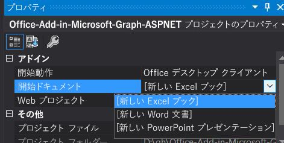

# <a name="create-an-aspnet-office-add-in-that-uses-single-sign-on-preview"></a>シングル サインオンを使用する ASP.NET Office アドインを作成する (プレビュー)

ユーザーが Office にサインインしたとき、アドインは同じ資格情報を使用し、再度のサインインを要求することなく、複数のアプリケーションへのアクセスを許可することができます。 概要については、「[Office アドインで SSO を有効化する](sso-in-office-add-ins.md)」を参照してください。
この記事では、ASP.NET を使用して構築されたアドインでシングルサインオン (SSO) を有効にするプロセスについて説明します。

> [!NOTE]
> Node.js ベースのアドインに関する同様の記事については、「[シングル サインオンを使用する Node.js Office アドインを作成する](create-sso-office-add-ins-nodejs.md)」を参照してください。

## <a name="prerequisites"></a>前提条件

* Visual Studio 2019 以降。

* [Office Developer Tools](https://www.visualstudio.com/features/office-tools-vs.aspx)

[!include[additional prerequisites](../includes/sso-tutorial-prereqs.md)]

* 少なくとも、Microsoft 365 サブスクリプションの OneDrive for Business に格納されているファイルとフォルダーがいくつかあります。

* Microsoft Azure サブスクリプション。 このアドインには、Azure Active Directory (AD) が必要です。 Azure AD は、アプリケーションが認証および承認に使用する ID サービスを提供します。 [Microsoft Azure](https://account.windowsazure.com/SignUp) で試用版サブスクリプションを取得できます。

## <a name="set-up-the-starter-project"></a>スタート プロジェクトをセットアップする

「[Office Add-in ASPNET SSO](https://github.com/officedev/office-add-in-aspnet-sso)」にあるリポジトリを複製するかダウンロードします。

> [!NOTE]
> サンプルには 2 つのバージョンがあります。
>
> * **[Before]** フォルダーはスタート プロジェクトです。SSO や承認に直接関連しない UI などの側面は、既に完了しています。この記事で後述する各セクションでは、これを完成させるための手順を順に説明します。
> * このサンプルの **[Complete]** バージョンは、この記事の手順を完了したときに得られるアドインと同様のものですが、完成済みのプロジェクトには、この記事のテキストと重複するコード コメントが含まれています。 完成済みのバージョンを使用する場合は、この記事の手順をそのまま実行しますが、[Before] を [Complete] に置き換えて、「**クライアント側のコードを作成する**」と「**サーバー側のコードを作成する**」のセクションを省略してください。


## <a name="register-the-add-in-with-azure-ad-v20-endpoint"></a>Azure AD v2.0 エンドポイントにアドインを登録する

1. [Azure ポータル - アプリの登録](https://go.microsoft.com/fwlink/?linkid=2083908)ページに移動してアプリを登録します。

1. Microsoft 365 テナントに対して***管理者***の資格情報を使用してサインインします。 たとえば、MyName@contoso.onmicrosoft.com です。

1. **[新規登録]** を選択します。 **[アプリケーションを登録]** ページで、次のように値を設定します。

    * `Office-Add-in-ASPNET-SSO` に **[名前]** を設定します。
    * [**サポートされているアカウントの種類**] を [**任意の組織のディレクトリ内のアカウント (任意の Azure AD ディレクトリ - マルチテナント) と個人用の Microsoft アカウント (例: Skype、 Xbox)**] に設定します。 (登録しているテナントのユーザーだけがアドインを使用できるようにする場合は、代わりに [**この組織ディレクトリのアカウントのみ...**] を選択します。ただし、追加セットアップ手順を実行する必要があります。 詳細については、「**シングルテナントのセットアップ**」を参照してください。
    * [**リダイレクト URI**] セクションで、ドロップダウンで [**Web**] が選択されていることを確認し、URI を [` https://localhost:44355/AzureADAuth/Authorize`] に設定します。
    * **[登録]** を選択します。

1. [ **Office アドイン-SSO** ] ページで、**アプリケーション (クライアント) id**と**ディレクトリ (テナント) id**の値をコピーして保存します。 以降の手順では、それらの両方を使用します。

    > [!NOTE]
    > この ID は、Office ホスト アプリケーション (たとえば、PowerPoint、Word、Excel) などの別のアプリケーションが、このアプリケーションへの承認されたアクセスを求めるときの「対象ユーザー」値になります。 また、そのアプリケーションが Microsoft Graph への承認されたアクセスを求めるときには、このアプリケーションの「クライアント ID」になります。

1. [**管理**] で [**証明書とシークレット**] を選択します。 [**新しいクライアント シークレット**] ボタンを選択します。 [**説明**] に値を入力してから、[**有効期限**] の適切なオプションを選択し、[**追加**] を選択します。 後の手順で必要になるため、先に進む前に、*クライアント シークレットの値をすぐにコピーし、アプリケーション ID とともに保存*します。

1. [**管理**] で [**API の公開**] を選択します。 **[設定]** リンクを選択して、"api://$App ID GUID$" の形式でアプリケーション ID URI を生成します。$App ID GUID$ は**アプリケーション (クライアント) ID** です。 `//` の後と GUID の前に、`localhost:44355/` を挿入します (末尾に追加されたスラッシュ「/」に注意します)。 ID 全体の形式は `api://localhost:44355/$App ID GUID$` でなければなりません (例: `api://localhost:44355/c6c1f32b-5e55-4997-881a-753cc1d563b7`)。

1. ダイアログで [**保存**] を選択します。

1. **[Scope の追加]** ボタンをクリックします。 開いたパネルで、`access_as_user`を **[スコープ名]** として入力します。

1. **[同意できるのはだれですか?]** を **[管理者とユーザー]** に設定します。

1. 管理者およびユーザーの同意のプロンプトを構成するためのフィールドに、現在のユーザーと同じ権限で Office ホスト アプリケーションがアドインの Web API を使用できるようにする `access_as_user` 範囲に適した値を入力します。 提案:

    - **管理者の同意のタイトル**: Office はユーザーとして機能できます。
    - **管理者の同意の説明**: 現在のユーザーと同じ権限で Office がアドインの Web API を呼び出すことを可能にします。
    - **ユーザーの同意のタイトル**: Office は自分として機能できます。
    - **管理者の同意の説明**: 自分と同じ権限で Office がアドインの Web API を呼び出すことを可能にします。

1. **[状態]** が **[有効]** に設定されていることを確認してください。

1. **[スコープの追加]** を選択します。

    > [!NOTE]
    > テキストフィールドのすぐ下に表示される **[スコープ名]** のドメイン部分は、以前に設定したアプリケーション ID URI に自動的に一致し、末尾に`/access_as_user`が追加されます。たとえば、`api://localhost:6789/c6c1f32b-5e55-4997-881a-753cc1d563b7/access_as_user`です。

1. **[承認済みのクライアント アプリケーション]** セクションで、アドインの Web アプリケーションに対して承認するアプリケーションを特定します。 次のそれぞれの ID を事前承認する必要があります。

    - `d3590ed6-52b3-4102-aeff-aad2292ab01c` (Microsoft Office)
    - `ea5a67f6-b6f3-4338-b240-c655ddc3cc8e` (Microsoft Office)
    - `57fb890c-0dab-4253-a5e0-7188c88b2bb4` (Office on the web)
    - `bc59ab01-8403-45c6-8796-ac3ef710b3e3` (Outlook on the web)

    ID ごとに、次の手順を実行します。

    a.  **[クライアント アプリケーションの追加]** ボタンを選択し、表示されたパネルで [クライアント ID] をそれぞれの GUID に設定して、`api://localhost:44355/$App ID GUID$/access_as_user`のチェック ボックスをオンにします。

    b.  **[アプリケーションの追加]** を選択します。

1. [**管理**] で [**API のアクセス許可**]、[**アクセス許可の追加**] の順に選択します。 開いたパネルで、**[Microsoft Graph]** を選択してから **[委任されたアクセス許可]** を選択します。

1. アドインに必要な権限を検索するには、**[アクセス許可を選択]** の検索ボックスを使用します。 以下を選択します。 アドイン自体に実際に必要なものは最初のもののみですが、Office ホストがアドインの Web アプリケーションへのトークンを取得するには、`profile` のアクセス許可が必要です。 (実際には、Files.Read.All とプロファイルのみがアドインに必要です。 MSAL.NET ライブラリに必要なので、他の 2 つを要求する必要があります。)

    * Files.Read.All
    * offline_access
    * openid
    * profile

    > [!NOTE]
    > `User.Read` アクセス許可は既定でリストされています。 必要でないアクセス許可は依頼しない方がよいため、アドインが実際に必要でない場合は、このアクセス許可のボックスのチェックをオフにしておくことをお勧めします。

1. 表示される各アクセス許可のチェック ボックスをオンにします。 アドインに必要なアクセス許可を選択したら、パネルの下部にある **[アクセス許可を追加する]** ボタンをクリックします。

1. 同じページで、[**[テナント名] に管理者の同意を与える**] ボタンを選択し、表示される確認に対して [**同意する**] を選択します。

    > [!NOTE]
    > [**[テナント名] に管理者の同意を与える**] を選択すると、同意プロンプトを作成できるように、数分後に再試行を求めるバナー メッセージが表示される場合があります。 その場合は、次のセクションで作業を開始できますが、***必ずポータルに戻り、このボタンを押してください***。

## <a name="configure-the-solution"></a>ソリューションを構成する

1. [**Before**] フォルダーのルートで、**Visual Studio** でソリューション (.sln) ファイルを開きます。 [**ソリューション エクスプローラー**] の一番上のノード (プロジェクト ノードではなく、ソリューション ノード) を右クリックして、[**スタートアップ プロジェクトの設定**] を選択します。

1. [**共通プロパティ**] で、[**スタートアップ プロジェクト**]、[**マルチ スタートアップ プロジェクト**] の順に選択します。 両方のプロジェクトの [**アクション**] が [**開始**] に設定され、「... WebAPI」で終わるプロジェクトが最初にリストされていることを確認します。 ダイアログを閉じます。

1. [**ソリューション エクスプローラー**] に戻り、[**Office-Add-in-Microsoft-Graph-ASPNETWebAPI**] プロジェクトを選択します (右クリックしないでください)。 [**プロパティ**] ウィンドウを開きます。 [**SSL 有効**] が [**True**] であることを確認します。 [**SSL URL**] が `http://localhost:44355/` であることを確認します。

1. 「Web.config」 で、以前にコピーした値を使用します。 [**ida:ClientID**] と [**ida:Audience**] の両方を [**アプリケーション (クライアント) ID**] に設定し、[**ida:Password**] をクライアント シークレットに設定します。

    > [!NOTE]
    > [**アプリケーション (クライアント) ID**] は、Office ホスト アプリケーション (たとえば、PowerPoint、Word、Excel) などの別のアプリケーションが、このアプリケーションへの承認されたアクセスを求めるときの「対象ユーザー」値になります。 また、そのアプリケーションが Microsoft Graph への承認されたアクセスを求めるときには、このアプリケーションの「クライアント ID」になります。

1. アドインを登録したときに、**サポートされているアカウントの種類**で「この組織のディレクトリ内のアカウントのみ」を選択しなかった場合は、web.config を保存して閉じます。 それ以外の場合は、保存して、開いたままにします。

1. [**ソリューション エクスプローラー**] で [**Office-Add-in-Microsoft-Graph-ASPNET**] プロジェクトを選択し、アドイン マニフェスト ファイル「Office-Add-in-ASPNET-SSO.xml」を開いて、ファイルの下部までスクロールします。 `</VersionOverrides>` 終了タグの直前に、以下のマークアップがあります。

    ```xml
    <WebApplicationInfo>
      <Id>$application_GUID here$</Id>
      <Resource>api://localhost:44355/$application_GUID here$</Resource>
      <Scopes>
          <Scope>Files.Read.All</Scope>
          <Scope>offline_access</Scope>
          <Scope>openid</Scope>
          <Scope>profile</Scope>
      </Scopes>
    </WebApplicationInfo>
    ```

1. このマークアップ内の*両方の場所の*プレースホルダー「$application_GUID here$」を、アドインの登録時にコピーしたアプリケーション ID に置き換えます。 「$」は ID の一部ではないので、これらを含めないでください。 これは、web.config の ClientID と Audience に使用したものと同じ ID です。

  > [!NOTE]
  > **リソース**値は、アドインを登録したときに設定した**アプリケーション ID URI** です。 **[範囲]** セクションは、アドインが AppSource を通じて販売される場合に同意ダイアログ ボックスを生成するためにのみ使用されます。

1. ファイルを保存して閉じます。

### <a name="setup-for-single-tenant"></a>シングルテナントのセットアップ

アドインを登録したときに、**サポートされているアカウントの種類**で「この組織のディレクトリ内のアカウントのみ」を選択した場合は、これらの追加のセットアップ手順を実行する必要があります。

1. Azure ポータルに戻り、アドインの登録の [**概要**] ブレードを開きます。 [**Directory (テナント) ID**] をコピーします。

1. web.config で、[**ida：Authority**] の値の「Common」を前の手順でコピーした GUID に置き換えます。 終了すると、値は `<add key="ida:Authority" value="https://login.microsoftonline.com/12345678-91ab-cdef-0123-456789abcdef/oauth2/v2.0" />` のようになります。

1. web.config を保存して閉じます。

## <a name="code-the-client-side"></a>クライアント側のコードの作成

1. [**スクリプト**] フォルダー内の HomeES6.js ファイルを開きます。 これには、一部のコードが既に含まれています。

    * Office が UI に Internet Explorer を使用しているときにアドインを実行できるように、Office.Promise オブジェクトをグローバル ウィンドウ オブジェクトに割り当てるポリフィル。 (詳細については、「[Office アドインによって使用されるブラウザー](../concepts/browsers-used-by-office-web-add-ins.md)」を参照してください。)
    * `Office.initialize` メソッドへの割り当てが、`getGraphAccessTokenButton` ボタン クリック イベントへのハンドラーの割り当てになります。
    * `showResult` メソッドは、作業ウィンドウの下側に Microsoft Graph から返されたデータ (またはエラー メッセージ) を表示するものです。
    * `logErrors` メソッドは、エンド ユーザーを対象としていないエラーをコンソールにログ出力するものです。
    * SSO がサポートされていない、または SSO がエラーになっているシナリオでアドインが使用するフォールバック認証システムを実装するコード。

1. `Office.initialize` への割り当ての下に、次に示すコードを追加します。 このコードについては、次の点に注意してください。

    * アドインのエラー処理により、アクセス トークンの取得が別のオプションのセットを使用して自動的に再試行されることがあります。 カウンター変数 `retryGetAccessToken` は、ユーザーがトークンを取得しようとしたときに繰り返し再試行されないように使用されます。
    * `getGraphData` 関数は、ES6 `async` キーワードで定義されます。 ES6 構文を使用すると、Office アドインの SSO API の使用が非常に簡単になります。 これは、ソリューション内の、Internet Explorer でサポートされていない構文を使用する唯一のファイルです。 ファイル名に「ES6」というリマインダーが設定されています。 このソリューションでは、tsc トランスパイラーを使用してこのファイルを ES5 にトランスパイルします。これにより、Office が UI に Internet Explorer を使用しているときにアドインが実行されます。 (プロジェクトのルートにある tsconfig.json ファイルを参照します。)

    ```javascript
    var retryGetAccessToken = 0;

    async function getGraphData() {
        await getDataWithToken({ allowSignInPrompt: true, forMSGraphAccess: true });
    }
    ```

1. `getGraphData` 関数の下に、次の関数を追加します。 後の手順で `handleClientSideErrors` 関数を作成することに注意してください。

    ```javascript
    async function getDataWithToken() {
        try {

            // TODO 1: Get the bootstrap token and send it to the server to exchange
            //         for an access token to Microsoft Graphn and then get the data
            //         from Microsoft Graph.

        }
        catch (exception) {
            if (exception.code) {
                handleClientSideErrors(exception);
            }
            else {
                showResult(["EXCEPTION: " + JSON.stringify(exception)]);
            }
        }
    }
    ```

1. `TODO 1`を以下のように置き換えます。 このコードについては、以下の点に注意してください。

    * `getAccessToken` は、Azure AD からブートストラップ トークンを取得し、アドインに戻るように Office に指示します。
    * `allowSignInPrompt` は、ユーザーがまだ Office にサインインしていない場合、ユーザーにサインインするように求めるように Office に指示します。
    * `forMSGraphAccess` は、アドインが (ブートストラップ トークンをユーザー ID トークンとして使用するだけでなく) Microsoft Graph へのアクセス トークンのブートストラップ トークンを交換することを Office に通知します。 このオプションを設定すると、ユーザーのテナント管理者がアドインの同意を与えていない場合、Office はブートストラップ トークンの取得プロセスをキャンセルすることができます (そしてエラー コード 13012 が返されます)。 アドインのクライアント側コードが 13012 に返信するには、フォールバック認証システムに分岐します。 `forMSGraphAccess` が使用されず、管理者が同意を与えていない場合は、ブートストラップ トークンが返されますが、on-behalf-of フローと交換しようとするとエラーになります。 したがって、`forMSGraphAccess` オプションを使用すると、アドインがフォールバック システムにすばやく分岐できます。
    * 後の手順で `getData` 関数を作成します。
    * `/api/values` パラメーターは、トークンを交換したり、Microsoft Graph を呼び出すためにアクセス トークンを使用したりする、サーバー側コントローラーの URL です。

    ```javascript
    let bootstrapToken = await OfficeRuntime.auth.getAccessToken({
        allowSignInPrompt: true,
        forMSGraphAccess: true });

    getData("/api/values", bootstrapToken);
    ```

1. `getGraphData` 関数の下に、次を追加します。 このコードについては、以下の点に注意してください。

    * これは、SSO 認証システムおよびフォールバック認証システムの両方で使用されます。
    * `relativeUrl` パラメーターは、サーバー側のコントローラーです。
    * `accessToken` パラメーターは、ブートストラップ トークンまたはフル アクセス トークンにすることができます。
    * `writeFileNamesToOfficeDocument` は、既にプロジェクトの一部です。
    * 後の手順で `handleServerSideErrors` 関数を作成します。

    ```javascript
    function getData(relativeUrl, accessToken) {

        $.ajax({
            url: relativeUrl,
            headers: { "Authorization": "Bearer " + accessToken },
            type: "GET"
        })
            .done(function (result) {
                writeFileNamesToOfficeDocument(result)
                    .then(function () {
                        showResult(["Your data has been added to the document."]);
                    })
                    .catch(function (error) {
                        showResult([JSON.stringify(error)]);
                    });
            })
            .fail(function (result) {
                handleServerSideErrors(result);
            });
    }
    ```

### <a name="handle-client-side-errors"></a>クライアント側のエラーを処理する

1. `getData`関数の下に、次の関数を追加します。 `error.code`は数値であり、通常は 13xxx の範囲にあることを注意してください。

    ```javascript
    function handleClientSideErrors(error) {
        switch (error.code) {

            // TODO 2: Handle errors where the add-in should NOT invoke
            //         the alternative system of authorization.

            // TODO 3: Handle errors where the add-in should invoke
            //         the alternative system of authorization.

        }
    }
    ```

1. `TODO 2`を以下のコードに置き換えます。 これらのエラーの詳細については、「[Office アドインの SSO のトラブルシューティング (Troubleshoot SSO in Office Add-ins)](troubleshoot-sso-in-office-add-ins.md)」を参照してください。

    ```javascript
    case 13001:
        // No one is signed into Office. If the add-in cannot be effectively used when no one
        // is logged into Office, then the first call of getAccessToken should pass the
        // `allowSignInPrompt: true` option.
        showResult(["No one is signed into Office. But you can use many of the add-ins functions anyway. If you want to log in, press the Get OneDrive File Names button again."]);
        break;
    case 13002:
        // The user aborted the consent prompt. If the add-in cannot be effectively used when consent
        // has not been granted, then the first call of getAccessToken should pass the `allowConsentPrompt: true` option.
        showResult(["You can use many of the add-ins functions even though you have not granted consent. If you want to grant consent, press the Get OneDrive File Names button again."]);
        break;
    case 13006:
        // Only seen in Office on the web.
        showResult(["Office on the web is experiencing a problem. Please sign out of Office, close the browser, and then start again."]);
        break;
    case 13008:
        // Only seen in Office on the web.
        showResult(["Office is still working on the last operation. When it completes, try this operation again."]);
        break;
    case 13010:
        // Only seen in Office on the web.
        showResult(["Follow the instructions to change your browser's zone configuration."]);
        break;
    ```

1. `TODO 3`を以下のコードに置き換えます。 その他のエラーが発生した場合、アドインはフォールバック認証システムに分岐します。 これらのエラーの詳細については、「 [Office アドインでの SSO のトラブルシューティング](troubleshoot-sso-in-office-add-ins.md)」を参照してください。このアドインでは、ユーザーが既にサインインしている場合でも、ユーザーにサインインを求めるダイアログがフォールバックシステムによって開かれます。

    ```javascript
    default:
        dialogFallback();
        break;
    ```

### <a name="handle-server-side-errors"></a>サーバー側のエラーを処理する

1. `handleClientSideErrors` 関数の下に、次の関数を追加します。

    ```javascript
    function handleServerSideErrors(result) {

    // TODO 4: Parse the JSON response.

    // TODO 5: Handle case where Microsoft Graph requires an additional form
    //         of authentication.

    // TODO 6: Handle other Azure AD errors

    }
    ```

1. `TODO 4`を以下のように置き換えます。 このコードについては、MFA などが存在する前に ASP.NET エラー クラスが作成されたことに注意してください。 第 2 認証要素に対する要求をサーバー側の論理が処理する方法の副作用として、クライアントに送信されるサーバー側のエラーは **Message** プロパティがありますが、**ExceptionMessage** プロパティはありません。 ただし、他のすべてのエラーには **ExceptionMessage** プロパティがあるため、クライアント側のコードは両方の応答を解析する必要があります。 どちらか一方の変数が未定義になります。

    ```javascript
    var message = JSON.parse(result.responseText).Message;
    var exceptionMessage = JSON.parse(result.responseText).ExceptionMessage;
    ```

1. `TODO 5`を以下のように置き換えます。 Microsoft Graph が認証の追加形式を必要とする場合、エラー AADSTS50076 が送信されます。 これには、**Message.Claims** プロパティの追加要件に関する情報が含まれます。 これを処理するために、コードはブートストラップ トークンの取得を 2 回試行しますが、今回は `authChallenge` オプションの値として追加要素の要求が含まれます。これにより、Azure AD は、必要なすべての形式の認証をユーザーに要求します。

    ```javascript
    if (message) {
        if (message.indexOf("AADSTS50076") !== -1) {
            var claims = JSON.parse(message).Claims;
            var claimsAsString = JSON.stringify(claims);
            getDataWithToken({ authChallenge: claimsAsString });
            return;
        }
    }
    ```

1. `TODO 6`を以下のように置き換えます。

    ```javascript
    if (exceptionMessage) {

        // TODO 7: Handle case where bootstrap token has expired.

        // TODO 8: Handle all other Azure AD errors.
    }
    ```

1. `TODO 7`を以下のように置き換えます。 まれにブートストラップ トークンが Office の検証時に期限切れにならず、交換のために Azure AD に送信されるまでの間に期限切れになることがあることに注意してください。 Azure AD はエラー AADSTS500133 で応答します。 この場合、コードは SSO API を呼び戻します (ただし、1 回のみ)。 今回は、Office が期限切れになっていない新しいブートストラップ トークンを返します。

    ```javascript
    if ((exceptionMessage.indexOf("AADSTS500133") !== -1)
        && (retryGetAccessToken <= 0)) {

        retryGetAccessToken++;
        getGraphData();
    }
    ```

1. `TODO 8` を以下のように置き換えます。

    ```javascript
    else {
        dialogFallback();
    }
    ```

1. ファイルを保存します。

## <a name="code-the-server-side"></a>サーバー側のコードを作成する

### <a name="configure-the-owin-middleware"></a>OWIN ミドルウェアを構成する

1. **Office-Add-in-ASPNET-SSO-WebAPI** プロジェクトのルートにある Startup.cs ファイルを開き、**スタートアップ** クラスに次のメソッドを追加します。 `ConfigureAuth` メソッドは、この後の手順で作成することに注意してください。

    ```csharp
    public void Configuration(IAppBuilder app)
    {
        ConfigureAuth(app);
    }
    ```

1. ファイルを保存して閉じます。

1. **App_Start** フォルダーを右クリックして、**[追加] > [クラス]** を選択します。

1. **[新しい項目の追加]** ダイアログで、ファイルに「**Startup.Auth.cs**」という名前を付けて **[追加]** をクリックします。

1. 新しいファイルで名前空間の名前を `Office_Add_in_ASPNET_SSO_WebAPI` に短縮します。

1. ファイルの先頭に、次に示す `using` ステートメントがすべて揃っていることを確認します。

    ```csharp
    using Owin;
    using Microsoft.IdentityModel.Tokens;
    using System.Configuration;
    using Microsoft.Owin.Security.OAuth;
    using Microsoft.Owin.Security.Jwt;
    using Office_Add_in_ASPNET_SSO_WebAPI.App_Start;
    ```

1. `Startup` クラスの宣言にキーワード `partial` を追加します (まだ追加されていない場合)。これは、次のようになります。

    `public partial class Startup`

1. 次に示すメソッドを `Startup` クラスに追加します。このメソッドでは、クライアント側の Home.js ファイルの `getData` メソッドから渡されたアクセス トークンを OWIN ミドルウェアで検証する方法を指定します。承認プロセスは、`[Authorize]` 属性で修飾された Web API エンドポイントが呼び出されたときには必ずトリガーされます。

    ```csharp
    public void ConfigureAuth(IAppBuilder app)
    {
        // TODO 1: Configure the validation settings

        // TODO 2: Specify the type of authorization and the discovery endpoint
        //        of the secure token service.
    }
    ```

1. `TODO 1` を以下のように置き換えます。 このコードの注意点は次のとおりです。

    * このコードでは、Office ホストから得られるブートストラップ トークンで指定された対象ユーザーが web.config で指定された値と一致する必要があることを OWIN に指示します。
    * Microsoft アカウントは、組織のテナント GUID とは異なる発行者 GUID を持っているため、両方の種類のアカウントをサポートするために、発行者を検証しません。
    * `SaveSigninToken` を `true` に設定することで、OWIN は Office ホストからの生のブートストラップ トークンを保存するようになります。 これは、アドインが代理フローで Microsoft Graph へのアクセス トークンを取得するために必要になります。
    * OWIN ミドルウェアでは、スコープは検証されません。 `access_as_user` が含まれている必要があるブートストラップ トークンのスコープは、コントローラーで検証されます。

    ```csharp
    TokenValidationParameters tvps = new TokenValidationParameters
    {
        ValidAudience = ConfigurationManager.AppSettings["ida:Audience"],
        ValidateIssuer = false,
        SaveSigninToken = true
    };
    ```

1. `TODO 2`を以下のように置き換えます。 このコードの注意点は次のとおりです。

    * より一般的な `UseWindowsAzureActiveDirectoryBearerAuthentication` は Azure AD V2 エンドポイントに準拠していないため、その代わりとしてメソッド `UseOAuthBearerAuthentication` が呼び出されます。
    * このメソッドに渡される URL は、Office ホストから受け取ったブートストラップ トークンの署名の検証に必要になるキーを取得するための方法を OWIN ミドルウェアが取得する場所になります。 URL の権威セグメントは、web.config から取得されます。これは「common」という文字列か、シングルテナント アドインの場合は GUID です。

    ```csharp
    string[] endAuthoritySegments = { "oauth2/v2.0" };
    string[] parsedAuthority = ConfigurationManager.AppSettings["ida:Authority"].Split(endAuthoritySegments, System.StringSplitOptions.None);
    string wellKnownURL = parsedAuthority[0] + "v2.0/.well-known/openid-configuration";

    app.UseOAuthBearerAuthentication(new OAuthBearerAuthenticationOptions
    {
        AccessTokenFormat = new JwtFormat(tvps, new OpenIdConnectCachingSecurityTokenProvider(wellKnownURL))
    });
    ```

1. ファイルを保存して閉じます。

### <a name="create-the-apivalues-controller"></a>/api/values コントローラーを作成する

1. ファイル **Controllers\ValueController.cs** を開きます。 このコントローラーは、SSO システムがブートストラップ トークンを正常に取得した場合に使用されます。 フォールバック認証システムの一部として使用されることはありません。 そのシステムで AzureADAuthController が使用されました。これは、自動的に作成されます。

1. ファイルの先頭に、次に示す `using` ステートメントがあることを確認します。

    ```csharp
    using Microsoft.Identity.Client;
    using System.Configuration;
    using System.Linq;
    using System.Security.Claims;
    using System.Threading.Tasks;
    using System.Web.Http;
    using System;
    using System.Net;
    using System.Net.Http;
    using Office_Add_in_ASPNET_SSO_WebAPI.Helpers;
    ```

1. `ValuesController` を宣言している行のすぐ上に、属性 `[Authorize]` を追加します。これにより、アドインはコントローラー メソッドが呼び出されたときに、最後の手順で構成した承認プロセスを必ず実行するようになります。アドインへの有効なアクセス トークンを持つ呼び出し元のみが、コントローラーのメソッドを起動できます。

1. 次のメソッドを `ValuesController` に追加します。 戻り値は、`Task<IEnumerable<string>>` ではなく `GET api/values` メソッドでより一般的な `Task<HttpResponseMessage>` になる点に注意してください。 これは、OAuth 認証論理が ASP.NET フィルターではなく、コントローラーに存在する必要があるということの副作用です。 その論理の一部のエラーの条件では、アドインのクライアントに HTTP 応答オブジェクトが送信される必要があります。

    ```csharp
    // GET api/values
    public async Task<HttpResponseMessage> Get()
    {
        // TODO 1: Validate the scopes of the bootstrap token.

        // TODO 2: Assemble all the information that is needed to get a
        //        token for Microsoft Graph using the on-behalf-of flow.

        // TODO 3: Get the access token for Microsoft Graph.

        // TODO 4: Use the token to call Microsoft Graph.
    }
    ```

1. `TODO1` を次のコードに置き換えて、`access_as_user` を含むトークンで指定されているスコープを検証します。 `SendErrorToClient` メソッドの第 2 パラメーターは、**Exception** オブジェクトです。 この場合、コードは `null` を渡します。これは、**Exception** オブジェクトが含まれていることで、生成される HTTP 応答には **Message** プロパティが含められなくなるためです。


    ```csharp
    string[] addinScopes = ClaimsPrincipal.Current.FindFirst("http://schemas.microsoft.com/identity/claims/scope").Value.Split(' ');
    if (!(addinScopes.Contains("access_as_user")))
    {
        return HttpErrorHelper.SendErrorToClient(HttpStatusCode.Unauthorized, null, "Missing access_as_user.");
    }
    ```

1. `TODO 2` を次のコードに置き換えて、「代理」フローを使用して Microsoft Graph のトークンを取得するために必要なすべての情報を編成します。 このコードについては、以下の点に注意してください。

    * アドインは、Office ホストとユーザーがアクセスする必要のあるリソース (または対象ユーザー) の役割を果たさなくなります。この時点で、それ自体が Microsoft Graph にアクセスする必要があるクライアントになります。`ConfidentialClientApplication` は MSAL の「クライアント コンテキスト」オブジェクトになります。
    * MSAL.NET 3.x.x からは、`bootstrapContext` は単なるブートストラップ トークンです。
    * 権威は、web.config から取得されます。これは「common」という文字列か、シングルテナント アドインの場合は GUID です。
    * MSAL では `openid`、`offline_access` の各スコープが機能することが必要ですが、コードがこれらを重複して要求するとエラーがスローされます。 コードが `profile` を要求した場合にもエラーがスローされます。それは、実際には Office ホスト アプリケーションがアドインの Web アプリケーションに対しトークンを取得するときだけに使用します。 そのため、`Files.Read.All` のみが明示的に要求されます。

    ```csharp
    string bootstrapContext = ClaimsPrincipal.Current.Identities.First().BootstrapContext.ToString();
    UserAssertion userAssertion = new UserAssertion(bootstrapContext);

    var cca = ConfidentialClientApplicationBuilder.Create(ConfigurationManager.AppSettings["ida:ClientID"])
                                                    .WithRedirectUri("https://localhost:44355")
                                                    .WithClientSecret(ConfigurationManager.AppSettings["ida:Password"])
                                                    .WithAuthority(ConfigurationManager.AppSettings["ida:Authority"])
                                                    .Build();

    string[] graphScopes = { "https://graph.microsoft.com/Files.Read.All" };
    ```

1. `TODO 3` を次のコードに置き換えます。このコードの注意点は次のとおりです。

    * `ConfidentialClientApplication.AcquireTokenOnBehalfOfAsync` メソッドは、最初にメモリ内の MSAL キャッシュで一致するアクセス トークンを探します。 それが見つからなかった場合にのみ、Azure AD V2 エンドポイントで代理フローを開始します。
    * `MsalServiceException` 以外の種類の例外は、意図的にキャッチしていないため、`500 Server Error` メッセージとしてクライアントに伝達されます。

    ```csharp
    AcquireTokenOnBehalfOfParameterBuilder parameterBuilder = null;
    AuthenticationResult authResult = null;
    try
    {
        parameterBuilder = cca.AcquireTokenOnBehalfOf(graphScopes, userAssertion);
        authResult = await parameterBuilder.ExecuteAsync();
    }
    catch (MsalServiceException e)
    {
        // TODO 3a: Handle request for multi-factor authentication.

        // TODO 3b: Handle lack of consent and invalid scope (permission).

        // TODO 3c: Handle all other MsalServiceExceptions.
    }
    ```

1. `TODO 3a`を以下のコードに置き換えます。 このコードについては、以下の点に注意してください。

    * Microsoft Graph リソースが多要素認証を必要としているときに、その認証をユーザーがまだ指定していない場合、Azure AD はエラー `AADSTS50076` と **Claims** プロパティを含む「400 要求が正しくありません」を返します。 MSAL は、この情報と共に **MsalUiRequiredException** (**MsalServiceException** から継承) をスローします。
    * **Claims** プロパティの値は、クライアントに渡す必要があります。クライアントは、その値を Office ホストに渡します。Office ホストは、その値を新しいブートストラップ トークンの要求に含めます。 Azure AD は、認証のすべての要求されたフォームをユーザーに示します。
    * 例外から HTTP 応答を作成する API は、**Claims** プロパティを認識しないため、このプロパティを応答オブジェクトに含めません。 これが含まれたメッセージを手動で作成する必要があります。 ただし、カスタムの **Message** プロパティは **ExceptionMessage** プロパティの作成を妨げるため、クライアントがエラー ID `AADSTS50076` を取得するには、その ID をカスタムの **Message** に追加する以外に方法はありません。 クライアントの JavaScript では、応答に **Message** または **ExceptionMessage** が含まれているかどうかを検出する必要があるため、どちらを読み取るかを認識します。
    * カスタム メッセージは、JSON として書式設定されているため、クライアント側の JavaScript は既知の JavaScript `JSON` オブジェクトのメソッドでメッセージを解析できます。

    ```csharp
    if (e.Message.StartsWith("AADSTS50076"))
    {
        string responseMessage = String.Format("{{\"AADError\":\"AADSTS50076\",\"Claims\":{0}}}", e.Claims);
        return HttpErrorHelper.SendErrorToClient(HttpStatusCode.Forbidden, null, responseMessage);
    }
    ```

1. `TODO 3b`を以下のコードに置き換えます。 このコードについては、以下の点に注意してください。

    * Azure AD の呼び出しにユーザーまたはテナント管理者のどちらも同意していない (または同意が取り消された) スコープ (アクセス許可) が少なくとも 1 つ含まれていると、Azure AD はエラー `AADSTS65001` と共に「400 要求が正しくありません」を返します。 MSAL は、この情報と共に **MsalUiRequiredException** をスローします。
    *  Azure AD の呼び出しに Azure AD が認識しないスコープが少なくとも 1 つ含まれていると、AAD はエラー `AADSTS70011` と共に「400 要求が正しくありません」を返します。 MSAL は、この情報と共に **MsalUiRequiredException** をスローします。
    *  すべての説明が含まれている理由は、別の条件で 70011 が返されたときに、このアドインでは無効なスコープの存在を意味する場合のみを処理する必要があるためです。
    *  **MsalUiRequiredException** オブジェクトが `SendErrorToClient` に渡されます。これにより、エラー情報を格納している **ExceptionMessage** プロパティが HTTP 応答に含まれるようにします。

    ```csharp
    if ((e.Message.StartsWith("AADSTS65001")) || (e.Message.StartsWith("AADSTS70011: The provided value for the input parameter 'scope' is not valid.")))
    {
        return HttpErrorHelper.SendErrorToClient(HttpStatusCode.Forbidden, e, null);
    }
    ```

1. `TODO 3c` を次のコードに置き換えて、他のすべての **MsalServiceException** を処理します。 前に説明したように、

    ```csharp
    else
    {
        throw e;
    }
    ```

1. `TODO 4` を次のコードに置き換えます。 `GraphApiHelper.GetOneDriveFileNames` メソッドは、自動的に作成されます。これは、Microsoft Graph にデータを要求し、アクセス トークンを含めます。

    ```csharp
    return await GraphApiHelper.GetOneDriveFileNames(authResult.AccessToken);
    ```

1. ファイルを保存して閉じます。

## <a name="run-the-solution"></a>ソリューションを実行する

1. Visual Studio ソリューション ファイルを開きます。
1. [**ビルド**] メニューで [**ソリューションのクリーン**] を選択します。 終了したら、[**ビルド**] メニューをもう一度開き、[**ソリューションのビルド**] を選択します。
1. [**ソリューション エクスプローラー**] で、[**Office-Add-in-ASPNET-SSO**] を選択します (一番上のソリューション ノードではなく、「WebAPI」で終わる名前のプロジェクトではありません)。
1. [**プロパティ**] ウィンドウで、[**ドキュメントの開始**] ドロップダウンを開き、3 つのオプション (Excel、Word、または PowerPoint) のいずれかを選択します。

    

1. F5 キーを押します。
1. Office アプリケーションの [**ホーム**] リボンで、[**SSO ASP.NET**] グループの [**アドインの表示**] を選択して、タスク ウィンドウ アドインを開きます。
1. [**OneDrive ファイル名の取得**] ボタンをクリックします。 Microsoft 365 の教育機関または職場のアカウント、あるいは Microsoft アカウントを使用して Office にログインしている場合、SSO が正常に機能していると、OneDrive for Business の最初の10個のファイルとフォルダーの名前が作業ウィンドウに表示されます。 ログインしていない、または SSO をサポートしていないシナリオにいる場合、もしくは何らかの理由で SSO が機能していない場合には、ログインするように求められます。 ログインすると、ファイル名およびフォルダー名が表示されます。
