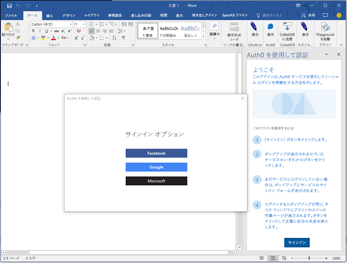
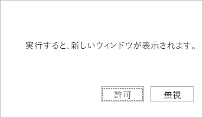

# <a name="use-the-dialog-api-in-your-office-add-ins"></a><span data-ttu-id="8c4c8-102">Office アドインでダイアログ API を使用する</span><span class="sxs-lookup"><span data-stu-id="8c4c8-102">Use the Dialog API in your Office Add-ins</span></span>

<span data-ttu-id="8c4c8-p101">[ダイアログ API](https://docs.microsoft.com/javascript/api/office/office.ui) を使用して、Office アドインでダイアログ ボックスを開くことができます。この記事では、Office アドインでダイアログ API を使用するためのガイダンスを提供します。</span><span class="sxs-lookup"><span data-stu-id="8c4c8-p101">You can use the [Dialog API](https://docs.microsoft.com/javascript/api/office/office.ui) to open dialog boxes in your Office Add-in. This article provides guidance for using the Dialog API in your Office Add-in.</span></span>

> [!NOTE]
> <span data-ttu-id="8c4c8-p102">ダイアログ API の現在のサポート状態に関する詳細は、「[ダイアログ API の要件セット](https://docs.microsoft.com/office/dev/add-ins/reference/requirement-sets/dialog-api-requirement-sets)」を参照してください。現在、ダイアログ API は Word、Excel、PowerPoint、および Outlook でサポートされています。</span><span class="sxs-lookup"><span data-stu-id="8c4c8-p102">For information about where the Dialog API is currently supported, see [Dialog API requirement sets](https://docs.microsoft.com/office/dev/add-ins/reference/requirement-sets/dialog-api-requirement-sets). The Dialog API is currently supported for Word, Excel, PowerPoint, and Outlook.</span></span>

> <span data-ttu-id="8c4c8-107">ダイアログ API の主要なシナリオは、Google や Facebook などのリソースで認証を有効にすることです。</span><span class="sxs-lookup"><span data-stu-id="8c4c8-107">A primary scenario for the Dialog APIs is to enable authentication with a resource such as Google or Facebook.</span></span>

<span data-ttu-id="8c4c8-108">作業ウィンドウ アドイン、コンテンツ アドイン、[アドイン コマンド](../design/add-in-commands.md)からダイアログ ボックスを開いて、次の操作を実行することを検討してください。</span><span class="sxs-lookup"><span data-stu-id="8c4c8-108">Consider opening a dialog box from a task pane or content add-in or [add-in command](../design/add-in-commands.md) to do the following:</span></span>

- <span data-ttu-id="8c4c8-109">作業ウィンドウに直接開くことができないサインイン ページを表示する。</span><span class="sxs-lookup"><span data-stu-id="8c4c8-109">Display sign in pages that cannot be opened directly in a task pane.</span></span>
- <span data-ttu-id="8c4c8-110">アドインでの作業用に画面領域を広げる (あるいは全画面表示)。</span><span class="sxs-lookup"><span data-stu-id="8c4c8-110">Provide more screen space, or even a full screen, for some tasks in your add-in.</span></span>
- <span data-ttu-id="8c4c8-111">ビデオが作業ウィンドウに限定されている場合に、小さすぎるビデオをホストする。</span><span class="sxs-lookup"><span data-stu-id="8c4c8-111">Host a video that would be too small if confined to a task pane.</span></span>

> [!NOTE]
> <span data-ttu-id="8c4c8-p103">UI 要素を重ねて表示することはお勧めできないため、シナリオで必要な場合を除き、作業ウィンドウでダイアログを開かないようにします。作業ウィンドウの表示領域の使用方法を検討するときには、作業ウィンドウはタブ表示できることに注意してください。例については、[Excel アドイン JavaScriptSalesTracker](https://github.com/OfficeDev/Excel-Add-in-JavaScript-SalesTracker) のサンプルを参照してください。</span><span class="sxs-lookup"><span data-stu-id="8c4c8-p103">Because overlapping UI elements are discouraged, avoid opening a dialog from a task pane unless your scenario requires it. When you consider how to use the surface area of a task pane, note that task panes can be tabbed. For an example, see the [Excel Add-in JavaScript SalesTracker](https://github.com/OfficeDev/Excel-Add-in-JavaScript-SalesTracker) sample.</span></span>

<span data-ttu-id="8c4c8-115">次の画像は、ダイアログ ボックスの例を示します。</span><span class="sxs-lookup"><span data-stu-id="8c4c8-115">The following image shows an example of a dialog box.</span></span>



<span data-ttu-id="8c4c8-p104">ダイアログ ボックスが常に画面の中央に開くことに注意してください。ユーザーはダイアログ ボックスの移動とサイズ変更ができます。ウィンドウは*モードレス*です。ホスト Office アプリケーションのドキュメントの操作と、作業ウィンドウのホスト ページ (存在する場合) の操作の両方を続行できます。</span><span class="sxs-lookup"><span data-stu-id="8c4c8-p104">Note that the dialog box always opens in the center of the screen. The user can move and resize it. The window is *nonmodal*--a user can continue to interact with both the document in the host Office application and with the host page in the task pane, if there is one.</span></span>

## <a name="dialog-api-scenarios"></a><span data-ttu-id="8c4c8-120">ダイアログ API のシナリオ</span><span class="sxs-lookup"><span data-stu-id="8c4c8-120">Dialog API scenarios</span></span>

<span data-ttu-id="8c4c8-121">Office JavaScript API は、[Dialog](https://docs.microsoft.com/javascript/api/office/office.dialog) オブジェクトと [Office.context.ui 名前空間](https://docs.microsoft.com/javascript/api/office/office.ui)の 2 つの関数を使用する次のシナリオをサポートしています。</span><span class="sxs-lookup"><span data-stu-id="8c4c8-121">The Office JavaScript APIs support the following scenarios with a [Dialog](https://docs.microsoft.com/javascript/api/office/office.dialog) object and two functions in the [Office.context.ui namespace](https://docs.microsoft.com/javascript/api/office/office.ui).</span></span>

### <a name="open-a-dialog-box"></a><span data-ttu-id="8c4c8-122">ダイアログ ボックスを開く</span><span class="sxs-lookup"><span data-stu-id="8c4c8-122">Open a dialog box</span></span>

<span data-ttu-id="8c4c8-p105">ダイアログ ボックスを開くには、作業ウィンドウのコードで [displayDialogAsync](https://docs.microsoft.com/javascript/api/office/office.ui) メソッドを呼び出して、開くリソースの URL を渡します。これは、通常はページですが、MVC アプリケーションのコントローラー メソッド、ルート、Web サービス メソッド、またはその他のリソースの場合もあります。この記事では、'ページ' または 'Web サイト' とは、ダイアログ内のリソースを意味します。次のコードは簡単な例を示しています。</span><span class="sxs-lookup"><span data-stu-id="8c4c8-p105">To open a dialog box, your code in the task pane calls the [displayDialogAsync](https://docs.microsoft.com/javascript/api/office/office.ui) method and passes to it the URL of the resource that you want to open. This is usually a page, but it can be a controller method in an MVC application, a route, a web service method, or any other resource. In this article, 'page' or 'website' refers to the resource in the dialog. The following code is a simple example:</span></span>

```js
Office.context.ui.displayDialogAsync('https://myAddinDomain/myDialog.html');
```

> [!NOTE]
> - <span data-ttu-id="8c4c8-p106">この URL には HTTP**S** プロトコルを使用します。これは、読み込まれる最初のページだけでなく、ダイアログ ボックスに読み込まれるすべてのページで必須です。</span><span class="sxs-lookup"><span data-stu-id="8c4c8-p106">The URL uses the HTTP**S** protocol. This is mandatory for all pages loaded in a dialog box, not just the first page loaded.</span></span>
> - <span data-ttu-id="8c4c8-129">ダイアログのリソースのドメインはホスト ページのドメインと同じです。ホスト ページは、作業ウィンドウ内のページまたはアドイン コマンドの[関数ファイル](https://docs.microsoft.com/office/dev/add-ins/reference/manifest/functionfile)にすることができます。</span><span class="sxs-lookup"><span data-stu-id="8c4c8-129">The dialog resource's domain is the same as the domain of the host page, which can be the page in a task pane or the [function file](https://docs.microsoft.com/office/dev/add-ins/reference/manifest/functionfile) of an add-in command.</span></span> <span data-ttu-id="8c4c8-130">ページ、コントローラーのメソッド、または `displayDialogAsync` メソッドに渡されるその他のリソースは、ホスト ページと同じドメインにある必要があります。</span><span class="sxs-lookup"><span data-stu-id="8c4c8-130">This is required: the page, controller method, or other resource that is passed to the `displayDialogAsync` method must be in the same domain as the host page.</span></span>

> [!IMPORTANT]
> <span data-ttu-id="8c4c8-131">ダイアログのホスト ページとリソースのフル ドメインは、同じである必要があります。</span><span class="sxs-lookup"><span data-stu-id="8c4c8-131">The host page and the resources of the dialog must have the same full domain.</span></span> <span data-ttu-id="8c4c8-132">`displayDialogAsync` にアドインのドメインのサブドメインを渡そうとすると、正常に動作しません。</span><span class="sxs-lookup"><span data-stu-id="8c4c8-132">If you attempt to pass `displayDialogAsync` a subdomain of the add-in's domain, it will not work.</span></span> <span data-ttu-id="8c4c8-133">サブドメインを含む、フル ドメインが一致している必要があります。</span><span class="sxs-lookup"><span data-stu-id="8c4c8-133">The full domain, including any subdomain, must match.</span></span>

<span data-ttu-id="8c4c8-p109">最初のページ (または他のリソース) が読み込まれると、ユーザーは HTTPS を使用する任意の Web サイト (または他のリソース) に移動できます。また、すぐに別のサイトにリダイレクトするように最初のページを設計することもできます。</span><span class="sxs-lookup"><span data-stu-id="8c4c8-p109">After the first page (or other resource) is loaded, a user can go to any website (or other resource) that uses HTTPS. You can also design the first page to immediately redirect to another site.</span></span>

<span data-ttu-id="8c4c8-136">既定では、ダイアログ ボックスのサイズはデバイス画面の高さと幅の 80% ですが、次の例に示すように、メソッドに構成オブジェクトを渡すことによってさまざまな割合を設定できます。</span><span class="sxs-lookup"><span data-stu-id="8c4c8-136">By default, the dialog box will occupy 80% of the height and width of the device screen, but you can set different percentages by passing a configuration object to the method, as shown in the following example:</span></span>

```js
Office.context.ui.displayDialogAsync('https://myDomain/myDialog.html', {height: 30, width: 20});
```

<span data-ttu-id="8c4c8-137">これを実行するサンプル アドインについては、「[Office アドイン ダイアログ API の例](https://github.com/OfficeDev/Office-Add-in-Dialog-API-Simple-Example)」を参照してください。</span><span class="sxs-lookup"><span data-stu-id="8c4c8-137">For a sample add-in that does this, see [Office Add-in Dialog API Example](https://github.com/OfficeDev/Office-Add-in-Dialog-API-Simple-Example).</span></span>

<span data-ttu-id="8c4c8-p110">全画面表示で効率的に操作するには、両方の値を 100% に設定します。(最大有効値は 99.5% であり、最大有効値にしても、ウィンドウは移動とサイズ変更が可能です。)</span><span class="sxs-lookup"><span data-stu-id="8c4c8-p110">Set both values to 100% to get what is effectively a full screen experience. (The effective maximum is 99.5%, and the window is still moveable and resizable.)</span></span>

> [!NOTE]
> <span data-ttu-id="8c4c8-p111">ホスト ウィンドウから開くことができるのは、1 つのダイアログ ボックスのみです。別のダイアログ ボックスを開こうとすると、エラーが発生します。たとえば、ユーザーが作業ウィンドウからダイアログ ボックスを開いた場合には、作業ウィンドウの別のページから 2 番目のダイアログ ボックスを開くことができません。ただし、[アドイン コマンド](../design/add-in-commands.md)からダイアログ ボックスを開く場合は、選択するたびにコマンドによって新しい (ただし非表示の) HTML ファイルが開かれます。これにより、新しい (非表示) ホスト ウィンドウが作成されるため、これらの各ウィンドウは独自のダイアログ ボックスを起動できます。詳細については、「[displayDialogAsync のエラー](#errors-from-displaydialogasync)」を参照してください。</span><span class="sxs-lookup"><span data-stu-id="8c4c8-p111">You can open only one dialog box from a host window. An attempt to open another dialog box generates an error. For example, if a user opens a dialog box from a task pane, she cannot open a second dialog box, from a different page in the task pane. However, when a dialog box is opened from an [add-in command](../design/add-in-commands.md), the command opens a new (but unseen) HTML file each time it is selected. This creates a new (unseen) host window, so each such window can launch its own dialog box. For more information, see [Errors from displayDialogAsync](#errors-from-displaydialogasync).</span></span>

### <a name="take-advantage-of-a-performance-option-in-office-online"></a><span data-ttu-id="8c4c8-146">Office Online のパフォーマンス オプションを利用する</span><span class="sxs-lookup"><span data-stu-id="8c4c8-146">Take advantage of a performance option in Office Online</span></span>

<span data-ttu-id="8c4c8-p112">`displayInIframe` プロパティは `displayDialogAsync` に渡すことのできる構成オブジェクトの追加のプロパティです。このプロパティを `true` に設定し、Office Online で開いたドキュメントでアドインを実行している場合、ダイアログ ボックスは浮動の iframe で開き、独立したウィンドウでは開きません (この方が速く開きます)。次に例を示します。</span><span class="sxs-lookup"><span data-stu-id="8c4c8-p112">The `displayInIframe` property is an additional property in the configuration object that you can pass to `displayDialogAsync`. When this property is set to `true`, and the add-in is running in a document opened in Office Online, the dialog box will open as a floating iframe rather than an independent window, which makes it open faster. The following is an example:</span></span>

```js
Office.context.ui.displayDialogAsync('https://myDomain/myDialog.html', {height: 30, width: 20, displayInIframe: true});
```

<span data-ttu-id="8c4c8-150">既定値は `false` です。これはプロパティを完全に省略した場合と同じ状態です。</span><span class="sxs-lookup"><span data-stu-id="8c4c8-150">The default value is `false`, which is the same as omitting the property entirely.</span></span> <span data-ttu-id="8c4c8-151">アドインが Office Online で実行されていない場合、`displayInIframe` は無視されます。</span><span class="sxs-lookup"><span data-stu-id="8c4c8-151">If the add-in is not running in Office Online, the `displayInIframe` is ignored.</span></span>

> [!NOTE]
> <span data-ttu-id="8c4c8-p114">どの時点であっても、iframe で開けないページにダイアログがリダイレクトされることになる場合は、`displayInIframe: true` を使用**しないでください**。たとえば、Google や Microsoft アカウントなどの多くの一般的な Web サービスのサインイン ページは iframe で開くことができません。</span><span class="sxs-lookup"><span data-stu-id="8c4c8-p114">You should **not** use `displayInIframe: true` if the dialog will at any point redirect to a page that cannot be opened in an iframe. For example, the sign in pages of many popular web services, such as Google and Microsoft Account, cannot be opened in an iframe.</span></span>

### <a name="handling-pop-up-blockers-with-office-online"></a><span data-ttu-id="8c4c8-154">Office Online を使用したポップアップ ブロックの処理</span><span class="sxs-lookup"><span data-stu-id="8c4c8-154">Handling pop-up blockers with Office Online</span></span>

<span data-ttu-id="8c4c8-155">Office Online の使用中にダイアログを表示しようとすると、ブラウザーのポップアップ ブロックによってダイアログがブロックされる可能性があります。</span><span class="sxs-lookup"><span data-stu-id="8c4c8-155">Attempting to display a dialog while using Office Online may cause the browser's pop-up blocker to block the dialog.</span></span> <span data-ttu-id="8c4c8-156">アドインのユーザーがアドインからのプロンプトに初めて同意する場合、ブラウザーのポップアップ ブロックが回避される可能性があります。</span><span class="sxs-lookup"><span data-stu-id="8c4c8-156">The browser's pop-up blocker can be circumvented if the user of your add-in first agrees to a prompt from the add-in.</span></span> <span data-ttu-id="8c4c8-157">`displayDialogAsync` の [DialogOptions](/javascript/api/office/office.dialogoptions) には、そのようなポップアップをトリガーするための `promptBeforeOpen` プロパティがあります。</span><span class="sxs-lookup"><span data-stu-id="8c4c8-157">`displayDialogAsync`'s [DialogOptions](/javascript/api/office/office.dialogoptions) has the `promptBeforeOpen` property to trigger such a pop-up.</span></span> <span data-ttu-id="8c4c8-158">`promptBeforeOpen` は、次の動作を設定するブール値です。</span><span class="sxs-lookup"><span data-stu-id="8c4c8-158">`promptBeforeOpen` is a boolean value which provides the following behavior:</span></span>
 
 - <span data-ttu-id="8c4c8-159">`true` - ナビゲーションをトリガーし、ブラウザーのポップアップ ブロックを回避するためのポップアップがフレームワークに表示されます。</span><span class="sxs-lookup"><span data-stu-id="8c4c8-159">`true` - The framework displays a pop-up to trigger the navigation and avoid the browser's pop-up blocker.</span></span> 
 - <span data-ttu-id="8c4c8-160">`false` - ダイアログは表示されず、(ナビゲーションをトリガーするユーザー インターフェイス アーティファクトを提供することにより) 開発者はポップアップを処理する必要があります。</span><span class="sxs-lookup"><span data-stu-id="8c4c8-160">`false` - The dialog will not be shown and the developer must handle pop-ups (by providing a user interface artifact to trigger the navigation).</span></span> 
 
<span data-ttu-id="8c4c8-161">ポップアップの外観は、次のスクリーンショットに類似したものになります。</span><span class="sxs-lookup"><span data-stu-id="8c4c8-161">The pop-up looks similiar to that in the following screenshot:</span></span>


 
### <a name="send-information-from-the-dialog-box-to-the-host-page"></a><span data-ttu-id="8c4c8-163">ダイアログ ボックスからホスト ページに情報を送信する</span><span class="sxs-lookup"><span data-stu-id="8c4c8-163">Send information from the dialog box to the host page</span></span>

<span data-ttu-id="8c4c8-164">ダイアログ ボックスは、以下の場合を除いて、作業ウィンドウのホスト ページと通信できません。</span><span class="sxs-lookup"><span data-stu-id="8c4c8-164">The dialog box cannot communicate with the host page in the task pane unless:</span></span>

- <span data-ttu-id="8c4c8-165">ダイアログ ボックスの現在のページがホスト ページと同じドメインにある。</span><span class="sxs-lookup"><span data-stu-id="8c4c8-165">The current page in the dialog box is in the same domain as the host page.</span></span>
- <span data-ttu-id="8c4c8-p116">Office JavaScript ライブラリがページに読み込まれている。(Office JavaScript ライブラリを使用するすべてのページと同様に、ページのスクリプトは `Office.initialize` プロパティにメソッドを割り当てる必要があります (空のメソッドでもかまいません)。詳細については、「[アドインの初期化](understanding-the-javascript-api-for-office.md#initializing-your-add-in)」を参照してください。)</span><span class="sxs-lookup"><span data-stu-id="8c4c8-p116">The Office JavaScript library is loaded in the page. (Like any page that uses the Office JavaScript library, script for the page must assign a method to the `Office.initialize` property, although it can be an empty method. For details, see [Initializing your add-in](understanding-the-javascript-api-for-office.md#initializing-your-add-in).)</span></span>

<span data-ttu-id="8c4c8-p117">ダイアログ ページのコードは、`messageParent` 関数を使用して、ブール値または文字列メッセージのいずれかをホスト ページに送信します。文字列には、単語、文、XML BLOB、文字列に変換された JSON、または文字列にシリアル化できるすべてのものを指定できます。次に例を示します。</span><span class="sxs-lookup"><span data-stu-id="8c4c8-p117">Code in the dialog page uses the `messageParent` function to send either a Boolean value or a string message to the host page. The string can be a word, sentence, XML blob, stringified JSON, or anything else that can be serialized to a string. The following is an example:</span></span>

```js
if (loginSuccess) {
    Office.context.ui.messageParent(true);
}
```

> [!NOTE]
> - <span data-ttu-id="8c4c8-p118">`messageParent` 関数は、ダイアログ ボックスで呼び出すことができる、*ただ* 2 つの Office API のうちの 1 つです。もう 1 つは `Office.context.requirements.isSetSupported` です。詳細は、「[Office のホストと API の要件を指定する](specify-office-hosts-and-api-requirements.md)」を参照してださい。</span><span class="sxs-lookup"><span data-stu-id="8c4c8-p118">The `messageParent` function is one of *only* two Office APIs that can be called in the dialog box. The other is `Office.context.requirements.isSetSupported`. For information about it, see [Specify Office hosts and API requirements](specify-office-hosts-and-api-requirements.md).</span></span>
> - <span data-ttu-id="8c4c8-175">`messageParent` 関数を呼び出せるのは、ホスト ページと同じドメイン (プロトコルとポートを含む) を持つページ上のみです。</span><span class="sxs-lookup"><span data-stu-id="8c4c8-175">The `messageParent` function can only be called on a page with the same domain (including protocol and port) as the host page.</span></span>

<span data-ttu-id="8c4c8-176">次の例では、`googleProfile` は文字列に変換されたバージョンのユーザーの Google プロファイルです。</span><span class="sxs-lookup"><span data-stu-id="8c4c8-176">In the next example, `googleProfile` is a stringified version of the user's Google profile.</span></span>

```js
if (loginSuccess) {
    Office.context.ui.messageParent(googleProfile);
}
```

<span data-ttu-id="8c4c8-p119">ホスト ページは、メッセージを受信するように構成する必要があります。これを構成するには、`displayDialogAsync` の元の呼び出しにコールバック パラメーターを追加します。コールバックはハンドラーを `DialogMessageReceived` イベントに割り当てます。次に例を示します。</span><span class="sxs-lookup"><span data-stu-id="8c4c8-p119">The host page must be configured to receive the message. You do this by adding a callback parameter to the original call of `displayDialogAsync`. The callback assigns a handler to the `DialogMessageReceived` event. The following is an example:</span></span>

```js
var dialog;
Office.context.ui.displayDialogAsync('https://myDomain/myDialog.html', {height: 30, width: 20},
    function (asyncResult) {
        dialog = asyncResult.value;
        dialog.addEventHandler(Office.EventType.DialogMessageReceived, processMessage);
    }
);
```

> [!NOTE]
> - <span data-ttu-id="8c4c8-p120">Office は [AsyncResult](https://docs.microsoft.com/javascript/api/office/office.asyncresult) オブジェクトをコールバックに渡します。Office はダイアログ ボックスを開こうとした結果を表します。ただし、ダイアログ ボックスでのイベントの結果は表しません。この違いの詳細については、「[エラーとイベントの処理](#handle-errors-and-events)」セクションを参照してください。</span><span class="sxs-lookup"><span data-stu-id="8c4c8-p120">Office passes an [AsyncResult](https://docs.microsoft.com/javascript/api/office/office.asyncresult) object to the callback. It represents the result of the attempt to open the dialog box. It does not represent the outcome of any events in the dialog box. For more on this distinction, see the section [Handle errors and events](#handle-errors-and-events).</span></span>
> - <span data-ttu-id="8c4c8-185">`asyncResult` の `value` プロパティは [Dialog](https://docs.microsoft.com/javascript/api/office/office.dialog) オブジェクトに設置されます。このオブジェクトはダイアログ ボックスの実行コンテキストではなく、ホスト ページに存在します。</span><span class="sxs-lookup"><span data-stu-id="8c4c8-185">The `value` property of the `asyncResult` is set to a [Dialog](https://docs.microsoft.com/javascript/api/office/office.dialog) object, which exists in the host page, not in the dialog box's execution context.</span></span>
> - <span data-ttu-id="8c4c8-p121">`processMessage` はイベントを処理する関数です。任意の名前を指定できます。</span><span class="sxs-lookup"><span data-stu-id="8c4c8-p121">The `processMessage` is the function that handles the event. You can give it any name you want.</span></span>
> - <span data-ttu-id="8c4c8-188">`dialog` 変数は、`processMessage` でも参照されるため、コールバックよりも広い範囲で宣言されます。</span><span class="sxs-lookup"><span data-stu-id="8c4c8-188">The `dialog` variable is declared at a wider scope than the callback because it is also referenced in `processMessage`.</span></span>

<span data-ttu-id="8c4c8-189">`DialogMessageReceived` イベントのハンドラーの簡単な例を次に示します。</span><span class="sxs-lookup"><span data-stu-id="8c4c8-189">The following is a simple example of a handler for the `DialogMessageReceived` event:</span></span>

```js
function processMessage(arg) {
    var messageFromDialog = JSON.parse(arg.message);
    showUserName(messageFromDialog.name);
}
```

> [!NOTE]
> - <span data-ttu-id="8c4c8-p122">Office は `arg` オブジェクトをハンドラーに渡します。その `message` プロパティは、ダイアログの `messageParent` の呼び出しで送信されるブール値または文字列です。この例では、Microsoft アカウントまたは Google などのサービスからのユーザーのプロファイルの文字列に変換された表記です。このため、`JSON.parse` を含むオブジェクトに逆シリアル化されます。</span><span class="sxs-lookup"><span data-stu-id="8c4c8-p122">Office passes the `arg` object to the handler. Its `message` property is the Boolean or string sent by the call of `messageParent` in the dialog. In this example, it is a stringified representation of a user's profile from a service such as Microsoft Account or Google, so it is deserialized back to an object with `JSON.parse`.</span></span>
> - <span data-ttu-id="8c4c8-p123">`showUserName` 実装は表示されません。作業ウィンドウ上に個人用のウェルカム メッセージが表示される場合があります。</span><span class="sxs-lookup"><span data-stu-id="8c4c8-p123">The `showUserName` implementation is not shown. It might display a personalized welcome message on the task pane.</span></span>

<span data-ttu-id="8c4c8-195">ダイアログ ボックスのユーザー操作が完了すると、次の例に示すようにメッセージ ハンドラーはダイアログ ボックスを閉じます。</span><span class="sxs-lookup"><span data-stu-id="8c4c8-195">When the user interaction with the dialog box is completed, your message handler should close the dialog box, as shown in this example.</span></span>

```js
function processMessage(arg) {
    dialog.close();
    // message processing code goes here;
}
```

> [!NOTE]
> - <span data-ttu-id="8c4c8-196">`dialog` オブジェクトは `displayDialogAsync` の呼び出しによって返されるものと同じである必要があります。</span><span class="sxs-lookup"><span data-stu-id="8c4c8-196">The `dialog` object must be the same one that is returned by the call of `displayDialogAsync`.</span></span>
> - <span data-ttu-id="8c4c8-197">`dialog.close` の呼び出しは、直ちにダイアログ ボックスを閉じるよう Office に指示します。</span><span class="sxs-lookup"><span data-stu-id="8c4c8-197">The call of `dialog.close` tells Office to immediately close the dialog box.</span></span>

<span data-ttu-id="8c4c8-198">これらの手法を使用するサンプル アドインについては、「[Office アドイン ダイアログ API の例](https://github.com/OfficeDev/Office-Add-in-Dialog-API-Simple-Example)」を参照してください。</span><span class="sxs-lookup"><span data-stu-id="8c4c8-198">For a sample add-in that uses these techniques, see [Office Add-in Dialog API Example](https://github.com/OfficeDev/Office-Add-in-Dialog-API-Simple-Example).</span></span>

<span data-ttu-id="8c4c8-p124">メッセージを受信した後、アドインで作業ウィンドウの別のページを開く必要がある場合は、ハンドラーの最後の行として `window.location.replace` メソッド (または `window.location.href`) を使用できます。次に例を示します。</span><span class="sxs-lookup"><span data-stu-id="8c4c8-p124">If the add-in needs to open a different page of the task pane after receiving the message, you can use the `window.location.replace` method (or `window.location.href`) as the last line of the handler. The following is an example:</span></span>

```js
function processMessage(arg) {
    // message processing code goes here;
    window.location.replace("/newPage.html");
    // Alternatively ...
    // window.location.href = "/newPage.html";
}
```

<span data-ttu-id="8c4c8-201">これを実行するアドインの例については、「[Insert Excel charts using Microsoft Graph in a PowerPoint add-in](https://github.com/OfficeDev/PowerPoint-Add-in-Microsoft-Graph-ASPNET-InsertChart)」 (PowerPoint アドインで Microsoft Graph を使用した Excel グラフの挿入) のサンプルを参照してください。</span><span class="sxs-lookup"><span data-stu-id="8c4c8-201">For an example of an add-in that does this, see the [Insert Excel charts using Microsoft Graph in a PowerPoint add-in](https://github.com/OfficeDev/PowerPoint-Add-in-Microsoft-Graph-ASPNET-InsertChart) sample.</span></span>

#### <a name="conditional-messaging"></a><span data-ttu-id="8c4c8-202">条件付きのメッセージング</span><span class="sxs-lookup"><span data-stu-id="8c4c8-202">Conditional messaging</span></span>
<span data-ttu-id="8c4c8-p125">ダイアログ ボックスから複数の `messageParent` 呼び出しを送信できますが、`DialogMessageReceived` イベントのホスト ページにあるハンドラーは 1 つのみのため、ハンドラーは条件ロジックを使用してさまざまなメッセージを区別する必要があります。たとえば、ユーザーに対して Microsoft アカウントまたは Google などの ID プロバイダーにサインインするよう求めるダイアログ ボックスが表示されると、ダイアログ ボックスはユーザーのプロファイルをメッセージとして送信します。認証が失敗した場合、次の例のように、ダイアログ ボックスはホスト ページにエラー情報を送信します。</span><span class="sxs-lookup"><span data-stu-id="8c4c8-p125">Because you can send multiple `messageParent` calls from the dialog box, but you have only one handler in the host page for the `DialogMessageReceived` event, the handler must use conditional logic to distinguish different messages. For example, if the dialog box prompts a user to sign in to an identity provider such as Microsoft Account or Google, it sends the user's profile as a message. If authentication fails, the dialog box sends error information to the host page, as in the following example:</span></span>

```js
if (loginSuccess) {
    var userProfile = getProfile();
    var messageObject = {messageType: "signinSuccess", profile: userProfile};            
    var jsonMessage = JSON.stringify(messageObject);
    Office.context.ui.messageParent(jsonMessage);
} else {
    var errorDetails = getError();
    var messageObject = {messageType: "signinFailure", error: errorDetails};            
    var jsonMessage = JSON.stringify(messageObject);
    Office.context.ui.messageParent(jsonMessage);
}
```

> [!NOTE]
> - <span data-ttu-id="8c4c8-206">`loginSuccess` 変数は、ID プロバイダーからの HTTP 応答を読み取ることによって初期化されます。</span><span class="sxs-lookup"><span data-stu-id="8c4c8-206">The `loginSuccess` variable would be initialized by reading the HTTP response from the identity provider.</span></span>
> - <span data-ttu-id="8c4c8-p126">`getProfile` 関数と `getError` 関数の実装は表示されません。両方の関数はそれぞれ、クエリ パラメーターまたは HTTP 応答の本文からデータを取得します。</span><span class="sxs-lookup"><span data-stu-id="8c4c8-p126">The the implementation of the `getProfile` and `getError` functions are not not shown. They each get data from a query parameter or from the body of the HTTP response.</span></span>
> - <span data-ttu-id="8c4c8-p127">サインインが成功したかどうかに応じて、さまざまな種類の匿名のオブジェクトが送信されます。両方の関数に `messageType` プロパティがありますが、一方には `profile` プロパティ、もう一方には `error` プロパティがあります。</span><span class="sxs-lookup"><span data-stu-id="8c4c8-p127">Anonymous objects of different types are sent depending on whether the sign in was successful. Both have a `messageType` property, but one has a `profile` property and the other has an `error` property.</span></span>

<span data-ttu-id="8c4c8-p128">次の例に示すように、ホスト ページのハンドラー コードは分岐に `messageType` プロパティの値を使用します。`showUserName` 関数は上記の例と同じであり、`showNotification` 関数はホスト ページの UI にエラーを表示することに注意してください。</span><span class="sxs-lookup"><span data-stu-id="8c4c8-p128">The handler code in the host page uses the value of the `messageType` property to branch as shown in the following example. Note that the `showUserName` function is the same as in the previous example and `showNotification` function displays the error in the host page's UI.</span></span>

```js
function processMessage(arg) {
    var messageFromDialog = JSON.parse(arg.message);
    if (messageFromDialog.messageType === "signinSuccess") {
        dialog.close();
        showUserName(messageFromDialog.profile.name);
        window.location.replace("/newPage.html");
    } else {
        dialog.close();
        showNotification("Unable to authenticate user: " + messageFromDialog.error);
    }
}
```

> [!NOTE]
> <span data-ttu-id="8c4c8-213">`showNotification`の実装は、この記事のサンプル コードでは表示されません。</span><span class="sxs-lookup"><span data-stu-id="8c4c8-213">The `showNotification` implementation is not shown in the sample code provided by this article.</span></span> <span data-ttu-id="8c4c8-214">アドインでこの関数を実装する方法の例は、「[Office アドイン ダイアログ API の例](https://github.com/OfficeDev/Office-Add-in-Dialog-API-Simple-Example)」を参照してください。</span><span class="sxs-lookup"><span data-stu-id="8c4c8-214">For an example of how you might implement this function within your add-in, see [Office Add-in Dialog API Example](https://github.com/OfficeDev/Office-Add-in-Dialog-API-Simple-Example).</span></span>

### <a name="closing-the-dialog-box"></a><span data-ttu-id="8c4c8-215">ダイアログ ボックスを閉じる</span><span class="sxs-lookup"><span data-stu-id="8c4c8-215">Closing the dialog box</span></span>

<span data-ttu-id="8c4c8-p130">ダイアログ ボックスを閉じるボタンをダイアログ ボックス内に実装できます。これを実行するには、ボタンのクリック イベント ハンドラーは `messageParent` を使用して、ボタンがクリックされたことをホスト ページに通知する必要があります。次に例を示します。</span><span class="sxs-lookup"><span data-stu-id="8c4c8-p130">You can implement a button in the dialog box that will close it. To do this, the click event handler for the button should use `messageParent` to tell the host page that the button has been clicked. The following is an example:</span></span>

```js
function closeButtonClick() {
    var messageObject = {messageType: "dialogClosed"};            
    var jsonMessage = JSON.stringify(messageObject);
    Office.context.ui.messageParent(jsonMessage);
}
```

<span data-ttu-id="8c4c8-p131">`DialogMessageReceived` のホスト ページ ハンドラーは、この例のように `dialog.close` を呼び出します (ダイアログ オブジェクトを初期化する方法を示す、前述の例を参照してください)。</span><span class="sxs-lookup"><span data-stu-id="8c4c8-p131">The host page handler for `DialogMessageReceived` would call `dialog.close`, as in this example. (See previous examples that show how the dialog object is initialized.)</span></span>


```js
function processMessage(arg) {
    var messageFromDialog = JSON.parse(arg.message);
    if (messageFromDialog.messageType === "dialogClosed") {
       dialog.close();
    }
}
```

<span data-ttu-id="8c4c8-221">この手法を使用するサンプルについては、「[Office アドインの UX 設計パターン](https://github.com/OfficeDev/Office-Add-in-UX-Design-Patterns-Code)」リポジトリの[ダイアログ ナビゲーション設計パターン](https://github.com/OfficeDev/Office-Add-in-UX-Design-Patterns-Code/tree/master/templates/dialog/navigation)を参照してください。</span><span class="sxs-lookup"><span data-stu-id="8c4c8-221">For a sample that uses this technique, see the [dialog navigation design pattern](https://github.com/OfficeDev/Office-Add-in-UX-Design-Patterns-Code/tree/master/templates/dialog/navigation) in the [UX design patterns for Office Add-ins](https://github.com/OfficeDev/Office-Add-in-UX-Design-Patterns-Code) repo.</span></span>

<span data-ttu-id="8c4c8-p132">独自の終了ダイアログ UI がない場合でも、エンド ユーザーは右上隅にある **X** を選択してダイアログ ボックスを閉じることができます。この操作により `DialogEventReceived` イベントがトリガーされます。イベントがトリガーされたときに、ホスト ウィンドウに通知する必要がある場合、ホスト ウィンドウはこのイベントのハンドラーを宣言する必要があります。詳細については、「[ダイアログ ウィンドウでのエラーとイベント](#errors-and-events-in-the-dialog-window)」セクションを参照してください。</span><span class="sxs-lookup"><span data-stu-id="8c4c8-p132">Even when you don't have your own close dialog UI, an end user can close the dialog box by choosing the **X** in the upper-right corner. This action triggers the `DialogEventReceived` event. If your host pane needs to know when this happens, it should declare a handler for this event. See the section [Errors and events in the dialog window](#errors-and-events-in-the-dialog-window) for details.</span></span>

## <a name="handle-errors-and-events"></a><span data-ttu-id="8c4c8-226">エラーとイベントを処理する</span><span class="sxs-lookup"><span data-stu-id="8c4c8-226">Handle errors and events</span></span>

<span data-ttu-id="8c4c8-227">コードでイベントの 2 つのカテゴリを処理する必要があります。</span><span class="sxs-lookup"><span data-stu-id="8c4c8-227">Your code should handle two categories of events:</span></span>

- <span data-ttu-id="8c4c8-228">ダイアログ ボックスを作成できないために `displayDialogAsync` の呼び出しによって返されるエラー。</span><span class="sxs-lookup"><span data-stu-id="8c4c8-228">Errors returned by the call of `displayDialogAsync` because the dialog box cannot be created.</span></span>
- <span data-ttu-id="8c4c8-229">ダイアログ ウィンドウでのエラーと他のイベント。</span><span class="sxs-lookup"><span data-stu-id="8c4c8-229">Errors, and other events, in the dialog window.</span></span>

### <a name="errors-from-displaydialogasync"></a><span data-ttu-id="8c4c8-230">displayDialogAsync のエラー</span><span class="sxs-lookup"><span data-stu-id="8c4c8-230">Errors from displayDialogAsync</span></span>

<span data-ttu-id="8c4c8-231">一般的なプラットフォームやシステムのエラーの他に、`displayDialogAsync` の呼び出しに特有の次のエラーがあります。</span><span class="sxs-lookup"><span data-stu-id="8c4c8-231">In addition to general platform and system errors, three errors are specific to calling `displayDialogAsync`.</span></span>

|<span data-ttu-id="8c4c8-232">コード番号</span><span class="sxs-lookup"><span data-stu-id="8c4c8-232">Code number</span></span>|<span data-ttu-id="8c4c8-233">意味</span><span class="sxs-lookup"><span data-stu-id="8c4c8-233">Meaning</span></span>|
|:-----|:-----|
|<span data-ttu-id="8c4c8-234">12004</span><span class="sxs-lookup"><span data-stu-id="8c4c8-234">12004</span></span>|<span data-ttu-id="8c4c8-p133">`displayDialogAsync` に渡される URL のドメインは信頼されていません。ドメインは、ホスト ページと同じドメインにある必要があります (プロトコルとポート番号を含む)。</span><span class="sxs-lookup"><span data-stu-id="8c4c8-p133">The domain of the URL passed to `displayDialogAsync` is not trusted. The domain must be the same domain as the host page (including protocol and port number).</span></span>|
|<span data-ttu-id="8c4c8-237">12005</span><span class="sxs-lookup"><span data-stu-id="8c4c8-237">12005</span></span>|<span data-ttu-id="8c4c8-p134">`displayDialogAsync` に渡される URL には HTTP プロトコルを使用します。HTTPS が必要です。(Office の一部のバージョンでは、12004 で返されるのと同じエラー メッセージが 12005 でも返されます。)</span><span class="sxs-lookup"><span data-stu-id="8c4c8-p134">The URL passed to `displayDialogAsync` uses the HTTP protocol. HTTPS is required. (In some versions of Office, the error message returned with 12005 is the same one returned for 12004.)</span></span>|
|<span data-ttu-id="8c4c8-241"><span id="12007">12007</span></span><span class="sxs-lookup"><span data-stu-id="8c4c8-241"><span id="12007">12007</span></span></span>|<span data-ttu-id="8c4c8-p135">ダイアログ ボックスは、このホスト ウィンドウで既に開いています。作業ウィンドウなどのホスト ウィンドウで一度に開けるダイアログ ボックスは 1 つだけです。</span><span class="sxs-lookup"><span data-stu-id="8c4c8-p135">A dialog box is already opened from this host window. A host window, such as a task pane, can only have one dialog box open at a time.</span></span>|
|<span data-ttu-id="8c4c8-244">12009</span><span class="sxs-lookup"><span data-stu-id="8c4c8-244">12009</span></span>|<span data-ttu-id="8c4c8-245">ダイアログ ボックスを無視するようにユーザーが選択しました。</span><span class="sxs-lookup"><span data-stu-id="8c4c8-245">The user chose to ignore the dialog box.</span></span> <span data-ttu-id="8c4c8-246">このエラーは、ダイアログの表示をアドインに許可しないようにユーザーが選択すると、Office のオンライン バージョンで発生することがあります。</span><span class="sxs-lookup"><span data-stu-id="8c4c8-246">This error can occur in online versions of Office, where users may choose not to allow an add-in to present a dialog.</span></span>|

<span data-ttu-id="8c4c8-247">`displayDialogAsync` が呼び出されると、常に [AsyncResult](https://docs.microsoft.com/javascript/api/office/office.asyncresult) オブジェクトがコールバック関数に渡されます。</span><span class="sxs-lookup"><span data-stu-id="8c4c8-247">When `displayDialogAsync` is called, it always passes an [AsyncResult](https://docs.microsoft.com/javascript/api/office/office.asyncresult) object to its callback function.</span></span> <span data-ttu-id="8c4c8-248">呼び出しが成功した場合 (つまり、ダイアログ ウィンドウが開いた場合)、`AsyncResult` オブジェクトの `value` プロパティは [Dialog](https://docs.microsoft.com/javascript/api/office/office.dialog) オブジェクトです。</span><span class="sxs-lookup"><span data-stu-id="8c4c8-248">When the call is successful - that is, the dialog window is opened - the `value` property of the `AsyncResult` object is a [Dialog](https://docs.microsoft.com/javascript/api/office/office.dialog) object.</span></span> <span data-ttu-id="8c4c8-249">この例は、「[ダイアログ ボックスからホスト ページに情報を送信する](#send-information-from-the-dialog-box-to-the-host-page)」セクションで参照できます。</span><span class="sxs-lookup"><span data-stu-id="8c4c8-249">An example of this is in the section [Send information from the dialog box to the host page](#send-information-from-the-dialog-box-to-the-host-page).</span></span> <span data-ttu-id="8c4c8-250">`displayDialogAsync` への呼び出しが失敗した場合は、ウィンドウは作成されず、`AsyncResult` オブジェクトの `status` プロパティが `Office.AsyncResultStatus.Failed` に設定され、オブジェクトの `error` プロパティが設定されます。</span><span class="sxs-lookup"><span data-stu-id="8c4c8-250">When the call to `displayDialogAsync` fails, the window is not created, the `status` property of the `AsyncResult` object is set to `Office.AsyncResultStatus.Failed`, and the `error` property of the object is populated.</span></span> <span data-ttu-id="8c4c8-251">`status` をテストして、エラーが発生したときに応答するコールバックを常に設定しておく必要があります。</span><span class="sxs-lookup"><span data-stu-id="8c4c8-251">You should always have a callback that tests the `status` and responds when it's an error.</span></span> <span data-ttu-id="8c4c8-252">コード番号に関係なくエラー メッセージのみを報告するコードの例を、次に示します。</span><span class="sxs-lookup"><span data-stu-id="8c4c8-252">For an example that simply reports the error message regardless of its code number, see the following code:</span></span>

```js
var dialog;
Office.context.ui.displayDialogAsync('https://myDomain/myDialog.html',
function (asyncResult) {
    if (asyncResult.status === Office.AsyncResultStatus.Failed) {
        showNotification(asyncResult.error.code = ": " + asyncResult.error.message);
    } else {
        dialog = asyncResult.value;
        dialog.addEventHandler(Office.EventType.DialogMessageReceived, processMessage);
    }
});
```

### <a name="errors-and-events-in-the-dialog-window"></a><span data-ttu-id="8c4c8-253">ダイアログ ウィンドウでのエラーとイベント</span><span class="sxs-lookup"><span data-stu-id="8c4c8-253">Errors and events in the dialog window</span></span>

<span data-ttu-id="8c4c8-254">ダイアログ ボックス内の、コード番号で知られている 3 つのエラーとイベントによって、ホスト ページで `DialogEventReceived` イベントがトリガーされます。</span><span class="sxs-lookup"><span data-stu-id="8c4c8-254">Three errors and events, known by their code numbers, in the dialog box will trigger a `DialogEventReceived` event in the host page.</span></span>

|<span data-ttu-id="8c4c8-255">コード番号</span><span class="sxs-lookup"><span data-stu-id="8c4c8-255">Code number</span></span>|<span data-ttu-id="8c4c8-256">意味</span><span class="sxs-lookup"><span data-stu-id="8c4c8-256">Meaning</span></span>|
|:-----|:-----|
|<span data-ttu-id="8c4c8-257">12002</span><span class="sxs-lookup"><span data-stu-id="8c4c8-257">12002</span></span>|<span data-ttu-id="8c4c8-258">以下のいずれか:</span><span class="sxs-lookup"><span data-stu-id="8c4c8-258">One of the following:</span></span><br> <span data-ttu-id="8c4c8-259">- `displayDialogAsync` に渡された URL にページが存在しない。</span><span class="sxs-lookup"><span data-stu-id="8c4c8-259">- No page exists at the URL that was passed to `displayDialogAsync`.</span></span><br> <span data-ttu-id="8c4c8-260">- `displayDialogAsync` に渡されたページが読み込まれたが、ダイアログ ボックスが見つからないか読み込むことができないページを指していたか、またはダイアログ ボックスが無効な構文を含む URL を指している。</span><span class="sxs-lookup"><span data-stu-id="8c4c8-260">- The page that was passed to `displayDialogAsync` loaded, but the dialog box was directed to a page that it cannot find or load, or it has been directed to a URL with invalid syntax.</span></span>|
|<span data-ttu-id="8c4c8-261">12003</span><span class="sxs-lookup"><span data-stu-id="8c4c8-261">12003</span></span>|<span data-ttu-id="8c4c8-p138">ダイアログ ボックスが HTTP プロトコルを使用している URL を指していました。HTTPS が必要です。</span><span class="sxs-lookup"><span data-stu-id="8c4c8-p138">The dialog box was directed to a URL with the HTTP protocol. HTTPS is required.</span></span>|
|<span data-ttu-id="8c4c8-264">12006</span><span class="sxs-lookup"><span data-stu-id="8c4c8-264">12006</span></span>|<span data-ttu-id="8c4c8-265">ダイアログ ボックスが閉じられました。通常は、ユーザーが **X** ボタンを選択したためです。</span><span class="sxs-lookup"><span data-stu-id="8c4c8-265">The dialog box was closed, usually because the user chooses the **X** button.</span></span>|

<span data-ttu-id="8c4c8-p139">コードで、呼び出し内の `DialogEventReceived` イベントのハンドラーを `displayDialogAsync` に割り当てることができます。次に簡単な例を示します。</span><span class="sxs-lookup"><span data-stu-id="8c4c8-p139">Your code can assign a handler for the `DialogEventReceived` event in the call to `displayDialogAsync`. The following is a simple example:</span></span>

```js
var dialog;
Office.context.ui.displayDialogAsync('https://myDomain/myDialog.html',
    function (result) {
        dialog = result.value;
        dialog.addEventHandler(Office.EventType.DialogEventReceived, processDialogEvent);
    }
);
```

<span data-ttu-id="8c4c8-268">各エラー コードのカスタム エラー メッセージを作成する `DialogEventReceived` イベントのハンドラーの例を、次に示します。</span><span class="sxs-lookup"><span data-stu-id="8c4c8-268">For an example of a handler for the `DialogEventReceived` event that creates custom error messages for each error code, see the following example:</span></span>

```js
function processDialogEvent(arg) {
    switch (arg.error) {
        case 12002:
            showNotification("The dialog box has been directed to a page that it cannot find or load, or the URL syntax is invalid.");
            break;
        case 12003:
            showNotification("The dialog box has been directed to a URL with the HTTP protocol. HTTPS is required.");            break;
        case 12006:
            showNotification("Dialog closed.");
            break;
        default:
            showNotification("Unknown error in dialog box.");
            break;
    }
}
```

<span data-ttu-id="8c4c8-269">この方法でエラーを処理するサンプル アドインについては、「[Office アドイン ダイアログ API の例](https://github.com/OfficeDev/Office-Add-in-Dialog-API-Simple-Example)」を参照してください。</span><span class="sxs-lookup"><span data-stu-id="8c4c8-269">For a sample add-in that handles errors in this way, see [Office Add-in Dialog API Example](https://github.com/OfficeDev/Office-Add-in-Dialog-API-Simple-Example).</span></span>


## <a name="pass-information-to-the-dialog-box"></a><span data-ttu-id="8c4c8-270">情報をダイアログ ボックスに渡す</span><span class="sxs-lookup"><span data-stu-id="8c4c8-270">Pass information to the dialog box</span></span>

<span data-ttu-id="8c4c8-p140">ホスト ページがダイアログ ボックスに情報を渡す必要がある場合もあります。これは主に 2 つの方法で実行することができます。</span><span class="sxs-lookup"><span data-stu-id="8c4c8-p140">Sometimes the host page needs to pass information to the dialog box. You can do this in two primary ways:</span></span>

- <span data-ttu-id="8c4c8-273">`displayDialogAsync` に渡される URL にクエリ パラメーターを追加します。</span><span class="sxs-lookup"><span data-stu-id="8c4c8-273">Add query parameters to the URL that is passed to `displayDialogAsync`.</span></span>
- <span data-ttu-id="8c4c8-p141">ホスト ウィンドウとダイアログ ボックスの両方にアクセス可能な場所に情報を格納します。2 つのウィンドウは共通のセッション ストレージを共有しませんが、ポート番号 (存在する場合) を含む*ドメインが同じである場合*は、共通の[ローカル ストレージ](https://www.w3schools.com/html/html5_webstorage.asp)を共有します。</span><span class="sxs-lookup"><span data-stu-id="8c4c8-p141">Store the information somewhere that is accessible to both the host window and dialog box. The two windows do not share a common session storage, but *if they have the same domain* (including port number, if any),  they share a common [local storage](https://www.w3schools.com/html/html5_webstorage.asp).</span></span>

### <a name="use-local-storage"></a><span data-ttu-id="8c4c8-276">ローカル ストレージの使用</span><span class="sxs-lookup"><span data-stu-id="8c4c8-276">Use local storage</span></span>

<span data-ttu-id="8c4c8-277">ローカル ストレージを使用するには、次の例に示すように、`displayDialogAsync` 呼び出しの前に、コードはホスト ページで `window.localStorage` オブジェクトの `setItem` メソッドを呼び出します。</span><span class="sxs-lookup"><span data-stu-id="8c4c8-277">To use local storage, your code calls the `setItem` method of the `window.localStorage` object in the host page before the `displayDialogAsync` call, as in the following example:</span></span>

```js
localStorage.setItem("clientID", "15963ac5-314f-4d9b-b5a1-ccb2f1aea248");
```

<span data-ttu-id="8c4c8-278">ダイアログ ウィンドウ内のコードは、次の例に示すように、必要に応じて項目を読み取ります。</span><span class="sxs-lookup"><span data-stu-id="8c4c8-278">Code in the dialog window reads the item when it's needed, as in the following example:</span></span>

```js
var clientID = localStorage.getItem("clientID");
// You can also use property syntax:
// var clientID = localStorage.clientID;
```

### <a name="use-query-parameters"></a><span data-ttu-id="8c4c8-279">クエリ パラメーターの使用</span><span class="sxs-lookup"><span data-stu-id="8c4c8-279">Use query parameters</span></span>

<span data-ttu-id="8c4c8-280">次の例では、クエリ パラメーターを使用してデータを渡す方法を示します。</span><span class="sxs-lookup"><span data-stu-id="8c4c8-280">The following example shows how to pass data with a query parameter:</span></span>

```js
Office.context.ui.displayDialogAsync('https://myAddinDomain/myDialog.html?clientID=15963ac5-314f-4d9b-b5a1-ccb2f1aea248');
```

<span data-ttu-id="8c4c8-281">この手法を使用するサンプルについては、「[PowerPoint アドインで Microsoft Graph を使用した Excel グラフの挿入](https://github.com/OfficeDev/PowerPoint-Add-in-Microsoft-Graph-ASPNET-InsertChart)」を参照してください。</span><span class="sxs-lookup"><span data-stu-id="8c4c8-281">For a sample that uses this technique, see [Insert Excel charts using Microsoft Graph in a PowerPoint add-in](https://github.com/OfficeDev/PowerPoint-Add-in-Microsoft-Graph-ASPNET-InsertChart).</span></span>

<span data-ttu-id="8c4c8-282">ダイアログ ウィンドウ内のコードは、URL を解析し、パラメーター値を読み取ることができます。</span><span class="sxs-lookup"><span data-stu-id="8c4c8-282">Code in your dialog window can parse the URL and read the parameter value.</span></span>

> [!NOTE]
> <span data-ttu-id="8c4c8-p142">Office は、`displayDialogAsync` に渡される URL に `_host_info` というクエリ パラメーターを自動的に追加します (カスタム クエリ パラメーターが存在する場合は、その後に追加されます。ダイアログ ボックスが移動する先の後続の URL には追加されません)。Microsoft は、将来、この値の内容を変更したり、完全に削除したりする可能性があるため、コードでこの値の内容を読み取らないでください。ダイアログ ボックスのセッション ストレージには、同じ値が追加されます。この場合も、*コードではこの値に対する読み取りも書き込みも行わないでください*。</span><span class="sxs-lookup"><span data-stu-id="8c4c8-p142">Office automatically adds a query parameter called `_host_info` to the URL that is passed to `displayDialogAsync`. (It is appended after your custom query parameters, if any. It is not appended to any subsequent URLs that the dialog box navigates to.) Microsoft may change the content of this value, or remove it entirely, in the future, so your code should not read it. The same value is added to the dialog box's session storage. Again, *your code should neither read nor write to this value*.</span></span>

## <a name="use-the-dialog-apis-to-show-a-video"></a><span data-ttu-id="8c4c8-288">ダイアログ API を使用してビデオを表示する</span><span class="sxs-lookup"><span data-stu-id="8c4c8-288">Use the Dialog APIs to show a video</span></span>

<span data-ttu-id="8c4c8-289">ダイアログ ボックスでビデオを表示するには</span><span class="sxs-lookup"><span data-stu-id="8c4c8-289">To show a video in a dialog box:</span></span>

1.  <span data-ttu-id="8c4c8-p143">コンテンツのみが iframe であるページを作成します。iframe の `src` 属性はオンライン ビデオをポイントします。ビデオの URL のプロトコルは HTTP**S** である必要があります。この記事では、このページを "video.dialogbox.html" と呼びます。マークアップの例を次に示します。</span><span class="sxs-lookup"><span data-stu-id="8c4c8-p143">Create a page whose only content is an iframe. The `src` attribute of the iframe points to an online video. The protocol of the video's URL must be HTTP**S**. In this article we'll call this page "video.dialogbox.html". The following is an example of the markup:</span></span>

    ```HTML
    <iframe class="ms-firstrun-video__player"  width="640" height="360"
        src="https://www.youtube.com/embed/XVfOe5mFbAE?rel=0&autoplay=1"
        frameborder="0" allowfullscreen>
    </iframe>
    ```

2.  <span data-ttu-id="8c4c8-295">video.dialogbox.html ページは、ホスト ページと同じドメインにある必要があります。</span><span class="sxs-lookup"><span data-stu-id="8c4c8-295">The video.dialogbox.html page must be in the same domain as the host page.</span></span>
3.  <span data-ttu-id="8c4c8-296">ホスト ページで `displayDialogAsync` の呼び出しを使用して、video.dialogbox.html を開きます。</span><span class="sxs-lookup"><span data-stu-id="8c4c8-296">Use a call of `displayDialogAsync` in the host page to open video.dialogbox.html.</span></span>
4.  <span data-ttu-id="8c4c8-p144">ユーザーがダイアログ ボックスを閉じたときに、アドインに通知する必要がある場合は、`DialogEventReceived` イベントのハンドラーを登録して、12006 イベントを処理します。詳しくは、「[ダイアログ ウィンドウでのエラーとイベント](#errors-and-events-in-the-dialog-window)」セクションを参照してください。</span><span class="sxs-lookup"><span data-stu-id="8c4c8-p144">If your add-in needs to know when the user closes the dialog box, register a handler for the `DialogEventReceived` event and handle the 12006 event. For details, see the section [Errors and events in the dialog window](#errors-and-events-in-the-dialog-window).</span></span>

<span data-ttu-id="8c4c8-299">ダイアログ ボックスにビデオを表示するサンプルについては、「[Office アドインの UX 設計パターン](https://github.com/OfficeDev/Office-Add-in-UX-Design-Patterns-Code)」リポジトリの[ビデオ プレースマット設計パターン](https://github.com/OfficeDev/Office-Add-in-UX-Design-Patterns-Code/tree/master/templates/first-run/video-placemat)を参照してください。</span><span class="sxs-lookup"><span data-stu-id="8c4c8-299">For a sample that shows a video in a dialog box, see the [video placemat design pattern](https://github.com/OfficeDev/Office-Add-in-UX-Design-Patterns-Code/tree/master/templates/first-run/video-placemat) in the [UX design patterns for Office Add-ins](https://github.com/OfficeDev/Office-Add-in-UX-Design-Patterns-Code) repo.</span></span>


## <a name="use-the-dialog-apis-in-an-authentication-flow"></a><span data-ttu-id="8c4c8-301">認証フローでダイアログ API を使用する</span><span class="sxs-lookup"><span data-stu-id="8c4c8-301">Use the Dialog APIs in an authentication flow</span></span>

<span data-ttu-id="8c4c8-302">ダイアログ API の主要なシナリオは、Microsoft アカウント、Office 365、Google、Facebook など、iframe でサインイン ページが開かないようにするリソースまたは ID プロバイダーを使用して認証を有効にすることです。</span><span class="sxs-lookup"><span data-stu-id="8c4c8-302">A primary scenario for the Dialog APIs is to enable authentication with a resource or identity provider that does not allow its sign-in page to open in an Iframe, such as Microsoft Account, Office 365, Google, and Facebook.</span></span>

> [!NOTE]
> <span data-ttu-id="8c4c8-p145">このシナリオでダイアログ API を使用する際には、`displayDialogAsync` への呼び出しで `displayInIframe: true` オプションを使用*しないでください*。このオプションの詳細については、この記事の「[Office Online のパフォーマンス オプションを利用する](#take-advantage-of-a-performance-option-in-office-online)」を参照してください。</span><span class="sxs-lookup"><span data-stu-id="8c4c8-p145">When you are using the Dialog APIs for this scenario, do *not* use the `displayInIframe: true` option in the call to `displayDialogAsync`. See [Take advantage of a performance option in Office Online](#take-advantage-of-a-performance-option-in-office-online) previously in this article for details about this option.</span></span>

<span data-ttu-id="8c4c8-305">シンプルで標準的な認証フローを、次に示します。</span><span class="sxs-lookup"><span data-stu-id="8c4c8-305">The following is a simple and typical authentication flow:</span></span>

1. <span data-ttu-id="8c4c8-p146">ダイアログ ボックスで開く最初のページは、アドインのドメイン (つまりホスト ウィンドウのドメイン) でホストされるローカル ページ (または他のリソース) です。このページには、"*NAME-OF-PROVIDER* にサインインが可能なページにリダイレクトしていますので、お待ちください。" という簡単な UI を含めることができます。「[情報をダイアログ ボックスに渡す](#pass-information-to-the-dialog-box)」に記載されているように、このページのコードは、ダイアログ ボックスに渡される情報を使用して、ID プロバイダーのサインイン ページの URL を構築します。</span><span class="sxs-lookup"><span data-stu-id="8c4c8-p146">The first page that opens in the dialog box is a local page (or other resource) that is hosted in the add-in's domain; that is, the host window's domain. This page can have a simple UI that says "Please wait, we are redirecting you to the page where you can sign in to *NAME-OF-PROVIDER*." Code in this page constructs the URL of the identity provider's sign-in page by using information that is passed to the dialog box as described in [Pass information to the dialog box](#pass-information-to-the-dialog-box).</span></span>
2. <span data-ttu-id="8c4c8-p147">次に、ダイアログ ウィンドウをサインイン ページにリダイレクトします。URL には、ユーザーがサインインしたらダイアログ ウィンドウを特定のページにリダイレクトするように ID プロバイダーに指示するクエリ パラメーターが含まれています。この記事では、このページを "redirectPage.html" と呼びます。(*このページはホスト ウィンドウと同じドメイン内のページにする必要があります*。これは、ダイアログ ウィンドウがサインイン試行の結果を渡す唯一の方法が `messageParent` の呼び出しを使用することであるためです。この呼び出しは、ホスト ウィンドウと同じドメインのページでしか行うことができません。)</span><span class="sxs-lookup"><span data-stu-id="8c4c8-p147">The dialog window then redirects to the sign-in page. The URL includes a query parameter that tells the identity provider to redirect the dialog window, after the user signs in, to a specific page. In this article, we'll call this page "redirectPage.html". (*This must be a page in the same domain as the host window*, because the only way for the dialog window to pass the results of the sign-in attempt is with a call of `messageParent`, which can only be called on a page with the same domain as the host window.)</span></span>
2. <span data-ttu-id="8c4c8-p148">ID プロバイダーのサービスは、ダイアログ ウィンドウからの着信 GET 要求を処理します。ユーザーが既にログオンしている場合は、直ちにウィンドウを redirectPage.html にリダイレクトして、ユーザー データをクエリ パラメーターとして含めます。ユーザーがまだサインインしていない場合は、プロバイダーのサインイン ページがウィンドウに表示され、ユーザーがサインインします。ほとんどのプロバイダーでは、ユーザーが正常にサインインできない場合、プロバイダーはダイアログ ウィンドウにエラー ページを表示して、redirectPage.html にはリダイレクトしません。ユーザーは隅にある **X** を選択して、ウィンドウを閉じる必要があります。ユーザーが正常にサインインした場合は、ダイアログ ウィンドウが redirectPage.html にリダイレクトされ、ユーザー データがクエリ パラメーターとして含まれます。</span><span class="sxs-lookup"><span data-stu-id="8c4c8-p148">The identity provider's service processes the incoming GET request from the dialog window. If the user is already logged on, it immediately redirects the window to redirectPage.html and includes user data as a query parameter. If the user is not already signed in, the provider's sign-in page appears in the window, and the user signs in. For most providers, if the user cannot sign in successfully, the provider shows an error page in the dialog window and does not redirect to redirectPage.html. The user must close the window by selecting the **X** in the corner. If the user successfully signs in, the dialog window is redirected to redirectPage.html and user data is included as a query parameter.</span></span>
3. <span data-ttu-id="8c4c8-319">edirectPage.html ページが開くと、`messageParent` を呼び出して、成功または失敗をホスト ページに報告し、また必要に応じて、ユーザー データまたはエラー データも報告します。</span><span class="sxs-lookup"><span data-stu-id="8c4c8-319">When the redirectPage.html page opens, it calls `messageParent` to report the success or failure to the host page and optionally also report user data or error data.</span></span>
4. <span data-ttu-id="8c4c8-320">`DialogMessageReceived` イベントがホスト ページで発生し、そのハンドラーはダイアログ ウィンドウを閉じ、メッセージの他の処理を必要に応じて実行します。</span><span class="sxs-lookup"><span data-stu-id="8c4c8-320">The `DialogMessageReceived` event fires in the host page and its handler closes the dialog window and optionally does other processing of the message.</span></span>

<span data-ttu-id="8c4c8-321">このパターンを使用するサンプル アドインについては、以下を参照してください。</span><span class="sxs-lookup"><span data-stu-id="8c4c8-321">For a sample add-in that uses this pattern, see Excel Add-in with ASP.NET and QuickBooks</span></span>

- <span data-ttu-id="8c4c8-322">[PowerPoint アドインで Microsoft Graph を使用した Excel グラフの挿入](https://github.com/OfficeDev/PowerPoint-Add-in-Microsoft-Graph-ASPNET-InsertChart):ダイアログ ウィンドウで最初に開かれるリソースは、独自のビューがないコントローラーのメソッドです。</span><span class="sxs-lookup"><span data-stu-id="8c4c8-322">[Insert Excel charts using Microsoft Graph in a PowerPoint add-in](https://github.com/OfficeDev/PowerPoint-Add-in-Microsoft-Graph-ASPNET-InsertChart): The resource that is initially opened in the dialog window is a controller method that has no view of its own.</span></span> <span data-ttu-id="8c4c8-323">これは Office 365 のサインイン ページにリダイレクトされます。</span><span class="sxs-lookup"><span data-stu-id="8c4c8-323">It redirects to the Office 365 sign in page.</span></span>

#### <a name="support-multiple-identity-providers"></a><span data-ttu-id="8c4c8-324">複数の ID プロバイダーのサポート</span><span class="sxs-lookup"><span data-stu-id="8c4c8-324">Support multiple identity providers</span></span>

<span data-ttu-id="8c4c8-p150">アドインによってユーザーが Microsoft アカウント、Google、Facebook などのプロバイダーを選択できる場合は、ユーザーがプロバイダーを選択するための UI を提供するローカルの最初のページ (前述のセクションを参照) が必要です。選択すると、サインイン URL とその URL へのリダイレクトの構築がトリガーされます。</span><span class="sxs-lookup"><span data-stu-id="8c4c8-p150">If your add-in gives the user a choice of providers, such as Microsoft Account, Google, or Facebook, you need a local first page (see preceding section) that provides a UI for the user to select a provider. Selection triggers the construction of the sign-in URL and redirection to it.</span></span>

#### <a name="authorization-of-the-add-in-to-an-external-resource"></a><span data-ttu-id="8c4c8-327">外部リソースへのアドインの承認</span><span class="sxs-lookup"><span data-stu-id="8c4c8-327">Authorization of the add-in to an external resource</span></span>

<span data-ttu-id="8c4c8-p151">最新の Web では、Web アプリケーションはユーザと同等の重要なセキュリティ プリンシパルであり、アプリケーションは Office 365、Google+、Facebook、LinkedIn などのオンライン リソースに対する独自の ID とアクセス許可を持っています。アプリケーションは、展開前にリソース プロバイダーに登録されます。登録には以下が含まれています。</span><span class="sxs-lookup"><span data-stu-id="8c4c8-p151">In the modern web, web applications are security principals just as users are, and the application has its own identity and permissions to an online resource such as Office 365, Google Plus, Facebook, or LinkedIn. The application is registered with the resource provider before it is deployed. The registration includes:</span></span>

- <span data-ttu-id="8c4c8-331">アプリケーションが必要とする、ユーザーのリソースへのアクセス許可の一覧。</span><span class="sxs-lookup"><span data-stu-id="8c4c8-331">A list of the permissions that the application needs to a user's resources.</span></span>
- <span data-ttu-id="8c4c8-332">アプリケーションがサービスにアクセスするときに、リソース サービスがアクセス トークンを返す宛先の URL。</span><span class="sxs-lookup"><span data-stu-id="8c4c8-332">A URL to which the resource service should return an access token when the application accesses the service.</span></span>  

<span data-ttu-id="8c4c8-p152">リソース サービスのユーザーのデータにアクセスするアプリケーションでユーザーが関数を呼び出すと、ユーザーはサービスにサインインするように求められ、アプリケーションが必要とするユーザーのリソースへのアクセス許可をアプリケーションに付与するように求められます。次に、サービスはサインイン ウィンドウを既に登録済みの URL にリダイレクトし、アクセス トークンを渡します。アプリケーションはアクセス トークンを使用して、ユーザーのリソースにアクセスします。</span><span class="sxs-lookup"><span data-stu-id="8c4c8-p152">When a user invokes a function in the application that accesses the user's data in the resource service, they are prompted to sign in to the service and then prompted to grant the application the permissions it needs to the user's resources. The service then redirects the sign-in window to the previously registered URL and passes the access token. The application uses the access token to access the user's resources.</span></span>

<span data-ttu-id="8c4c8-p153">ユーザーのサインイン用に示されているフローと類似したフローを使用すると、ダイアログ API を使用してこのプロセスを管理できます。違いは次の点のみです。</span><span class="sxs-lookup"><span data-stu-id="8c4c8-p153">You can use the Dialog APIs to manage this process by using a flow that is similar to the one described for users to sign in. The only differences are:</span></span>

- <span data-ttu-id="8c4c8-338">ユーザーがアプリケーションが必要とするアクセス許可をアプリケーションに付与したことがない場合は、サインインすると、ユーザーに対してこれを実行するよう求めるメッセージがダイアログ ボックスに表示されます。</span><span class="sxs-lookup"><span data-stu-id="8c4c8-338">If the user hasn't previously granted the application the permissions it needs, she is prompted to do so in the dialog box after signing in.</span></span>
- <span data-ttu-id="8c4c8-p154">ダイアログ ウィンドウは、`messageParent` を使用して文字列に変換されたアクセス トークンを送信するか、またはホスト ウィンドウがアクセス トークンを取得できる場所にアクセス トークンを格納することで、アクセス トークンをホスト ウィンドウに送信します。トークンには制限時間がありますが、制限時間内であれば追加のメッセージを表示することなく、ホスト ウィンドウはトークンを使用して、ユーザーのリソースに直接アクセスできます。</span><span class="sxs-lookup"><span data-stu-id="8c4c8-p154">The dialog window sends the access token to the host window either by using `messageParent` to send the stringified access token or by storing the access token where the host window can retrieve it. The token has a time limit, but while it lasts, the host window can use it to directly access the user's resources without any further prompting.</span></span>

<span data-ttu-id="8c4c8-341">これを実現するために、次のサンプルではダイアログ API を使用します。</span><span class="sxs-lookup"><span data-stu-id="8c4c8-341">The following sample uses the Dialog APIs for this purpose:</span></span>
- <span data-ttu-id="8c4c8-342">[PowerPoint アドインで Microsoft Graph を使用した Excel グラフの挿入](https://github.com/OfficeDev/PowerPoint-Add-in-Microsoft-Graph-ASPNET-InsertChart) - データベースにアクセス トークンを格納します。</span><span class="sxs-lookup"><span data-stu-id="8c4c8-342">[Insert Excel charts using Microsoft Graph in a PowerPoint add-in](https://github.com/OfficeDev/PowerPoint-Add-in-Microsoft-Graph-ASPNET-InsertChart) - Stores the access token in a database.</span></span>

<span data-ttu-id="8c4c8-343">アドインにおける認証と承認の詳細については、以下を参照してください。</span><span class="sxs-lookup"><span data-stu-id="8c4c8-343">For more information about authentication and authorization in add-ins, see:</span></span>
- [<span data-ttu-id="8c4c8-344">Office アドインで外部サービスを承認する</span><span class="sxs-lookup"><span data-stu-id="8c4c8-344">Authorize external services in your Office Add-in</span></span>](auth-external-add-ins.md)
- [<span data-ttu-id="8c4c8-345">Office の JavaScript API ヘルパーのライブラリ</span><span class="sxs-lookup"><span data-stu-id="8c4c8-345">Office JavaScript API Helpers library</span></span>](https://github.com/OfficeDev/office-js-helpers)


## <a name="use-the-office-dialog-api-with-single-page-applications-and-client-side-routing"></a><span data-ttu-id="8c4c8-346">単一ページ アプリケーションとクライアント側ルーティングで Office ダイアログ API を使用する</span><span class="sxs-lookup"><span data-stu-id="8c4c8-346">Use the Office Dialog API with single-page applications and client-side routing</span></span>

<span data-ttu-id="8c4c8-347">単一ページ アプリケーションが通常使用するように、アドインがクライアント側ルーティングを使用している場合は、HTML の完了ページと個別ページの URL の代わりに、ルートの URL を [displayDialogAsync](https://docs.microsoft.com/javascript/api/office/office.ui) メソッドに渡すこともできます。</span><span class="sxs-lookup"><span data-stu-id="8c4c8-347">If your add-in uses client-side routing, as single-page applications typically do, you have the option to pass the URL of a route to the [displayDialogAsync](https://docs.microsoft.com/javascript/api/office/office.ui) method, instead of the URL of a complete and separate HTML page.</span></span>

> [!IMPORTANT]
><span data-ttu-id="8c4c8-p155">ダイアログ ボックスは、独自の実行コンテキストを含む新しいウィンドウ内にあります。ルートを渡すと、ダイアログ ウィンドウで、この新しいコンテキストに対して基本ページとそのすべての初期化、およびブートストラップ コードを再度実行し、すべての変数が初期値に設定されます。この手法により、ダイアログ ウィンドウで、アプリケーションの 2 番目のインスタンスが起動します。ダイアログ ウィンドウ内の変数を変更するコードは、同じ変数の作業ウィンドウのバージョンは変更しません。同様に、ダイアログ ウィンドウには、それ自体にセッション ストレージがあり、作業ウィンドウからコードでそこにアクセスすることはできません。</span><span class="sxs-lookup"><span data-stu-id="8c4c8-p155">The dialog box is in a new window with its own execution context. If you pass a route, your base page and all its initialization and bootstrapping code run again in this new context, and any variables are set to their initial values in the dialog window. So this technique launches a second instance of your application in the dialog window. Code that changes variables in the dialog window does not change the task pane version of the same variables. Similarly, the dialog window has its own session storage, which is not accessible from code in the task pane.</span></span>
