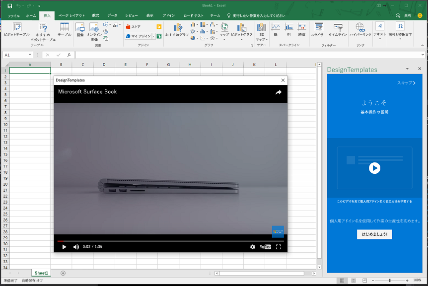

# <a name="use-the-dialog-api-in-your-office-add-ins"></a>Office アドインでダイアログ API を使用する

[ダイアログ API](/javascript/api/office/office.ui) を使用して、Office アドインでダイアログ ボックスを開くことができます。この記事では、Office アドインでダイアログ API を使用するためのガイダンスを提供します。

> [!NOTE]
> ダイアログ API の現在のサポート状態に関する詳細は、「[ダイアログ API の要件セット](/office/dev/add-ins/reference/requirement-sets/dialog-api-requirement-sets)」を参照してください。現在、ダイアログ API は Word、Excel、PowerPoint、および Outlook でサポートされています。

ダイアログ API の主要なシナリオは、Google や Facebook、Microsoft Graph などのリソースで認証を有効にすることです。 詳細については、この記事をよく読んだ*後*で「[Office Dialog API を使用して認証する](auth-with-office-dialog-api.md)」を参照してください。

作業ウィンドウ アドイン、コンテンツ アドイン、[アドイン コマンド](../design/add-in-commands.md)からダイアログ ボックスを開いて、次の操作を実行することを検討してください。

- 作業ウィンドウに直接開くことができないサインイン ページを表示する。
- アドインでの作業用に画面領域を広げる (あるいは全画面表示)。
- ビデオが作業ウィンドウに限定されている場合に、小さすぎるビデオをホストする。

> [!NOTE]
> UI 要素を重ねて表示することはお勧めできないため、シナリオで必要な場合を除き、作業ウィンドウでダイアログを開かないようにします。作業ウィンドウの表示領域の使用方法を検討するときには、作業ウィンドウはタブ表示できることに注意してください。例については、[Excel アドイン JavaScriptSalesTracker](https://github.com/OfficeDev/Excel-Add-in-JavaScript-SalesTracker) のサンプルを参照してください。

次の画像は、ダイアログ ボックスの例を示します。


ダイアログ ボックスが常に画面の中央に開くことに注意してください。ユーザーはダイアログ ボックスの移動とサイズ変更ができます。ウィンドウは*モードレス*です。ホスト Office アプリケーションのドキュメントの操作と、作業ウィンドウのホスト ページ (存在する場合) の操作の両方を続行できます。

## <a name="dialog-api-scenarios"></a>ダイアログ API のシナリオ

Office JavaScript API は、[Dialog](/javascript/api/office/office.dialog) オブジェクトと [Office.context.ui 名前空間](/javascript/api/office/office.ui)の 2 つの関数を使用する次のシナリオをサポートしています。

### <a name="open-a-dialog-box"></a>ダイアログ ボックスを開く

ダイアログ ボックスを開くには、作業ウィンドウのコードで [displayDialogAsync](/javascript/api/office/office.ui) メソッドを呼び出して、開くリソースの URL を渡します。これは、通常はページですが、MVC アプリケーションのコントローラー メソッド、ルート、Web サービス メソッド、またはその他のリソースの場合もあります。この記事では、'ページ' または 'Web サイト' とは、ダイアログ内のリソースを意味します。次のコードは簡単な例を示しています。

```js
Office.context.ui.displayDialogAsync('https://myAddinDomain/myDialog.html');
```

> [!NOTE]
> - この URL には HTTP**S** プロトコルを使用します。これは、読み込まれる最初のページだけでなく、ダイアログ ボックスに読み込まれるすべてのページで必須です。
> - ダイアログのリソースのドメインはホスト ページのドメインと同じです。ホスト ページは、作業ウィンドウ内のページまたはアドイン コマンドの[関数ファイル](/office/dev/add-ins/reference/manifest/functionfile)にすることができます。 ページ、コントローラーのメソッド、または `displayDialogAsync` メソッドに渡されるその他のリソースは、ホスト ページと同じドメインにある必要があります。

> [!IMPORTANT]
> ダイアログのホスト ページとリソースのフル ドメインは、同じである必要があります。 `displayDialogAsync` にアドインのドメインのサブドメインを渡そうとすると、正常に動作しません。 サブドメインを含む、フル ドメインが一致している必要があります。

最初のページ (または他のリソース) が読み込まれると、ユーザーは HTTPS を使用する任意の Web サイト (または他のリソース) に移動できます。また、すぐに別のサイトにリダイレクトするように最初のページを設計することもできます。

既定では、ダイアログ ボックスのサイズはデバイス画面の高さと幅の 80% ですが、次の例に示すように、メソッドに構成オブジェクトを渡すことによってさまざまな割合を設定できます。

```js
Office.context.ui.displayDialogAsync('https://myDomain/myDialog.html', {height: 30, width: 20});
```

これを実行するサンプル アドインについては、「[Office アドイン ダイアログ API の例](https://github.com/OfficeDev/Office-Add-in-Dialog-API-Simple-Example)」を参照してください。

全画面表示で効率的に操作するには、両方の値を 100% に設定します。(最大有効値は 99.5% であり、最大有効値にしても、ウィンドウは移動とサイズ変更が可能です。)

> [!NOTE]
> ホスト ウィンドウから開くことができるのは、1 つのダイアログ ボックスのみです。別のダイアログ ボックスを開こうとすると、エラーが発生します。たとえば、ユーザーが作業ウィンドウからダイアログ ボックスを開いた場合には、作業ウィンドウの別のページから 2 番目のダイアログ ボックスを開くことができません。ただし、[アドイン コマンド](../design/add-in-commands.md)からダイアログ ボックスを開く場合は、選択するたびにコマンドによって新しい (ただし非表示の) HTML ファイルが開かれます。これにより、新しい (非表示) ホスト ウィンドウが作成されるため、これらの各ウィンドウは独自のダイアログ ボックスを起動できます。詳細については、「[displayDialogAsync のエラー](#errors-from-displaydialogasync)」を参照してください。

### <a name="take-advantage-of-a-performance-option-in-office-on-the-web"></a>Office on the web のパフォーマンス オプションを利用する

`displayInIframe` プロパティは、`displayDialogAsync` に渡すことのできる構成オブジェクトの追加のプロパティです。 このプロパティを `true` に設定し、Office on the web で開いたドキュメントでアドインを実行している場合、ダイアログ ボックスは浮動の iframe で開き、独立したウィンドウでは開きません (この方が速く開きます)。 例を次に示します。

```js
Office.context.ui.displayDialogAsync('https://myDomain/myDialog.html', {height: 30, width: 20, displayInIframe: true});
```

既定値は `false` です。これはプロパティを完全に省略した場合と同じ状態です。 アドインが Office on the web で実行されていない場合、`displayInIframe` は無視されます。

> [!NOTE]
> どの時点であっても、iframe で開けないページにダイアログがリダイレクトされることになる場合は、`displayInIframe: true` を使用**しないでください**。たとえば、Google や Microsoft アカウントなどの多くの一般的な Web サービスのサインイン ページは iframe で開くことができません。

### <a name="handling-pop-up-blockers-with-office-on-the-web"></a>Office on the web を使用したポップアップ ブロックの処理

Office on the web の使用中にダイアログを表示しようとすると、ブラウザーのポップアップ ブロックによってダイアログがブロックされる可能性があります。 アドインのユーザーがアドインからのプロンプトに初めて同意する場合、ブラウザーのポップアップ ブロックが回避される可能性があります。 `displayDialogAsync` の [DialogOptions](/javascript/api/office/office.dialogoptions) には、そのようなポップアップをトリガーするための `promptBeforeOpen` プロパティがあります。 `promptBeforeOpen` は、次の動作を設定するブール値です。

 - `true` - ナビゲーションをトリガーし、ブラウザーのポップアップ ブロックを回避するためのポップアップがフレームワークに表示されます。 
 - `false` - ダイアログは表示されず、(ナビゲーションをトリガーするユーザー インターフェイス アーティファクトを提供することにより) 開発者はポップアップを処理する必要があります。 
 
ポップアップの外観は、次のスクリーンショットに類似したものになります。


 
### <a name="send-information-from-the-dialog-box-to-the-host-page"></a>ダイアログ ボックスからホスト ページに情報を送信する

ダイアログ ボックスは、以下の場合を除いて、作業ウィンドウのホスト ページと通信できません。

- ダイアログ ボックスの現在のページがホスト ページと同じドメインにある。
- Office JavaScript ライブラリがページに読み込まれている。(Office JavaScript ライブラリを使用するすべてのページと同様に、ページのスクリプトは `Office.initialize` プロパティにメソッドを割り当てる必要があります (空のメソッドでもかまいません)。詳細については、「[アドインの初期化](understanding-the-javascript-api-for-office.md#initializing-your-add-in)」を参照してください。)

ダイアログ ページのコードは、`messageParent` 関数を使用して、ブール値または文字列メッセージのいずれかをホスト ページに送信します。文字列には、単語、文、XML BLOB、文字列に変換された JSON、または文字列にシリアル化できるすべてのものを指定できます。次に例を示します。

```js
if (loginSuccess) {
    Office.context.ui.messageParent(true);
}
```

> [!NOTE]
> - `messageParent` 関数は、ダイアログ ボックスで呼び出すことができる、*ただ* 2 つの Office API のうちの 1 つです。もう 1 つは `Office.context.requirements.isSetSupported` です。詳細は、「[Office のホストと API の要件を指定する](specify-office-hosts-and-api-requirements.md)」を参照してださい。
> - `messageParent` 関数を呼び出せるのは、ホスト ページと同じドメイン (プロトコルとポートを含む) を持つページ上のみです。

次の例では、`googleProfile` は文字列に変換されたバージョンのユーザーの Google プロファイルです。

```js
if (loginSuccess) {
    Office.context.ui.messageParent(googleProfile);
}
```

ホスト ページは、メッセージを受信するように構成する必要があります。これを構成するには、`displayDialogAsync` の元の呼び出しにコールバック パラメーターを追加します。コールバックはハンドラーを `DialogMessageReceived` イベントに割り当てます。次に例を示します。

```js
var dialog;
Office.context.ui.displayDialogAsync('https://myDomain/myDialog.html', {height: 30, width: 20},
    function (asyncResult) {
        dialog = asyncResult.value;
        dialog.addEventHandler(Office.EventType.DialogMessageReceived, processMessage);
    }
);
```

> [!NOTE]
> - Office は [AsyncResult](/javascript/api/office/office.asyncresult) オブジェクトをコールバックに渡します。Office はダイアログ ボックスを開こうとした結果を表します。ただし、ダイアログ ボックスでのイベントの結果は表しません。この違いの詳細については、「[エラーとイベントの処理](#handle-errors-and-events)」セクションを参照してください。
> - `asyncResult` の `value` プロパティは [Dialog](/javascript/api/office/office.dialog) オブジェクトに設置されます。このオブジェクトはダイアログ ボックスの実行コンテキストではなく、ホスト ページに存在します。
> - `processMessage` はイベントを処理する関数です。任意の名前を指定できます。
> - `dialog` 変数は、`processMessage` でも参照されるため、コールバックよりも広い範囲で宣言されます。

`DialogMessageReceived` イベントのハンドラーの簡単な例を次に示します。

```js
function processMessage(arg) {
    var messageFromDialog = JSON.parse(arg.message);
    showUserName(messageFromDialog.name);
}
```

> [!NOTE]
> - Office は `arg` オブジェクトをハンドラーに渡します。その `message` プロパティは、ダイアログの `messageParent` の呼び出しで送信されるブール値または文字列です。この例では、Microsoft アカウントまたは Google などのサービスからのユーザーのプロファイルの文字列に変換された表記です。このため、`JSON.parse` を含むオブジェクトに逆シリアル化されます。
> - `showUserName` 実装は表示されません。作業ウィンドウ上に個人用のウェルカム メッセージが表示される場合があります。

ダイアログ ボックスのユーザー操作が完了すると、次の例に示すようにメッセージ ハンドラーはダイアログ ボックスを閉じます。

```js
function processMessage(arg) {
    dialog.close();
    // message processing code goes here;
}
```

> [!NOTE]
> - `dialog` オブジェクトは `displayDialogAsync` の呼び出しによって返されるものと同じである必要があります。
> - `dialog.close` の呼び出しは、直ちにダイアログ ボックスを閉じるよう Office に指示します。

これらの手法を使用するサンプル アドインについては、「[Office アドイン ダイアログ API の例](https://github.com/OfficeDev/Office-Add-in-Dialog-API-Simple-Example)」を参照してください。

メッセージを受信した後、アドインで作業ウィンドウの別のページを開く必要がある場合は、ハンドラーの最後の行として `window.location.replace` メソッド (または `window.location.href`) を使用できます。次に例を示します。

```js
function processMessage(arg) {
    // message processing code goes here;
    window.location.replace("/newPage.html");
    // Alternatively ...
    // window.location.href = "/newPage.html";
}
```

これを実行するアドインの例については、「[Insert Excel charts using Microsoft Graph in a PowerPoint add-in](https://github.com/OfficeDev/PowerPoint-Add-in-Microsoft-Graph-ASPNET-InsertChart)」 (PowerPoint アドインで Microsoft Graph を使用した Excel グラフの挿入) のサンプルを参照してください。

#### <a name="conditional-messaging"></a>条件付きのメッセージング

ダイアログ ボックスから複数の `messageParent` 呼び出しを送信できますが、`DialogMessageReceived` イベントのホスト ページにあるハンドラーは 1 つのみのため、ハンドラーは条件ロジックを使用してさまざまなメッセージを区別する必要があります。たとえば、ユーザーに対して Microsoft アカウントまたは Google などの ID プロバイダーにサインインするよう求めるダイアログ ボックスが表示されると、ダイアログ ボックスはユーザーのプロファイルをメッセージとして送信します。認証が失敗した場合、次の例のように、ダイアログ ボックスはホスト ページにエラー情報を送信します。

```js
if (loginSuccess) {
    var userProfile = getProfile();
    var messageObject = {messageType: "signinSuccess", profile: userProfile};
    var jsonMessage = JSON.stringify(messageObject);
    Office.context.ui.messageParent(jsonMessage);
} else {
    var errorDetails = getError();
    var messageObject = {messageType: "signinFailure", error: errorDetails};
    var jsonMessage = JSON.stringify(messageObject);
    Office.context.ui.messageParent(jsonMessage);
}
```

> [!NOTE]
> - `loginSuccess` 変数は、ID プロバイダーからの HTTP 応答を読み取ることによって初期化されます。
> - `getProfile` 関数と `getError` 関数の実装は表示されません。両方の関数はそれぞれ、クエリ パラメーターまたは HTTP 応答の本文からデータを取得します。
> - サインインが成功したかどうかに応じて、さまざまな種類の匿名のオブジェクトが送信されます。両方の関数に `messageType` プロパティがありますが、一方には `profile` プロパティ、もう一方には `error` プロパティがあります。

次の例に示すように、ホスト ページのハンドラー コードは分岐に `messageType` プロパティの値を使用します。`showUserName` 関数は上記の例と同じであり、`showNotification` 関数はホスト ページの UI にエラーを表示することに注意してください。

```js
function processMessage(arg) {
    var messageFromDialog = JSON.parse(arg.message);
    if (messageFromDialog.messageType === "signinSuccess") {
        dialog.close();
        showUserName(messageFromDialog.profile.name);
        window.location.replace("/newPage.html");
    } else {
        dialog.close();
        showNotification("Unable to authenticate user: " + messageFromDialog.error);
    }
}
```

> [!NOTE]
> `showNotification`の実装は、この記事のサンプル コードでは表示されません。 アドインでこの関数を実装する方法の例は、「[Office アドイン ダイアログ API の例](https://github.com/OfficeDev/Office-Add-in-Dialog-API-Simple-Example)」を参照してください。

### <a name="closing-the-dialog-box"></a>ダイアログ ボックスを閉じる

ダイアログ ボックスを閉じるボタンをダイアログ ボックス内に実装できます。これを実行するには、ボタンのクリック イベント ハンドラーは `messageParent` を使用して、ボタンがクリックされたことをホスト ページに通知する必要があります。次に例を示します。

```js
function closeButtonClick() {
    var messageObject = {messageType: "dialogClosed"};
    var jsonMessage = JSON.stringify(messageObject);
    Office.context.ui.messageParent(jsonMessage);
}
```

`DialogMessageReceived` のホスト ページ ハンドラーは、この例のように `dialog.close` を呼び出します (ダイアログ オブジェクトを初期化する方法を示す、前述の例を参照してください)。


```js
function processMessage(arg) {
    var messageFromDialog = JSON.parse(arg.message);
    if (messageFromDialog.messageType === "dialogClosed") {
       dialog.close();
    }
}
```

独自の終了ダイアログ UI がない場合でも、エンド ユーザーは右上隅にある **X** を選択してダイアログ ボックスを閉じることができます。この操作により `DialogEventReceived` イベントがトリガーされます。イベントがトリガーされたときに、ホスト ウィンドウに通知する必要がある場合、ホスト ウィンドウはこのイベントのハンドラーを宣言する必要があります。詳細については、「[ダイアログ ウィンドウでのエラーとイベント](#errors-and-events-in-the-dialog-window)」セクションを参照してください。

## <a name="handle-errors-and-events"></a>エラーとイベントを処理する

コードでイベントの 2 つのカテゴリを処理する必要があります。

- ダイアログ ボックスを作成できないために `displayDialogAsync` の呼び出しによって返されるエラー。
- ダイアログ ウィンドウでのエラーと他のイベント。

### <a name="errors-from-displaydialogasync"></a>displayDialogAsync のエラー

一般的なプラットフォームやシステムのエラーの他に、`displayDialogAsync` の呼び出しに特有の次のエラーがあります。

|コード番号|意味|
|:-----|:-----|
|12004|`displayDialogAsync` に渡される URL のドメインは信頼されていません。ドメインは、ホスト ページと同じドメインにある必要があります (プロトコルとポート番号を含む)。|
|12005|`displayDialogAsync` に渡される URL には HTTP プロトコルを使用します。HTTPS が必要です。(Office の一部のバージョンでは、12004 で返されるのと同じエラー メッセージが 12005 でも返されます。)|
|<span id="12007">12007</span>|ダイアログ ボックスは、このホスト ウィンドウで既に開いています。作業ウィンドウなどのホスト ウィンドウで一度に開けるダイアログ ボックスは 1 つだけです。|
|12009|ダイアログ ボックスを無視するようにユーザーが選択しました。 このエラーは、ダイアログの表示をアドインに許可しないようにユーザーが選択すると、Office のオンライン バージョンで発生することがあります。|

`displayDialogAsync` が呼び出されると、常に [AsyncResult](/javascript/api/office/office.asyncresult) オブジェクトがコールバック関数に渡されます。 呼び出しが成功した場合 (つまり、ダイアログ ウィンドウが開いた場合)、`AsyncResult` オブジェクトの `value` プロパティは [Dialog](/javascript/api/office/office.dialog) オブジェクトです。 この例は、「[ダイアログ ボックスからホスト ページに情報を送信する](#send-information-from-the-dialog-box-to-the-host-page)」セクションで参照できます。 `displayDialogAsync` への呼び出しが失敗した場合は、ウィンドウは作成されず、`AsyncResult` オブジェクトの `status` プロパティが `Office.AsyncResultStatus.Failed` に設定され、オブジェクトの `error` プロパティが設定されます。 `status` をテストして、エラーが発生したときに応答するコールバックを常に設定しておく必要があります。 コード番号に関係なくエラー メッセージのみを報告するコードの例を、次に示します。

```js
var dialog;
Office.context.ui.displayDialogAsync('https://myDomain/myDialog.html',
function (asyncResult) {
    if (asyncResult.status === Office.AsyncResultStatus.Failed) {
        showNotification(asyncResult.error.code = ": " + asyncResult.error.message);
    } else {
        dialog = asyncResult.value;
        dialog.addEventHandler(Office.EventType.DialogMessageReceived, processMessage);
    }
});
```

### <a name="errors-and-events-in-the-dialog-window"></a>ダイアログ ウィンドウでのエラーとイベント

ダイアログ ボックス内の、コード番号で知られている 3 つのエラーとイベントによって、ホスト ページで `DialogEventReceived` イベントがトリガーされます。

|コード番号|意味|
|:-----|:-----|
|12002|以下のいずれか:<br> - `displayDialogAsync` に渡された URL にページが存在しない。<br> - `displayDialogAsync` に渡されたページが読み込まれたが、ダイアログ ボックスが見つからないか読み込むことができないページを指していたか、またはダイアログ ボックスが無効な構文を含む URL を指している。|
|12003|ダイアログ ボックスが HTTP プロトコルを使用している URL を指していました。HTTPS が必要です。|
|12006|ダイアログ ボックスが閉じられました。通常は、ユーザーが **X** ボタンを選択したためです。|

コードで、呼び出し内の `DialogEventReceived` イベントのハンドラーを `displayDialogAsync` に割り当てることができます。次に簡単な例を示します。

```js
var dialog;
Office.context.ui.displayDialogAsync('https://myDomain/myDialog.html',
    function (result) {
        dialog = result.value;
        dialog.addEventHandler(Office.EventType.DialogEventReceived, processDialogEvent);
    }
);
```

各エラー コードのカスタム エラー メッセージを作成する `DialogEventReceived` イベントのハンドラーの例を、次に示します。

```js
function processDialogEvent(arg) {
    switch (arg.error) {
        case 12002:
            showNotification("The dialog box has been directed to a page that it cannot find or load, or the URL syntax is invalid.");
            break;
        case 12003:
            showNotification("The dialog box has been directed to a URL with the HTTP protocol. HTTPS is required.");            break;
        case 12006:
            showNotification("Dialog closed.");
            break;
        default:
            showNotification("Unknown error in dialog box.");
            break;
    }
}
```

この方法でエラーを処理するサンプル アドインについては、「[Office アドイン ダイアログ API の例](https://github.com/OfficeDev/Office-Add-in-Dialog-API-Simple-Example)」を参照してください。


## <a name="pass-information-to-the-dialog-box"></a>情報をダイアログ ボックスに渡す

ホスト ページがダイアログ ボックスに情報を渡す必要がある場合もあります。これは主に 2 つの方法で実行することができます。

- `displayDialogAsync` に渡される URL にクエリ パラメーターを追加します。
- ホスト ウィンドウとダイアログ ボックスの両方にアクセス可能な場所に情報を格納します。2 つのウィンドウは共通のセッション ストレージを共有しませんが、ポート番号 (存在する場合) を含む*ドメインが同じである場合*は、共通の[ローカル ストレージ](https://www.w3schools.com/html/html5_webstorage.asp)を共有します。\*

> [!NOTE]
> \* トークン処理の戦略に影響を与えるバグがあります。 Safari または Edge ブラウザーの **Office on the web** でアドインを実行している場合、ダイアログとタスク ウィンドウは同じローカル ストレージを共有しないため、これらの間の通信に使用できません。

### <a name="use-local-storage"></a>ローカル ストレージの使用

ローカル ストレージを使用するには、次の例に示すように、`displayDialogAsync` 呼び出しの前に、コードはホスト ページで `window.localStorage` オブジェクトの `setItem` メソッドを呼び出します。

```js
localStorage.setItem("clientID", "15963ac5-314f-4d9b-b5a1-ccb2f1aea248");
```

ダイアログ ウィンドウ内のコードは、次の例に示すように、必要に応じて項目を読み取ります。

```js
var clientID = localStorage.getItem("clientID");
// You can also use property syntax:
// var clientID = localStorage.clientID;
```

### <a name="use-query-parameters"></a>クエリ パラメーターの使用

次の例では、クエリ パラメーターを使用してデータを渡す方法を示します。

```js
Office.context.ui.displayDialogAsync('https://myAddinDomain/myDialog.html?clientID=15963ac5-314f-4d9b-b5a1-ccb2f1aea248');
```

この手法を使用するサンプルについては、「[PowerPoint アドインで Microsoft Graph を使用した Excel グラフの挿入](https://github.com/OfficeDev/PowerPoint-Add-in-Microsoft-Graph-ASPNET-InsertChart)」を参照してください。

ダイアログ ウィンドウ内のコードは、URL を解析し、パラメーター値を読み取ることができます。

> [!NOTE]
> Office は、`displayDialogAsync` に渡される URL に `_host_info` というクエリ パラメーターを自動的に追加します (カスタム クエリ パラメーターが存在する場合は、その後に追加されます。ダイアログ ボックスが移動する先の後続の URL には追加されません)。Microsoft は、将来、この値の内容を変更したり、完全に削除したりする可能性があるため、コードでこの値の内容を読み取らないでください。ダイアログ ボックスのセッション ストレージには、同じ値が追加されます。この場合も、*コードではこの値に対する読み取りも書き込みも行わないでください*。

## <a name="use-the-dialog-apis-to-show-a-video"></a>ダイアログ API を使用してビデオを表示する

ダイアログ ボックスでビデオを表示するには

1.  コンテンツのみが iframe であるページを作成します。iframe の `src` 属性はオンライン ビデオをポイントします。ビデオの URL のプロトコルは HTTP**S** である必要があります。この記事では、このページを "video.dialogbox.html" と呼びます。マークアップの例を次に示します。

    ```HTML
    <iframe class="ms-firstrun-video__player"  width="640" height="360"
        src="https://www.youtube.com/embed/XVfOe5mFbAE?rel=0&autoplay=1"
        frameborder="0" allowfullscreen>
    </iframe>
    ```

2.  video.dialogbox.html ページは、ホスト ページと同じドメインにある必要があります。
3.  ホスト ページで `displayDialogAsync` の呼び出しを使用して、video.dialogbox.html を開きます。
4.  ユーザーがダイアログ ボックスを閉じたときに、アドインに通知する必要がある場合は、`DialogEventReceived` イベントのハンドラーを登録して、12006 イベントを処理します。詳しくは、「[ダイアログ ウィンドウでのエラーとイベント](#errors-and-events-in-the-dialog-window)」セクションを参照してください。

ダイアログ ボックスにビデオを表示するサンプルについては、[ビデオ プレイスマット設計パターン](/office/dev/add-ins/design/first-run-experience-patterns#video-placemat)を参照してください。



## <a name="use-the-dialog-apis-in-an-authentication-flow"></a>認証フローでダイアログ API を使用する

「[Office Dialog API を使用して認証する](auth-with-office-dialog-api.md)」を参照してください。

## <a name="using-the-office-dialog-api-with-single-page-applications-and-client-side-routing"></a>単一ページ アプリケーションとクライアント側ルーティングで Office ダイアログ API を使用する

単一ページ アプリケーション (SPAs) が通常使用するように、アドインがクライアント側ルーティングを使用している場合は、HTML の完了ページと個別ページの URL の代わりに、ルートの URL を [displayDialogAsync](/javascript/api/office/office.ui) メソッド (*推奨*) に渡すこともできます。

ダイアログ ボックスは、独自の実行コンテキストを含む新しいウィンドウ内にあります。 ルートを渡すと、ダイアログ ウィンドウで、この新しいコンテキストに対して基本ページとそのすべての初期化、およびブートストラップ コードを再度実行し、すべての変数が初期値に設定されます。 そのため、この手法はダイアログ ウィンドウにアプリケーションの 2 番目のインスタンスをダウンロードして起動します。これにより、SPA の目的が部分的に無効になります。 さらに、ダイアログ ウィンドウ内の変数を変更するコードは、同じ変数の作業ウィンドウのバージョンは変更しません。 同様に、ダイアログ ウィンドウには、それ自体にセッション ストレージがあり、作業ウィンドウからコードでそこにアクセスすることはできません。

そのため、ルートを `displayDialogAsync` メソッドに渡した場合、実際に SPA はありません。同じ SPA の 2 つのインスタンスがあります。 さらに、作業ウィンドウのインスタンスのコードは大半がそのインスタンスで使用されません。また、ダイアログ インスタンスのコードの大半も、そのインスタンスで使用されません。 同じバンドルに 2 つの SPA があるようなものです。 ダイアログで実行する必要があるコードが複雑な場合は、これを明示的に行う必要がある場合があります。つまり、同じドメインの異なるフォルダーに 2 つの SPA があります。 ただし、ほとんどの場合、ダイアログで必要になるのは単純なロジックのみです。 このような場合、SPA のドメインで単純な HTML ページ (JavaScript が埋め込まれているか、参照されている) をホストするだけで、プロジェクトが大幅に簡略化されます。 ページの URL を `displayDialogAsync` メソッドに渡します。 これは、単一ページのアプリという文字通りの考え方から逸脱していることを意味する場合がありますが、前述のように、ダイアログを使用している場合は、SPA のインスタンスは実際には 1 つではありません。
