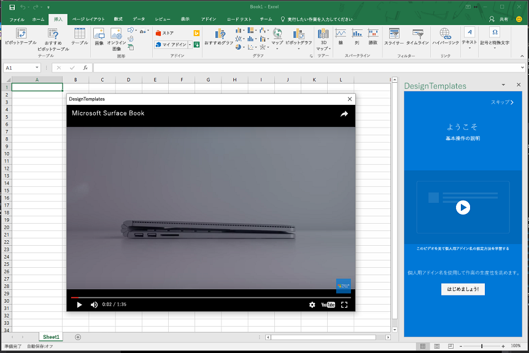

# <a name="use-the-office-dialog-box-to-show-a-video"></a>Office ダイアログボックスを使用してビデオを表示する

この記事では、Office アドインダイアログボックスでビデオを再生する方法について説明します。

> [!NOTE]
> この記事では、「office[アドインで office ダイアログ API を使用](dialog-api-in-office-add-ins.md)する」で説明されているように、office ダイアログボックスの使用に関する基本事項を理解していることを前提としています。

Office ダイアログ API を使用してダイアログボックス内のビデオを再生するには、次の手順を実行します。

1. Iframe を含むページを作成し、その他のコンテンツは作成しません。 このページは、ホストページと同じドメインにある必要があります。 ホストページについての通知については、「[ホストページからダイアログボックスを開く](dialog-api-in-office-add-ins.md#open-a-dialog-box-from-a-host-page)」を参照してください。 Iframe の`src`属性で、オンラインビデオの URL をポイントします。 ビデオの URL のプロトコルは HTTPS である必要があります。 この記事では、このページを "video. .html" と呼びます。 マークアップの例を次に示します。

    ```HTML
    <iframe class="ms-firstrun-video__player"  width="640" height="360"
        src="https://www.youtube.com/embed/XVfOe5mFbAE?rel=0&autoplay=1"
        frameborder="0" allowfullscreen>
    </iframe>
    ```

2. ホスト ページで `displayDialogAsync` の呼び出しを使用して、video.dialogbox.html を開きます。
3. ユーザーがダイアログ ボックスを閉じたときに、アドインに通知する必要がある場合は、`DialogEventReceived` イベントのハンドラーを登録して、12006 イベントを処理します。 詳細については、「 [Office ダイアログボックスでのエラーとイベント](dialog-handle-errors-events.md)」を参照してください。

ダイアログボックスでビデオを再生する例については、「[ビデオプレイスマット設計パターン](/office/dev/add-ins/design/first-run-experience-patterns#video-placemat)」を参照してください。


