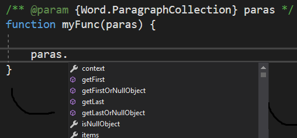

# <a name="get-javascript-intellisense-in-visual-studio-2017"></a>Visual Studio 2017 で JavaScript IntelliSense を利用できるようにする 

Visual Studio 2017 を使用して Office アドインを開発する場合は、JSDoc を使用することで、JavaScript の変数、オブジェクト、パラメーター、および戻り値の IntelliSense を有効にできます。この記事では、JSDoc の概要と、JSDoc を使用して Visual Studio の IntellSense を作成する方法について説明します。詳細については、「[JavaScript IntelliSense](https://docs.microsoft.com/ja-jp/visualstudio/ide/javascript-intellisense)」および「[JSDoc support in JavaScript](https://github.com/Microsoft/TypeScript/wiki/JsDoc-support-in-JavaScript)」を参照してください。 

## <a name="officejs-type-definitions"></a>Office.js の型定義

Visual Studio に Office.js の型の定義を提供する必要があります。そのために、次の操作を実行します。

- `\Office\1\` という名前のソリューションのフォルダーに Office.js ファイルのローカル コピーを用意します。アドイン プロジェクトの作成時に、Visual Studio の Office アドイン プロジェクト テンプレートにより、このローカル コピーが追加されます。 
- アドイン ソリューションの Web アプリケーション プロジェクトのルートに、tsconfig.json ファイルを追加することで、Office.js のオンライン バージョンを使用します。ファイルには、次のコンテンツが含まれている必要があります。

    ```json
        {        
            "compilerOptions": {
                "allowJs": true,            // These settings apply to JavaScript files also.
                "noEmit":  true             // Do not compile the JS (or TS) files in this project.
            },
            "exclude": [
                "node_modules",             // Don't include any JavaScript found under "node_modules".
                "Scripts/Office/1"          // Suppress loading all the JavaScript files from the Office NuGet package.
            ],
            "typeAcquisition": {
                "enable": true,             // Enable automatic fetching of type definitions for detected JavaScript libraries.
                "include": [ "office-js" ]  // Ensure that the "Office-js" type definition is fetched.
            }
        }
    ```

## <a name="jsdoc-syntax"></a>JSDoc 構文

基本的な手法として、変数 (またはパラメーターなど) の前に、データ型を識別するコメントを付けます。これにより、Visual Studio の IntelliSense は、そのメンバーを推測できるようになります。次に例を示します。

### <a name="variable"></a>可変

```js
/** @type {Excel.Range} */
var subsetRange;
```


### <a name="parameter"></a>パラメーター

```js
/** @param {Word.ParagraphCollection} paragraphs */
function myFunc(paragraphs){

}
```


### <a name="return-value"></a>戻り値

```js
/** @returns {Word.Range} */
function myFunc() {

}
```


### <a name="complex-types"></a>複合型

```js
/** @typedef {{range: Word.Range, paragraphs: Word.ParagraphCollection}} MyType

/** @returns {MyType} */
function myFunc() {

}
```


## <a name="see-also"></a>関連項目

- [Visual Studio でのアドインの作成とデバッグ](create-and-debug-office-add-ins-in-visual-studio.md)
