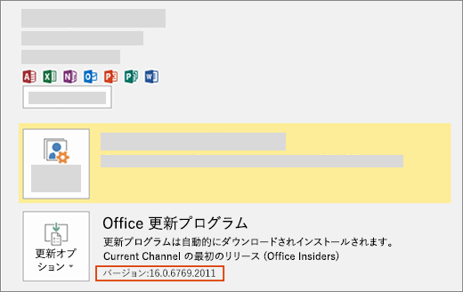

# Office の最新バージョンをインストールするInstall the latest version of Office

新しい開発者用機能 (現時点ではプレビュー版のものを含む) は、Office の最新ビルドの取得をオプトインしたサブスクライバーに最初に配信されます。New developer features, including those still in preview, are delivered first to subscribers who opt in to get the latest builds of Office.

## 最新のビルドを取得するためにオプトインするOpt in to getting the latest builds

Office の最新ビルドを取得するためにオプトインするには、次の操作を行います。To opt in to getting the latest builds of Office:

- Office 365 Solo のサブスクライバーは、「[Office Insider になる](https://products.office.com/office-insider)」を参照してください。If you're an Office 365 Home, Personal, or University subscriber, see [Be an Office Insider](https://products.office.com/office-insider).
- 一般法人向け Office 365 をご利用の場合は、「[一般法人向け Office 365 の先行リリース ビルドをインストールする](https://support.office.com/article/Install-the-First-Release-build-for-Office-365-for-business-customers-4dd8ba40-73c0-4468-b778-c7b744d03ead)」を参照してください。If you're an Office 365 for business customer, see [Install the First Release build for Office 365 for business customers](https://support.office.com/article/Install-the-First-Release-build-for-Office-365-for-business-customers-4dd8ba40-73c0-4468-b778-c7b744d03ead).
- Mac で Office を実行している場合は、次の操作を行います。If you're running Office on a Mac:
  - Office アプリケーションを起動します。Start an Office application.
  - [ヘルプ] メニューで [**更新プログラムのチェック**] を選択します。Select **Check for Updates** on the Help menu.
  - [Microsoft AutoUpdate] ボックスで、チェック ボックスをオンにして Office Insider プログラムに参加します。In the Microsoft AutoUpdate box, check the box to join the Office Insider program.

## 最新ビルドを取得するGet the latest build

Office の最新ビルドを取得するには、次の操作を行います。To get the latest build of Office:

1. [Office 展開ツール](https://www.microsoft.com/download/details.aspx?id=49117)をダウンロードします。Download the [Office Deployment Tool](https://www.microsoft.com/download/details.aspx?id=49117).
2. ツールを実行します。これにより、Setup.exe および configuration.xml という 2 つのファイルが抽出されます。Run the tool. This extracts the following two files: Setup.exe and configuration.xml.
3. configuration.xml を[先行リリース構成ファイル](https://raw.githubusercontent.com/OfficeDev/Office-Add-in-Commands-Samples/master/Tools/FirstReleaseConfig/configuration.xml)に置き換えます。Replace the configuration.xml file with the [First Release Configuration File](https://raw.githubusercontent.com/OfficeDev/Office-Add-in-Commands-Samples/master/Tools/FirstReleaseConfig/configuration.xml).
4. 次のコマンドを管理者として実行します: `setup.exe /configure configuration.xml`Run the following command as an administrator:  `setup.exe /configure configuration.xml`

> [!NOTE]
> このコマンドの実行には時間がかかることがあります (進行状況は表示されません)。The command might take a long time to run without indicating progress.

インストール処理の完了時点で、最新の Office アプリケーションがインストールされています。When the installation process finishes, you will have the latest Office applications installed. 最新のビルドであることを確認するには、任意の Office アプリケーションから **[ファイル]**、**[アカウント]** の順に移動します。To verify that you have the latest build, go to **File** > **Account** from any Office application. [Office 更新プログラム] に、[(Office Insiders)] ラベルが表示され、その下にバージョン番号が表示されます。Under Office Updates, you'll see the (Office Insiders) label above the version number.

## Office JavaScript API の要件セットの最小 Office ビルドMinimum Office builds for Office JavaScript API requirement sets

API の要件セットの各プラットフォームの最小製品ビルドについては、次をご覧ください。For information about the minimum product builds for each platform for the API requirement sets, see the following:

- [Excel JavaScript API の要件セットExcel JavaScript API requirement sets](/office/dev/add-ins/reference/requirement-sets/excel-api-requirement-sets)
- [OneNote JavaScript API の要件セットOneNote JavaScript API requirement sets](/office/dev/add-ins/reference/requirement-sets/onenote-api-requirement-sets)
- [Outlook JavaScript API の要件セットOutlook JavaScript API requirement sets](/office/dev/add-ins/reference/requirement-sets/outlook-api-requirement-sets)
- [PowerPoint JavaScript API の要件セットPowerPoint JavaScript API requirement sets](/office/dev/add-ins/reference/requirement-sets/powerpoint-api-requirement-sets)
- [Word JavaScript API の要件セットWord JavaScript API requirement sets](/office/dev/add-ins/reference/requirement-sets/word-api-requirement-sets)
- [ダイアログ API の要件セットDialog API requirement sets](/office/dev/add-ins/reference/requirement-sets/dialog-api-requirement-sets)
- [Office 共通 API の要件セットOffice Common API requirement sets](/office/dev/add-ins/reference/requirement-sets/office-add-in-requirement-sets)
