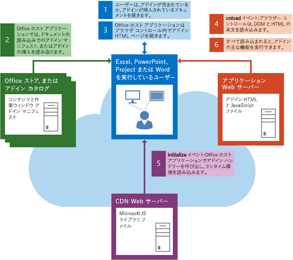
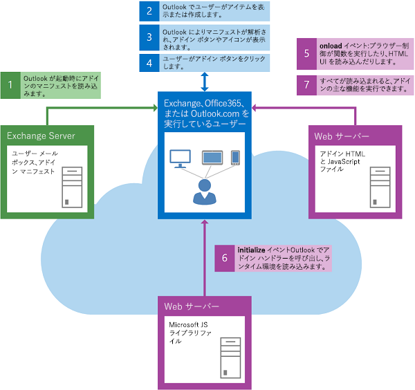

# DOM とランタイム環境を読み込む

アドインでは、DOM と Office アドイン両方のランタイム環境が、独自のカスタム ロジックを実行する前に読み込まれていることを確認する必要があります。

## コンテンツまたは作業ウィンドウ アドインの起動

次の図では、Excel、PowerPoint、Project、または Word のコンテンツ アドインまたは作業ウィンドウ アドインの起動に関連するイベントのフローを示しています。

次のイベントは、コンテンツ アドインまたは作業ウィンドウ アドインの開始時に発生します。

1. ユーザーは、既にアドインが含まれているドキュメントを開くか、ドキュメントにアドインを挿入します。

2. クライアント Officeは、アドインの XML マニフェストを AppSource、SharePoint のアプリ カタログ、またはそれが作成元の共有フォルダー カタログから読み取ります。

3. クライアント Officeブラウザー コントロールでアドインの HTML ページを開きます。

    次の手順 4. と 5. は、同時に実行されることも、同時に実行されないこともあります。したがって、次の処理に進む前に、DOM とアドイン ランタイム環境の両方の読み込みが完了したことをアドインのコードで確認する必要があります。

4. ブラウザー コントロールは DOM と HTML 本文を読み込み、イベントのイベント ハンドラーを呼び出 `window.onload` します。

5. Office クライアント アプリケーションはランタイム環境を読み込み、Office JavaScript API ライブラリ ファイルをコンテンツ配布ネットワーク (CDN) サーバーからダウンロードしてキャッシュし、ハンドラーが割り当てられている場合は[、Office](/javascript/api/office)オブジェクトのinitialize イベントに対してアドインのイベント ハンドラーを呼び出します。 現時点では、コールバック (またはチェーンされた `then()` 関数) が `Office.onReady` ハンドラーに渡された (チェーンされた) かどうかも確認します。 との区別の詳細については、「 `Office.initialize` アドイン `Office.onReady` の初期化 [」を参照してください](initialize-add-in.md)。

6. DOM と HTML 本文の読み込み、およびアドインの初期化が完了すると、アドインのメイン関数は処理を続行できます。

## Outlook アドインの起動

次の図は、デスクトップ、タブレット、スマートフォンで実行される Outlook アドインの起動に関係するイベントのフローを示しています。

次のイベントは、アドインのOutlook発生します。

1. Outlook は起動時に、ユーザーの電子メール アカウント用にインストールされている Outlook アドインの XML マニフェストを読み取ります。

2. ユーザーが Outlook でアイテムを選択します。

3. 選択されたアイテムが Outlook アドインのアクティブ化条件を満たしている場合は、Outlook がアドインをアクティブにし、ボタンを UI に表示します。

4. ユーザーがボタンをクリックして Outlook アドインを起動すると、Outlook がアプリの HTML ページをブラウザー コントロール内に表示します。次の手順 5 と 6 は同時に行われます。

5. ブラウザー コントロールは DOM と HTML 本文を読み込み、イベントのイベント ハンドラーを呼び出 `onload` します。

6. Outlook がランタイム環境を読み込みます (このランタイム環境は、コンテンツ配布ネットワーク (CDN) サーバーから JavaScript API for JavaScript ライブラリ ファイルをダウンロードしてキャッシュします)。その後、ハンドラーが割り当てられている場合は、アドインの [Office](/javascript/api/office#Office_initialize_reason_) オブジェクトの [initialize](/javascript/api/office) イベントに対するイベント ハンドラーを呼び出します。 現時点では、コールバック (またはチェーンされた `then()` 関数) が `Office.onReady` ハンドラーに渡された (チェーンされた) かどうかも確認します。 との区別の詳細については、「 `Office.initialize` アドイン `Office.onReady` の初期化 [」を参照してください](initialize-add-in.md)。

7. DOM と HTML 本文の読み込み、およびアドインの初期化が完了すると、アドインのメイン関数は処理を続行できます。

## 関連項目

- [Office JavaScript API について](understanding-the-javascript-api-for-office.md)
- [Office アドインを初期化する](initialize-add-in.md)
