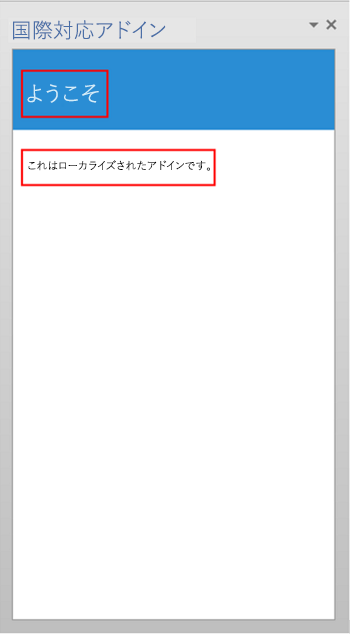

# <a name="localization-for-office-add-ins"></a><span data-ttu-id="04e1e-103">Office アドインのローカライズ</span><span class="sxs-lookup"><span data-stu-id="04e1e-103">Localization for Office Add-ins</span></span>

<span data-ttu-id="04e1e-104">Office アドイン に適切なローカライズ方法を任意に選んで実装できます。</span><span class="sxs-lookup"><span data-stu-id="04e1e-104">You can implement any localization scheme that's appropriate for your Office Add-in.</span></span> <span data-ttu-id="04e1e-105">JavaScript API と Office アドイン プラットフォームのマニフェスト スキーマには、いくつかの選択肢が用意されています。</span><span class="sxs-lookup"><span data-stu-id="04e1e-105">The JavaScript API and manifest schema of the Office Add-ins platform provide some choices.</span></span> <span data-ttu-id="04e1e-106">Office JavaScript API を使用して、ロケールを決定し、ホストアプリケーションのロケールに基づいて文字列を表示したり、データのロケールに基づいてデータを解釈または表示したりすることができます。</span><span class="sxs-lookup"><span data-stu-id="04e1e-106">You can use the Office JavaScript API to determine a locale and display strings based on the locale of the host application, or to interpret or display data based on the locale of the data.</span></span> <span data-ttu-id="04e1e-107">マニフェストを使用すると、ロケールに固有なアドイン ファイルの場所と説明的な情報を指定できます。</span><span class="sxs-lookup"><span data-stu-id="04e1e-107">You can use the manifest to specify locale-specific add-in file location and descriptive information.</span></span> <span data-ttu-id="04e1e-108">または、Microsoft Ajax スクリプトを使用して、グローバリゼーションとローカライズをサポートできます。</span><span class="sxs-lookup"><span data-stu-id="04e1e-108">Alternatively, you can use Microsoft Ajax script to support globalization and localization.</span></span>

## <a name="use-the-javascript-api-to-determine-locale-specific-strings"></a><span data-ttu-id="04e1e-109">ロケール固有文字列を判別するための JavaScript API の使用</span><span class="sxs-lookup"><span data-stu-id="04e1e-109">Use the JavaScript API to determine locale-specific strings</span></span>

<span data-ttu-id="04e1e-110">Office JavaScript API には、ホストアプリケーションのロケールと一致する値の表示または解釈をサポートする2つのプロパティが用意されています。</span><span class="sxs-lookup"><span data-stu-id="04e1e-110">The Office JavaScript API provides two properties that support displaying or interpreting values consistent with the locale of the host application and data:</span></span>

- <span data-ttu-id="04e1e-111">[Context.displayLanguage][displayLanguage] には、ホスト アプリケーションのユーザー インターフェイスのロケール (または言語) を指定します。</span><span class="sxs-lookup"><span data-stu-id="04e1e-111">[Context.displayLanguage][displayLanguage] specifies the locale (or language) of the user interface of the host application.</span></span> <span data-ttu-id="04e1e-112">次の例では、ホスト アプリケーションで en-US または fr-Fr のどちらのロケールが使用されるかを確認し、ロケールに合った挨拶文を表示します。</span><span class="sxs-lookup"><span data-stu-id="04e1e-112">The following example verifies if the host application uses the en-US or fr-FR locale, and displays a locale-specific greeting.</span></span>

    ```js
    function sayHelloWithDisplayLanguage() {
        var myLanguage = Office.context.displayLanguage;
        switch (myLanguage) {
            case 'en-US':
                write('Hello!');
                break;
            case 'fr-FR':
                write('Bonjour!');
                break;
        }
    }

    // Function that writes to a div with id='message' on the page.
    function write(message) {
        document.getElementById('message').innerText += message;
    }
    ```

- <span data-ttu-id="04e1e-p103">[Context.contentLanguage][contentLanguage] では、データのロケール (または言語) を指定します。[displayLanguage] プロパティを確認する代わりに、最後のコード サンプルを拡張します。`myLanguage` を [contentLanguage] プロパティの値に割り当て、同じコードの残りの部分を使用して、データのロケールに基づいて、あいさつ文を表示します。</span><span class="sxs-lookup"><span data-stu-id="04e1e-p103">[Context.contentLanguage][contentLanguage] specifies the locale (or language) of the data. Extending the last code sample, instead of checking the [displayLanguage] property, assign `myLanguage` the value of the [contentLanguage] property, and use the rest of the same code to display a greeting based on the locale of the data:</span></span>

    ```js
    var myLanguage = Office.context.contentLanguage;
    ```

## <a name="control-localization-from-the-manifest"></a><span data-ttu-id="04e1e-115">マニフェストでのローカライズの制御</span><span class="sxs-lookup"><span data-stu-id="04e1e-115">Control localization from the manifest</span></span>


<span data-ttu-id="04e1e-p104">すべての Office アドインでは、マニフェストで [DefaultLocale] 要素とロケールを指定します。Office アドイン プラットフォームと Office ホスト アプリケーションの既定では、[Description]、[DisplayName]、[IconUrl]、[HighResolutionIconUrl]、[SourceLocation] 要素の値をすべてのロケールに適用します。必要に応じて、特定のロケールに対して特定の値を指定できます。それには、これら 5 つの要素について、追加のロケールに対応する [Override] 子要素を指定します。[DefaultLocale] 要素の値と、[Override] 要素の `Locale` 属性の値は、[RFC 3066] の「Tags for the Identification of Languages」に従って指定します。表 1. は、これらの要素でのローカライズのサポートの説明です。</span><span class="sxs-lookup"><span data-stu-id="04e1e-p104">Every Office Add-in specifies a [DefaultLocale] element and a locale in its manifest. By default, the Office Add-in platform and Office host applications apply the values of the [Description], [DisplayName], [IconUrl], [HighResolutionIconUrl], and [SourceLocation] elements to all locales. You can optionally support specific values for specific locales, by specifying an [Override] child element for each additional locale, for any of these five elements. The value for the [DefaultLocale] element and for the `Locale` attribute of the [Override] element is specified according to [RFC 3066], "Tags for the Identification of Languages." Table 1 describes the localizing support for these elements.</span></span>

<span data-ttu-id="04e1e-121">*表 1.ローカライズのサポート*</span><span class="sxs-lookup"><span data-stu-id="04e1e-121">*Table 1. Localization support*</span></span>


|<span data-ttu-id="04e1e-122">**要素**</span><span class="sxs-lookup"><span data-stu-id="04e1e-122">**Element**</span></span>|<span data-ttu-id="04e1e-123">**ローカライズのサポート**</span><span class="sxs-lookup"><span data-stu-id="04e1e-123">**Localization support**</span></span>|
|:-----|:-----|
|<span data-ttu-id="04e1e-124">[Description]</span><span class="sxs-lookup"><span data-stu-id="04e1e-124">[Description]</span></span>   |<span data-ttu-id="04e1e-125">指定した各ロケールのユーザーには、AppSource (またはプライベート カタログ) でローカライズされたアドインの説明が表示されます。</span><span class="sxs-lookup"><span data-stu-id="04e1e-125">Users in each locale you specify can see a localized description for the add-in in AppSource (or private catalog).</span></span><br/><span data-ttu-id="04e1e-126">Outlook アドインについては、アドインのインストール後に Exchange 管理センター (EAC) に表示される説明が該当します。</span><span class="sxs-lookup"><span data-stu-id="04e1e-126">For Outlook add-ins, users can see the description in the Exchange Admin Center (EAC) after installation.</span></span>|
|<span data-ttu-id="04e1e-127">[DisplayName]</span><span class="sxs-lookup"><span data-stu-id="04e1e-127">[DisplayName]</span></span>   |<span data-ttu-id="04e1e-128">指定した各ロケールのユーザーには、AppSource (またはプライベート カタログ) でローカライズされたアドインの説明が表示されます。</span><span class="sxs-lookup"><span data-stu-id="04e1e-128">Users in each locale you specify can see a localized description for the add-in in AppSource (or private catalog).</span></span><br/><span data-ttu-id="04e1e-129">Outlook アドインについては、アドインのインストール後に [Outlook アドイン] ボタンのラベルおよび EAC に表示される表示名が該当します。</span><span class="sxs-lookup"><span data-stu-id="04e1e-129">For Outlook add-ins, users can see the display name as a label for the Outlook add-in button and in the EAC after installation.</span></span><br/><span data-ttu-id="04e1e-130">コンテンツ アドインおよび作業ウィンドウ アドインについては、アドインのインストール後にリボンに表示される表示名が該当します。</span><span class="sxs-lookup"><span data-stu-id="04e1e-130">For content and task pane add-ins, users can see the display name in the ribbon after installing the add-in.</span></span>|
|<span data-ttu-id="04e1e-131">[IconUrl]</span><span class="sxs-lookup"><span data-stu-id="04e1e-131">[IconUrl]</span></span>        |<span data-ttu-id="04e1e-p105">アイコンのイメージは省略可能です。ここで説明したオーバーライドと同じ方法で、特定のカルチャに特定のイメージを指定できます。アイコンを使用し、ローカライズした場合、指定した各ロケールのユーザーには、アドインのローカライズされたアイコン画像が表示されます。</span><span class="sxs-lookup"><span data-stu-id="04e1e-p105">The icon image is optional. You can use the same override technique to specify a certain image for a specific culture. If you use and localize an icon, users in each locale you specify can see a localized icon image for the add-in.</span></span><br/><span data-ttu-id="04e1e-135">Outlook アドインについては、アドインのインストール後に EAC で表示されるアイコンが該当します。</span><span class="sxs-lookup"><span data-stu-id="04e1e-135">For Outlook add-ins, users can see the icon in the EAC after installing the add-in.</span></span><br/><span data-ttu-id="04e1e-136">コンテンツ アドインおよび作業ウィンドウ アドインについては、アドインのインストール後にリボンに表示されるアイコンが該当します。</span><span class="sxs-lookup"><span data-stu-id="04e1e-136">For content and task pane add-ins, users can see the icon in the ribbon after installing the add-in.</span></span>|
|<span data-ttu-id="04e1e-137">[HighResolutionIconUrl] **重要:** この要素は、アドイン マニフェストのバージョン 1.1 を使用する場合にのみ使用できます。</span><span class="sxs-lookup"><span data-stu-id="04e1e-137">[HighResolutionIconUrl] **Important:** This element is available only when using add-in manifest version 1.1.</span></span>|<span data-ttu-id="04e1e-p106">高解像度のアイコンのイメージは省略可能ですが、指定する場合は、[IconUrl] 要素の後に指定する必要があります。[HighResolutionIconUrl] が指定され、高解像度の dpi をサポートするデバイスにアドインがインストールされている場合、[IconUrl] の値の代わりに [HighResolutionIconUrl] の値が使用されます。</span><span class="sxs-lookup"><span data-stu-id="04e1e-p106">The high resolution icon image is optional but if it is specified, it must occur after the  [IconUrl] element. When [HighResolutionIconUrl] is specified, and the add-in is installed on a device that supports high dpi resolution, the [HighResolutionIconUrl] value is used instead of the value for [IconUrl].</span></span><br/><span data-ttu-id="04e1e-p107">ここで説明したオーバーライドと同じ方法で、特定のカルチャに特定のイメージを指定できます。アイコンを使用し、ローカライズした場合、指定した各ロケールのユーザーには、アドインのローカライズされたアイコン画像が表示されます。</span><span class="sxs-lookup"><span data-stu-id="04e1e-p107">You can use the same override technique to specify a certain image for a specific culture. If you use and localize an icon, users in each locale you specify can see a localized icon image for the add-in.</span></span><br/><span data-ttu-id="04e1e-142">Outlook アドインについては、アドインのインストール後に EAC で表示されるアイコンが該当します。</span><span class="sxs-lookup"><span data-stu-id="04e1e-142">For Outlook add-ins, users can see the icon in the EAC after installing the add-in.</span></span><br/><span data-ttu-id="04e1e-143">コンテンツ アドインおよび作業ウィンドウ アドインについては、アドインのインストール後にリボンに表示されるアイコンが該当します。</span><span class="sxs-lookup"><span data-stu-id="04e1e-143">For content and task pane add-ins, users can see the icon in the ribbon after installing the add-in.</span></span>|
|<span data-ttu-id="04e1e-144">[Resources] **重要:** この要素は、アドイン マニフェストのバージョン 1.1 を使用する場合にのみ使用できます。</span><span class="sxs-lookup"><span data-stu-id="04e1e-144">[Resources] **Important:** This element is available only when using add-in manifest version 1.1.</span></span>   |<span data-ttu-id="04e1e-145">指定した各ロケールのユーザーには、そのロケールのアドイン専用に作成した文字列とアイコン リソースが表示されます。</span><span class="sxs-lookup"><span data-stu-id="04e1e-145">Users in each locale you specify can see string and icon resources that you specifically create for the add-in for that locale.</span></span> |
|<span data-ttu-id="04e1e-146">[SourceLocation]</span><span class="sxs-lookup"><span data-stu-id="04e1e-146">[SourceLocation]</span></span>   |<span data-ttu-id="04e1e-147">指定した各ロケールのユーザーには、そのロケールのアドイン専用にデザインした Web ページが表示されます。</span><span class="sxs-lookup"><span data-stu-id="04e1e-147">Users in each locale you specify can see a webpage that you specifically design for the add-in for that locale.</span></span> |


> [!NOTE]
> <span data-ttu-id="04e1e-148">Office がサポートするロケールでのみ、説明と表示名をローカライズできます。</span><span class="sxs-lookup"><span data-stu-id="04e1e-148">You can localize the description and display name for only the locales that Office supports.</span></span> <span data-ttu-id="04e1e-149">現在の Office のリリースの言語およびロケールの一覧については、「[Office 2013 の言語識別子と OptionState ID 値](/previous-versions/office/office-2013-resource-kit/cc179219(v=office.15))」を参照してください。</span><span class="sxs-lookup"><span data-stu-id="04e1e-149">See [Language identifiers and OptionState Id values in Office 2013](/previous-versions/office/office-2013-resource-kit/cc179219(v=office.15)) for a list of languages and locales for the current release of Office.</span></span>


### <a name="examples"></a><span data-ttu-id="04e1e-150">例</span><span class="sxs-lookup"><span data-stu-id="04e1e-150">Examples</span></span>

<span data-ttu-id="04e1e-p109">たとえば、Office アドインで [DefaultLocale] を `en-us` に指定できます。次に示すように、アドインは、[DisplayName] 要素に対して、ロケールが `fr-fr` の [Override] 子要素を指定できます。</span><span class="sxs-lookup"><span data-stu-id="04e1e-p109">For example, an Office Add-in can specify the [DefaultLocale] as `en-us`. For the [DisplayName] element, the add-in can specify an [Override] child element for the locale `fr-fr`, as shown below.</span></span>


```xml
<DefaultLocale>en-us</DefaultLocale>
...
<DisplayName DefaultValue="Video player">
    <Override Locale="fr-fr" Value="Lecteur vidéo" />
</DisplayName>
```

> [!NOTE]
> <span data-ttu-id="04e1e-153">`de-de` や `de-at` など、言語ファミリ内の複数の領域用にローカライズを行う必要がある場合は、領域ごとに別々の `Override` 要素を使用することをお勧めします。</span><span class="sxs-lookup"><span data-stu-id="04e1e-153">If you need to localize for more than one area within a language family, such as `de-de` and `de-at`, we recommend that you use separate `Override` elements for each area.</span></span> <span data-ttu-id="04e1e-154">言語名 (この場合は `de`) のみの使用は、Office ホスト アプリケーションとプラットフォームのすべての組み合わせでサポートされていません。</span><span class="sxs-lookup"><span data-stu-id="04e1e-154">Using just the language name alone, in this case, `de`, is not supported across all combinations of Office host applications and platforms.</span></span>

<span data-ttu-id="04e1e-p111">このように指定すると、既定ではアドインは `en-us` ロケールを想定します。ほとんどのロケールでは、英語の表示名 "Video player" が表示されます。ただし、クライアント コンピューターのロケールが `fr-fr` の場合は、フランス語の表示名 "Lecteur vidéo" が表示されます。</span><span class="sxs-lookup"><span data-stu-id="04e1e-p111">This means that the add-in assumes the  `en-us` locale by default. Users see the English display name of "Video player" for all locales unless the client computer's locale is `fr-fr`, in which case users would see the French display name "Lecteur vidéo".</span></span>

> [!NOTE]
> <span data-ttu-id="04e1e-157">既定のロケールを含め、1 つの言語につき 1 つの override のみを指定できます。</span><span class="sxs-lookup"><span data-stu-id="04e1e-157">You may only specify a single override per language, including for the default locale.</span></span> <span data-ttu-id="04e1e-158">たとえば、既定のロケールが `en-us` の場合、`en-us` の override も指定することはできません。</span><span class="sxs-lookup"><span data-stu-id="04e1e-158">For example, if your default locale is `en-us` you cannot not specify an  override for `en-us` as well.</span></span> 

<span data-ttu-id="04e1e-p113">次の例では、[Description] 要素に対してロケールのオーバーライドを適用しています。最初に、既定のロケールを `en-us` に指定し、英語の説明を記述しています。その後で、[Override] 要素を使用して、`fr-fr` ロケールに対応するフランス語の説明を記述しています。</span><span class="sxs-lookup"><span data-stu-id="04e1e-p113">The following example applies a locale override for the [Description] element. It first specifies a default locale of `en-us` and an English description, and then specifies an [Override] statement with a French description for the `fr-fr` locale:</span></span>

```xml
<DefaultLocale>en-us</DefaultLocale>
...
<Description DefaultValue=
   "Watch YouTube videos referenced in the emails you receive
   without leaving your email client.">
   <Override Locale="fr-fr" Value=
   "Visualisez les vidéos YouTube référencées dans vos courriers 
   électronique directement depuis Outlook."/>
</Description>
```

<span data-ttu-id="04e1e-p114">つまり、アドインでは、既定で `en-us` ロケールを想定します。ほとんどのロケールでは、`DefaultValue` 属性で記述した英語の説明が表示されます。ただし、クライアント コンピューターのロケールが `fr-fr` の場合は、フランス語の説明が表示されます。</span><span class="sxs-lookup"><span data-stu-id="04e1e-p114">This means that the add-in assumes the `en-us` locale by default. Users would see the English description in the `DefaultValue` attribute for all locales unless the client computer's locale is `fr-fr`, in which case they would see the French description.</span></span>

<span data-ttu-id="04e1e-p115">次の例では、アドインは、`fr-fr` ロケールとカルチャに対してより適切な別のイメージを指定しています。既定ではイメージ DefaultLogo.png が表示されますが、クライアント コンピューターのロケールが `fr-fr` の場合は、イメージ FrenchLogo.png が表示されます。</span><span class="sxs-lookup"><span data-stu-id="04e1e-p115">In the following example, the add-in specifies a separate image that's more appropriate for the `fr-fr` locale and culture. Users see the image DefaultLogo.png by default, except when the locale of the client computer is `fr-fr`. In this case, users would see the image FrenchLogo.png.</span></span> 


```xml
<!-- Replace "domain" with a real web server name and path. -->
<IconUrl DefaultValue="https://<domain>/DefaultLogo.png"/>
<Override Locale="fr-fr" Value="https://<domain>/FrenchLogo.png"/>
```

<span data-ttu-id="04e1e-p116">次の例は、リソースを `Resources` セクションにローカライズする方法を示しています。`ja-jp` カルチャに適したイメージのローカル式を適用しています。</span><span class="sxs-lookup"><span data-stu-id="04e1e-p116">The following example shows how to localize a resource in the `Resources` section. It applies a locale override for an image that is more appropriate for the `ja-jp` culture.</span></span>

```xml
<Resources>
      <bt:Images>
        <bt:Image id="icon1_16x16" DefaultValue="https://www.contoso.com/icon_default.png">
          <bt:Override Locale="ja-jp" Value="https://www.contoso.com/ja-jp16-icon_default.png" />
        </bt:Image>
 ...
```


<span data-ttu-id="04e1e-p117">[SourceLocation] 要素については、他のロケールをサポートする場合、該当する各ロケール用のソース HTML ファイルを個別に用意する必要があります。指定した各ロケールのユーザーには、そのロケール用にカスタマイズしてデザインした Web ページが表示されます。</span><span class="sxs-lookup"><span data-stu-id="04e1e-p117">For the [SourceLocation] element, supporting additional locales means providing a separate source HTML file for each of the specified locales. Users in each locale you specify can see a customized webpage that you design for that them.</span></span>

<span data-ttu-id="04e1e-p118">Outlook アドインについては、[SourceLocation] 要素もフォーム ファクターに合わせることができます。これにより、対応するフォーム ファクターごとに個別のローカライズされたソース HTML ファイルを指定できます。該当する各設定要素 ([DesktopSettings]、[TabletSettings]、または [PhoneSettings]) に対し、1 つまたは複数の [Override] 子要素を指定できます。次の例は、デスクトップ、タブレット、およびスマートフォンのフォーム ファクターの設定要素を示します。各フォーム ファクターには、既定のロケールを表す HTML ファイルとフランスのロケールを表す HTML ファイルがあります。</span><span class="sxs-lookup"><span data-stu-id="04e1e-p118">For Outlook add-ins, the [SourceLocation] element also aligns to the form factor. This allows you to provide a separate, localized source HTML file for each corresponding form factor. You can specify one or more [Override] child elements in each applicable settings element ([DesktopSettings], [TabletSettings], or [PhoneSettings]). The following example shows settings elements for the desktop, tablet, and smartphone form factors, each with one HTML file for the default locale and another for the French locale.</span></span>


```xml
<DesktopSettings>
   <SourceLocation DefaultValue="https://contoso.com/Desktop.html">
      <Override Locale="fr-fr" Value="https://contoso.com/fr/Desktop.html" />
   </SourceLocation>
   <RequestedHeight>250</RequestedHeight>
</DesktopSettings>
<TabletSettings>
   <SourceLocation DefaultValue="https://contoso.com/Tablet.html">
      <Override Locale="fr-fr" Value="https://contoso.com/fr/Tablet.html" />
   </SourceLocation>
   <RequestedHeight>200</RequestedHeight>
</TabletSettings>
<PhoneSettings>
   <SourceLocation DefaultValue="https://contoso.com/Mobile.html">
      <Override Locale="fr-fr" Value="https://contoso.com/fr/Mobile.html" />
   </SourceLocation>
</PhoneSettings>
```

## <a name="match-datetime-format-with-client-locale"></a><span data-ttu-id="04e1e-174">日付/時刻の形式のクライアント ロケールへの関連付け</span><span class="sxs-lookup"><span data-stu-id="04e1e-174">Match date/time format with client locale</span></span>

<span data-ttu-id="04e1e-p119">ホスト アプリケーションのユーザー インターフェイスのロケールは [displayLanguage] プロパティで取得できます。これにより、日付と時刻の値をホスト コンピューターの現在のロケールと一致する形式で表示することができます。その方法の 1 つが、Office アドインがサポートする各ロケールで使用する日付と時刻の表示形式を指定したリソース ファイルを準備するという方法です。実行時には、アドインはそのリソース ファイルを使用して、[displayLanguage] プロパティから取得したロケールに一致する適切な日付と時刻の形式を判断します。</span><span class="sxs-lookup"><span data-stu-id="04e1e-p119">You can get the locale of the user interface of the hosting application by using the [displayLanguage] property. You can then display date and time values in a format consistent with the current locale of the host application. One way to do that is to prepare a resource file that specifies the date/time display format to use for each locale that your Office Add-in supports. At run time, your add-in can use the resource file and match the appropriate date/time format with the locale obtained from the [displayLanguage] property.</span></span>

<span data-ttu-id="04e1e-p120">ホスト コンピューターのデータのロケールは、[contentLanguage] プロパティを使用して取得できます。この値に基づいて、日付と時刻の文字列を適切に変換または表示できます。たとえば、`jp-JP` ロケールでは日付と時刻の値は `yyyy/MM/dd` と表記され、`fr-FR` ロケールでは `dd/MM/yyyy` と表記されます。</span><span class="sxs-lookup"><span data-stu-id="04e1e-p120">You can get the locale of the data of the hosting application by using the [contentLanguage] property. Based on this value, you can then appropriately interpret or display date/time strings. For example, the `jp-JP` locale expresses data/time values as `yyyy/MM/dd`, and the `fr-FR` locale, `dd/MM/yyyy`.</span></span>


## <a name="use-ajax-for-globalization-and-localization"></a><span data-ttu-id="04e1e-182">グローバリゼーションとローカライズでの Ajax の使用</span><span class="sxs-lookup"><span data-stu-id="04e1e-182">Use Ajax for globalization and localization</span></span>


<span data-ttu-id="04e1e-183">Visual Studio で Office アドインを作成する場合, .NET Framework と Ajax を使用してクライアント スクリプト ファイルをグローバライズおよびローカライズできます。</span><span class="sxs-lookup"><span data-stu-id="04e1e-183">If you use Visual Studio to create Office Add-ins, the .NET Framework and Ajax provide ways to globalize and localize client script files.</span></span>

<span data-ttu-id="04e1e-p121">現在のブラウザーのロケール設定に基づいて値を表示するには、Office アドイン向けの JavaScript コード内で [Date](https://msdn.microsoft.com/library/caf98d32-2de2-4704-8198-692350343681.aspx) および [Number](https://msdn.microsoft.com/library/c216d3a1-12ae-47d1-bca1-c3666d04572f.aspx) JavaScript 型の拡張と JavaScript [Date](https://developer.mozilla.org/docs/Web/JavaScript/Reference/Global_Objects/Date) オブジェクトをグローバライズして使用できます。詳細については、「 [Walkthrough: Globalizing a Date by Using Client Script](https://msdn.microsoft.com/library/69b34e6d-d590-4d03-a763-b7ae54b47d74.aspx)」を参照してください。</span><span class="sxs-lookup"><span data-stu-id="04e1e-p121">You can globalize and use the [Date](https://msdn.microsoft.com/library/caf98d32-2de2-4704-8198-692350343681.aspx) and [Number](https://msdn.microsoft.com/library/c216d3a1-12ae-47d1-bca1-c3666d04572f.aspx) JavaScript type extensions and the JavaScript [Date](https://developer.mozilla.org/docs/Web/JavaScript/Reference/Global_Objects/Date) object in the JavaScript code for an Office Add-in to display values based on the locale settings on the current browser. For more information, see [Walkthrough: Globalizing a Date by Using Client Script](https://msdn.microsoft.com/library/69b34e6d-d590-4d03-a763-b7ae54b47d74.aspx).</span></span>

<span data-ttu-id="04e1e-p122">ローカライズされたリソース文字列をスタンドアロンの JavaScript ファイルに直接埋め込むことで、異なるロケール用のクライアント スクリプト ファイルを作成できます。クライアント スクリプト ファイルは、ブラウザーで設定されるかユーザーが指定できます。サポートされているすべてのロケールに個別のスクリプト ファイルを作成してください。各スクリプト ファイルには、特定のロケール用のリソース文字列を含むオブジェクトを JSON 形式で埋め込みます。ローカライズされた値は、スクリプトがブラウザーで実行されると適用されます。</span><span class="sxs-lookup"><span data-stu-id="04e1e-p122">You can include localized resource strings directly in standalone JavaScript files to provide client script files for different locales, which are set on the browser or provided by the user. Create a separate script file for each supported locale. In each script file, include an object in JSON format that contains the resource strings for that locale. The localized values are applied when the script runs in the browser.</span></span>


## <a name="example-build-a-localized-office-add-in"></a><span data-ttu-id="04e1e-190">例: ローカライズされた Office アドインの作成</span><span class="sxs-lookup"><span data-stu-id="04e1e-190">Example: Build a localized Office Add-in</span></span>

<span data-ttu-id="04e1e-191">このセクションでは、Office アドイン の説明、表示名、および UI をローカライズする方法の例を示します。</span><span class="sxs-lookup"><span data-stu-id="04e1e-191">This section provides examples that show you how to localize an Office Add-in description, display name, and UI.</span></span> 

> [!NOTE]
> <span data-ttu-id="04e1e-192">Visual Studio 2019 をダウンロードするには、 [Visual STUDIO IDE ページ](https://visualstudio.microsoft.com/vs/)を参照してください。</span><span class="sxs-lookup"><span data-stu-id="04e1e-192">To download Visual Studio 2019, see the [Visual Studio IDE page](https://visualstudio.microsoft.com/vs/).</span></span> <span data-ttu-id="04e1e-193">インストール時には、Office/SharePoint 開発ワークロードを選択する必要があります。</span><span class="sxs-lookup"><span data-stu-id="04e1e-193">During installation you'll need to select the Office/SharePoint development workload.</span></span>

### <a name="configure-office-to-use-additional-languages-for-display-or-editing"></a><span data-ttu-id="04e1e-194">表示または編集用の追加言語を使用できるように Office を構成する</span><span class="sxs-lookup"><span data-stu-id="04e1e-194">Configure Office to use additional languages for display or editing</span></span>

<span data-ttu-id="04e1e-195">提供されているサンプルコードを実行するには、追加の言語を使用するように Office を構成し、メニューやコマンドの表示に使用される言語を切り替えて、編集と校正、またはその両方を行い、アドインをテストできるようにします。</span><span class="sxs-lookup"><span data-stu-id="04e1e-195">To run the sample code provided, configure Office on your computer to use additional languages so that you can test your add-in by switching the language used for display in menus and commands, for editing and proofing, or both.</span></span>

<span data-ttu-id="04e1e-196">Office Language Pack を使用して、追加言語をインストールできます。</span><span class="sxs-lookup"><span data-stu-id="04e1e-196">You can use an Office Language pack to install an additional language.</span></span> <span data-ttu-id="04e1e-197">言語パックの詳細と入手先については、「[Office 2013 の言語オプション](https://support.microsoft.com/office/82ee1236-0f9a-45ee-9c72-05b026ee809f)」を参照してください。</span><span class="sxs-lookup"><span data-stu-id="04e1e-197">For more information about Language Packs and where to get them, see [Language Accessory Pack for Office](https://support.microsoft.com/office/82ee1236-0f9a-45ee-9c72-05b026ee809f).</span></span>

<span data-ttu-id="04e1e-198">Language Accessory Pack をインストールしたら、UI の表示、ドキュメント コンテンツの編集、またはその両方にインストールされた言語を使用するように Office を構成できます。</span><span class="sxs-lookup"><span data-stu-id="04e1e-198">After you install the Language Accessory Pack, you can configure Office to use the installed language for display in the UI, for editing document content, or both.</span></span> <span data-ttu-id="04e1e-199">この記事の例では、言語パック (スペイン語) が適用されている Office のインストールを使用します。</span><span class="sxs-lookup"><span data-stu-id="04e1e-199">The example in this article uses an installation of Office that has the Spanish Language Pack applied.</span></span>

### <a name="create-an-office-add-in-project"></a><span data-ttu-id="04e1e-200">Office アドイン プロジェクトの作成</span><span class="sxs-lookup"><span data-stu-id="04e1e-200">Create an Office Add-in project</span></span>

<span data-ttu-id="04e1e-201">Visual Studio 2019 Office アドインプロジェクトを作成する必要があります。</span><span class="sxs-lookup"><span data-stu-id="04e1e-201">You'll need to create a Visual Studio 2019 Office Add-in project.</span></span>

> [!NOTE]
> <span data-ttu-id="04e1e-202">Visual Studio 2019 をインストールしていない場合は、「 [Visual STUDIO IDE」ページ](https://visualstudio.microsoft.com/vs/)でダウンロード手順を参照してください。</span><span class="sxs-lookup"><span data-stu-id="04e1e-202">If you haven't installed Visual Studio 2019, see the [Visual Studio IDE page](https://visualstudio.microsoft.com/vs/) for download instructions.</span></span> <span data-ttu-id="04e1e-203">インストール時には、Office/SharePoint 開発ワークロードを選択する必要があります。</span><span class="sxs-lookup"><span data-stu-id="04e1e-203">During installation you'll need to select the Office/SharePoint development workload.</span></span> <span data-ttu-id="04e1e-204">既に Visual Studio 2019 がインストールされている場合は、 [Visual Studio インストーラーを使用](/visualstudio/install/modify-visual-studio/)して、Office/SharePoint 開発ワークロードがインストールされていることを確認してください。</span><span class="sxs-lookup"><span data-stu-id="04e1e-204">If you have previously installed Visual Studio 2019, [use the Visual Studio Installer](/visualstudio/install/modify-visual-studio/) to ensure that the Office/SharePoint development workload is installed.</span></span>

1. <span data-ttu-id="04e1e-205">[**新規プロジェクトの作成**] を選択します。</span><span class="sxs-lookup"><span data-stu-id="04e1e-205">Choose **Create a new project**.</span></span>

2. <span data-ttu-id="04e1e-206">検索ボックスを使用して、**アドイン**と入力します。</span><span class="sxs-lookup"><span data-stu-id="04e1e-206">Using the search box, enter **add-in**.</span></span> <span data-ttu-id="04e1e-207">[**Word Web アドイン**] を選択し、[**次へ**] を選択します。</span><span class="sxs-lookup"><span data-stu-id="04e1e-207">Choose **Word Web Add-in**, then select **Next**.</span></span>

3. <span data-ttu-id="04e1e-208">プロジェクトに**WorldReadyAddIn**という名前を指定し、[**作成**] を選択します。</span><span class="sxs-lookup"><span data-stu-id="04e1e-208">Name your project **WorldReadyAddIn** and select **Create**.</span></span>

4. <span data-ttu-id="04e1e-209">ソリューションが Visual Studio によって作成され、2 つのプロジェクトが**ソリューション エクスプローラー**に表示されます。</span><span class="sxs-lookup"><span data-stu-id="04e1e-209">Visual Studio creates a solution and its two projects appear in **Solution Explorer**.</span></span> <span data-ttu-id="04e1e-210">Visual Studio で**Home.html**ファイルが開きます。</span><span class="sxs-lookup"><span data-stu-id="04e1e-210">The **Home.html** file opens in Visual Studio.</span></span>


### <a name="localize-the-text-used-in-your-add-in"></a><span data-ttu-id="04e1e-211">アドインに使用されるテキストのローカライズ</span><span class="sxs-lookup"><span data-stu-id="04e1e-211">Localize the text used in your add-in</span></span>

<span data-ttu-id="04e1e-212">別の言語にローカライズする必要があるのは、次の 2 つの領域に表示されるテキストです。</span><span class="sxs-lookup"><span data-stu-id="04e1e-212">The text that you want to localize for another language appears in two areas:</span></span>

-  <span data-ttu-id="04e1e-p129">**アドインの表示名と説明**。これは、アドインのマニフェスト ファイルのエントリによって制御されています。</span><span class="sxs-lookup"><span data-stu-id="04e1e-p129">**Add-in display name and description**. This is controlled by entries in the add-in manifest file.</span></span>

-  <span data-ttu-id="04e1e-215">**アドイン UI**。</span><span class="sxs-lookup"><span data-stu-id="04e1e-215">**Add-in UI**.</span></span> <span data-ttu-id="04e1e-216">アドインの UI に表示される文字列は、JavaScript コードを使用してローカライズできます。たとえば、ローカライズされた文字列を含む別個のリソース ファイルを使用します。</span><span class="sxs-lookup"><span data-stu-id="04e1e-216">You can localize the strings that appear in your add-in UI by using JavaScript code, for example, by using a separate resource file that contains the localized strings.</span></span>

<span data-ttu-id="04e1e-217">アドインの表示名と説明をローカライズするには</span><span class="sxs-lookup"><span data-stu-id="04e1e-217">To localize the add-in display name and description:</span></span>

1. <span data-ttu-id="04e1e-218">**ソリューション エクスプローラー**で、**WorldReadyAddIn**、**WorldReadyAddInManifest** の順に展開し、**WorldReadyAddIn.xml** を選択します。</span><span class="sxs-lookup"><span data-stu-id="04e1e-218">In **Solution Explorer**, expand **WorldReadyAddIn**, **WorldReadyAddInManifest**, and then choose **WorldReadyAddIn.xml**.</span></span>

2. <span data-ttu-id="04e1e-219">WorldReadyAddInManifest.xml で、[DisplayName] 要素と [Description] 要素を次のコード ブロックに置き換えます。</span><span class="sxs-lookup"><span data-stu-id="04e1e-219">In WorldReadyAddInManifest.xml, replace the [DisplayName] and [Description] elements with the following block of code:</span></span>

    > [!NOTE]
    > <span data-ttu-id="04e1e-220">この例の [DisplayName] 要素および [Description] 要素で使用されているスペイン語にローカライズされた文字列を、別の言語にローカライズされた文字列で置き換えることができます。</span><span class="sxs-lookup"><span data-stu-id="04e1e-220">You can replace the Spanish language localized strings used in this example for the [DisplayName] and [Description] elements with the localized strings for any other language.</span></span>

    ```xml
    <DisplayName DefaultValue="World Ready add-in">
      <Override Locale="es-es" Value="Aplicación de uso internacional"/>
    </DisplayName>
    <Description DefaultValue="An add-in for testing localization">
      <Override Locale="es-es" Value="Una aplicación para la prueba de la localización"/>
    </Description>
    ```

3. <span data-ttu-id="04e1e-221">たとえば、Office 2013 の表示言語を英語からスペイン語に変更してアドインを実行すると、アドインの表示名と説明がローカライズされたテキストで表示されます。</span><span class="sxs-lookup"><span data-stu-id="04e1e-221">When you change the display language for Office 2013 from English to Spanish, for example, and then run the add-in, the add-in display name and description are shown with localized text.</span></span>

<span data-ttu-id="04e1e-222">アドインの UI をレイアウトするには</span><span class="sxs-lookup"><span data-stu-id="04e1e-222">To lay out the add-in UI:</span></span>

1. <span data-ttu-id="04e1e-223">Visual Studio の**ソリューション エクスプローラー**で、**Home.html** を選択します。</span><span class="sxs-lookup"><span data-stu-id="04e1e-223">In Visual Studio, in **Solution Explorer**, choose **Home.html**.</span></span>

2. <span data-ttu-id="04e1e-224">Home.html で `<body>` 要素コンテンツを次の HTML に置き換えて、ファイルを保存します。</span><span class="sxs-lookup"><span data-stu-id="04e1e-224">Replace the `<body>` element contents in Home.html with the following HTML, and save the file.</span></span>

    ```html
    <body>
        <!-- Page content -->
        <div id="content-header" class="ms-bgColor-themePrimary ms-font-xl">
            <div class="padding">
                <h1 id="greeting" class="ms-fontColor-white"></h1>
            </div>
        </div>
        <div id="content-main">
            <div class="padding">
                <div class="ms-font-m">
                    <p id="about"></p>
                </div>
            </div>
        </div>
    </body>
    ```

<span data-ttu-id="04e1e-225">次の図は、残りの手順を完了してアドインを実行したときにローカライズされたテキストが表示される見出し (h1) 要素と段落 (p) 要素を示しています。</span><span class="sxs-lookup"><span data-stu-id="04e1e-225">The following figure shows the heading (h1) element and the paragraph (p) element that will display localized text when you complete the remaining steps and run the add-in.</span></span>

<span data-ttu-id="04e1e-226">*図 1. アドインの UI*</span><span class="sxs-lookup"><span data-stu-id="04e1e-226">*Figure 1. The add-in UI*</span></span>



### <a name="add-the-resource-file-that-contains-the-localized-strings"></a><span data-ttu-id="04e1e-228">ローカライズされた文字列を含むリソース ファイルの追加</span><span class="sxs-lookup"><span data-stu-id="04e1e-228">Add the resource file that contains the localized strings</span></span>

<span data-ttu-id="04e1e-229">JavaScript リソース ファイルには、アドイン UI に使用された文字列が含まれます。</span><span class="sxs-lookup"><span data-stu-id="04e1e-229">The JavaScript resource file contains the strings used for the add-in UI.</span></span> <span data-ttu-id="04e1e-230">サンプル アドイン UI の HTML には、あいさつ文を表示する `<h1>` 要素、およびユーザーにアドインを紹介する `<p>` 要素が含まれます。</span><span class="sxs-lookup"><span data-stu-id="04e1e-230">The HTML for the sample add-in UI contains an `<h1>` element that displays a greeting, and a `<p>` element that introduces the add-in to the user.</span></span> 

<span data-ttu-id="04e1e-p132">見出しと段落のローカライズされた文字列を有効にするには、文字列を別個のリソース ファイルに置きます。このリソース ファイルにより、ローカライズされた文字列の各セット用に個別の JavaScript Object Notation (JSON) オブジェクトを格納する JavaScript オブジェクトが作成されます。また、指定したロケールに対する適切な JSON オブジェクトを取得するためのメソッドも提供されます。</span><span class="sxs-lookup"><span data-stu-id="04e1e-p132">To enable localized strings for the heading and paragraph, you place the strings in a separate resource file. The resource file creates a JavaScript object that contains a separate JavaScript Object Notation (JSON) object for each set of localized strings. The resource file also provides a method for getting back the appropriate JSON object for a given locale.</span></span>

<span data-ttu-id="04e1e-234">アドイン プロジェクトにリソース ファイルを追加するには</span><span class="sxs-lookup"><span data-stu-id="04e1e-234">To add the resource file to the add-in project:</span></span>

1. <span data-ttu-id="04e1e-235">Visual Studio の**ソリューション エクスプローラー**で、**WorldReadyAddInWeb** プロジェクトを右クリックして **[追加]** > **[新しい項目]** を選択します。</span><span class="sxs-lookup"><span data-stu-id="04e1e-235">In **Solution Explorer** in Visual Studio, right-click the **WorldReadyAddInWeb** project and choose **Add** > **New Item**.</span></span> 

2. <span data-ttu-id="04e1e-236">**[新しい項目の追加]** ダイアログ ボックスで **[JavaScript ファイル]** を選択します。</span><span class="sxs-lookup"><span data-stu-id="04e1e-236">In the **Add New Item** dialog box, choose **JavaScript File**.</span></span>

3. <span data-ttu-id="04e1e-237">ファイル名として「**UIStrings.js**」と入力して、**[追加]** を選択します。</span><span class="sxs-lookup"><span data-stu-id="04e1e-237">Enter **UIStrings.js** as the file name and choose **Add**.</span></span>

4. <span data-ttu-id="04e1e-238">次のコードを UIStrings.js ファイルに追加して、ファイルを保存します。</span><span class="sxs-lookup"><span data-stu-id="04e1e-238">Add the following code to the UIStrings.js file, and save the file.</span></span>

    ```js
    /* Store the locale-specific strings */

    var UIStrings = (function ()
    {
        "use strict";

        var UIStrings = {};

        // JSON object for English strings
        UIStrings.EN =
        {
            "Greeting": "Welcome",
            "Introduction": "This is my localized add-in."
        };

        // JSON object for Spanish strings
        UIStrings.ES =
        {
            "Greeting": "Bienvenido",
            "Introduction": "Esta es mi aplicación localizada."
        };

        UIStrings.getLocaleStrings = function (locale)
        {
            var text;

            // Get the resource strings that match the language.
            switch (locale)
            {
                case 'en-US':
                    text = UIStrings.EN;
                    break;
                case 'es-ES':
                    text = UIStrings.ES;
                    break;
                default:
                    text = UIStrings.EN;
                    break;
            }

            return text;
        };

        return UIStrings;
    })();
    ```

<span data-ttu-id="04e1e-239">UIStrings.js リソース ファイルで、アドインの UI のローカライズされた文字列を含むオブジェクト **UIStrings** を作成します。</span><span class="sxs-lookup"><span data-stu-id="04e1e-239">The UIStrings.js resource file creates an object, **UIStrings**, which contains the localized strings for your add-in UI.</span></span>

### <a name="localize-the-text-used-for-the-add-in-ui"></a><span data-ttu-id="04e1e-240">アドインの UI に使用するテキストのローカライズ</span><span class="sxs-lookup"><span data-stu-id="04e1e-240">Localize the text used for the add-in UI</span></span>

<span data-ttu-id="04e1e-p133">アドインでリソース ファイルを使用するには、リソース ファイルのスクリプト タグを Home.html に追加する必要があります。Home.html が読み込まれると、UIStrings.js が実行され、文字列の取得に使用する **UIStrings** オブジェクトをコードで利用できるようになります。コードで **UIStrings** を利用できるようにするには、Home.html の head タグに次の HTML を追加します。</span><span class="sxs-lookup"><span data-stu-id="04e1e-p133">To use the resource file in your add-in, you'll need to add a script tag for it on Home.html. When Home.html is loaded, UIStrings.js executes and the **UIStrings** object that you use to get the strings is available to your code. Add the following HTML in the head tag for Home.html to make **UIStrings** available to your code.</span></span>

```html
<!-- Resource file for localized strings:                                                          -->
<script src="../UIStrings.js" type="text/javascript"></script>
```

<span data-ttu-id="04e1e-244">これで、**UIStrings** オブジェクトを使用してアドインの UI の文字列を設定できるようになりました。</span><span class="sxs-lookup"><span data-stu-id="04e1e-244">Now you can use the **UIStrings** object to set the strings for the UI of your add-in.</span></span>

<span data-ttu-id="04e1e-p134">ホスト アプリケーションのメニューとコマンドの表示に使用されている言語に基づいてアドインのローカライズを変更する場合は、**Office.context.displayLanguage** プロパティを使用して、その言語のロケールを取得します。たとえば、ホスト アプリケーションの言語でメニューとコマンドの表示にスペイン語が使用されている場合、**Office.context.displayLanguage** プロパティは言語コード es-ES を返します。</span><span class="sxs-lookup"><span data-stu-id="04e1e-p134">If you want to change the localization for your add-in based on what language is used for display in menus and commands in the host application, you use the **Office.context.displayLanguage** property to get the locale for that language. For example, if the host application language uses Spanish for display in menus and commands, the **Office.context.displayLanguage** property will return the language code es-ES.</span></span>

<span data-ttu-id="04e1e-247">ドキュメントのコンテンツを編集するために使用されている言語に基づいてアドインのローカライズを変更する場合は、その言語のロケールを取得するのにには、 **Office の language**プロパティを使用します。</span><span class="sxs-lookup"><span data-stu-id="04e1e-247">If you want to change the localization for your add-in based on what language is being used for editing document content, you use the **Office.context.contentLanguage** property to get the locale for that language.</span></span> <span data-ttu-id="04e1e-248">たとえば、ホスト アプリケーションの言語でドキュメント コンテンツの編集にスペイン語が使用されている場合、 **Office.context.contentLanguage** プロパティは言語コード es-ES を返します。</span><span class="sxs-lookup"><span data-stu-id="04e1e-248">For example, if the host application language uses Spanish for editing document content, the **Office.context.contentLanguage** property will return the language code es-ES.</span></span>

<span data-ttu-id="04e1e-249">ホスト アプリケーションが使用している言語がわかったら、**UIStrings** を使用して、ホスト アプリーケーションの言語に一致するローカライズされた文字列のセットを取得します。</span><span class="sxs-lookup"><span data-stu-id="04e1e-249">After you know the language the host application is using, you can use **UIStrings** to get the set of localized strings that matches the host application language.</span></span>

<span data-ttu-id="04e1e-p136">Home.js ファイルのコードを次のコードで置き換えます。このコードは、ホスト アプリケーションの表示言語または編集言語に基づいて、Home.html で UI 要素に使用される文字列を変更する方法を示しています。</span><span class="sxs-lookup"><span data-stu-id="04e1e-p136">Replace the code in the Home.js file with the following code. The code shows how you can change the strings used in the UI elements on Home.html based on either the display language of the host application or the editing language of the host application.</span></span>

> [!NOTE]
> <span data-ttu-id="04e1e-252">編集で使用した言語にアドインのローカライズを変更して切り替えるには、コード行 `var myLanguage = Office.context.contentLanguage;` をコメント解除し、コード行 `var myLanguage = Office.context.displayLanguage;` をコメント化します。</span><span class="sxs-lookup"><span data-stu-id="04e1e-252">To switch between changing the localization of the add-in based on the language used for editing, uncomment the line of code  `var myLanguage = Office.context.contentLanguage;` and comment out the line of code `var myLanguage = Office.context.displayLanguage;`</span></span>

```js
/// <reference path="../App.js" />
/// <reference path="../UIStrings.js" />


(function () {
    "use strict";

    // The initialize function must be run each time a new page is loaded.
    Office.initialize = function (reason)
    {

        $(document).ready(function () {
            // Get the language setting for editing document content.
            // To test this, uncomment the following line and then comment out the
            // line that uses Office.context.displayLanguage.
            // var myLanguage = Office.context.contentLanguage;

            // Get the language setting for UI display in the host application.
            var myLanguage = Office.context.displayLanguage;
            var UIText;

            // Get the resource strings that match the language.
            // Use the UIStrings object from the UIStrings.js file
            // to get the JSON object with the correct localized strings.
            UIText = UIStrings.getLocaleStrings(myLanguage);

            // Set localized text for UI elements.
            $("#greeting").text(UIText.Greeting);
            $("#about").text(UIText.Introduction);
        });
    };
})();
```

### <a name="test-your-localized-add-in"></a><span data-ttu-id="04e1e-253">ローカライズされたアドインのテスト</span><span class="sxs-lookup"><span data-stu-id="04e1e-253">Test your localized add-in</span></span>

<span data-ttu-id="04e1e-254">ローカライズされたアドインをテストするには、ホスト アプリケーションで表示または編集に使用する言語を変更してから、アドインを実行します。</span><span class="sxs-lookup"><span data-stu-id="04e1e-254">To test your localized add-in, change the language used for display or editing in the host application and then run your add-in.</span></span>

<span data-ttu-id="04e1e-255">アドインで表示または編集に使用される言語を変更するには</span><span class="sxs-lookup"><span data-stu-id="04e1e-255">To change the language used for display or editing in your add-in:</span></span>

1. <span data-ttu-id="04e1e-256">Word で **[ファイル]**、**[オプション]**、**[言語]** の順に選択します。</span><span class="sxs-lookup"><span data-stu-id="04e1e-256">In Word, choose **File** > **Options** > **Language**.</span></span> <span data-ttu-id="04e1e-257">次の図に、[言語] タブが開かれている **[Word のオプション]** ダイアログ ボックスを示します。</span><span class="sxs-lookup"><span data-stu-id="04e1e-257">The following figure shows the **Word Options** dialog box opened to the Language tab.</span></span>

    <span data-ttu-id="04e1e-258">*図 2. Word の [オプション] ダイアログ ボックスの言語オプション*</span><span class="sxs-lookup"><span data-stu-id="04e1e-258">*Figure 2. Language options in the Word Options dialog box*</span></span>

    ![Word の [オプション] ダイアログ](../images/office15-app-how-to-localize-fig04.png)

2. <span data-ttu-id="04e1e-260">**[表示言語の選択]** で表示する言語 (スペイン語など) を選択して、上向き矢印を選択してスペイン語をリストの最初の位置に移動します。</span><span class="sxs-lookup"><span data-stu-id="04e1e-260">Under **Choose Display Language**, select the language that you want for display, for example Spanish, and then choose the up arrow to move the Spanish language to the first position in the list.</span></span> <span data-ttu-id="04e1e-261">または、編集に使用する言語を変更するには、[**編集言語の選択**] で、編集に使用する言語 (スペイン語など) を選択し、[**既定に設定**] を選択します。</span><span class="sxs-lookup"><span data-stu-id="04e1e-261">Alternatively, to change the language used for editing, under **Choose Editing Languages**, choose the language you want to use for editing, for example, Spanish, and then choose **Set as Default**.</span></span>

3. <span data-ttu-id="04e1e-262">**[OK]** をクリックして選択内容を確認し、Word を閉じます。</span><span class="sxs-lookup"><span data-stu-id="04e1e-262">Choose **OK** to confirm your selection, and then close Word.</span></span>

4. <span data-ttu-id="04e1e-263">Visual Studio で**F5**キーを押すとサンプルアドインが実行されます。それ以外の場合は、メニューバーからデバッグ開始デバッグ**を選択し**  >  **Start Debugging**ます。</span><span class="sxs-lookup"><span data-stu-id="04e1e-263">Press **F5** in Visual Studio to run the sample add-in, or choose **Debug** > **Start Debugging** from the menu bar.</span></span>

5. <span data-ttu-id="04e1e-264">Word で **[ホーム]**、**[作業ウィンドウを表示]** の順に選択します。</span><span class="sxs-lookup"><span data-stu-id="04e1e-264">In Word, choose **Home** > **Show Taskpane**.</span></span>

<span data-ttu-id="04e1e-265">実行されると、次の図に示すように、アドインの UI の文字列がホスト アプリケーションで使用されている言語と一致するように変更されます。</span><span class="sxs-lookup"><span data-stu-id="04e1e-265">Once running, the strings in the add-in UI change to match the language used by the host application, as shown in the following figure.</span></span>


<span data-ttu-id="04e1e-266">*図 3. ローカライズされたテキストが表示されたアドインの UI*</span><span class="sxs-lookup"><span data-stu-id="04e1e-266">*Figure 3. Add-in UI with localized text*</span></span>


## <a name="see-also"></a><span data-ttu-id="04e1e-268">関連項目</span><span class="sxs-lookup"><span data-stu-id="04e1e-268">See also</span></span>

- [<span data-ttu-id="04e1e-269">Office アドインの設計ガイドライン</span><span class="sxs-lookup"><span data-stu-id="04e1e-269">Design guidelines for Office Add-ins</span></span>](../design/add-in-design.md)
- <span data-ttu-id="04e1e-270">[Office 2013 の言語識別子と OptionState ID 値](/previous-versions/office/office-2013-resource-kit/cc179219(v=office.15))</span><span class="sxs-lookup"><span data-stu-id="04e1e-270">[Language identifiers and OptionState Id values in Office 2013](/previous-versions/office/office-2013-resource-kit/cc179219(v=office.15))</span></span>

[DefaultLocale]:         ../reference/manifest/defaultlocale.md
[説明]:           ../reference/manifest/description.md
[Description]:           ../reference/manifest/description.md
[DisplayName]:           ../reference/manifest/displayname.md
[IconUrl]:               ../reference/manifest/iconurl.md
[HighResolutionIconUrl]: ../reference/manifest/highresolutioniconurl.md
[Resources]:             ../reference/manifest/resources.md
[SourceLocation]:        ../reference/manifest/sourcelocation.md
[Override]:              ../reference/manifest/override.md
[DesktopSettings]:       ../reference/manifest/desktopsettings.md
[TabletSettings]:        ../reference/manifest/tabletsettings.md
[PhoneSettings]:         ../reference/manifest/phonesettings.md
[displayLanguage]:       /javascript/api/office/office.context#displaylanguage
[contentLanguage]:       /javascript/api/office/office.context#contentlanguage
[RFC 3066]:              https://www.rfc-editor.org/info/rfc3066
