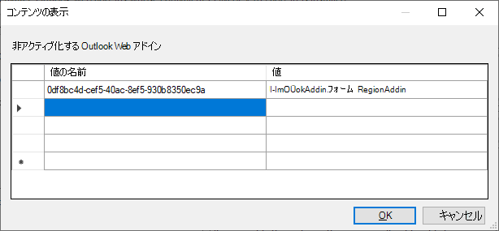

# <a name="make-your-office-add-in-compatible-with-an-existing-com-add-in"></a>Office アドインに既存の COM アドインとの互換性をもたせる

既存の COM アドインがある場合は、Office アドインで同等の機能を構築して、Office on the web や Mac などの他のプラットフォームでソリューションを実行できます。 場合によっては、Officeアドインが、対応する COM アドインで使用できるすべての機能を提供できない場合があります。 このような状況では、COM アドインは、アドインが提供できる対応するWindowsよりも、Officeユーザー エクスペリエンスが向上する可能性があります。

Office アドインを構成して、同等の COM アドインが既にユーザーのコンピューターにインストールされている場合、Windows の Office が Office アドインの代わりに COM アドインを実行します。 COM アドインは、Office がユーザーのコンピューターにインストールされているに従って、COM アドインと Office アドインの間でシームレスに切り替わるため、「同等」と呼ばれる。

> [!NOTE]
> この機能は、サブスクリプションに接続されている場合、次のプラットフォームとアプリケーションMicrosoft 365されます。 COM アドインは他のプラットフォームにインストールできないので、これらのプラットフォームでは、この記事で後で説明する manifest 要素 `EquivalentAddins` は無視されます。
>
> - Excel、Word、および PowerPoint (Windows 1904 以降)
> - Outlookサーバー Windowsバージョンに対して(バージョン 2102 以降) Exchangeオン
>   - Exchange Online
>   - Exchange 2019 累積的な更新プログラム 10 以降 ([KB5003612](https://support.microsoft.com/topic/cumulative-update-10-for-exchange-server-2019-kb5003612-b1434cad-3fbc-4dc3-844d-82568e8d4344))
>   - Exchange 2016 累積的な更新プログラム 21 以降 ([KB5003611](https://support.microsoft.com/topic/cumulative-update-21-for-exchange-server-2016-kb5003611-b7ba1656-abba-4a0b-9be9-dac45095d969))

## <a name="specify-an-equivalent-com-add-in"></a>同等の COM アドインを指定する

### <a name="manifest"></a>マニフェスト

> [!IMPORTANT]
> Word、Excel、Outlook、PowerPointに適用されます。

Office アドインと COM アドイン間の互換性を有効にするには、Office アドインのマニフェストで同等の COM アドインを[](add-in-manifests.md)識別します。 次Office、Windows両方がインストールされている場合は、Officeアドインではなく COM アドインを使用します。

次の例は、COM アドインを同等のアドインとして指定するマニフェストの部分を示しています。 要素の値は COM アドインを識別し `ProgId` [、EquivalentAddins](../reference/manifest/equivalentaddins.md) 要素は終了タグの直前に配置する必要 `VersionOverrides` があります。

```xml
<VersionOverrides>
  ...
  <EquivalentAddins>
    <EquivalentAddin>
      <ProgId>ContosoCOMAddin</ProgId>
      <Type>COM</Type>
    </EquivalentAddin>
  </EquivalentAddins>
</VersionOverrides>
```

> [!TIP]
> COM アドインと XLL UDF の互換性については、「カスタム関数を XLL ユーザー定義関数と互換性のあるものにする [」を参照してください](../excel/make-custom-functions-compatible-with-xll-udf.md)。 この設定にはOutlook。

### <a name="group-policy"></a>グループ ポリシー

> [!IMPORTANT]
> ユーザーにのみOutlook適用されます。

Outlook Web アドインと COM/VSTO アドイン間の互換性を宣言するには、グループ ポリシー [非アクティブ化] Outlook Web アドインの同等の COM アドインまたは **VSTO** アドインをユーザーのコンピューターで構成してインストールする同等の COM アドインを識別します。 次Outlook、Windowsがインストールされている場合、Web アドインの代わりに COM アドインを使用します。

1. ツールの [インストール手順に](https://www.microsoft.com/download/details.aspx?id=49030)注意を払って、最新の管理用テンプレート ツール **をダウンロードします**。
1. ローカル グループ ポリシー エディター **(gpedit.msc) を開きます**。
1. [ユーザー **構成] [**  >  **管理用テンプレート**   >  **] [Microsoft Outlook 2016**  >  **その他] に移動します**。
1. 同等の COM または Outlookがインストールされている Web アドインを非アクティブ化するVSTO **を選択します**。
1. リンクを開き、ポリシー設定を編集します。
1. ダイアログ ボックスで **、Outlookを非アクティブ化します**。
    1. [ **値の名前]** を `Id` Web アドインのマニフェストで見つかった名前に設定します。 **重要**: *中かっこ* をエントリの周囲 `{}` に追加しない。
    1. Value **を** 同等 `ProgId` の COM/VSTOに設定します。
    1. **[OK] を** 選択して更新プログラムを有効にします。
    

## <a name="equivalent-behavior-for-users"></a>ユーザーと同等の動作

同等の[COM](#specify-an-equivalent-com-add-in)アドインを指定すると、Windows の Office は、同等の COM アドインがインストールされている場合、Office アドインのユーザー インターフェイス (UI) は表示されません。 Officeアドインのリボン ボタンのみを非表示にし、インストールOffice防ぐ必要があります。 したがって、Officeアドインは UI 内の次の場所に表示されます。

- [ **自分のアドイン] の下**
- リボン マネージャーのエントリとして (Excel、Word、およびPowerPointのみ)

> [!NOTE]
> マニフェストで同等の COM アドインを指定すると、他のプラットフォーム (Office on the web Mac など) には影響しません。

次のシナリオでは、ユーザーがアドインを取得する方法に応Office説明します。

### <a name="appsource-acquisition-of-an-office-add-in"></a>AppSource によるアドインOffice取得

ユーザーが AppSource から Officeアドインを取得し、同等の COM アドインが既にインストールされている場合は、次Officeします。

1. アドインOfficeインストールします。
2. リボンでOfficeアドイン UI を非表示にします。
3. COM アドイン リボン ボタンをポイントするユーザーの呼び出しを表示します。

### <a name="centralized-deployment-of-office-add-in"></a>アドインのOffice展開

管理者が集中展開を使用して Office アドインをテナントに展開し、同等の COM アドインが既にインストールされている場合、ユーザーは変更を表示する前に Office を再起動する必要があります。 再起動Office、次のコマンドが実行されます。

1. アドインOfficeインストールします。
2. リボンでOfficeアドイン UI を非表示にします。
3. COM アドイン リボン ボタンをポイントするユーザーの呼び出しを表示します。

### <a name="document-shared-with-embedded-office-add-in"></a>埋め込みアドインと共有Officeドキュメント

ユーザーが COM アドインをインストールし、埋め込み Office アドインを含む共有ドキュメントを取得した場合、そのユーザーがドキュメントを開いた場合、次のOffice。

1. ユーザーにアドインを信頼Office求めるメッセージを表示します。
2. 信頼できる場合は、Officeアドインがインストールされます。
3. リボンでOfficeアドイン UI を非表示にします。

## <a name="other-com-add-in-behavior"></a>その他の COM アドインの動作

### <a name="excel-powerpoint-word"></a>Excel、PowerPoint、Word

ユーザーが同等の COM アドインをアンインストールした場合は、OfficeをWindows、Office UI を復元します。

カスタム アドインに同等の COM アドインを指定したOffice、Officeアドインの更新プログラムの処理Office停止します。 アドインの最新の更新プログラムOffice、ユーザーはまず COM アドインをアンインストールする必要があります。

### <a name="outlook"></a>Outlook

対応する web VSTOを無効にするために、Outlookを開始するときに、COM/Outlookアドインを接続する必要があります。

その後の Outlook セッション中に COM/VSTO アドインが切断された場合、Web アドインは再起動するまで無効Outlook可能性があります。

## <a name="see-also"></a>関連項目

- [カスタム関数を XLL ユーザー定義関数と互換性のあるものにする](../excel/make-custom-functions-compatible-with-xll-udf.md)
