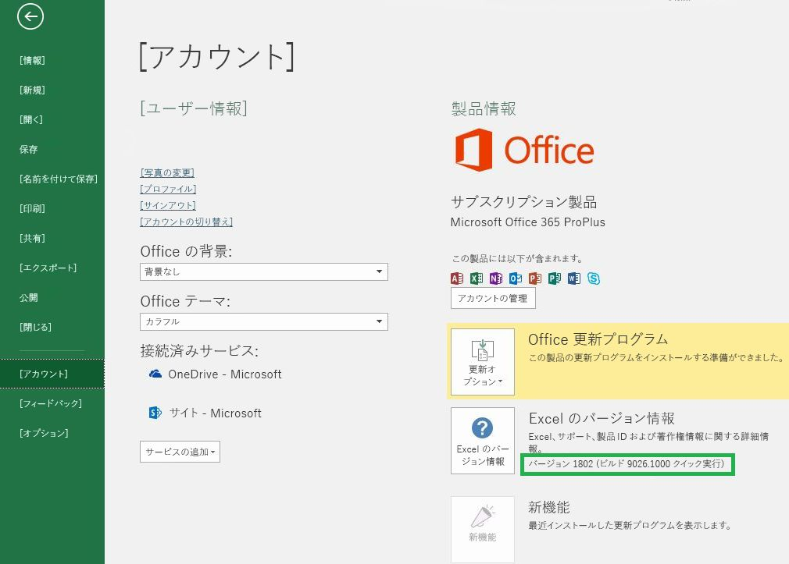

# Office のバージョンと要件セットOffice versions and requirement sets

Office にはプラットフォームやバージョンが異なるものが数多くあり、それらは Office JavaScript API (Office.js) に含まれる API をすべてサポートしているわけではありません。 ユーザーがインストールしている Office のバージョンを制御できない場合があります。  このような状況に対処するため、Office アドインで必要な機能を Office ホストがサポートしているかどうかを判別するのに役立つ要件セットと呼ばれるシステムが用意されています。There are many versions of Office on several platforms, and they don't all support every API in Office JavaScript API (Office.js). You may not always have control over the version of Office your users have installed.  To handle this situation, we provide a system called requirement sets to help you determine whether an Office host supports the capabilities you need in your Office Add-in. 

> [!NOTE]
> - Office は、Office for Windows、Office Online、Office for Mac、Office for iPad を含む複数のプラットフォームで実行できます。Office runs across multiple platforms, including Office for Windows, Office Online, Office for the Mac, and Office for the iPad.
> - Office ホストの例は、Excel、Word、PowerPoint、Outlook、OneNote などの Office 製品です。Examples of Office hosts are Office Products: Excel, Word, PowerPoint, Outlook, OneNote, and so forth.  
> - 要件セットとは、`ExcelApi 1.5` や `WordApi 1.3` などの、API メンバーの名前付きグループです。A requirement set is a named group of API members e.g., `ExcelApi 1.5`, `WordApi 1.3`, and so on.  

## Office のバージョンを確認する方法How to check your Office version

使用している Office のバージョンを特定するには、Office アプリケーション内で **[ファイル]** メニューを選択し、**[アカウント]** を選択します。 Office のバージョンは **[製品情報]** セクションに表示されます。 たとえば、次のスクリーン ショットは、Office のバージョンが 1802 (ビルド 9026.1000) であることを示しています。To identify the Office version that you're using, from within an Office application, select the **File** menu, and then choose **Account**. The version of Office will appear in the **Product Information** section. For example, the following screenshot indicates Office Version 1802 (Build 9026.1000):

## Office 要件セットの可用性Office requirement sets availability

Office アドインは API 要件セットを使用して、使用する必要のある API メンバーを Office ホストがサポートしているかどうかを判別できます。 要件セットのサポートは、Office ホストと Office ホストのバージョンによって異なります (前のセクションを参照してください)。Office Add-ins can use API requirement sets to determine whether the Office host supports the API members that it need to use. Requirement set support varies by Office host and the Office host version (see previous section).

一部の Office ホストには独自の API 要件セットがあります。 たとえば、Excel API の最初の要件セットは `ExcelApi 1.1` で、Word API の最初の要件セットは `WordApi 1.1` でした。 それ以降、追加の API 機能を提供するため、複数の新しい ExcelApi 要件セットと WordApi 要件セットが追加されています。Some Office hosts have their own API requirement sets. For example, the first requirement set for the Excel API was `ExcelApi 1.1` and the first requirement set for the Word API was `WordApi 1.1`. Since then, multiple new ExcelApi requirement sets and WordApi requirement sets have been added to provide additional API functionality.

さらに、アドイン コマンド (リボン機能拡張) やダイアログ ボックスを起動する機能 (ダイアログ API) など、他の機能が共通 API に追加されました。In addition, other functionality such as add-in commands (ribbon extensibility) and the ability to launch dialog boxes (Dialog API) were added to the Common API. アドイン コマンドやダイアログ API の要件セットは、さまざまな Office ホストで共有されている API セットの例です。Add-in commands and Dialog API requirement sets are examples of API sets that the various Office hosts share in common.

アドインは、そのアドインが動作している Office ホストのバージョンでサポートしている要件セットにある API のみを使用できます。 特定の Office ホストのバージョンで使用できる要件セットを正確に確認するには、ホスト固有の要件セットに関する次の記事を参照してください。An add-in can only use APIs in requirement sets that are supported by the version of Office host where the add-in is running. To know exactly which requirement sets are available for a specific Office host version, refer to the following host-specific requirement set articles:

- [Excel JavaScript API 要件セット](/office/dev/add-ins/reference/requirement-sets/excel-api-requirement-sets) (ExcelApi)[Excel JavaScript API requirement sets](/office/dev/add-ins/reference/requirement-sets/excel-api-requirement-sets) (ExcelApi)
- [Word JavaScript API 要件セット](/office/dev/add-ins/reference/requirement-sets/word-api-requirement-sets) (WordApi)[Word JavaScript API requirement sets](/office/dev/add-ins/reference/requirement-sets/word-api-requirement-sets) (WordApi)
- [OneNote JavaScript API 要件セット](/office/dev/add-ins/reference/requirement-sets/onenote-api-requirement-sets) (OneNoteApi)[OneNote JavaScript API requirement sets](/office/dev/add-ins/reference/requirement-sets/onenote-api-requirement-sets) (OneNoteApi)
- [Outlook API 要件セットについて](/office/dev/add-ins/reference/requirement-sets/outlook-api-requirement-sets) (MailBox)[Understanding Outlook API requirement sets](/office/dev/add-ins/reference/requirement-sets/outlook-api-requirement-sets) (MailBox)

一部の要件セットには、どの Office ホストでも使用できる API が含まれています。 これらの要件のセットの詳細については、次の記事を参照してください。Some requirement sets contain APIs that can be used by any Office host. For information about these requirement sets, refer to the following articles:

- [Office の共通要件セットOffice common requirement sets](/office/dev/add-ins/reference/requirement-sets/office-add-in-requirement-sets)
- [アドイン コマンドの要件セットAdd-in commands requirement sets](/office/dev/add-ins/reference/requirement-sets/add-in-commands-requirement-sets)
- [ダイアログ API の要件セットDialog API requirement sets](/office/dev/add-ins/reference/requirement-sets/dialog-api-requirement-sets)
- [Identity API の要件セットIdentity API requirement sets](/office/dev/add-ins/reference/requirement-sets/identity-api-requirement-sets)

`ExcelApi 1.1` の "1.1" など、要件セットのバージョン番号は Office ホストを基準にしています。 特定の要件セットのバージョン番号 (例: `ExcelApi 1.1`) は、Office.js のバージョン番号には対応しておらず、他の Office ホスト (Word、Outlook など) の要件セットにも対応していません。  Office ホストの要件セットがリリースされる早さや時期は、ホストによって異なります。 たとえば、`ExcelApi 1.5` の方が `WordApi 1.3` 要件セットより前にリリースされました。The version number of a requirement set, such as the "1.1" in `ExcelApi 1.1`, is relative to the Office host. The version number of a given requirement set (e.g., `ExcelApi 1.1`) does not correspond to the version number of Office.js or to requirement sets for other Office hosts (e.g., Word, Outlook, etc.).  Requirement sets for the different Office hosts are released at different speeds and times. For example, `ExcelApi 1.5` was released before the `WordApi 1.3` requirement set.

JavaScript API for Office ライブラリ (Office.js) には、現在利用可能なすべての要件セットが含まれています。The JavaScript API for Office library (Office.js) includes all requirement sets that are currently available. `ExcelApi 1.3` や `WordApi 1.3` のような要件セットは存在しますが、`Office.js 1.3` のような要件セットは存在しません。While there is such a thing as requirement sets `ExcelApi 1.3` and `WordApi 1.3`, there is no `Office.js 1.3` requirement set. Office.js の最新リリースは、コンテンツ配信ネットワーク (CDN) 経由で配信される単一の Office エンドポイントとして維持されます。The latest release of Office.js is maintained as a single Office endpoint delivered via the content delivery network (CDN). バージョン管理や下位互換性の処理方法など、Office.js CDN に関する詳細については、「[JavaScript API for Office について](/office/dev/add-ins/develop/understanding-the-javascript-api-for-office)」を参照してください。For more details around the Office.js CDN, including how versioning and backward compatibility is handled, see [Understanding the JavaScript API for Office](/office/dev/add-ins/develop/understanding-the-javascript-api-for-office).

## Office ホストと要件セットを指定するSpecify Office hosts and requirement sets

アドインに必要となる Office ホストと要件セットは、さまざまな方法で指定できます。  詳細については、「[Office のホストと API の要件を指定する](/office/dev/add-ins/develop/specify-office-hosts-and-api-requirements)」を参照してください。There are various ways to specify which Office hosts and requirement sets are required by an add-in.  For detailed information, see [Specify Office hosts and API requirements](/office/dev/add-ins/develop/specify-office-hosts-and-api-requirements)

## 関連項目See also

- [Office のホストと API の要件を指定するSpecify Office hosts and API requirements](/office/dev/add-ins/develop/specify-office-hosts-and-api-requirements)
- [Office の最新バージョンをインストールするInstall the latest version of Office](/office/dev/add-ins/develop/install-latest-office-version)
- [Office 365 ProPlus 更新プログラムのチャネルの概要Overview of update channels for Office 365 ProPlus](/deployoffice/overview-of-update-channels-for-office-365-proplus)
- [Office 365 で Office を最大限に活用するGet the most from Office with Office 365](https://products.office.com/compare-all-microsoft-office-products?tab=2)
