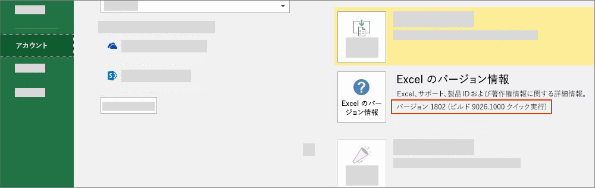

# Office のバージョンと要件セット

Office にはプラットフォームやバージョンが異なるものが数多くあり、それらは Office JavaScript API (Office.js) に含まれる API をすべてサポートしているわけではありません。 ユーザーがインストールしている Office のバージョンを制御できない場合があります。このような状況に対処するため、Office アドインで必要な機能を Office アプリケーションがサポートしているかどうかを判別するのに役立つ要件セットと呼ばれるシステムが用意されています。

> [!NOTE]
>
> - Office は、Windows、ブラウザー、Mac、iPad などの複数のプラットフォームで実行されます。
> - Office アプリケーションの例は、Excel、Word、PowerPoint、Outlook、OneNote などの Office 製品です。  
> - 要件セットとは、`ExcelApi 1.5` や `WordApi 1.3` などの、API メンバーの名前付きグループです。  

## Office のバージョンを確認する方法

使用している Office のバージョンを特定するには、Office アプリケーション内で **[ファイル]** メニューを選択し、**[アカウント]** を選択します。Office のバージョンは **[製品情報]** セクションに表示されます。たとえば、次のスクリーン ショットは、Office のバージョンが 1802 (ビルド 9026.1000) であることを示しています。

## Office 要件セットの可用性

Office アドインは API 要件セットを使用して、使用する必要のある API メンバーを Office アプリケーションがサポートしているかどうかを判別できます。 要件セットのサポートは、Office アプリケーションと Office アプリケーションのバージョンによって異なります (前のセクションを参照してください)。

一部の Office アプリケーションには独自の API 要件セットがあります。 たとえば、Excel API の最初の要件セットは `ExcelApi 1.1` で、Word API の最初の要件セットは `WordApi 1.1` でした。 それ以降、追加の API 機能を提供するため、複数の新しい ExcelApi 要件セットと WordApi 要件セットが追加されています。

さらに、アドイン コマンド (リボン機能拡張) やダイアログ ボックスを起動する機能 (ダイアログ API) など、他の機能が一般的な API に追加されました。 アドイン コマンドやダイアログ API の要件セットは、さまざまな Office アプリケーションで共有されている API セットの例です。

アドインは、そのアドインが動作している Office アプリケーションのバージョンでサポートされている要件セットにある API のみを使用できます。特定の Office アプリケーションのバージョンで使用できる要件セットを正確に確認するには、アプリケーション固有の要件セットに関する次の記事を参照してください。

- [Excel JavaScript API 要件セット](../reference/requirement-sets/excel-api-requirement-sets.md) (ExcelApi)
- [Word JavaScript API 要件セット](../reference/requirement-sets/word-api-requirement-sets.md) (WordApi)
- [OneNote JavaScript API 要件セット](../reference/requirement-sets/onenote-api-requirement-sets.md) (OneNoteApi)
- [PowerPoint JavaScript API 要件セット](../reference/requirement-sets/powerpoint-api-requirement-sets.md) (PowerPointApi)
- [Outlook API 要件セットについて](../reference/requirement-sets/outlook-api-requirement-sets.md) (Mailbox)

一部の要件セットには、どの Office アプリケーションでも使用できる API が含まれています。それらの要件セットの詳細については、次の記事を参照してください。

- [Office の共通要件セット](../reference/requirement-sets/office-add-in-requirement-sets.md)
- [アドイン コマンドの要件セット](../reference/requirement-sets/add-in-commands-requirement-sets.md)
- [ダイアログ API の要件セット](../reference/requirement-sets/dialog-api-requirement-sets.md)
- [Identity API の要件セット](../reference/requirement-sets/identity-api-requirement-sets.md)

`ExcelApi 1.1` の "1.1" など、要件セットのバージョン番号は Office アプリケーションを基準にしています。 特定の要件セットのバージョン番号 (例: `ExcelApi 1.1`) は、Office.js のバージョン番号には対応しておらず、他の Office アプリケーション (Word、Outlook など) の要件セットにも対応していません。  Office アプリケーションの要件セットがリリースされる割合は、アプリケーションによって異なります。 たとえば、`ExcelApi 1.5` の方が `WordApi 1.3` 要件セットより前にリリースされました。

Office JavaScript API ライブラリ (Office.js) には、現在利用可能なすべての要件セットが含まれています。 `ExcelApi 1.3` や `WordApi 1.3` のような要件セットは存在しますが、`Office.js 1.3` のような要件セットは存在しません。 Office.js の最新リリースは、コンテンツ配信ネットワーク (CDN) 経由で配信される単一の Office エンドポイントとして維持されます。 バージョン管理や下位互換性の処理方法など、Office.js CDN に関する詳細については、「[Office JavaScript API について](../develop/understanding-the-javascript-api-for-office.md)」を参照してください。

## Office アプリケーションと要件セットを指定する

アドインに必要となる Office アプリケーションと要件セットは、さまざまな方法で指定できます。  詳細については、「[Office アプリケーションと API の要件を指定する](../develop/specify-office-hosts-and-api-requirements.md)」を参照してください。

## 関連項目

- [Office アプリケーションと API の要件を指定する](../develop/specify-office-hosts-and-api-requirements.md)
- [Office の最新バージョンをインストールする](../develop/install-latest-office-version.md)
- [Microsoft 365 Apps 用更新プログラム チャネルの概要](/deployoffice/overview-of-update-channels-for-office-365-proplus)
- [Microsoft 365 と Microsoft Teams による生産性の再構築](https://products.office.com/compare-all-microsoft-office-products?tab=2)
