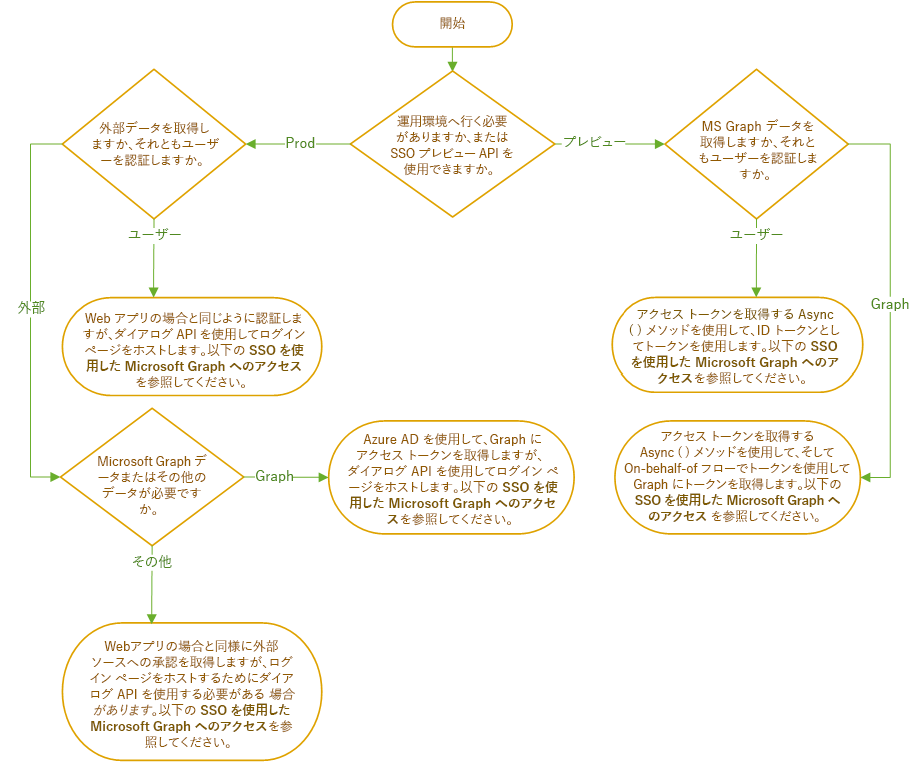

# Office アドインにおける認証と承認の概要Overview of authentication and authorization in Office Add-ins

既定では、Web アプリケーション、つまり Office アドインでは匿名アクセスが許可されていますが、ログインによる認証をユーザーに要求できます。Web applications and, hence, Office Add-ins allow anonymous access by default, but you can require users to authenticate with a login. たとえば、ユーザーに Microsoft アカウント、職場または学校用の Office 365 のアカウント、またはその他の一般的なアカウントでログインするように要求できます。For example, you can require that your users be logged in with a Microsoft Account, an Office 365 Work or School account, or other common account. これによりユーザーの確認がアドインで可能になることから、このタスクはユーザー認証と呼ばれています。This task is called user authentication because it enables the add-in to know who the user is.

アドインはまた、Microsoft Graph データ (ユーザーの Office 365 プロファイル、OneDrive ファイル、SharePoint データなど) や Google、Facebook、LinkedIn、SalesForce、GitHub などの外部ソース内のデータにアクセスするためのユーザーの同意を取得することもできます。Your add-in can also get the user's consent to access their Microsoft Graph data (such as their Office 365 profile, OneDrive files, and SharePoint data) or to data in other external sources such as Google, Facebook, LinkedIn, SalesForce, and GitHub. これにより承認されるのはユーザーではなく*アドイン*であることから、このタスクはアドイン (またはアプリ) 承認と呼ばれています。This task is called add-in (or app) authorization, because it is the *add-in* that is being authorized, not the user.

これらの認証を実行するには、2 つの方法があります。You have a choice of two ways to accomplish these authentications.

- **Office シングル サインオン (SSO)**: *現在プレビュー中*のシステムで、ユーザーが Office にログインすると、それがアドインへのログインとしても機能することを可能にします。**Office Single Sign-on (SSO)**: A system, *currently in preview*, that enables the user's login to Office to also function as a login to the add-in. アドインでは、必要に応じて、Microsoft Graph へのアドインの承認を行うために、ユーザーの Office の資格情報を使用できます。Optionally, the add-in can also use the user's Office credentials to authorize the add-in to Microsoft Graph. (Microsoft 以外のソースは、このシステムからはアクセスできません。)(Non-Microsoft sources are not accessible through this system.)
- **Azure Active Directory での Web アプリケーションの認証と承認**: これは、新しい機能または特別な機能ではありません。**Web Application Authentication and Authorization with Azure Active Directory**: This isn't something new or special. これは、Office SSO システムの導入以前に Office アドイン (およびその他の Web アプリ) でユーザーの認証とアプリの承認を行うために使用されていた方法で、Office SSO を使用できないシナリオでは現在でも使用されています。It's just the way Office add-in (and other web apps) authenticated users and authorized apps before there was an Office SSO system and is still used in scenarios where Office SSO cannot be.

次のフローチャートは、アドイン開発者が判断する必要がある項目を示しています。The following flowchart shows you the decisions that you need to make as an add-in developer. 詳細については、この記事で後述します。Details are later in this article.

## SSO を使用しないユーザー認証User authentication without SSO

他の Web アプリケーションの場合と同様、Office アドインでのユーザーの認証は Azure Active Directory (AAD) を使用して行えますが、ログイン ページを iFrame 内で開くことが AAD により許可されていない点が異なります。You can authenticate a user in an Office Add-in with Azure Active Directory (AAD) as you would any in any other web application with one exception: AAD does not allow its login page to open in an iframe. Office アドインが *Office on the web* で実行されている場合、作業ウィンドウとして iFrame が使用されます。When an Office Add-in is running on *Office on the web*, the task pane is an iframe. これは、AAD のログイン画面は、Office ダイアログ API を使用して開かれるダイアログで開く必要があることを意味します。This means that you will need to open the AAD login screen in a dialog opened with the Office Dialog API. このことは、認証ヘルパー ライブラリの使用方法に影響します。This affects how you use authentication helper libraries. 詳細については、「[Office ダイアログ API を使用して認証と承認を行う](auth-with-office-dialog-api.md)」を参照してください。For more information, see [Authentication with the Office Dialog API](auth-with-office-dialog-api.md).

AAD での認証のプログラミングの詳細については、「[Microsoft identity platform (v2.0) overview (Microsoft ID プラットフォーム (v2.0) の概要)](/azure/active-directory/develop/v2-overview)」を参照してください。For information about programming authentication with AAD, begin with [Microsoft identity platform (v2.0) overview](/azure/active-directory/develop/v2-overview). このドキュメント セットには、多くのチュートリアルやガイドの他、関連するサンプルやライブラリへのリンクが含まれています。There are many tutorials and guides in that documentation set, as well as links to relevant samples and libraries. 「[Office ダイアログ API を使用して認証と承認を行う](auth-with-office-dialog-api.md)」の説明にあるように、Office ダイアログで実行するサンプル内のコードを調整する必要がある場合があります。As explained in [Authentication with the Office Dialog API](auth-with-office-dialog-api.md), you may need to adjust the code in the samples to run in the Office Dialog.

## SSO を使用しないで Microsoft Graph にアクセスするAccess to Microsoft Graph without SSO

Azure Active Directory (AAD) から Graph へのアクセス トークンを取得することで、アドイン用の Microsoft Graph データへの承認を取得できます。You can get authorization to Microsoft Graph data for your add-in by obtaining an access token to Graph from Azure Active Directory (AAD). これは、Office SSO を使用せずに行えます。You can do this without relying on Office SSO. 方法の詳細については、「[Access to Microsoft Graph without SSO (SSO を使用せずに Microsoft Graph にアクセスする)](authorize-to-microsoft-graph-without-sso.md)」を参照してください。この記事には詳細情報やサンプルへのリンクが含まれています。For more information about how, see [Access to Microsoft Graph without SSO](authorize-to-microsoft-graph-without-sso.md) which has more details and links to samples.

## SSO を使用したユーザー認証User authentication with SSO

SSO を使用してユーザーを認証するために、作業ウィンドウまたは関数ファイル内のコードが [getAccessToken](/javascript/api/office-runtime/officeruntime.auth#getaccesstoken-options-) メソッドを呼び出します。To use SSO to authenticate the user, your code in a task pane or function file calls the [getAccessToken](/javascript/api/office-runtime/officeruntime.auth#getaccesstoken-options-) method. ユーザーが Office にサインインしていない場合、Office でダイアログが開き、Azure Active Directory のログインページに移動します。If the user is not signed into Office, Office will open a dialog and navigate it to the Azure Active Directory login page. ユーザーがサインインすると、またはユーザーが既にサインインしている場合、メソッドによりアクセス トークンが返されます。After the user is signed in, or if the user is already signed in, the method returns an access token. このトークンは、**代理**フロー内のブートストラップ トークンです。The token is a bootstrap token in the **On Behalf Of** flow. (「[Access to Microsoft Graph without SSO (SSO を使用せずに Microsoft Graph にアクセスする)](#access-to-microsoft-graph-with-sso)」を参照してください。) ただし、このトークンには `preferred_username`、`name`、`sub`、および `oid` を含む、現在のユーザーに固有の複数の要求が含まれるため、ID トークンとしても使用できます。(See [Access to Microsoft Graph with SSO](#access-to-microsoft-graph-with-sso).) However, it can be used as an ID token as well, because it contains several claims that are unique to the current user, including `preferred_username`, `name`, `sub`, and `oid`. 最終的なユーザー ID として使用するプロパティに関するガイダンスについては、「[Microsoft identity platform access tokens (Microsoft ID プラットフォームのアクセス トークン)](https://docs.microsoft.com/azure/active-directory/develop/access-tokens#payload-claims)」を参照してください。For guidance on which property to use as the ultimate user ID, see [Microsoft identity platform access tokens](https://docs.microsoft.com/azure/active-directory/develop/access-tokens#payload-claims). これらのトークンの例については、「[Example access token (アクセス トークンの例)](sso-in-office-add-ins.md#example-access-token)」を参照してください。For an example of a one of these tokens, see the [Example access token](sso-in-office-add-ins.md#example-access-token).

コードにより目的の要求がトークンから抽出されると、管理下のユーザー テーブルまたはユーザー データベース内でその値を使用してユーザーが検索されます。After your code has extracted the desired claim from the token, it uses that value to look up the user in a user table or user database that you maintain. ユーザー設定やユーザーのアカウントの状態などのユーザー関連情報を格納するには、データベースを使用します。Use the database to store user-relative information such as the user's preferences or the state of the user's account. SSO を使用しているため、ユーザーは個別にアドインにサインインを行いません。このため、ユーザーのパスワードを保存する必要はありません。Since you are using SSO, your users don't sign-in separately to your add-in, so you do not need to store a password for the user.

SSO を使用するユーザー認証を実装する前に、「[Office アドインのシングル サインオンを有効化する](sso-in-office-add-ins.md)」の記事を十分に理解しておく必要があります。次のサンプルも確認しておいてください。Before you begin implementing user authentication with SSO, be sure that you are thoroughly familiar with the article [Enable single sign-on for Office Add-ins](sso-in-office-add-ins.md). Note also these samples:

- [Office アドイン NodeJS SSO](https://github.com/OfficeDev/Office-Add-in-NodeJS-SSO)、特に [ssoAuthES6.js](https://github.com/OfficeDev/Office-Add-in-NodeJS-SSO/blob/master/Complete/src/auth.ts) ファイル。[Office Add-in NodeJS SSO](https://github.com/OfficeDev/Office-Add-in-NodeJS-SSO), especially the file [ssoAuthES6.js](https://github.com/OfficeDev/Office-Add-in-NodeJS-SSO/blob/master/Complete/src/auth.ts). 
- [Office アドイン ASP.NET SSO](https://github.com/OfficeDev/Office-Add-in-ASPNET-SSO)。[Office Add-in ASP.NET SSO](https://github.com/OfficeDev/Office-Add-in-ASPNET-SSO). 

ただし、これらの例では、トークンは ID トークンとしては使用されません。These samples, however, do not use the token as an ID token. ここでは、トークンは、**On-Behalf-Of** フローを使用して Microsoft Graph にアクセスするために使用されます。They use it to get access to Microsoft Graph with the **On Behalf Of** flow.

## SSO を使用した Microsoft Graph へのアクセスAccess to Microsoft Graph with SSO

SSO を使用して Microsoft Graph にアクセスするために、作業ウィンドウまたは関数ファイル内のアドインが [getAccessToken](/javascript/api/office-runtime/officeruntime.auth#getaccesstoken-options-) メソッドを呼び出します。To use SSO to get access to Microsoft Graph, your add-in in a task pane or function file calls the [getAccessToken](/javascript/api/office-runtime/officeruntime.auth#getaccesstoken-options-) method. ユーザーが Office にサインインしていない場合、Office でダイアログが開き、Azure Active Directory のログインページに移動します。If the user is not signed into Office, Office will open a dialog and navigate it to the Azure Active Directory login page. ユーザーがサインインすると、またはユーザーが既にサインインしている場合、メソッドによりアクセス トークンが返されます。After the user is signed in, or if the user is already signed in, the method returns an access token. このトークンは、**代理**フロー内のブートストラップ トークンです。The token is a bootstrap token in the **On Behalf Of** flow. 特に、このトークンには 値 `access_as_user` を持つ `scope` 要求が含まれます。Specifically, it has a `scope` claim with the value `access_as_user`. トークンでの要求に関するガイダンスについては、「[Microsoft identity platform access tokens (Microsoft ID プラットフォームのアクセス トークン)](https://docs.microsoft.com/azure/active-directory/develop/access-tokens#payload-claims)」を参照してください。For guidance about the claims in the token, see [Microsoft identity platform access tokens](https://docs.microsoft.com/azure/active-directory/develop/access-tokens#payload-claims). これらのトークンの例については、「[Example access token (アクセス トークンの例)](sso-in-office-add-ins.md#example-access-token)」を参照してください。For an example of a one of these tokens, see the [Example access token](sso-in-office-add-ins.md#example-access-token).

コードがトークンを取得すると、コードは**代理**フロー内でこのトークンを使用して、2 つ目のトークンである Microsoft Graph へのアクセス トークンを取得します。After your code obtains the token, it uses it in the **On Behalf Of** flow to obtain a second token: an access token to Microsoft Graph.

Office SSO の実装を開始する前に、次の 2 つの記事を十分に理解しておく必要があります。Before you begin implementing Office SSO, be sure that you are thoroughly familiar with these two articles:

- [Office アドインのシングル サインオンを有効化するEnable single sign-on for Office Add-ins](sso-in-office-add-ins.md)
- [SSO を使用した Microsoft Graph への承認Authorize to Microsoft Graph with SSO](authorize-to-microsoft-graph.md)

また、ここに示すチュートリアル記事のうち少なくとも 1 つに目を通してください。You should also read at least one of the walkthrough articles listed here. これらの手順を実行しない場合でも、これらの記事にはOffice SSO の実装方法および**代理**フローに関する重要な情報が含まれています。Even if you don't carry out the steps, these contain valuable information about how you implement Office SSO and the **On Behalf Of** flow. 

- [シングル サインオンを使用する ASP.NET Office アドインを作成するCreate an ASP.NET Office Add-in that uses single sign-on](create-sso-office-add-ins-aspnet.md)
- [シングル サインオンを使用する Node.js Office アドインを作成するCreate an Node.js Office Add-in that uses single sign-on](create-sso-office-add-ins-nodejs.md)

次のサンプルにも目を通してください。Note also these samples:

- [Office アドイン NodeJS SSOOffice Add-in NodeJS SSO](https://github.com/OfficeDev/Office-Add-in-NodeJS-SSO)
- [Office アドイン ASP.NET SSOOffice Add-in ASP.NET SSO](https://github.com/OfficeDev/Office-Add-in-ASPNET-SSO)

## Microsoft 以外のデータ ソースへのアクセスAccess to non-Microsoft data sources

大手のオンライン サービス (Google、Facebook、LinkedIn、SalesForce、GitHub など) では、開発者は、ユーザーが自分のアカウントに別のアプリケーションからアクセスできるようにすることが可能です。Popular online services, including Google, Facebook, LinkedIn, SalesForce, and GitHub, let developers give users access to their accounts in other applications. これにより、開発者はこれらのサービスを Office アドインに含めることができます。This gives you the ability to include these services in your Office Add-in. アドインでこれを実行する方法の概要については、「[Authorize external services in your Office Add-in (Office アドインで外部サービスを承認する)](auth-external-add-ins.md)」を参照してください。For an overview of the ways that your add-in can do this, see [Authorize external services in your Office Add-in](auth-external-add-ins.md).

> [!IMPORTANT]
> コーディングを始める前に、データ ソースのログイン画面を iFrame で開くことがデータ ソースにより許可されているかどうかを確認します。Before you begin coding, find out if the data source allows its login in screen to be opened in an iFrame. Office アドインが *Office on the web* で実行されている場合、作業ウィンドウとして iFrame が使用されます。When an Office Add-in is running on *Office on the web*, the task pane is an iFrame. データ ソースのログインの画面を iFrame で開くことがデータ ソースにより許可されていない場合、ログイン画面は、Office ダイアログ API を使用して開かれるダイアログで開く必要があります。If the data source does not allow its login screen to be opened in an iFrame, then you will need to open the login screen in a dialog opened with the Office Dialog API. 詳細については、「[Office ダイアログ API を使用して認証と承認を行う](auth-with-office-dialog-api.md)」を参照してください。For more information, see [Authentication with the Office Dialog API](auth-with-office-dialog-api.md).
